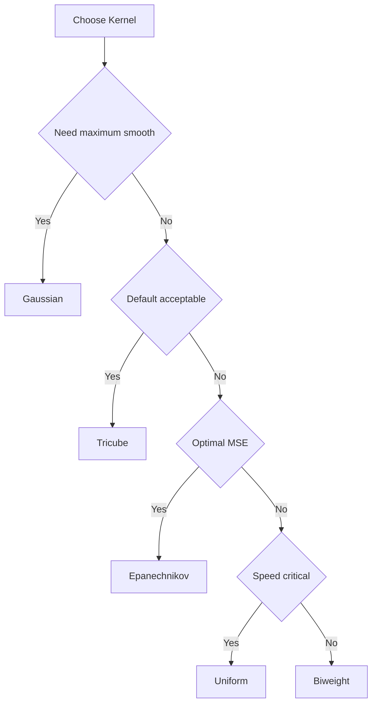

<!-- markdownlint-disable MD024 MD033 MD046 -->
# Weight Functions

Kernel functions for distance weighting.

## Overview

Weight functions (kernels) determine how neighboring points contribute to each local fit. Points closer to the target receive higher weights.


---

## Available Kernels

| Kernel | Efficiency | Smoothness | Support |
| --- | --- | --- | --- |
| **Tricube** | 0.998 | Very smooth | Compact |
| **Epanechnikov** | 1.000 | Smooth | Compact |
| **Gaussian** | 0.961 | Infinite | Unbounded |
| **Biweight** | 0.995 | Very smooth | Compact |
| **Cosine** | 0.999 | Smooth | Compact |
| **Triangle** | 0.989 | Moderate | Compact |
| **Uniform** | 0.943 | None | Compact |

**Efficiency** = AMISE relative to Epanechnikov (1.0 = optimal)

---

## Tricube (Default)

Cleveland's original choice. Best all-around performance.

$$w(u) = (1 - |u|^3)^3$$

**Use when**: Default choice for most applications.

```cpp
#include <fastlowess.hpp>
#include <cmath>
#include <iostream>
#include <vector>

int main() {
    const int n = 100;
    std::vector<double> x(n), y(n);
    for (int i = 0; i < n; ++i) {
        x[i] = i * 2 * M_PI / (n - 1);
        y[i] = std::sin(x[i]) + 0.1;
    }

    fastlowess::Lowess model({ .weight_function = "tricube" });
    auto result = model.fit(x, y).value();

    std::cout << "y[0]: " << result.y_vector()[0] << "\n";
    return 0;
}
```

```output
y[0]: 0.382608
```

---

## Epanechnikov

Theoretically optimal for kernel density estimation.

$$w(u) = \frac{3}{4}(1 - u^2)$$

**Use when**: Optimal MSE properties desired.

```cpp
#include <fastlowess.hpp>
#include <cmath>
#include <iostream>
#include <vector>

int main() {
    const int n = 100;
    std::vector<double> x(n), y(n);
    for (int i = 0; i < n; ++i) {
        x[i] = i * 2 * M_PI / (n - 1);
        y[i] = std::sin(x[i]) + 0.1;
    }

    fastlowess::Lowess model({ .weight_function = "epanechnikov" });
    auto result = model.fit(x, y).value();

    std::cout << "y[0]: " << result.y_vector()[0] << "\n";
    return 0;
}
```

```output
y[0]: 0.406728
```

---

## Gaussian

Infinitely smooth. No boundary effects.

$$w(u) = \exp(-u^2/2)$$

**Use when**: Maximum smoothness needed, computational cost acceptable.

```cpp
#include <fastlowess.hpp>
#include <cmath>
#include <iostream>
#include <vector>

int main() {
    const int n = 100;
    std::vector<double> x(n), y(n);
    for (int i = 0; i < n; ++i) {
        x[i] = i * 2 * M_PI / (n - 1);
        y[i] = std::sin(x[i]) + 0.1;
    }

    fastlowess::Lowess model({ .weight_function = "gaussian" });
    auto result = model.fit(x, y).value();

    std::cout << "y[0]: " << result.y_vector()[0] << "\n";
    return 0;
}
```

```output
y[0]: 0.435767
```

---

## Biweight

Good balance of efficiency and smoothness.

$$w(u) = (1 - u^2)^2$$

**Use when**: Alternative to Tricube with slightly different properties.

```cpp
#include <fastlowess.hpp>
#include <cmath>
#include <iostream>
#include <vector>

int main() {
    const int n = 100;
    std::vector<double> x(n), y(n);
    for (int i = 0; i < n; ++i) {
        x[i] = i * 2 * M_PI / (n - 1);
        y[i] = std::sin(x[i]) + 0.1;
    }

    fastlowess::Lowess model({ .weight_function = "biweight" });
    auto result = model.fit(x, y).value();

    std::cout << "y[0]: " << result.y_vector()[0] << "\n";
    return 0;
}
```

```output
y[0]: 0.375903
```

---

## Cosine

Smooth and computationally efficient.

$$w(u) = \cos(\pi u / 2)$$

**Use when**: Want smooth kernel with simple form.

```cpp
#include <fastlowess.hpp>
#include <cmath>
#include <iostream>
#include <vector>

int main() {
    const int n = 100;
    std::vector<double> x(n), y(n);
    for (int i = 0; i < n; ++i) {
        x[i] = i * 2 * M_PI / (n - 1);
        y[i] = std::sin(x[i]) + 0.1;
    }

    fastlowess::Lowess model({ .weight_function = "cosine" });
    auto result = model.fit(x, y).value();

    std::cout << "y[0]: " << result.y_vector()[0] << "\n";
    return 0;
}
```

```output
y[0]: 0.40083
```

---

## Triangle

Simple linear taper.

$$w(u) = 1 - |u|$$

**Use when**: Simple, interpretable weights.

```cpp
#include <fastlowess.hpp>
#include <cmath>
#include <iostream>
#include <vector>

int main() {
    const int n = 100;
    std::vector<double> x(n), y(n);
    for (int i = 0; i < n; ++i) {
        x[i] = i * 2 * M_PI / (n - 1);
        y[i] = std::sin(x[i]) + 0.1;
    }

    fastlowess::Lowess model({ .weight_function = "triangle" });
    auto result = model.fit(x, y).value();

    std::cout << "y[0]: " << result.y_vector()[0] << "\n";
    return 0;
}
```

```output
y[0]: 0.381657
```

---

## Uniform

Equal weights within window. Fastest but least smooth.

$$w(u) = 1$$

**Use when**: Speed is critical, smoothness less important.

```cpp
#include <fastlowess.hpp>
#include <cmath>
#include <iostream>
#include <vector>

int main() {
    const int n = 100;
    std::vector<double> x(n), y(n);
    for (int i = 0; i < n; ++i) {
        x[i] = i * 2 * M_PI / (n - 1);
        y[i] = std::sin(x[i]) + 0.1;
    }

    fastlowess::Lowess model({ .weight_function = "uniform" });
    auto result = model.fit(x, y).value();

    std::cout << "y[0]: " << result.y_vector()[0] << "\n";
    return 0;
}
```

```output
y[0]: 0.45084
```

---

## Choosing a Kernel



!!! tip "Recommendation"
    Stick with **Tricube** (default) unless you have specific requirements. The differences between kernels are usually small in practice.
