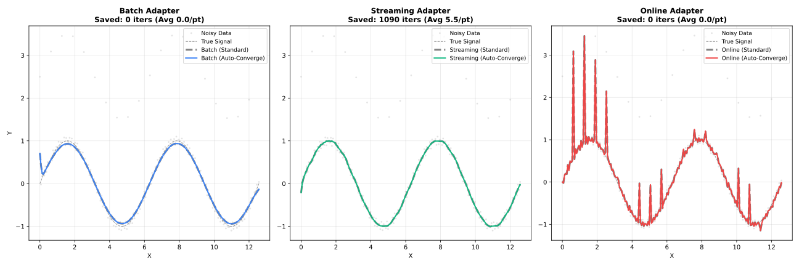

# Execution Modes

Choose the right adapter for your use case.

## Overview

Choose the first row below whose condition applies:

| Condition | Adapter |
| --- | --- |
| Data too large to fit in memory | `StreamingLowess` |
| Fits in memory, need real-time/incremental updates | `OnlineLowess` |
| Fits in memory, no real-time requirement | `Lowess` |

| Mode | Use Case | Memory | Features |
| --- | --- | --- | --- |
| **Batch** (`Lowess`) | Complete datasets | Full | All features |
| **Streaming** (`StreamingLowess`) | Large files (>100K) | Chunked | Residuals, robustness |
| **Online** (`OnlineLowess`) | Real-time sensors | Fixed window | Incremental updates |

---

## Feature Comparison

| Feature | Batch | Streaming | Online |
| --- | --- | --- | --- |
| Confidence intervals | ✓ | ✗ | ✗ |
| Prediction intervals | ✓ | ✗ | ✗ |
| Cross-validation | ✓ | ✗ | ✗ |
| Diagnostics | ✓ | ✓ | ✗ |
| Residuals | ✓ | ✓ | ✓ |
| Robustness weights | ✓ | ✓ | ✓ |

---

## Next Steps

- [API Reference](api.md) — All configuration options
- [Streaming API](api-streaming.md) · [Online API](api-online.md)
