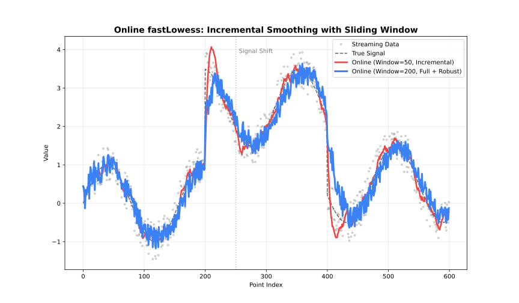

For real-time data: processes one `(x, y)` point at a time and returns a smoothed value immediately once enough points have been seen.

See also: [API](api.md)



## `OnlineOptions.builder() OnlineOptions.Builder`

```java
OnlineOptions options = OnlineOptions.builder()
        .windowCapacity(200)
        .minPoints(10)
        .build();
```

`OnlineOptions.Builder` exposes all the same settings as [`Options.Builder`](api.md) (except `returnSe`, `cvFractions`/`cvMethod`/`cvK`/`cvSeed`, and `backend`, which are batch-only). Note `parallel` still defaults to `true` in the builder, but per-point updates rarely benefit from parallelism in practice. Additional settings:

| Setting | Type | Default | Description |
| --- | --- | --- | --- |
| `windowCapacity` | `int` | `100` | Maximum number of recent points retained. |
| `minPoints` | `int` | `10` | Minimum points required before output starts. |
| `updateMode` | `String` | `"full"` | How the window is updated as new points arrive: `incremental`, `full`. |

## `new OnlineLowess(OnlineOptions options)`

## `OnlineLowess.addPoint(double x, double y) Optional<PointResult>`

Adds a single observation. Returns `Optional.empty()` while the window is still filling (fewer than `minPoints` seen so far); once populated, the `PointResult` holds the smoothed value for the most recently added point.

## `OnlineLowess.close()`

Releases native resources. Safe to call multiple times. Implements `AutoCloseable`.

## `PointResult` accessors

| Accessor | Type | Notes |
| --- | --- | --- |
| `y()` | `double` | Smoothed value. |
| `standardError()` | `OptionalDouble` | Empty if not computed. |
| `residual()` | `OptionalDouble` | Empty if not computed. |
| `robustnessWeight()` | `OptionalDouble` | Empty if not computed. |
| `iterationsUsed()` | `OptionalInt` | Empty if not applicable. |

## Example

```java
import fastlowess.OnlineLowess;
import fastlowess.OnlineOptions;
import fastlowess.PointResult;

import java.util.Optional;

OnlineOptions options = OnlineOptions.builder().build();

try (OnlineLowess model = new OnlineLowess(options)) {
    for (Point point : sensorReadings) {
        Optional<PointResult> res = model.addPoint(point.x(), point.y());
        res.ifPresent(r -> System.out.println("smoothed: " + r.y()));
    }
}
```
