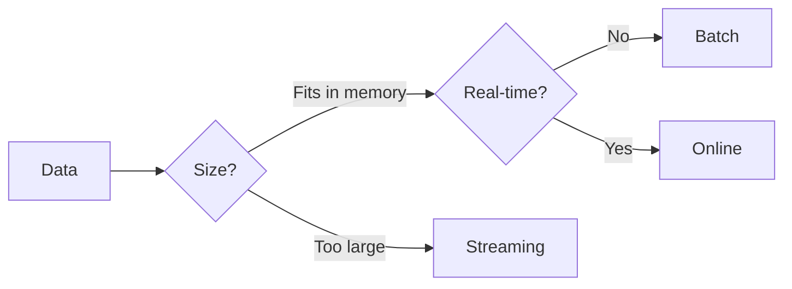

# Execution Modes

Choose the right adapter for your use case.

## Overview

| Mode | Use Case | Memory | Features |
| --- | --- | --- | --- |
| **Batch** | Complete datasets | Full | All features |
| **Streaming** | Large files (>100K) | Chunked | Residuals, robustness |
| **Online** | Real-time sensors | Fixed window | Incremental updates |

---

## Feature Comparison

| Feature | Batch | Streaming | Online |
| --- | --- | --- | --- |
| Confidence intervals | ✓ | ✗ | ✗ |
| Prediction intervals | ✓ | ✗ | ✗ |
| Cross-validation | ✓ | ✗ | ✗ |
| Diagnostics | ✓ | ✓ | ✗ |
| Residuals | ✓ | ✓ | ✓ |
| Robustness weights | ✓ | ✓ | ✓ |
| Parallel execution | ✓ | ✓ | ✗ |

---

## Next Steps

- [API Reference](api.md) — All configuration options
- [Tutorials](use-case-real-time.md) — Real-time processing guide
