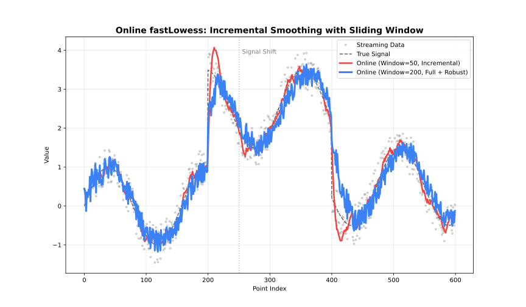

# Online Adapter

Incremental updates with a sliding window for real-time data.

## When to Use

- Data arrives incrementally (sensors, streams)
- Need real-time smoothed values
- Fixed memory budget



## Parameters

| Parameter | Default | Description |
| --- | --- | --- |
| `window_capacity` | 1000 | Max points in window |
| `min_points` | 2 | Points before output starts |
| `update_mode` | `"incremental"` | Update strategy |

### Update Modes

| Mode | Behavior | Speed |
| --- | --- | --- |
| `"incremental"` | Update only affected fits | Faster |
| `"full"` | Recompute entire window | More accurate |

## Example

```@example online
using FastLOWESS
using Random, Statistics

rng = MersenneTwister(42)
x = collect(range(0, 2π, length=100))
y = sin.(x) .+ randn(rng, 100) .* 0.3

model = OnlineLowess(;
    fraction=0.2,
    iterations=1,
    window_capacity=100,
    min_points=5,
    update_mode="incremental"
)
shown = 0
for i in eachindex(x)
    global shown
    result = add_point(model, x[i], y[i])
    if result !== nothing && shown < 5
        println("Current smoothed value: ", result.y)
        shown += 1
    end
end
```

---
