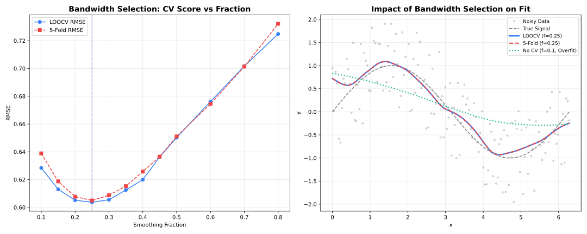

# Cross-Validation

Automated parameter selection via cross-validation.

## Overview

Cross-validation helps select optimal parameters (especially `fraction`) by evaluating performance on held-out data.



---

## K-Fold Cross-Validation

Split data into K folds, train on K-1, validate on 1.

```@example cross-validation
using FastLOWESS
using Random, Statistics

rng = MersenneTwister(42)
x = collect(range(0, 2π, length=100))
y = sin.(x) .+ randn(rng, 100) .* 0.3

model = Lowess(; cv_method="kfold",
    cv_k=5,
    cv_fractions=[0.2, 0.3, 0.5, 0.7]
)
result = fit(model, x, y)

println("Selected fraction: ", result.fraction_used)
println("CV scores: ", result.cv_scores)
```

---

## Leave-One-Out (LOOCV)

Each point is held out once. Most thorough but slowest.

```@example cross-validation
using FastLOWESS
using Random, Statistics

rng = MersenneTwister(42)
x = collect(range(0, 2π, length=100))
y = sin.(x) .+ randn(rng, 100) .* 0.3

model = Lowess(; cv_method="loocv",
    cv_fractions=[0.2, 0.3, 0.5, 0.7]
)
result = fit(model, x, y)
println("Selected fraction (CV): ", result.fraction_used)
```

---

## Seeded Randomization

Set a seed for reproducible fold assignments:

```@example cross-validation
using FastLOWESS
using Random, Statistics

rng = MersenneTwister(42)
x = collect(range(0, 2π, length=100))
y = sin.(x) .+ randn(rng, 100) .* 0.3

model = Lowess(; cv_method="kfold",
    cv_k=5,
    cv_fractions=[0.3, 0.5, 0.7],
    cv_seed=42
)
result = fit(model, x, y)
println("Selected fraction (CV): ", result.fraction_used)
```

---

## Comparison

| Method | Folds | Speed | Variance | Bias |
| --- | --- | --- | --- | --- |
| **KFold(5)** | 5 | Fast | Moderate | Low |
| **KFold(10)** | 10 | Medium | Lower | Lower |
| **LOOCV** | N | Slow | Lowest | Lowest |

!!! tip "Recommendation"
    Use **5-fold** or **10-fold** CV for most applications. LOOCV is only worth it for small datasets (N < 100).

---

## CV Metrics

Cross-validation uses MSE (Mean Squared Error) by default:

```text
MSE = mean((y_true - y_pred)^2)
```

Lower MSE indicates better fit on held-out data.

---

## Interpreting Results

```@example cross-validation
using FastLOWESS
using Random, Statistics

rng = MersenneTwister(42)
x = collect(range(0, 2π, length=100))
y = sin.(x) .+ randn(rng, 100) .* 0.3

# Example output
model = Lowess(; cv_method="kfold", cv_k=5,
                cv_fractions=[0.1, 0.3, 0.5, 0.7])
result = fit(model, x, y)

# Fraction  | CV Score (MSE)
# 0.1       | 0.0542  ← Undersmoothed
# 0.3       | 0.0231  ← Best
# 0.5       | 0.0298
# 0.7       | 0.0412  ← Oversmoothed
println("Selected fraction (CV): ", result.fraction_used)
```

The fraction with **lowest CV score** is automatically selected.

---

## Availability

!!! warning "Batch Mode Only"
    Cross-validation is only available in **Batch** mode.

| Feature | Batch | Streaming | Online |
| --- | --- | --- | --- |
| K-Fold CV | ✓ | ✗ | ✗ |
| LOOCV | ✓ | ✗ | ✗ |

---

## Best Practices

1. **Test a range**: Include fractions from 0.1 to 0.9
2. **Use enough folds**: 5-10 folds balance speed and accuracy
3. **Set a seed**: For reproducible results
4. **Check the curve**: CV optimizes MSE, but visual inspection matters
