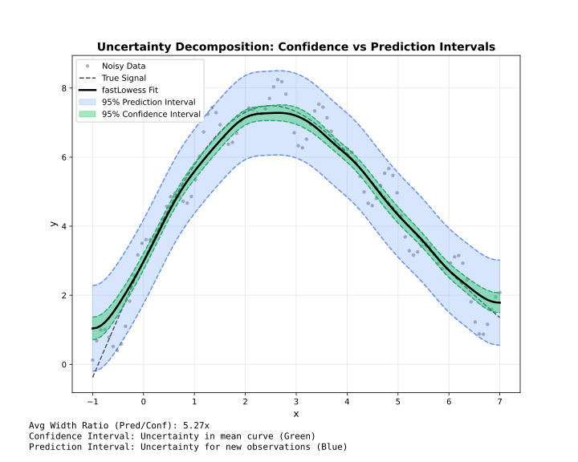

# Intervals

Confidence and prediction intervals for uncertainty quantification.

## Overview



!!! note "Adapter support"
    Confidence and prediction intervals are available in **Batch** mode, **Streaming** mode (computed per chunk and merged across overlap boundaries via `merge_strategy`, like `y`/`derivative`), and **Online** mode when `update_mode="full"` is set (errors if combined with the default `"incremental"` mode).

Confidence and prediction coverage levels are independent; for example, a 90% confidence interval can be paired with a 99% prediction interval.

| Type | Represents | Width | Use |
| --- | --- | --- | --- |
| **Confidence** | Uncertainty in mean curve | Narrow | Where is the true trend? |
| **Prediction** | Uncertainty for new points | Wide | Where will new data fall? |

---

## Confidence Intervals

Estimate uncertainty in the smoothed curve itself.

```@example intervals-confidence
using FastLOWESS
using Random, Statistics

rng = MersenneTwister(42)
x = collect(range(0, 2π, length=100))
y = sin.(x) .+ randn(rng, 100) .* 0.3

model = Lowess(; fraction=0.5, intervals=(confidence=0.95,))
result = fit(model, x, y)

println("Smoothed (first 5): ", result.y[1:5])
println("CI Lower (first 5): ", result.confidence_lower[1:5])
println("CI Upper (first 5): ", result.confidence_upper[1:5])
```

---

## Prediction Intervals

Estimate where new observations might fall.

```@example intervals-prediction
using FastLOWESS
using Random, Statistics

rng = MersenneTwister(42)
x = collect(range(0, 2π, length=100))
y = sin.(x) .+ randn(rng, 100) .* 0.3

model = Lowess(; fraction=0.5, intervals=(prediction=0.95,))
result = fit(model, x, y)

println("Prediction bounds: [$(result.prediction_lower[1]), $(result.prediction_upper[1])]")
```

---

## Both Intervals

Request both types simultaneously:

```@example intervals-both
using FastLOWESS
using Random, Statistics

rng = MersenneTwister(42)
x = collect(range(0, 2π, length=100))
y = sin.(x) .+ randn(rng, 100) .* 0.3

result = fit(
    Lowess(fraction=0.5, intervals=(confidence=0.95, prediction=0.95)),
    x, y
)
println("95% CI at midpoint: [$(round(result.confidence_lower[50]; digits=3)), $(round(result.confidence_upper[50]; digits=3))]")
```

---

## Confidence Levels

Common levels and their z-values:

| Level | z-value | Interpretation |
| --- | --- | --- |
| 0.90 | 1.645 | 90% of intervals contain true value |
| 0.95 | 1.960 | 95% of intervals contain true value |
| 0.99 | 2.576 | 99% of intervals contain true value |

```@example intervals-levels
using FastLOWESS
using Random, Statistics

rng = MersenneTwister(42)
x = collect(range(0, 2π, length=100))
y = sin.(x) .+ randn(rng, 100) .* 0.3

# 99% confidence interval
model = Lowess(; intervals=(confidence=0.99,))
result = fit(model, x, y)
println("99% CI at midpoint: [$(round(result.confidence_lower[50]; digits=3)), $(round(result.confidence_upper[50]; digits=3))]")
```

---

## Standard Errors

Access standard errors directly (available when intervals are computed):

```@example intervals-se
using FastLOWESS
using Random, Statistics

rng = MersenneTwister(42)
x = collect(range(0, 2π, length=100))
y = sin.(x) .+ randn(rng, 100) .* 0.3

model = Lowess(; intervals=(confidence=0.95,))
result = fit(model, x, y)

println("Standard errors (first 5): ", result.standard_errors[1:5])
```

---

## Residual Bootstrap

Set `bootstrap` to at least `2` to replace analytic uncertainty with residual-bootstrap refits. Batch shares its outer `seed` with CV; Streaming restarts the seed per combined chunk, and Online per full-update window. Online bootstrap requires `update_mode="full"`.

```@example intervals-bootstrap
using FastLOWESS

x = collect(0.0:0.1:2.9)
y = sin.(x) .+ 0.1 .* cos.(7 .* x)
intervals = (confidence=0.95, prediction=0.95, bootstrap=20)

batch = fit(Lowess(; intervals=intervals, seed=42), x, y)
println("Batch SEs: ", length(batch.standard_errors))

chunk = process_chunk(StreamingLowess(; chunk_size=length(x), intervals=intervals, seed=42), x, y)
println("Streaming CI present: ", chunk.confidence_lower !== nothing)

online = OnlineLowess(; min_points=5, update_mode="full", intervals=intervals, seed=42)
last_point = filter(!isnothing, [add_point(online, xi, yi) for (xi, yi) in zip(x[1:12], y[1:12])])[end]
println("Online PI present: ", last_point.prediction_lower !== nothing)
```

---

## Availability

!!! note "Supported In All Three Adapters"
    Confidence and prediction intervals are available in **Batch**, **Streaming**, and **Online** mode (`update_mode="full"` only).

| Feature | Batch | Streaming | Online |
| --- | --- | --- | --- |
| Confidence intervals | ✓ | ✓ | ✓ (`update_mode="full"` only) |
| Prediction intervals | ✓ | ✓ | ✓ (`update_mode="full"` only) |
| Standard errors | ✓ | ✓ | ✓ (`update_mode="full"` only) |
| Residual bootstrap | ✓ | ✓ | ✓ (`update_mode="full"` only) |
