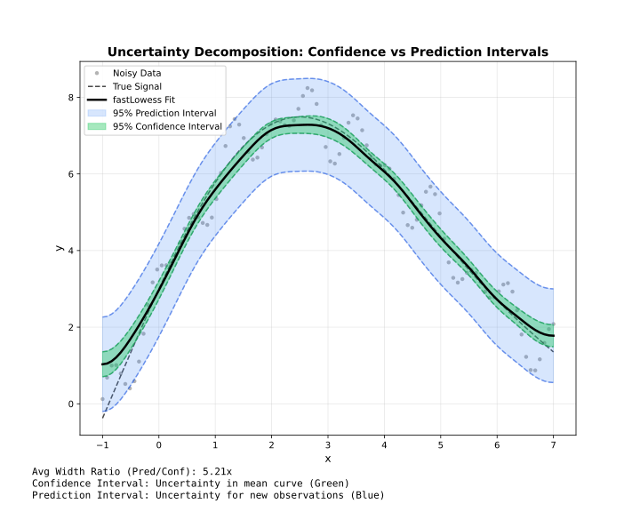

# Intervals

Confidence and prediction intervals for uncertainty quantification.

## Overview



!!! note "Adapter support"
    Confidence and prediction intervals are available in **Batch** mode only. Streaming and Online modes do not support intervals.

| Type | Represents | Width | Use |
| --- | --- | --- | --- |
| **Confidence** | Uncertainty in mean curve | Narrow | Where is the true trend? |
| **Prediction** | Uncertainty for new points | Wide | Where will new data fall? |

---

## Confidence Intervals

Estimate uncertainty in the smoothed curve itself.

```julia
using FastLOWESS
using Random, Statistics

rng = MersenneTwister(42)
x = collect(range(0, 2π, length=100))
y = sin.(x) .+ randn(rng, 100) .* 0.3

using FastLOWESS

model = Lowess(; fraction=0.5, confidence_intervals=0.95)
result = fit(model, x, y)

for i in 1:length(result.y)
    println("x=$(result.x[i]): y=$(result.y[i]) [$(result.confidence_lower[i]), $(result.confidence_upper[i])]")
end
```

---

## Prediction Intervals

Estimate where new observations might fall.

```julia
using FastLOWESS
using Random, Statistics

rng = MersenneTwister(42)
x = collect(range(0, 2π, length=100))
y = sin.(x) .+ randn(rng, 100) .* 0.3

model = Lowess(; fraction=0.5, prediction_intervals=0.95)
result = fit(model, x, y)

println("Prediction bounds: [$(result.prediction_lower[1]), $(result.prediction_upper[1])]")
```

---

## Both Intervals

Request both types simultaneously:

```julia
using FastLOWESS
using Random, Statistics

rng = MersenneTwister(42)
x = collect(range(0, 2π, length=100))
y = sin.(x) .+ randn(rng, 100) .* 0.3

result = fit(
    Lowess(fraction=0.5, confidence_intervals=0.95, prediction_intervals=0.95),
    x, y
)
```

---

## Confidence Levels

Common levels and their z-values:

| Level | z-value | Interpretation |
| --- | --- | --- |
| 0.90 | 1.645 | 90% of intervals contain true value |
| 0.95 | 1.960 | 95% of intervals contain true value |
| 0.99 | 2.576 | 99% of intervals contain true value |

```julia
using FastLOWESS
using Random, Statistics

rng = MersenneTwister(42)
x = collect(range(0, 2π, length=100))
y = sin.(x) .+ randn(rng, 100) .* 0.3

# 99% confidence interval
model = Lowess(; confidence_intervals=0.99)
result = fit(model, x, y)
```

---

## Standard Errors

Access standard errors directly (available when intervals are computed):

```julia
using FastLOWESS
using Random, Statistics

rng = MersenneTwister(42)
x = collect(range(0, 2π, length=100))
y = sin.(x) .+ randn(rng, 100) .* 0.3

model = Lowess(; confidence_intervals=0.95)
result = fit(model, x, y)

for (i, se) in enumerate(result.standard_errors)
    println("Point $i: SE = $se")
end
```

---

## Availability

!!! warning "Batch Mode Only"
    Confidence and prediction intervals are only available in **Batch** mode. Streaming and Online modes do not support intervals.

| Feature | Batch | Streaming | Online |
| --- | --- | --- | --- |
| Confidence intervals | ✓ | ✗ | ✗ |
| Prediction intervals | ✓ | ✗ | ✗ |
| Standard errors | ✓ | ✗ | ✗ |
