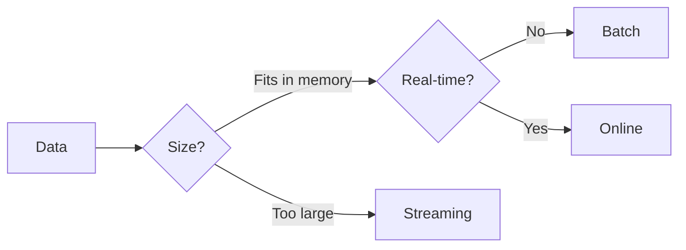

<!-- markdownlint-disable MD024 MD033 MD046 -->
Choose the right adapter for your use case.

## Overview

| Mode | Use Case | Memory | Features |
| --- | --- | --- | --- |
| **Batch** | Complete datasets | Full | All features |
| **Streaming** | Large files (>100K) | Chunked | Residuals, robustness |
| **Online** | Real-time sensors | Fixed window | Incremental updates |

---
