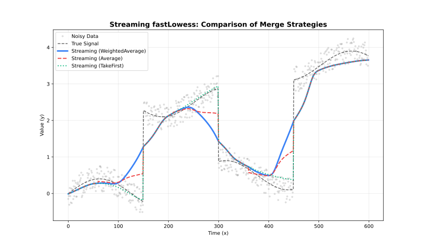

<!-- markdownlint-disable MD024 -->
# Execution Modes

Choose the right adapter for your use case.

## Overview

Choose the first row below whose condition applies:

| Condition | Adapter |
| --- | --- |
| Data too large to fit in memory | `Streaming` |
| Fits in memory, need real-time/incremental updates | `Online` |
| Fits in memory, no real-time requirement | `Batch` |

| Mode | Use Case | Memory | Features |
| --- | --- | --- | --- |
| **Batch** | Complete datasets | Full | All features |
| **Streaming** | Large files (>100K) | Chunked | Residuals, robustness |
| **Online** | Real-time sensors | Fixed window | Incremental updates |

---

## Batch Adapter

Standard mode for complete datasets. **Supports all features.**

### When to Use

- Dataset fits in memory
- Need intervals, cross-validation, or diagnostics
- Processing complete files

### Example

:::{jupyter-execute}
import fastlowess as fl
import numpy as np

rng = np.random.default_rng(42)
x = np.linspace(0, 2 * np.pi, 100)
y = np.sin(x) + rng.normal(0, 0.3, 100)

model = fl.Lowess(
    fraction=0.5,
    iterations=3,
    confidence_intervals=0.95,
    prediction_intervals=0.95,
    return_diagnostics=True,
    parallel=True
)
result = model.fit(x, y)
print(f"95% CI at midpoint: [{result.confidence_lower[50]:.4f}, {result.confidence_upper[50]:.4f}]")
print(f"R2: {result.diagnostics.r_squared:.4f}")
:::

---

## Streaming Adapter

Process large datasets in chunks with configurable overlap.

### When to Use

- Dataset >100,000 points
- Memory-constrained environments
- Batch processing pipelines

### Parameters

| Parameter | Default | Description |
| --- | --- | --- |
| `chunk_size` | 5000 | Points per chunk |
| `overlap` | 500 | Overlap between chunks |
| `merge_strategy` | `"weighted_average"` | How to merge overlaps |

### Merge Strategies

| Strategy | Behavior |
| --- | --- |
| `"average"` | Average overlapping values |
| `"weighted_average"` | Distance-weighted blend |
| `"take_first"` | Keep left chunk values |
| `"take_last"` | Keep right chunk values |

### Example

:::{jupyter-execute}
import fastlowess as fl
import numpy as np

rng = np.random.default_rng(42)
x = np.linspace(0, 2 * np.pi, 100)
y = np.sin(x) + rng.normal(0, 0.3, 100)

model = fl.StreamingLowess(
    fraction=0.3,
    iterations=2,
    chunk_size=5000,
    overlap=500,
    merge_strategy="average"
)
model.process_chunk(x, y)
result = model.finalize()
print(f"Smoothed y[0]: {result.y[0]:.4f}")
:::

---

:::{warning} Always call finalize()
In Rust, always call `processor.finalize()` after processing all chunks to retrieve buffered overlap data.
:::

## Online Adapter

Incremental updates with a sliding window for real-time data.

### When to Use

- Data arrives incrementally (sensors, streams)
- Need real-time smoothed values
- Fixed memory budget

### Parameters

| Parameter | Default | Description |
| --- | --- | --- |
| `window_capacity` | 1000 | Max points in window |
| `min_points` | 2 | Points before output starts |
| `update_mode` | `"incremental"` | Update strategy |

### Update Modes

| Mode | Behavior | Speed |
| --- | --- | --- |
| `"incremental"` | Update only affected fits | Faster |
| `"full"` | Recompute entire window | More accurate |

### Example

:::{jupyter-execute}
import fastlowess as fl
import numpy as np

rng = np.random.default_rng(42)
x = np.linspace(0, 2 * np.pi, 100)
y = np.sin(x) + rng.normal(0, 0.3, 100)

model = fl.OnlineLowess(
    fraction=0.2,
    iterations=1,
    window_capacity=100,
    min_points=5,
    update_mode="incremental"
)
shown = 0
for xi, yi in zip(x, y):
    result = model.add_point(float(xi), float(yi))
    if result is not None:
        print(result.y)
        shown += 1
        if shown >= 5:
            break
:::

---

## Feature Comparison

| Feature | Batch | Streaming | Online |
| --- | --- | --- | --- |
| Confidence intervals | ✓ | ✗ | ✗ |
| Prediction intervals | ✓ | ✗ | ✗ |
| Cross-validation | ✓ | ✗ | ✗ |
| Diagnostics | ✓ | ✓ | ✗ |
| Residuals | ✓ | ✓ | ✓ |
| Robustness weights | ✓ | ✓ | ✓ |
| Parallel execution | ✓ | ✓ | ✗ |

---

## Next Steps

- [API Reference](../api/api.md) — All configuration options
- [Tutorials](../use-case/real-time.md) — Real-time processing guide
