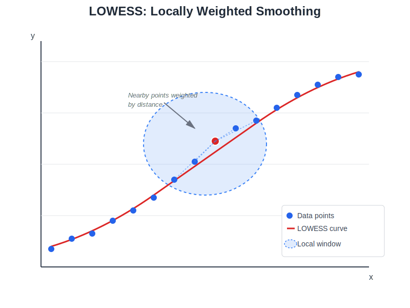

fastlowess: High-performance LOWESS for Python
==============================================

**High-performance parallel LOWESS (Locally Weighted Scatterplot Smoothing) for Python**

A production-ready implementation built on top of a highly optimized Rust core. It offers **12-3800x speed improvements** over standard implementations while providing robust statistics, uncertainty quantification, and memory-efficient streaming.

What is LOWESS?
---------------

LOWESS (Locally Weighted Scatterplot Smoothing) is a nonparametric regression method that fits smooth curves through scatter plots. At each point, it fits a weighted polynomial (typically linear) using nearby data points.

Key advantages:
*   **No parametric assumptions**: Adapts to the data's local structure.
*   **Robustness**: Handles outliers using iterative re-weighted least squares (IRLS).
*   **Uncertainty Quantification**: Provides confidence and prediction intervals.
*   **Scale**: Handles millions of points with parallel execution and streaming.

How LOWESS Works
----------------

LOWESS creates smooth curves through scattered data using local weighted neighborhoods:

1. For each point, select nearby neighbors (controlled by ``fraction``).
2. Fit a weighted polynomial (closer points get higher weight).
3. Use the fitted value as the smoothed estimate.
4. Optionally iterate to downweight outliers (robustness).

Robustness Advantages
---------------------

This implementation is **more robust than statsmodels** due to:

MAD-Based Scale Estimation
^^^^^^^^^^^^^^^^^^^^^^^^^^

We use **Median Absolute Deviation (MAD)** for scale estimation, which is breakdown-point-optimal:

.. math::

   s = \text{median}(|r_i - \text{median}(r)|)

Boundary Padding
^^^^^^^^^^^^^^^^

We apply **boundary policies** (Extend, Reflect, Zero) at dataset edges to maintain symmetric local neighborhoods, preventing the edge bias common in other implementations.

Gaussian Consistency Factor
^^^^^^^^^^^^^^^^^^^^^^^^^^^

For precision in intervals, residual scale is computed using:

.. math::

   \hat{\sigma} = 1.4826 \times \text{MAD}

Performance Advantages
----------------------

The ``fastlowess`` Python package demonstrates massive performance gains over Python's ``statsmodels`` and R's ``stats::lowess``. The benchmarks compare ``fastlowess`` (both Serial and Parallel execution modes) against these standard implementations.

The results show that ``fastlowess`` is the decisive winner across all benchmarks, achieving an **average speedup of 280x** and a **maximum speedup of 1169x**.

The table below shows speedups relative to the **statsmodels baseline**.

+----------------------+-------------+-------------+---------------+
| Name                 | statsmodels |      R      |  fastlowess   |
+======================+=============+=============+===============+
| clustered            |  162.77ms   |  [82.8x]²   |  [170-432x]¹  |
+----------------------+-------------+-------------+---------------+
| constant_y           |  133.63ms   |  [92.3x]²   |  [176-372x]¹  |
+----------------------+-------------+-------------+---------------+
| delta_large          |   0.51ms    |   [0.8x]²   |  [3.3-2.0x]¹  |
+----------------------+-------------+-------------+---------------+
| delta_medium         |   0.79ms    |   [1.3x]²   |  [3.7-3.3x]¹  |
+----------------------+-------------+-------------+---------------+
| delta_none           |  414.86ms   |   [2.5x]²   |  [3.2-16x]¹   |
+----------------------+-------------+-------------+---------------+
| delta_small          |   1.45ms    |   [1.7x]²   |  [3.6-4.4x]¹  |
+----------------------+-------------+-------------+---------------+
| extreme_outliers     |  488.96ms   |  [106.4x]²  |  [168-373x]¹  |
+----------------------+-------------+-------------+---------------+
| financial_1000       |   13.55ms   |  [76.6x]²   |  [135-105x]¹  |
+----------------------+-------------+-------------+---------------+
| financial_10000      |  302.20ms   |  [168.3x]²  |  [379-480x]¹  |
+----------------------+-------------+-------------+---------------+
| financial_500        |   6.49ms    |  [58.0x]¹   |   [92-54x]²   |
+----------------------+-------------+-------------+---------------+
| financial_5000       |  103.94ms   |  [117.3x]²  |  [252-336x]¹  |
+----------------------+-------------+-------------+---------------+
| fraction_0.05        |  122.00ms   |  [177.6x]²  |  [376-274x]¹  |
+----------------------+-------------+-------------+---------------+
| fraction_0.1         |  140.59ms   |  [112.8x]²  |  [252-219x]¹  |
+----------------------+-------------+-------------+---------------+
| fraction_0.2         |  181.57ms   |  [85.3x]²   |  [180-283x]¹  |
+----------------------+-------------+-------------+---------------+
| fraction_0.3         |  220.98ms   |  [84.8x]²   |  [151-304x]¹  |
+----------------------+-------------+-------------+---------------+
| fraction_0.5         |  296.47ms   |  [80.9x]²   |  [125-366x]¹  |
+----------------------+-------------+-------------+---------------+
| fraction_0.67        |  362.59ms   |  [83.1x]²   |  [115-428x]¹  |
+----------------------+-------------+-------------+---------------+
| genomic_1000         |   17.82ms   |  [15.9x]²   |   [16-23x]¹   |
+----------------------+-------------+-------------+---------------+
| genomic_10000        |  399.90ms   |   [3.6x]²   |  [4.5-18x]¹   |
+----------------------+-------------+-------------+---------------+
| genomic_5000         |  138.49ms   |   [5.0x]²   |  [6.1-21x]¹   |
+----------------------+-------------+-------------+---------------+
| genomic_50000        |  6776.57ms  |   [2.4x]²   |  [3.1-12x]¹   |
+----------------------+-------------+-------------+---------------+
| high_noise           |  435.85ms   |  [132.6x]²  |  [118-381x]¹  |
+----------------------+-------------+-------------+---------------+
| iterations_0         |   45.18ms   |  [128.4x]²  |  [212-497x]¹  |
+----------------------+-------------+-------------+---------------+
| iterations_1         |   94.10ms   |  [114.3x]²  |  [195-460x]¹  |
+----------------------+-------------+-------------+---------------+
| iterations_10        |  495.65ms   |  [116.0x]²  |  [172-428x]¹  |
+----------------------+-------------+-------------+---------------+
| iterations_2         |  135.48ms   |  [109.0x]²  |  [180-399x]¹  |
+----------------------+-------------+-------------+---------------+
| iterations_3         |  181.56ms   |  [108.8x]²  |  [178-408x]¹  |
+----------------------+-------------+-------------+---------------+
| iterations_5         |  270.58ms   |  [110.4x]²  |  [174-356x]¹  |
+----------------------+-------------+-------------+---------------+
| scale_1000           |   17.95ms   |  [82.6x]¹   |  [131-51x]²   |
+----------------------+-------------+-------------+---------------+
| scale_10000          |  408.13ms   |  [178.1x]²  |  [378-270x]¹  |
+----------------------+-------------+-------------+---------------+
| scale_5000           |  139.81ms   |  [133.6x]²  |  [254-224x]¹  |
+----------------------+-------------+-------------+---------------+
| scale_50000          |  6798.58ms  |  [661.0x]²  | [987-1169x]¹  |
+----------------------+-------------+-------------+---------------+
| scientific_1000      |   19.04ms   |  [70.1x]²   |  [103-75x]¹   |
+----------------------+-------------+-------------+---------------+
| scientific_10000     |  479.57ms   |  [190.7x]²  |  [316-461x]¹  |
+----------------------+-------------+-------------+---------------+
| scientific_500       |   8.59ms    |  [49.6x]¹   |   [69-45x]²   |
+----------------------+-------------+-------------+---------------+
| scientific_5000      |  161.42ms   |  [124.9x]²  |  [205-273x]¹  |
+----------------------+-------------+-------------+---------------+
| scale_100000**       |      -      |      -      |    1-1.5x     |
+----------------------+-------------+-------------+---------------+

\* **fastlowess**: Shows speedup range ``[Serial-Parallel]``. E.g., ``[12-48x]`` means 12x speedup (Sequential) and 48x speedup (Parallel).

\*\* **Large Scale**: ``fastlowess (Serial)`` is the baseline (1x).

¹ Winner (Fastest implementation)

² Runner-up (Second fastest implementation)

**Key Takeaways**:

1. **Dominant Performance**: ``fastlowess`` is consistently the fastest implementation. Even in **Serial** mode, it significantly outperforms ``statsmodels`` and ``R``.
2. **Parallel Scaling**:
   
   - **Large Datasets**: Parallel execution provides massive gains. For example, ``scale_50000`` shows a jump from ~987x (Serial) to ~1169x (Parallel) speedup.
   - **Small Datasets**: For very small datasets (e.g., ``scale_1000``, ``financial_500``), Serial execution is often faster than Parallel due to thread overhead (e.g., ``[131-51x]``).

3. **R vs Statsmodels**: ``R`` is a strong runner-up, generally ~80-150x faster than ``statsmodels``, but ``fastlowess`` extends this lead further.
4. **Handling Complex Cases**: ``fastlowess`` maintains its performance advantage even in pathological cases like ``high_noise`` and ``extreme_outliers``.

.. toctree::
   :maxdepth: 2
   :caption: User Guide

   installation
   quickstart
   examples
   advanced_usage
   execution_modes
   parameters

.. toctree::
   :maxdepth: 2
   :caption: API Reference

   api

Indices and tables
==================

* :ref:`genindex`
* :ref:`modindex`
* :ref:`search`
