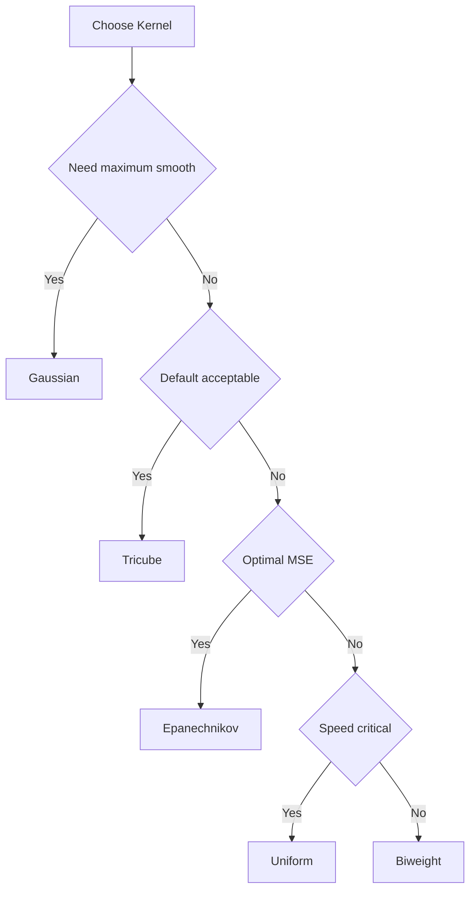

# Weight Functions

Kernel functions for distance weighting.

## Overview

Weight functions (kernels) determine how neighboring points contribute to each local fit. Points closer to the target receive higher weights.

---

## Available Kernels

| Kernel | Efficiency | Smoothness | Support |
| --- | --- | --- | --- |
| **Tricube** | 0.998 | Very smooth | Compact |
| **Epanechnikov** | 1.000 | Smooth | Compact |
| **Gaussian** | 0.961 | Infinite | Unbounded |
| **Biweight** | 0.995 | Very smooth | Compact |
| **Cosine** | 0.999 | Smooth | Compact |
| **Triangle** | 0.989 | Moderate | Compact |
| **Uniform** | 0.943 | None | Compact |

**Efficiency** = AMISE relative to Epanechnikov (1.0 = optimal)

---

## Tricube (Default)

Cleveland's original choice. Best all-around performance.

$$w(u) = (1 - |u|^3)^3$$

**Use when**: Default choice for most applications.

:::{jupyter-execute}
import fastlowess as fl
import numpy as np

rng = np.random.default_rng(42)
x = np.linspace(0, 2 * np.pi, 100)
y = np.sin(x) + rng.normal(0, 0.3, 100)

model = fl.Lowess(weight_function="tricube")
result = model.fit(x, y)
print(f"Smoothed y[0]: {result.y[0]:.4f}")
:::

---

## Epanechnikov

Theoretically optimal for kernel density estimation.

$$w(u) = \frac{3}{4}(1 - u^2)$$

**Use when**: Optimal MSE properties desired.

:::{jupyter-execute}
import fastlowess as fl
import numpy as np

rng = np.random.default_rng(42)
x = np.linspace(0, 2 * np.pi, 100)
y = np.sin(x) + rng.normal(0, 0.3, 100)

model = fl.Lowess(weight_function="epanechnikov")
result = model.fit(x, y)
print(f"Smoothed y[0]: {result.y[0]:.4f}")
:::

---

## Gaussian

Infinitely smooth. No boundary effects.

$$w(u) = \exp(-u^2/2)$$

**Use when**: Maximum smoothness needed, computational cost acceptable.

:::{jupyter-execute}
import fastlowess as fl
import numpy as np

rng = np.random.default_rng(42)
x = np.linspace(0, 2 * np.pi, 100)
y = np.sin(x) + rng.normal(0, 0.3, 100)

model = fl.Lowess(weight_function="gaussian")
result = model.fit(x, y)
print(f"Smoothed y[0]: {result.y[0]:.4f}")
:::

---

## Biweight

Good balance of efficiency and smoothness.

$$w(u) = (1 - u^2)^2$$

**Use when**: Alternative to Tricube with slightly different properties.

:::{jupyter-execute}
import fastlowess as fl
import numpy as np

rng = np.random.default_rng(42)
x = np.linspace(0, 2 * np.pi, 100)
y = np.sin(x) + rng.normal(0, 0.3, 100)

model = fl.Lowess(weight_function="biweight")
result = model.fit(x, y)
print(f"Smoothed y[0]: {result.y[0]:.4f}")
:::

---

## Cosine

Smooth and computationally efficient.

$$w(u) = \cos(\pi u / 2)$$

**Use when**: Want smooth kernel with simple form.

:::{jupyter-execute}
import fastlowess as fl
import numpy as np

rng = np.random.default_rng(42)
x = np.linspace(0, 2 * np.pi, 100)
y = np.sin(x) + rng.normal(0, 0.3, 100)

model = fl.Lowess(weight_function="cosine")
result = model.fit(x, y)
print(f"Smoothed y[0]: {result.y[0]:.4f}")
:::

---

## Triangle

Simple linear taper.

$$w(u) = 1 - |u|$$

**Use when**: Simple, interpretable weights.

:::{jupyter-execute}
import fastlowess as fl
import numpy as np

rng = np.random.default_rng(42)
x = np.linspace(0, 2 * np.pi, 100)
y = np.sin(x) + rng.normal(0, 0.3, 100)

model = fl.Lowess(weight_function="triangle")
result = model.fit(x, y)
print(f"Smoothed y[0]: {result.y[0]:.4f}")
:::

---

## Uniform

Equal weights within window. Fastest but least smooth.

$$w(u) = 1$$

**Use when**: Speed is critical, smoothness less important.

:::{jupyter-execute}
import fastlowess as fl
import numpy as np

rng = np.random.default_rng(42)
x = np.linspace(0, 2 * np.pi, 100)
y = np.sin(x) + rng.normal(0, 0.3, 100)

model = fl.Lowess(weight_function="uniform")
result = model.fit(x, y)
print(f"Smoothed y[0]: {result.y[0]:.4f}")
:::

---

## Choosing a Kernel

:::{tip} Recommendation
Stick with **Tricube** (default) unless you have specific requirements. The differences between kernels are usually small in practice.
:::
