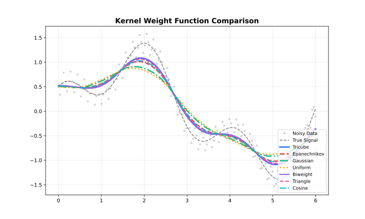

```{r setup, include=FALSE}
knitr::opts_chunk$set(collapse = TRUE, comment = "#>")
```

## Overview

Kernel functions determine how neighbouring points contribute to each local fit.
Points closer to the target receive higher weights.



## Available Kernels

| Kernel | Efficiency | Smoothness | Support |
| --- | --- | --- | --- |
| **Tricube** | 0.998 | Very smooth | Compact |
| **Epanechnikov** | 1.000 | Smooth | Compact |
| **Gaussian** | 0.961 | Infinite | Unbounded |
| **Biweight** | 0.995 | Very smooth | Compact |
| **Cosine** | 0.999 | Smooth | Compact |
| **Triangle** | 0.989 | Moderate | Compact |
| **Uniform** | 0.943 | None | Compact |

**Efficiency** = AMISE relative to Epanechnikov (1.0 = optimal)

---

## Tricube (Default)

Cleveland's original choice. Best all-around performance.

$$w(u) = (1 - |u|^3)^3$$

**Use when**: Default choice for most applications.

```{r kernels_1}
library(rfastlowess)
set.seed(42)
x <- seq(0, 2 * pi, length.out = 100)
y <- sin(x) + rnorm(100, sd = 0.3)

model <- Lowess(weight_function = "tricube")
result <- fit(model, x, y)
print(head(result$y))
```

---

## Epanechnikov

Optimal in the AMISE sense. Slightly more angular than tricube.

$$w(u) = \frac{3}{4}(1 - u^2)$$

**Use when**: Statistical optimality matters; compact support desired.

```{r kernels_2}
model <- Lowess(weight_function = "epanechnikov")
result <- fit(model, x, y)
print(head(result$y))
```

---

## Gaussian

Unbounded support — all points have non-zero weight.

$$w(u) = e^{-u^2/2}$$

**Use when**: Smooth transitions at boundaries; periodic data.

```{r kernels_3}
model <- Lowess(weight_function = "gaussian")
result <- fit(model, x, y)
print(head(result$y))
```

---

## Biweight

Very smooth, compact support.

$$w(u) = (1 - u^2)^2$$

**Use when**: Extra smoothness required; robust to heavy tails.

```{r kernels_4}
model <- Lowess(weight_function = "biweight")
result <- fit(model, x, y)
print(head(result$y))
```

---

## Cosine

Smooth, cosine-shaped weight. Efficient and compact.

$$w(u) = \frac{\pi}{4}\cos\!\left(\frac{\pi u}{2}\right)$$

**Use when**: Smooth result with compact support; slightly faster than biweight.

```{r kernels_5}
model <- Lowess(weight_function = "cosine")
result <- fit(model, x, y)
print(head(result$y))
```

---

## Triangle

Linear decrease from centre. Simple, moderate smoothness.

$$w(u) = 1 - |u|$$

**Use when**: Simple linear decay desired; interpretability matters.

```{r kernels_6}
model <- Lowess(weight_function = "triangle")
result <- fit(model, x, y)
print(head(result$y))
```

---

## Uniform

Flat weight — equal contribution within the neighbourhood.

$$w(u) = \frac{1}{2}$$

**Use when**: Unweighted local regression; baseline comparisons.

```{r kernels_7}
model <- Lowess(weight_function = "uniform")
result <- fit(model, x, y)
print(head(result$y))
```

```{r session-info}
sessionInfo()
```
