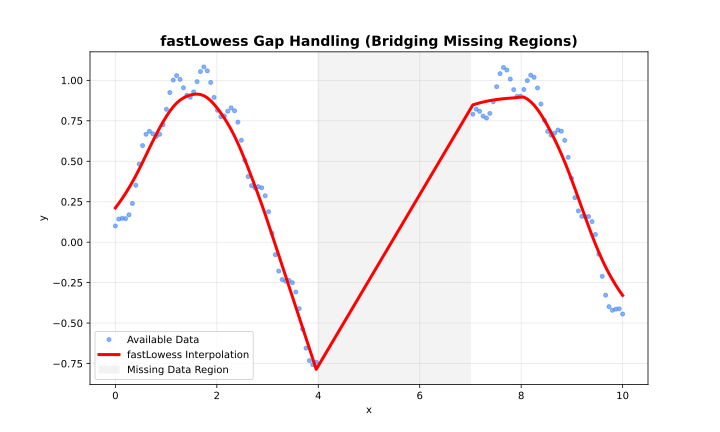

# Batch Adapter

Standard mode for complete datasets. **Supports all features.**

## When to Use

- Dataset fits in memory
- Need intervals, cross-validation, or diagnostics
- Processing complete files



## Example

```javascript
const { Lowess } = require('fastlowess-wasm');

const n = 100;
const x = Float64Array.from({ length: n }, (_, i) => i * 2 * Math.PI / (n - 1));
const y = Float64Array.from(x, (xi, i) => Math.sin(xi) + (((i * 7 + 3) % 17) / 17 - 0.5) * 0.6);

const model = new Lowess({
    fraction: 0.5,
    iterations: 3,
    confidence_intervals: 0.95,
    prediction_intervals: 0.95,
    return_diagnostics: true
});
const result = model.fit(x, y);
console.log("CI lower[0]:", result.confidence_lower[0].toFixed(4));
```

```output
CI lower[0]: 0.0551
```

---
