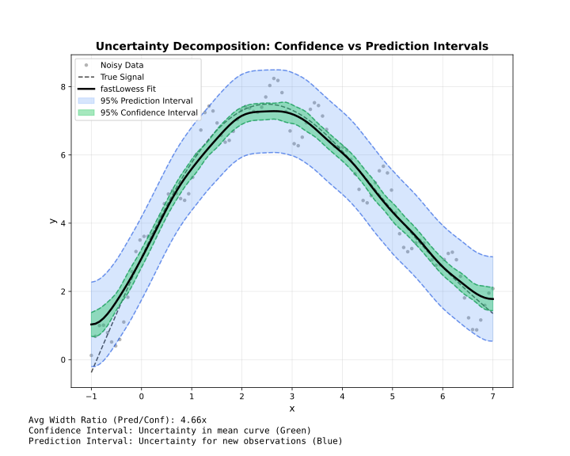

<!-- markdownlint-disable MD024 MD033 -->
# Intervals

Confidence and prediction intervals for uncertainty quantification.

## Overview



!!! note "Adapter support"
    Confidence and prediction intervals are available in **Batch** mode only. Streaming and Online modes do not support intervals.

| Type | Represents | Width | Use |
| --- | --- | --- | --- |
| **Confidence** | Uncertainty in mean curve | Narrow | Where is the true trend? |
| **Prediction** | Uncertainty for new points | Wide | Where will new data fall? |

---

## Confidence Intervals

Estimate uncertainty in the smoothed curve itself.

```javascript
const { Lowess } = require('fastlowess-wasm');

const n = 100;
const x = Float64Array.from({ length: n }, (_, i) => i * 2 * Math.PI / (n - 1));
const y = Float64Array.from(x, (xi, i) => Math.sin(xi) + (((i * 7 + 3) % 17) / 17 - 0.5) * 0.6);

const model = new Lowess({fraction: 0.5, confidence_intervals: 0.95});
const result = model.fit(x, y);

result.y.forEach((y, i) => {
    console.log(`x=${result.x[i]}: y=${y} [${result.confidence_lower[i]}, ${result.confidence_upper[i]}]`);
});
```

---

## Prediction Intervals

Estimate where new observations might fall.

```javascript
const { Lowess } = require('fastlowess-wasm');

const n = 100;
const x = Float64Array.from({ length: n }, (_, i) => i * 2 * Math.PI / (n - 1));
const y = Float64Array.from(x, (xi, i) => Math.sin(xi) + (((i * 7 + 3) % 17) / 17 - 0.5) * 0.6);

const model = new Lowess({fraction: 0.5, prediction_intervals: 0.95});
const result = model.fit(x, y);
console.log(`Prediction bounds: [${result.prediction_lower[0]}, ${result.prediction_upper[0]}]`);
```

---

## Both Intervals

Request both types simultaneously:

```javascript
const { Lowess } = require('fastlowess-wasm');

const n = 100;
const x = Float64Array.from({ length: n }, (_, i) => i * 2 * Math.PI / (n - 1));
const y = Float64Array.from(x, (xi, i) => Math.sin(xi) + (((i * 7 + 3) % 17) / 17 - 0.5) * 0.6);

const model = new Lowess({fraction: 0.5,
    confidence_intervals: 0.95,
    prediction_intervals: 0.95});
const result = model.fit(x, y);
```

---

## Confidence Levels

Common levels and their z-values:

| Level | z-value | Interpretation |
| --- | --- | --- |
| 0.90 | 1.645 | 90% of intervals contain true value |
| 0.95 | 1.960 | 95% of intervals contain true value |
| 0.99 | 2.576 | 99% of intervals contain true value |

```javascript
const { Lowess } = require('fastlowess-wasm');

const n = 100;
const x = Float64Array.from({ length: n }, (_, i) => i * 2 * Math.PI / (n - 1));
const y = Float64Array.from(x, (xi, i) => Math.sin(xi) + (((i * 7 + 3) % 17) / 17 - 0.5) * 0.6);

// 99% confidence interval
const model = new Lowess({confidence_intervals: 0.99});
const result = model.fit(x, y);
```

---

## Standard Errors

Access standard errors directly (available when intervals are computed):

```javascript
const { Lowess } = require('fastlowess-wasm');

const n = 100;
const x = Float64Array.from({ length: n }, (_, i) => i * 2 * Math.PI / (n - 1));
const y = Float64Array.from(x, (xi, i) => Math.sin(xi) + (((i * 7 + 3) % 17) / 17 - 0.5) * 0.6);

const model = new Lowess({confidence_intervals: 0.95});
const result = model.fit(x, y);

result.standard_errors.forEach((se, i) => {
    console.log(`Point ${i}: SE = ${se.toFixed(4)}`);
});
```

---

## Availability

!!! warning "Batch Mode Only"
    Confidence and prediction intervals are only available in **Batch** mode. Streaming and Online modes do not support intervals.

| Feature | Batch | Streaming | Online |
| --- | --- | --- | --- |
| Confidence intervals | ✓ | ✗ | ✗ |
| Prediction intervals | ✓ | ✗ | ✗ |
| Standard errors | ✓ | ✗ | ✗ |
