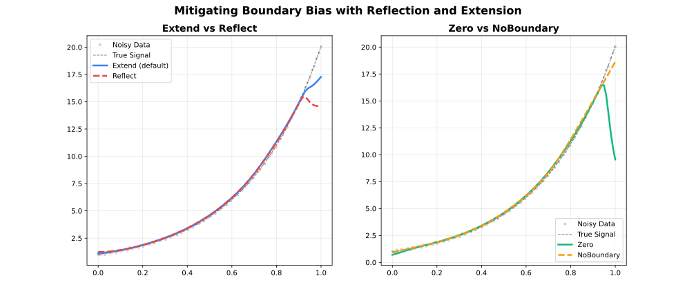
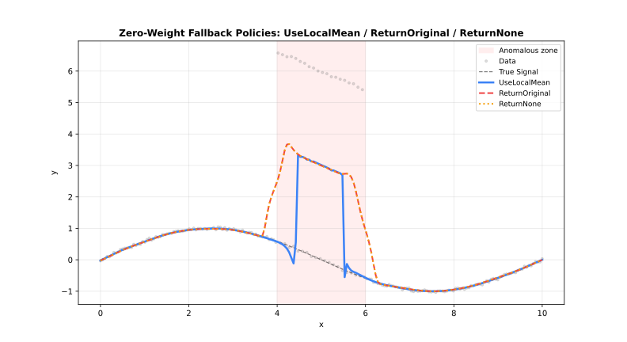

<!-- markdownlint-disable MD024 MD033 -->
# Parameters

Complete reference for all LOWESS configuration options.

## Quick Reference

| Parameter | Default | Range/Options | Description | Adapter |
| --- | --- | --- | --- | --- |
| **fraction** | 0.67 | (0, 1] | Smoothing span | All |
| **iterations** | 3 | [0, 1000] | Robustness iterations | All |
| **delta** | `null` | [0, ∞) | Interpolation threshold | All |
| **weight_function** | `"tricube"` | 7 options | Distance kernel | All |
| **robustness_method** | `"bisquare"` | 3 options | Outlier weighting | All |
| **zero_weight_fallback** | `"use_local_mean"` | 3 options | Zero-weight behavior | All |
| **boundary_policy** | `"extend"` | 4 options | Edge handling | All |
| **scaling_method** | `"mad"` | 3 options | Scale estimation | All |
| **auto_converge** | `null` | tolerance | Early stopping | All |
| **return_residuals** | `false` | logical | Include residuals | All |
| **return_robustness_weights** | `false` | logical | Include weights | All |
| **return_se** | `false` | logical | Return standard errors | All |
| **return_diagnostics** | `false` | logical | Include metrics | Batch, Streaming |
| **custom_weights** | `null` | positive | Per-observation weights | Batch |
| **confidence_intervals** | `null` | (0, 1) | CI level | Batch |
| **prediction_intervals** | `null` | (0, 1) | PI level | Batch |
| **cv_method** | `null` | method | Auto-select fraction | Batch |
| **chunk_size** | 5000 | [10, ∞) | Points per chunk | Streaming |
| **overlap** | 500 | [0, chunk) | Overlap between chunks | Streaming |
| **merge_strategy** | `"weighted_average"` | 4 options | Merge overlaps | Streaming |
| **window_capacity** | 1000 | [3, ∞) | Max window size | Online |
| **min_points** | 2 | [2, window] | Min before output | Online |
| **update_mode** | `"incremental"` | 2 options | Update strategy | Online |

!!! note "Rust option values"
    In Rust, pass option-like parameters as strings (case-insensitive), e.g. `"tricube"`, `"bisquare"`, `"extend"`, `"average"`.

---

## Parameter Options Summary

| Parameter | Available Options |
| --- | --- |
| **weight_function** | `"tricube"`, `"epanechnikov"`, `"gaussian"`, `"biweight"`, `"cosine"`, `"triangle"`, `"uniform"` |
| **robustness_method** | `"bisquare"`, `"huber"`, `"talwar"` |
| **zero_weight_fallback** | `"use_local_mean"`, `"return_original"`, `"return_none"` |
| **boundary_policy** | `"extend"`, `"reflect"`, `"zero"`, `"noboundary"` |
| **scaling_method** | `"mad"`, `"mar"`, `"mean"` |
| **merge_strategy** | `"average"`, `"weighted_average"`, `"take_first"`, `"take_last"` |
| **update_mode** | `"incremental"`, `"full"` |

---

## Core Parameters

### fraction

The proportion of data used for each local fit. **Most important parameter.**

| Value | Effect | Use Case |
| --- | --- | --- |
| 0.1–0.3 | Fine detail | Rapidly changing signals |
| 0.3–0.5 | Balanced | General purpose |
| 0.5–0.7 | Heavy smoothing | Noisy data |
| 0.7–1.0 | Very smooth | Trend extraction |

```javascript
const { Lowess } = require('fastlowess-wasm');

const n = 100;
const x = Float64Array.from({ length: n }, (_, i) => i * 2 * Math.PI / (n - 1));
const y = Float64Array.from(x, (xi, i) => Math.sin(xi) + (((i * 7 + 3) % 17) / 17 - 0.5) * 0.6);

const model = new Lowess({fraction: 0.3});
const result = model.fit(x, y);
```

---

### iterations

Number of robustness iterations for outlier resistance.

| Value | Effect | Performance |
| --- | --- | --- |
| 0 | No robustness | Fastest |
| 1–3 | Moderate | Recommended |
| 4–6 | Strong | Contaminated data |
| 7+ | Very strong | Heavy outliers |

```javascript
const { Lowess } = require('fastlowess-wasm');

const n = 100;
const x = Float64Array.from({ length: n }, (_, i) => i * 2 * Math.PI / (n - 1));
const y = Float64Array.from(x, (xi, i) => Math.sin(xi) + (((i * 7 + 3) % 17) / 17 - 0.5) * 0.6);

const model = new Lowess({iterations: 5});
const result = model.fit(x, y);
```

---

### delta

Interpolation optimization threshold. Points within `delta` distance reuse the previous fit.

- **Default**: 1% of x-range (Batch), 0.0 (Streaming/Online)
- **Effect**: Higher values = faster but less accurate

```javascript
const { Lowess } = require('fastlowess-wasm');

const n = 100;
const x = Float64Array.from({ length: n }, (_, i) => i * 2 * Math.PI / (n - 1));
const y = Float64Array.from(x, (xi, i) => Math.sin(xi) + (((i * 7 + 3) % 17) / 17 - 0.5) * 0.6);

const model = new Lowess({delta: 0.05});
const result = model.fit(x, y);
```

---

### weight_function

Distance weighting kernel for local fits.

| Kernel | Efficiency | Smoothness |
| --- | --- | --- |
| `"tricube"` | 0.998 | Very smooth |
| `"epanechnikov"` | 1.000 | Smooth |
| `"gaussian"` | 0.961 | Infinite |
| `"biweight"` | 0.995 | Very smooth |
| `"cosine"` | 0.999 | Smooth |
| `"triangle"` | 0.989 | Moderate |
| `"uniform"` | 0.943 | None |

See [Weight Functions](kernels.md) for detailed comparison.

```javascript
const { Lowess } = require('fastlowess-wasm');

const n = 100;
const x = Float64Array.from({ length: n }, (_, i) => i * 2 * Math.PI / (n - 1));
const y = Float64Array.from(x, (xi, i) => Math.sin(xi) + (((i * 7 + 3) % 17) / 17 - 0.5) * 0.6);

const model = new Lowess({weight_function: "epanechnikov"});
const result = model.fit(x, y);
```

---

### robustness_method

Method for downweighting outliers during iterative refinement.

| Method | Behavior | Use Case |
| --- | --- | --- |
| `"bisquare"` | Smooth downweighting | General-purpose |
| `"huber"` | Linear beyond threshold | Moderate outliers |
| `"talwar"` | Hard threshold (0 or 1) | Extreme contamination |

See [Robustness](robustness.md) for detailed comparison.

```javascript
const { Lowess } = require('fastlowess-wasm');

const n = 100;
const x = Float64Array.from({ length: n }, (_, i) => i * 2 * Math.PI / (n - 1));
const y = Float64Array.from(x, (xi, i) => Math.sin(xi) + (((i * 7 + 3) % 17) / 17 - 0.5) * 0.6);

const model = new Lowess({robustness_method: "talwar"});
const result = model.fit(x, y);
```

---

### boundary_policy

Edge handling strategy to reduce boundary bias. See [Boundary Handling](boundary.md) for a detailed comparison.



| Policy | Behavior | Use Case |
| --- | --- | --- |
| `"extend"` | Pad with first/last values | Most cases (default) |
| `"reflect"` | Mirror data at boundaries | Periodic/symmetric data |
| `"zero"` | Pad with zeros | Data approaches zero |
| `"noboundary"` | No padding | Original Cleveland behavior |

For example:

```javascript
const { Lowess } = require('fastlowess-wasm');

const n = 100;
const x = Float64Array.from({ length: n }, (_, i) => i * 2 * Math.PI / (n - 1));
const y = Float64Array.from(x, (xi, i) => Math.sin(xi) + (((i * 7 + 3) % 17) / 17 - 0.5) * 0.6);

const model = new Lowess({boundary_policy: "reflect"});
const result = model.fit(x, y);
```

---

### scaling_method

Method for estimating residual scale during robustness iterations. See [Scaling Methods](scaling.md) for a detailed comparison.


| Method | Description | Robustness |
| --- | --- | --- |
| `"mad"` | Median Absolute Deviation | Very robust |
| `"mar"` | Median Absolute Residual | Robust |
| `"mean"` | Mean Absolute Residual | Less robust |

For example:

```javascript
const { Lowess } = require('fastlowess-wasm');

const n = 100;
const x = Float64Array.from({ length: n }, (_, i) => i * 2 * Math.PI / (n - 1));
const y = Float64Array.from(x, (xi, i) => Math.sin(xi) + (((i * 7 + 3) % 17) / 17 - 0.5) * 0.6);

const model = new Lowess({scaling_method: "mad"});
const result = model.fit(x, y);
```

---

### zero_weight_fallback

Behavior when all neighborhood weights are zero.



| Option | Behavior |
| --- | --- |
| `"use_local_mean"` | Use mean of neighborhood (default) |
| `"return_original"` | Return original y value |
| `"return_none"` | Return NaN |

For example:

```javascript
const { Lowess } = require('fastlowess-wasm');

const n = 100;
const x = Float64Array.from({ length: n }, (_, i) => i * 2 * Math.PI / (n - 1));
const y = Float64Array.from(x, (xi, i) => Math.sin(xi) + (((i * 7 + 3) % 17) / 17 - 0.5) * 0.6);

const model = new Lowess({zero_weight_fallback: "use_local_mean"});
const result = model.fit(x, y);
```

---

### auto_converge

Enable early stopping when robustness weights stabilize.

```javascript
const { Lowess } = require('fastlowess-wasm');

const n = 100;
const x = Float64Array.from({ length: n }, (_, i) => i * 2 * Math.PI / (n - 1));
const y = Float64Array.from(x, (xi, i) => Math.sin(xi) + (((i * 7 + 3) % 17) / 17 - 0.5) * 0.6);

const model = new Lowess({iterations: 20, auto_converge: 1e-6});
const result = model.fit(x, y);
```

---

### custom_weights

Per-observation weights applied before distance and robustness weighting. Only
available in the **Batch** adapter.

!!! note "Batch only"
    `custom_weights` is silently ignored in Streaming and Online adapters.

See [Custom Weights](custom-weights.md) for a full discussion.

```javascript
const { Lowess } = require('fastlowess-wasm');

const n = 100;
const x = Float64Array.from({ length: n }, (_, i) => i * 2 * Math.PI / (n - 1));
const y = Float64Array.from(x, (xi, i) => Math.sin(xi) + (((i * 7 + 3) % 17) / 17 - 0.5) * 0.6);

const weights = new Float64Array(x.length).fill(1.0);
weights[5] = 0.0; // exclude index 5

const model = new Lowess({fraction: 0.5});
const result = model.fit(x, y, weights);
```

---

## Output Options

### return_residuals

Include residuals (`y - smoothed`) in the output.

```javascript
const { Lowess } = require('fastlowess-wasm');

const n = 100;
const x = Float64Array.from({ length: n }, (_, i) => i * 2 * Math.PI / (n - 1));
const y = Float64Array.from(x, (xi, i) => Math.sin(xi) + (((i * 7 + 3) % 17) / 17 - 0.5) * 0.6);

const model = new Lowess({return_residuals: true});
const result = model.fit(x, y);
console.log(result.residuals);
```

---

### return_diagnostics

Include fit quality metrics (Batch and Streaming only).

| Metric | Description |
| --- | --- |
| `rmse` | Root Mean Square Error |
| `mae` | Mean Absolute Error |
| `r_squared` | R² coefficient |
| `residual_sd` | Residual standard deviation |
| `effective_df` | Effective degrees of freedom |
| `aic` | Akaike Information Criterion |
| `aicc` | Corrected AIC |

```javascript
const { Lowess } = require('fastlowess-wasm');

const n = 100;
const x = Float64Array.from({ length: n }, (_, i) => i * 2 * Math.PI / (n - 1));
const y = Float64Array.from(x, (xi, i) => Math.sin(xi) + (((i * 7 + 3) % 17) / 17 - 0.5) * 0.6);

const model = new Lowess({return_diagnostics: true});
const result = model.fit(x, y);
console.log("R²:", result.diagnostics.r_squared);
```

---

### return_robustness_weights

Include final robustness weights (useful for outlier detection).

```javascript
const { Lowess } = require('fastlowess-wasm');

const n = 100;
const x = Float64Array.from({ length: n }, (_, i) => i * 2 * Math.PI / (n - 1));
const y = Float64Array.from(x, (xi, i) => Math.sin(xi) + (((i * 7 + 3) % 17) / 17 - 0.5) * 0.6);

const model = new Lowess({iterations: 3, return_robustness_weights: true});
const result = model.fit(x, y);
// result.robustness_weights contains outlier weights
```

---

### return_se

Return per-point standard errors for the smoothed fit. Standard errors measure the uncertainty of each smoothed estimate and are used as the basis for confidence and prediction intervals when those are requested alongside `return_se`.

```javascript
const { Lowess } = require('fastlowess-wasm');

const n = 100;
const x = Float64Array.from({ length: n }, (_, i) => i * 2 * Math.PI / (n - 1));
const y = Float64Array.from(x, (xi, i) => Math.sin(xi) + (((i * 7 + 3) % 17) / 17 - 0.5) * 0.6);

const model = new Lowess({return_se: true});
const result = model.fit(x, y);
console.log(result.standard_errors);
```

---

### confidence_intervals / prediction_intervals

Request uncertainty estimates (Batch only).

See [Intervals](intervals.md) for detailed usage.

```javascript
const { Lowess } = require('fastlowess-wasm');

const n = 100;
const x = Float64Array.from({ length: n }, (_, i) => i * 2 * Math.PI / (n - 1));
const y = Float64Array.from(x, (xi, i) => Math.sin(xi) + (((i * 7 + 3) % 17) / 17 - 0.5) * 0.6);

const model = new Lowess({confidence_intervals: 0.95, prediction_intervals: 0.95});
const result = model.fit(x, y);
```

---

## CV Methods

### cv_method

Selection strategy for automated parameter tuning.

| Method | Description | Speed |
| --- | --- | --- |
| `"kfold"` | K-Fold Cross-Validation | Fast |
| `"loocv"` | Leave-One-Out Cross-Validation | Slow |

```javascript
const { Lowess } = require('fastlowess-wasm');

const n = 100;
const x = Float64Array.from({ length: n }, (_, i) => i * 2 * Math.PI / (n - 1));
const y = Float64Array.from(x, (xi, i) => Math.sin(xi) + (((i * 7 + 3) % 17) / 17 - 0.5) * 0.6);

const model = new Lowess({ cv_method: "kfold", cv_k: 5 });
const result = model.fit(x, y);
```

---

## Adapter Parameters

### chunk_size

Points per chunk in Streaming mode.

```javascript
const { StreamingLowess } = require('fastlowess-wasm');

const processor = new StreamingLowess({}, { chunk_size: 10000 });
```

---

### overlap

Overlap between chunks in Streaming mode.

```javascript
const { StreamingLowess } = require('fastlowess-wasm');

const processor = new StreamingLowess({}, { overlap: 1000 });
```

---

### merge_strategy

Method for merging overlapping chunks. See [Merge Strategies](merge.md) for a detailed comparison.

| Strategy | Description | Robustness |
| --- | --- | --- |
| `"average"` | Average of overlapping chunks | Faster, less accurate |
| `"take_first"` | Use value from first chunk | Fastest, least accurate |
| `"take_last"` | Use value from last chunk | Fastest, least accurate |
| `"weighted_average"` | Weighted average of overlapping chunks | Most accurate |

For example:

```javascript
const { StreamingLowess } = require('fastlowess-wasm');

const processor = new StreamingLowess({}, { merge_strategy: "weighted_average" });
```

---

### window_capacity

Maximum points held in memory for Online mode.

```javascript
const { OnlineLowess } = require('fastlowess-wasm');

const processor = new OnlineLowess({}, { window_capacity: 500 });
```

---

### min_points

Minimum points required before Online filter starts producing outputs.

```javascript
const { OnlineLowess } = require('fastlowess-wasm');

const processor = new OnlineLowess({}, { min_points: 10 });
```

---

### update_mode

Optimization strategy for Online mode updates.

| Mode | Description | Speed |
| --- | --- | --- |
| `"full"` | Full update | Slow |
| `"incremental"` | Incremental update | Fast |

For example:

```javascript
const { OnlineLowess } = require('fastlowess-wasm');

const processor = new OnlineLowess({}, { update_mode: "full" });
```
