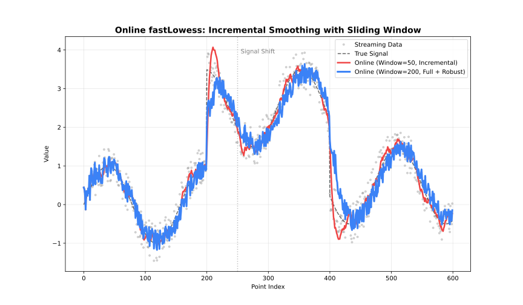

See also: [fastLowess](api.md)

## When to Use

- Data arrives incrementally (sensors, streams)
- Need real-time smoothed values
- Fixed memory budget



## Class

### `OnlineLowess`

The `OnlineLowess` class updates the model incrementally with new data points.

**Constructor:**

```javascript
const { OnlineLowess } = require('fastlowess-wasm');

const online = new OnlineLowess({ fraction: 0.5 }, { window_capacity: 50, min_points: 3 });
console.log("typeof add_point:", typeof online.add_point);
```

```output
typeof add_point: function
```

- `options`: An object containing `OnlineSmoothOptions` fields (a subset of the Batch `LowessOptions` fields — see below).
- `onlineOptions`: An object containing `OnlineOptions` fields.

#### `add_point(x, y)`

Adds a single point to the sliding window and returns the smoothed value for that point, or `null` while the window is still filling up (fewer than `min_points` seen so far). Once the window reaches `window_capacity`, each new point evicts the oldest one, so memory stays bounded regardless of how much history has passed through. `update_mode` controls how much work each call does: `"incremental"` re-fits only the newest point, while `"full"` re-smooths the entire window for a more accurate but slower result.

```javascript
const { OnlineLowess } = require('fastlowess-wasm');

const n = 100;
const x = Float64Array.from({ length: n }, (_, i) => i * 2 * Math.PI / (n - 1));
const y = Float64Array.from(x, xi => Math.sin(xi) + 0.1);

const online = new OnlineLowess({ fraction: 0.5 }, { window_capacity: 50, min_points: 3 });

// Returns null until min_points (3) are reached
online.add_point(x[0], y[0]);  // null
online.add_point(x[1], y[1]);  // null

// Returns OnlineOutput once enough points are available
const result = online.add_point(x[2], y[2]);
console.log("Smoothed y:", result.y);
```

```output
Smoothed y: 0.22659245357374927
```

## Options Structure

### `OnlineSmoothOptions`

| Field | Type | Default | Description |
| --- | --- | --- | --- |
| `fraction` | `number` | `0.67` | Smoothing fraction (bandwidth) |
| `iterations` | `number` | `0` | Number of robustifying iterations (requires `update_mode = "full"`) |
| `weight_function` | `string` | `"tricube"` | Weight function name |
| `robustness_method` | `string` | `"bisquare"` | Robustness method name |
| `delta` | `number` | `NaN` | Interpolation distance (`NaN` disables interpolation); positive values require `update_mode: "full"` |
| `zero_weight_fallback` | `string` | `"use_local_mean"` | Zero-weight handling |
| `boundary_policy` | `string` | `"extend"` | Boundary handling policy |
| `scaling_method` | `string` | `"mad"` | Residual scaling method |
| `auto_converge` | `number` | `null` | Auto-convergence tolerance; requires `update_mode: "full"` and `iterations > 0` |
| `missing` | `string` | `"error"` | Policy for non-finite (NaN/Inf) values in each point |
| `window_capacity` | `number` | `1000` | Max points in sliding window |
| `min_points` | `number` | `2` | Min points before smoothing starts |
| `update_mode` | `string` | `"incremental"` | Update mode (`"full"` or `"incremental"`) |
| `outputs` | `string[]` | `[]` | Select `se`, `weights`, and/or `derivative`; `se` requires `update_mode: "full"` |
| `intervals` | `object` | `null` | Grouped `confidence`, `prediction`, and per-window `bootstrap` options (requires `update_mode: "full"`) |
| `seed` | `number` | `null` | Reproducible bootstrap draws for each full-update window |

Incremental mode fits only the newest point. Positive `delta` is rejected there, and `auto_converge` requires full mode with at least one robustness iteration.

Cross-validation, GPU `backend`, `custom_weights`, the `"sorted"` output, and `parallel` are Batch-only; the `"diagnostics"` and `"residuals"` outputs are not available online. See [fastLowess](api.md) for those options.

## Options

### fraction

`fraction` is the most important parameter: it controls the size of the local neighbourhood used at each point.

| Range | Effect | Use case |
| --- | --- | --- |
| 0.1-0.3 | Fine detail | Rapidly changing signals |
| 0.3-0.5 | Balanced | General purpose |
| 0.5-0.7 | Heavy smoothing | Noisy data |
| 0.7-1.0 | Very smooth | Trend extraction |

### iterations

`iterations` controls robustness to outliers, at the cost of speed. Requires `update_mode = "full"`; the default `"incremental"` mode performs a non-robust single-point fit.

| Value | Effect | Performance |
| --- | --- | --- |
| 0 | No robustness | Fastest |
| 1-3 | Moderate | Recommended |
| 4-6 | Strong | Contaminated data |
| 7+ | Very strong | Heavy outliers |

### weight_function

*See: [Weight Functions](../weighting/kernels.md)*

- `"tricube"` (default)
- `"epanechnikov"`
- `"gaussian"`
- `"uniform"` (alias: `"boxcar"`)
- `"biweight"` (alias: `"bisquare"`)
- `"triangle"` (alias: `"triangular"`)
- `"cosine"`

### robustness_method

*See: [Robustness](../weighting/robustness.md)*

- `"bisquare"` (default; alias: `"biweight"`)
- `"huber"`
- `"talwar"`

### delta

Points within `delta` of each other on the x-axis share the same local fit instead of each computing its own regression — an interpolation shortcut that trades a small amount of accuracy for a large speedup on dense, evenly-spaced data. `NaN` (default) auto-sets it to `0` in Online mode, i.e. interpolation is disabled and every point is fit exactly.

### zero_weight_fallback

Behavior when all neighborhood weights are zero:

| Option | Behavior |
| --- | --- |
| `"use_local_mean"` (default; aliases: `"local_mean"`, `"mean"`) | Use the mean of the neighborhood |
| `"return_original"` (alias: `"original"`) | Return the original y value |
| `"return_none"` (alias: `"none"`) | Return `NaN` |

### boundary_policy

*See: [Boundary Handling](../advanced/boundary.md)*

- `"extend"` (default; alias: `"pad"`)
- `"reflect"` (alias: `"mirror"`)
- `"zero"`
- `"noboundary"` (alias: `"none"`)

### scaling_method

*See: [Scaling Methods](../weighting/scaling.md)*

- `"mad"` (default; alias: `"median_absolute_deviation"`)
- `"mar"` (alias: `"median_absolute_residual"`)
- `"mean"` (alias: `"mean_absolute_residual"`)

### auto_converge

*See: [Robustness](../weighting/robustness.md#auto-convergence)*

Convergence tolerance for early stopping of robustness iterations. `null` (default) disables early stopping.

### missing

Policy for handling a non-finite (NaN/Inf) `x` or `y` value passed to `add_point`:

| Option | Behavior |
| --- | --- |
| `"error"` (default) | Throw an error |
| `"drop"` | Silently ignore the point — `add_point` returns `null`/`undefined` instead of adding it to the window |

### window_capacity

Maximum number of most recent points kept in the sliding window; older points are discarded as new ones arrive. Each `add_point()` call costs O(`window_capacity`) rather than growing with total history.

### min_points

Minimum number of points required before smoothing starts. `add_point()` returns `null` until the window reaches this size.

### update_mode

*See: [Execution Modes](../guide/adapter-choice.md)*

| Mode | Alias | Behavior | Speed |
| --- | --- | --- | --- |
| `"incremental"` (default) | `"single"` | Update only affected fits | Faster |
| `"full"` | `"resmooth"` | Recompute entire window | More accurate |

### outputs: se

*See: [Intervals](../guide/intervals.md)*

Select `"se"` to populate `standard_error`; it requires `update_mode: "full"`. The fast `"incremental"` path never computes standard errors, so selecting `"se"` (or setting `intervals`) with anything other than `"full"` throws at construction time.

### outputs: weights

Select `"weights"` to include the robustness weight for the latest point (from the last robustness iteration) in the result.

### outputs: derivative

Select `"derivative"` to expose the latest point's local WLS slope in `OnlineOutput.derivative` at effectively no extra computation cost.

### intervals

*See: [Intervals](../guide/intervals.md)*

An object such as `{ confidence: 0.90, prediction: 0.99, bootstrap: 200 }`, populating `confidence_lower`/`confidence_upper` and `prediction_lower`/`prediction_upper` for the latest point. The coverage levels are independent. Same `update_mode: "full"` requirement as the `"se"` output. `bootstrap` (at least `2`) refits each sliding window from resampled residuals.

### seed

Seeds bootstrap draws. Each full-update window restarts from the same seed. It does not enable bootstrap by itself; `0` is a valid seed.

## Result Structure

### `OnlineOutput`

Returned by `add_point()` once the window has enough points (`null` until then).

| Field | Type | Description |
| --- | --- | --- |
| `y` | `number` | Smoothed value for the latest point |
| `standard_error` | `number \| undefined` | Populated when `"se"` or any interval is set (requires `update_mode: "full"`); otherwise always `undefined` |
| `confidence_lower` / `confidence_upper` | `number \| undefined` | Confidence interval bounds around the mean response, if `intervals.confidence` was set (requires `update_mode: "full"`) |
| `prediction_lower` / `prediction_upper` | `number \| undefined` | Prediction interval bounds for a new observation, if `intervals.prediction` was set (requires `update_mode: "full"`) |
| `residual` | `number \| undefined` | Residual y − smoothed; always present (there is no `"residuals"` output for Online) |
| `robustness_weight` | `number \| undefined` | Robustness weight, if `"weights"` was requested |
| `iterations_used` | `number \| undefined` | Robustness iterations performed |
| `derivative` | `number \| undefined` | Local fit derivative/slope for the latest point, if `"derivative"` was requested |

There is no `Diagnostics` object or `"diagnostics"` output for `OnlineLowess`: `OnlineOutput` carries no diagnostics field, since diagnostics like RMSE/R² need more than one point's worth of history to be meaningful.
