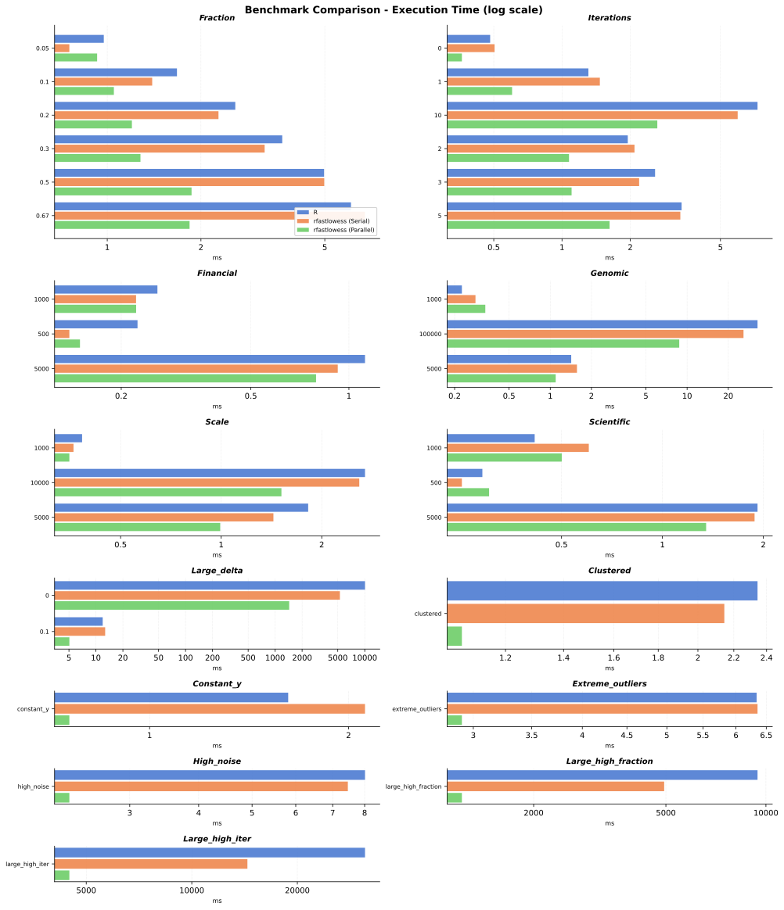

These shared native CPU benchmark results compare base R and serial/parallel `rfastlowess`; they do not measure WebAssembly, whose binding is single-threaded. Timings depend on hardware, thread availability, and workload, so results are reference observations rather than universal thresholds.

## R and CPU Comparison

The plot and table use **mean** CPU timings. Parentheses show speedup relative to `stats::lowess`; values above 1 indicate faster execution than R.

| Scenario | `stats::lowess` | rfastlowess (serial) | rfastlowess (parallel) |
| --- | ---: | ---: | ---: |
| clustered | 2.34 ms | 2.15 ms (1.1×) | 1.07 ms (2.2×) |
| constant_y | 1.62 ms | 2.12 ms (0.8×) | 0.76 ms (2.1×) |
| extreme_outliers | 6.34 ms | 6.35 ms (1.0×) | 2.91 ms (2.2×) |
| financial_1000 | 0.26 ms | 0.22 ms (1.2×) | 0.22 ms (1.2×) |
| financial_500 | 0.22 ms | 0.14 ms (1.6×) | 0.15 ms (1.5×) |
| financial_5000 | 1.12 ms | 0.92 ms (1.2×) | 0.79 ms (1.4×) |
| fraction_0.05 | 0.97 ms | 0.76 ms (1.3×) | 0.93 ms (1.1×) |
| fraction_0.1 | 1.67 ms | 1.39 ms (1.2×) | 1.05 ms (1.6×) |
| fraction_0.2 | 2.58 ms | 2.28 ms (1.1×) | 1.20 ms (2.1×) |
| fraction_0.3 | 3.65 ms | 3.20 ms (1.1×) | 1.28 ms (2.9×) |
| fraction_0.5 | 4.97 ms | 4.98 ms (1.0×) | 1.87 ms (2.7×) |
| fraction_0.67 | 6.07 ms | 6.73 ms (0.9×) | 1.84 ms (3.3×) |
| genomic_1000 | 0.23 ms | 0.28 ms (0.8×) | 0.34 ms (0.7×) |
| genomic_100000 | 32.71 ms | 25.84 ms (1.3×) | 8.76 ms (3.7×) |
| genomic_5000 | 1.42 ms | 1.57 ms (0.9×) | 1.10 ms (1.3×) |
| high_noise | 8.01 ms | 7.46 ms (1.1×) | 2.33 ms (3.4×) |
| iterations_0 | 0.48 ms | 0.50 ms (1.0×) | 0.36 ms (1.3×) |
| iterations_1 | 1.31 ms | 1.47 ms (0.9×) | 0.60 ms (2.2×) |
| iterations_10 | 7.29 ms | 5.96 ms (1.2×) | 2.63 ms (2.8×) |
| iterations_2 | 1.95 ms | 2.09 ms (0.9×) | 1.07 ms (1.8×) |
| iterations_3 | 2.57 ms | 2.19 ms (1.2×) | 1.10 ms (2.3×) |
| iterations_5 | 3.37 ms | 3.33 ms (1.0×) | 1.62 ms (2.1×) |
| large_delta_0 | 10 067.77 ms | 5 279.61 ms (1.9×) | 1 434.48 ms (7.0×) |
| large_delta_0.1 | 11.90 ms | 12.68 ms (0.9×) | 5.05 ms (2.4×) |
| large_high_fraction | 9 434.85 ms | 4 940.71 ms (1.9×) | 1 216.33 ms (7.8×) |
| large_high_iter | 31 189.44 ms | 14 409.17 ms (2.2×) | 4 475.26 ms (7.0×) |
| scale_1000 | 0.38 ms | 0.36 ms (1.1×) | 0.35 ms (1.1×) |
| scale_10000 | 2.69 ms | 2.59 ms (1.0×) | 1.51 ms (1.8×) |
| scale_5000 | 1.82 ms | 1.43 ms (1.3×) | 0.99 ms (1.8×) |
| scientific_1000 | 0.42 ms | 0.60 ms (0.7×) | 0.50 ms (0.8×) |
| scientific_500 | 0.29 ms | 0.25 ms (1.2×) | 0.30 ms (1.0×) |
| scientific_5000 | 1.92 ms | 1.88 ms (1.0×) | 1.35 ms (1.4×) |

At small sizes, fixed per-call overhead can dominate, and parallel execution is not always faster. The large wide-window workload reaches **7.8×** parallel speedup; the high-iteration workload reaches **2.2×** serial speedup. Allowing default `delta` reduces the reference workload from approximately 10.07 s to 11.90 ms.
