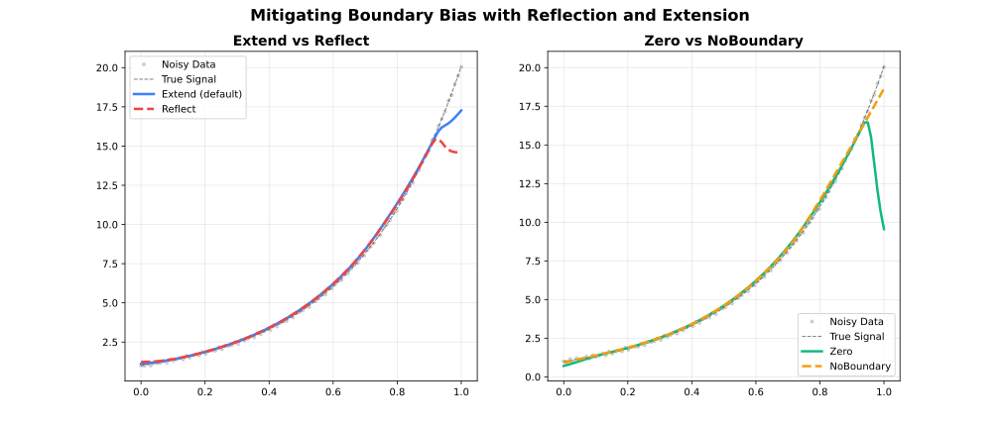

<!-- markdownlint-disable MD024 MD033 -->
Edge strategies that reduce bias near the ends of the data range.

## Overview

Standard LOWESS neighbourhoods become asymmetric at the boundaries: fewer points exist on one side, pulling the local fit toward the data interior. The `boundary_policy` parameter controls how the data is padded to mitigate this effect.



| Policy | Padding Strategy | Best For |
| --- | --- | --- |
| `"extend"` | Repeat first / last value | Most datasets (default) |
| `"reflect"` | Mirror data at boundaries | Periodic or symmetric data |
| `"zero"` | Pad with zeros | Data known to approach zero |
| `"noboundary"` | No padding (Cleveland original) | Reproducing reference behaviour |

---

## Extend (Default)

Pads beyond both endpoints by replicating the first and last observed values. Prevents the fit from curling toward zero and is a safe default for nearly all use cases.

**Use when**: No strong prior on boundary behaviour; general-purpose smoothing.

```javascript
const { Lowess } = require('fastlowess-wasm');

const n = 100;
const x = Float64Array.from({ length: n }, (_, i) => i * 2 * Math.PI / (n - 1));
const y = Float64Array.from(x, (xi, i) => Math.sin(xi) + (((i * 7 + 3) % 17) / 17 - 0.5) * 0.6);

const model = new Lowess({ boundary_policy: "extend" });
const result = model.fit(x, y);
console.log("y[0]:", result.y[0].toFixed(4));
```

```output
y[0]: 0.1662
```

---

## Reflect

Mirrors the data about both endpoints before fitting, then discards the reflected region from the output. Preserves continuity of derivatives, making it ideal for periodic or spatially symmetric signals.

**Use when**: Circular data (e.g., angle, day-of-year), symmetric physical quantities, or when the derivative at the boundary should be near zero.

```javascript
const { Lowess } = require('fastlowess-wasm');

const n = 100;
const x = Float64Array.from({ length: n }, (_, i) => i * 2 * Math.PI / (n - 1));
const y = Float64Array.from(x, (xi, i) => Math.sin(xi) + (((i * 7 + 3) % 17) / 17 - 0.5) * 0.6);

const model = new Lowess({ boundary_policy: "reflect" });
const result = model.fit(x, y);
console.log("y[0]:", result.y[0].toFixed(4));
```

```output
y[0]: 0.5823
```

---

## Zero

Pads with zeros beyond both endpoints. Appropriate when the underlying process is known to be zero outside the observation window (e.g., a pulse signal or a bounded physical quantity).

**Use when**: Signal decays to zero at both ends; zero is a meaningful boundary value.

```javascript
const { Lowess } = require('fastlowess-wasm');

const n = 100;
const x = Float64Array.from({ length: n }, (_, i) => i * 2 * Math.PI / (n - 1));
const y = Float64Array.from(x, (xi, i) => Math.sin(xi) + (((i * 7 + 3) % 17) / 17 - 0.5) * 0.6);

const model = new Lowess({ boundary_policy: "zero" });
const result = model.fit(x, y);
console.log("y[0]:", result.y[0].toFixed(4));
```

```output
y[0]: 0.2625
```

---

## No Boundary

Applies no padding. Each local fit uses only the points that are actually available, which may be fewer than the requested neighbourhood at the endpoints. This reproduces the original Cleveland (1979) algorithm exactly.

**Use when**: Reproducing reference results; you prefer the raw LOWESS boundary behaviour.

:::note
Without padding, boundary fits can have higher variance and visible edge artefacts, particularly with small `fraction` values.
:::

```javascript
const { Lowess } = require('fastlowess-wasm');

const n = 100;
const x = Float64Array.from({ length: n }, (_, i) => i * 2 * Math.PI / (n - 1));
const y = Float64Array.from(x, (xi, i) => Math.sin(xi) + (((i * 7 + 3) % 17) / 17 - 0.5) * 0.6);

const model = new Lowess({ boundary_policy: "noboundary" });
const result = model.fit(x, y);
console.log("y[0]:", result.y[0].toFixed(4));
```

```output
y[0]: 0.5702
```

---

## Choosing a Policy

| Situation | Recommended Policy |
| --- | --- |
| General purpose | `"extend"` (default) |
| Periodic signal (angle, day-of-year) | `"reflect"` |
| Signal known to be zero at boundaries | `"zero"` |
| Replicating original Cleveland behaviour | `"noboundary"` |
