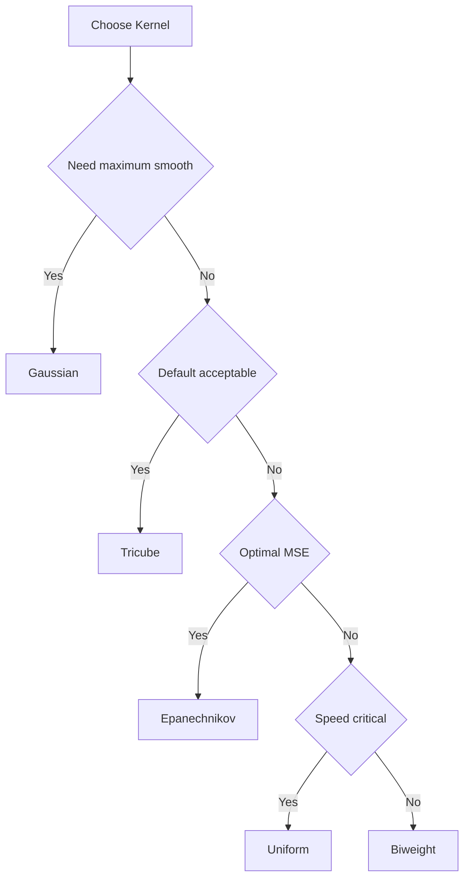

<!-- markdownlint-disable MD024 MD033 MD046 -->
Kernel functions for distance weighting.

## Overview

Weight functions (kernels) determine how neighboring points contribute to each local fit. Points closer to the target receive higher weights.


---

## Available Kernels

| Kernel | Efficiency | Smoothness | Support |
| --- | --- | --- | --- |
| **Tricube** | 0.998 | Very smooth | Compact |
| **Epanechnikov** | 1.000 | Smooth | Compact |
| **Gaussian** | 0.961 | Infinite | Unbounded |
| **Biweight** | 0.995 | Very smooth | Compact |
| **Cosine** | 0.999 | Smooth | Compact |
| **Triangle** | 0.989 | Moderate | Compact |
| **Uniform** | 0.943 | None | Compact |

**Efficiency** = AMISE relative to Epanechnikov (1.0 = optimal)

---

## Tricube (Default)

Cleveland's original choice. Best all-around performance.

$$w(u) = (1 - |u|^3)^3$$

**Use when**: Default choice for most applications.

```javascript
const { Lowess } = require('fastlowess-wasm');

const n = 100;
const x = Float64Array.from({ length: n }, (_, i) => i * 2 * Math.PI / (n - 1));
const y = Float64Array.from(x, (xi, i) => Math.sin(xi) + (((i * 7 + 3) % 17) / 17 - 0.5) * 0.6);

const model = new Lowess({ weight_function: "tricube" });
const result = model.fit(x, y);
console.log("y[0]:", result.y[0].toFixed(4));
```

```output
y[0]: 0.1662
```

---

## Epanechnikov

Theoretically optimal for kernel density estimation.

$$w(u) = \frac{3}{4}(1 - u^2)$$

**Use when**: Optimal MSE properties desired.

```javascript
const { Lowess } = require('fastlowess-wasm');

const n = 100;
const x = Float64Array.from({ length: n }, (_, i) => i * 2 * Math.PI / (n - 1));
const y = Float64Array.from(x, (xi, i) => Math.sin(xi) + (((i * 7 + 3) % 17) / 17 - 0.5) * 0.6);

const model = new Lowess({ weight_function: "epanechnikov" });
const result = model.fit(x, y);
console.log("y[0]:", result.y[0].toFixed(4));
```

```output
y[0]: 0.1905
```

---

## Gaussian

Infinitely smooth. No boundary effects.

$$w(u) = \exp(-u^2/2)$$

**Use when**: Maximum smoothness needed, computational cost acceptable.

```javascript
const { Lowess } = require('fastlowess-wasm');

const n = 100;
const x = Float64Array.from({ length: n }, (_, i) => i * 2 * Math.PI / (n - 1));
const y = Float64Array.from(x, (xi, i) => Math.sin(xi) + (((i * 7 + 3) % 17) / 17 - 0.5) * 0.6);

const model = new Lowess({ weight_function: "gaussian" });
const result = model.fit(x, y);
console.log("y[0]:", result.y[0].toFixed(4));
```

```output
y[0]: 0.2220
```

---

## Biweight

Good balance of efficiency and smoothness.

$$w(u) = (1 - u^2)^2$$

**Use when**: Alternative to Tricube with slightly different properties.

```javascript
const { Lowess } = require('fastlowess-wasm');

const n = 100;
const x = Float64Array.from({ length: n }, (_, i) => i * 2 * Math.PI / (n - 1));
const y = Float64Array.from(x, (xi, i) => Math.sin(xi) + (((i * 7 + 3) % 17) / 17 - 0.5) * 0.6);

const model = new Lowess({ weight_function: "biweight" });
const result = model.fit(x, y);
console.log("y[0]:", result.y[0].toFixed(4));
```

```output
y[0]: 0.1593
```

---

## Cosine

Smooth and computationally efficient.

$$w(u) = \cos(\pi u / 2)$$

**Use when**: Want smooth kernel with simple form.

```javascript
const { Lowess } = require('fastlowess-wasm');

const n = 100;
const x = Float64Array.from({ length: n }, (_, i) => i * 2 * Math.PI / (n - 1));
const y = Float64Array.from(x, (xi, i) => Math.sin(xi) + (((i * 7 + 3) % 17) / 17 - 0.5) * 0.6);

const model = new Lowess({ weight_function: "cosine" });
const result = model.fit(x, y);
console.log("y[0]:", result.y[0].toFixed(4));
```

```output
y[0]: 0.1845
```

---

## Triangle

Simple linear taper.

$$w(u) = 1 - |u|$$

**Use when**: Simple, interpretable weights.

```javascript
const { Lowess } = require('fastlowess-wasm');

const n = 100;
const x = Float64Array.from({ length: n }, (_, i) => i * 2 * Math.PI / (n - 1));
const y = Float64Array.from(x, (xi, i) => Math.sin(xi) + (((i * 7 + 3) % 17) / 17 - 0.5) * 0.6);

const model = new Lowess({ weight_function: "triangle" });
const result = model.fit(x, y);
console.log("y[0]:", result.y[0].toFixed(4));
```

```output
y[0]: 0.1646
```

---

## Uniform

Equal weights within window. Fastest but least smooth.

$$w(u) = 1$$

**Use when**: Speed is critical, smoothness less important.

```javascript
const { Lowess } = require('fastlowess-wasm');

const n = 100;
const x = Float64Array.from({ length: n }, (_, i) => i * 2 * Math.PI / (n - 1));
const y = Float64Array.from(x, (xi, i) => Math.sin(xi) + (((i * 7 + 3) % 17) / 17 - 0.5) * 0.6);

const model = new Lowess({ weight_function: "uniform" });
const result = model.fit(x, y);
console.log("y[0]:", result.y[0].toFixed(4));
```

```output
y[0]: 0.2381
```

---

## Choosing a Kernel



:::tip[Recommendation]
Stick with **Tricube** (default) unless you have specific requirements. The differences between kernels are usually small in practice.
:::
