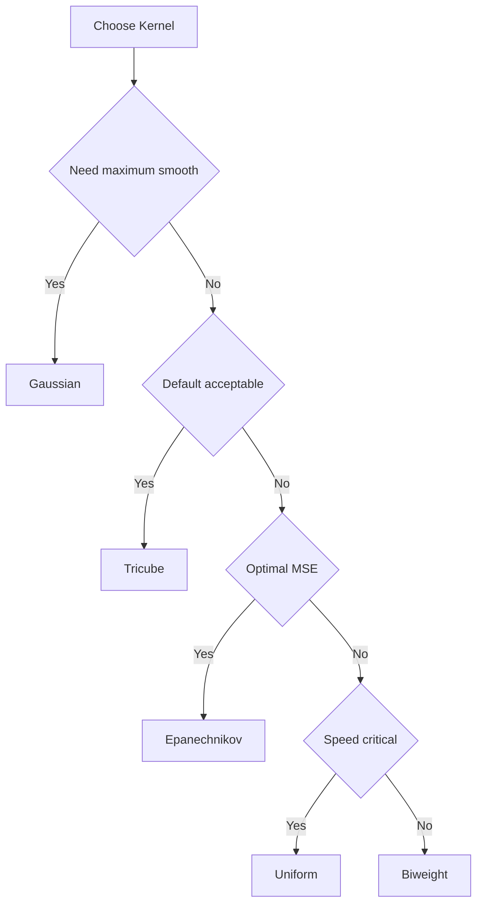

<!-- markdownlint-disable MD024 MD033 MD046 -->
# Weight Functions

Kernel functions for distance weighting.

## Overview

Weight functions (kernels) determine how neighboring points contribute to each local fit. Points closer to the target receive higher weights.


---

## Available Kernels

| Kernel | Efficiency | Smoothness | Support |
| --- | --- | --- | --- |
| **Tricube** | 0.998 | Very smooth | Compact |
| **Epanechnikov** | 1.000 | Smooth | Compact |
| **Gaussian** | 0.961 | Infinite | Unbounded |
| **Biweight** | 0.995 | Very smooth | Compact |
| **Cosine** | 0.999 | Smooth | Compact |
| **Triangle** | 0.989 | Moderate | Compact |
| **Uniform** | 0.943 | None | Compact |

**Efficiency** = AMISE relative to Epanechnikov (1.0 = optimal)

---

## Tricube (Default)

Cleveland's original choice. Best all-around performance.

$$w(u) = (1 - |u|^3)^3$$

**Use when**: Default choice for most applications.

```rust
use fastLowess::prelude::*;
use std::f64::consts::TAU;

fn main() -> Result<(), LowessError> {
    let n = 100usize;
    let x: Vec<f64> = (0..n).map(|i| i as f64 * TAU / (n - 1) as f64).collect();
    let y: Vec<f64> = x.iter().map(|&xi| xi.sin() + 0.1).collect();

    let model = Lowess::new()
        .weight_function("tricube")
        .build()?;
    let result = model.fit(&x, &y)?;

    println!("First smoothed value (tricube kernel): {}", result.y[0]);
    Ok(())
}
```

---

## Epanechnikov

Theoretically optimal for kernel density estimation.

$$w(u) = \frac{3}{4}(1 - u^2)$$

**Use when**: Optimal MSE properties desired.

```rust
use fastLowess::prelude::*;
use std::f64::consts::TAU;

fn main() -> Result<(), LowessError> {
    let n = 100usize;
    let x: Vec<f64> = (0..n).map(|i| i as f64 * TAU / (n - 1) as f64).collect();
    let y: Vec<f64> = x.iter().map(|&xi| xi.sin() + 0.1).collect();

    let model = Lowess::new()
        .weight_function("epanechnikov")
        .build()?;
    let result = model.fit(&x, &y)?;

    println!("First smoothed value (epanechnikov kernel): {}", result.y[0]);
    Ok(())
}
```

---

## Gaussian

Infinitely smooth. No boundary effects.

$$w(u) = \exp(-u^2/2)$$

**Use when**: Maximum smoothness needed, computational cost acceptable.

```rust
use fastLowess::prelude::*;
use std::f64::consts::TAU;

fn main() -> Result<(), LowessError> {
    let n = 100usize;
    let x: Vec<f64> = (0..n).map(|i| i as f64 * TAU / (n - 1) as f64).collect();
    let y: Vec<f64> = x.iter().map(|&xi| xi.sin() + 0.1).collect();

    let model = Lowess::new()
        .weight_function("gaussian")
        .build()?;
    let result = model.fit(&x, &y)?;

    println!("First smoothed value (gaussian kernel): {}", result.y[0]);
    Ok(())
}
```

---

## Biweight

Good balance of efficiency and smoothness.

$$w(u) = (1 - u^2)^2$$

**Use when**: Alternative to Tricube with slightly different properties.

```rust
use fastLowess::prelude::*;
use std::f64::consts::TAU;

fn main() -> Result<(), LowessError> {
    let n = 100usize;
    let x: Vec<f64> = (0..n).map(|i| i as f64 * TAU / (n - 1) as f64).collect();
    let y: Vec<f64> = x.iter().map(|&xi| xi.sin() + 0.1).collect();

    let model = Lowess::new()
        .weight_function("biweight")
        .build()?;
    let result = model.fit(&x, &y)?;

    println!("First smoothed value (biweight kernel): {}", result.y[0]);
    Ok(())
}
```

---

## Cosine

Smooth and computationally efficient.

$$w(u) = \cos(\pi u / 2)$$

**Use when**: Want smooth kernel with simple form.

```rust
use fastLowess::prelude::*;
use std::f64::consts::TAU;

fn main() -> Result<(), LowessError> {
    let n = 100usize;
    let x: Vec<f64> = (0..n).map(|i| i as f64 * TAU / (n - 1) as f64).collect();
    let y: Vec<f64> = x.iter().map(|&xi| xi.sin() + 0.1).collect();

    let model = Lowess::new()
        .weight_function("cosine")
        .build()?;
    let result = model.fit(&x, &y)?;

    println!("First smoothed value (cosine kernel): {}", result.y[0]);
    Ok(())
}
```

---

## Triangle

Simple linear taper.

$$w(u) = 1 - |u|$$

**Use when**: Simple, interpretable weights.

```rust
use fastLowess::prelude::*;
use std::f64::consts::TAU;

fn main() -> Result<(), LowessError> {
    let n = 100usize;
    let x: Vec<f64> = (0..n).map(|i| i as f64 * TAU / (n - 1) as f64).collect();
    let y: Vec<f64> = x.iter().map(|&xi| xi.sin() + 0.1).collect();

    let model = Lowess::new()
        .weight_function("triangle")
        .build()?;
    let result = model.fit(&x, &y)?;

    println!("First smoothed value (triangle kernel): {}", result.y[0]);
    Ok(())
}
```

---

## Uniform

Equal weights within window. Fastest but least smooth.

$$w(u) = 1$$

**Use when**: Speed is critical, smoothness less important.

```rust
use fastLowess::prelude::*;
use std::f64::consts::TAU;

fn main() -> Result<(), LowessError> {
    let n = 100usize;
    let x: Vec<f64> = (0..n).map(|i| i as f64 * TAU / (n - 1) as f64).collect();
    let y: Vec<f64> = x.iter().map(|&xi| xi.sin() + 0.1).collect();

    let model = Lowess::new()
        .weight_function("uniform")
        .build()?;
    let result = model.fit(&x, &y)?;

    println!("First smoothed value (uniform kernel): {}", result.y[0]);
    Ok(())
}
```

---

## Choosing a Kernel



!!! tip "Recommendation"
    Stick with **Tricube** (default) unless you have specific requirements. The differences between kernels are usually small in practice.
