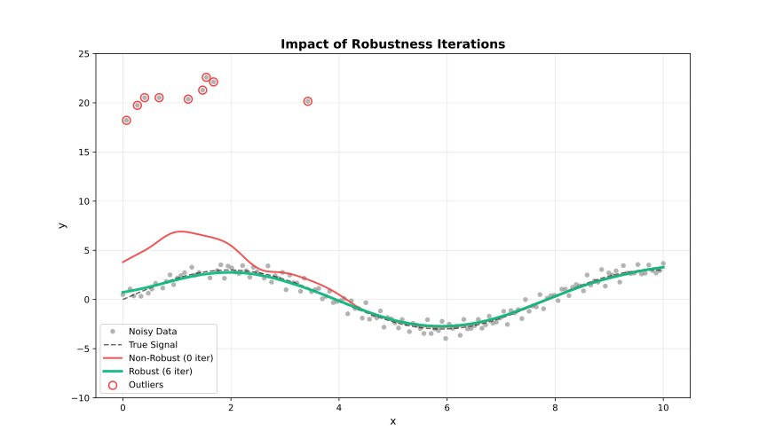

<!-- markdownlint-disable MD033 -->
# Robustness

Outlier handling through iterative reweighting.

## How Robustness Works

Standard LOWESS can be biased by outliers. Robustness iterations downweight points with large residuals:

1. Fit initial LOWESS
2. Compute residuals
3. Assign robustness weights (large residuals → low weight)
4. Refit using combined distance × robustness weights
5. Repeat steps 2–4




---

## Robustness Methods

### Bisquare (Default)

Smooth downweighting. Points transition gradually from full weight to zero.

$$w(u) = \begin{cases} (1 - u^2)^2 & |u| < 1 \\ 0 & |u| \geq 1 \end{cases}$$

**Use when**: General purpose, balanced approach.

```rust
use fastLowess::prelude::*;
use std::f64::consts::TAU;

fn main() -> Result<(), LowessError> {
    let n = 100usize;
    let x: Vec<f64> = (0..n).map(|i| i as f64 * TAU / (n - 1) as f64).collect();
    let y: Vec<f64> = x.iter().map(|&xi| xi.sin() + 0.1).collect();

    let model = Lowess::new()
        .iterations(3)
        .robustness_method("bisquare")
        .build()?;
    let result = model.fit(&x, &y)?;

    println!("First smoothed value (bisquare robustness): {}", result.y[0]);
    Ok(())
}
```

---

### Huber

Linear penalty beyond threshold. Less aggressive than Bisquare.

$$w(u) = \begin{cases} 1 & |u| \leq k \\ k/|u| & |u| > k \end{cases}$$

**Use when**: Moderate outliers, want to retain some influence.

```rust
use fastLowess::prelude::*;
use std::f64::consts::TAU;

fn main() -> Result<(), LowessError> {
    let n = 100usize;
    let x: Vec<f64> = (0..n).map(|i| i as f64 * TAU / (n - 1) as f64).collect();
    let y: Vec<f64> = x.iter().map(|&xi| xi.sin() + 0.1).collect();

    let model = Lowess::new()
        .iterations(3)
        .robustness_method("huber")
        .build()?;
    let result = model.fit(&x, &y)?;

    println!("First smoothed value (huber robustness): {}", result.y[0]);
    Ok(())
}
```

---

### Talwar

Hard threshold. Points are either fully weighted or completely excluded.

$$w(u) = \begin{cases} 1 & |u| \leq k \\ 0 & |u| > k \end{cases}$$

**Use when**: Extreme outliers, want binary exclusion.

```rust
use fastLowess::prelude::*;
use std::f64::consts::TAU;

fn main() -> Result<(), LowessError> {
    let n = 100usize;
    let x: Vec<f64> = (0..n).map(|i| i as f64 * TAU / (n - 1) as f64).collect();
    let y: Vec<f64> = x.iter().map(|&xi| xi.sin() + 0.1).collect();

    let model = Lowess::new()
        .iterations(3)
        .robustness_method("talwar")
        .build()?;
    let result = model.fit(&x, &y)?;

    println!("First smoothed value (talwar robustness): {}", result.y[0]);
    Ok(())
}
```

---

## Comparison

| Method | Transition | Aggressiveness | Use Case |
| --- | --- | --- | --- |
| **Bisquare** | Smooth | Moderate | General purpose |
| **Huber** | Gradual | Mild | Preserve influence |
| **Talwar** | Hard | Strong | Extreme contamination |

---

## Detecting Outliers

Use robustness weights to identify potential outliers:

```rust
use fastLowess::prelude::*;
use std::f64::consts::TAU;

fn main() -> Result<(), LowessError> {
    let n = 100usize;
    let x: Vec<f64> = (0..n).map(|i| i as f64 * TAU / (n - 1) as f64).collect();
    let y: Vec<f64> = x.iter().map(|&xi| xi.sin() + 0.1).collect();

    let model = Lowess::new()
        .iterations(5)
        .return_robustness_weights()
        .build()?;

    let result = model.fit(&x, &y)?;

    if let Some(weights) = &result.robustness_weights {
        for (i, &w) in weights.iter().enumerate() {
            if w < 0.5 {
                println!("Potential outlier at index {}: weight = {:.3}", i, w);
            }
        }
    }

    Ok(())
}
```

---

## Scale Estimation

Residuals are scaled before computing robustness weights. Two methods:

| Method | Formula | Robustness |
| --- | --- | --- |
| **MAD** | `median(\|r − median(r)\|)` | Very robust (default) |
| **MAR** | `median(\|r\|)` | Robust, uncentered |
| **Mean** | `mean(\|r\|)` | Less robust, fastest |


```rust
use fastLowess::prelude::*;
use std::f64::consts::TAU;

fn main() -> Result<(), LowessError> {
    let n = 100usize;
    let x: Vec<f64> = (0..n).map(|i| i as f64 * TAU / (n - 1) as f64).collect();
    let y: Vec<f64> = x.iter().map(|&xi| xi.sin() + 0.1).collect();

    let model = Lowess::new()
        .iterations(3)
        .scaling_method("mad")  // Default
        .build()?;
    let result = model.fit(&x, &y)?;

    println!("First smoothed value (mad scaling): {}", result.y[0]);
    Ok(())
}
```

---

## Auto-Convergence

Stop iterations early when weights stabilize:

!!! tip "Performance"
    Auto-convergence can significantly reduce computation when weights stabilize before reaching max iterations.

```rust
use fastLowess::prelude::*;
use std::f64::consts::TAU;

fn main() -> Result<(), LowessError> {
    let n = 100usize;
    let x: Vec<f64> = (0..n).map(|i| i as f64 * TAU / (n - 1) as f64).collect();
    let y: Vec<f64> = x.iter().map(|&xi| xi.sin() + 0.1).collect();

    let model = Lowess::new()
        .iterations(10)           // Maximum iterations
        .auto_converge(1e-6)      // Stop when change < 1e-6
        .build()?;
    let result = model.fit(&x, &y)?;

    println!("First smoothed value (auto-converge): {}", result.y[0]);
    Ok(())
}
```
