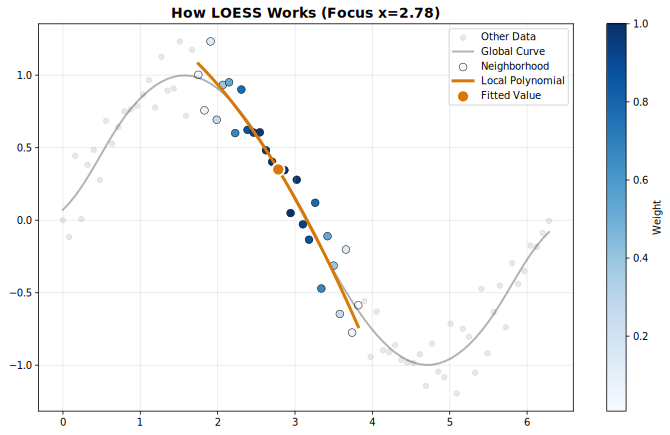
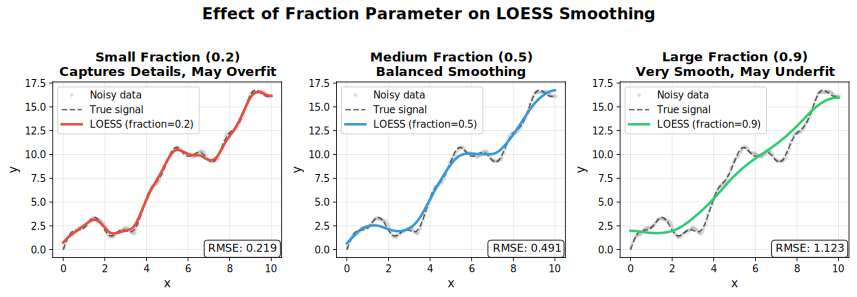
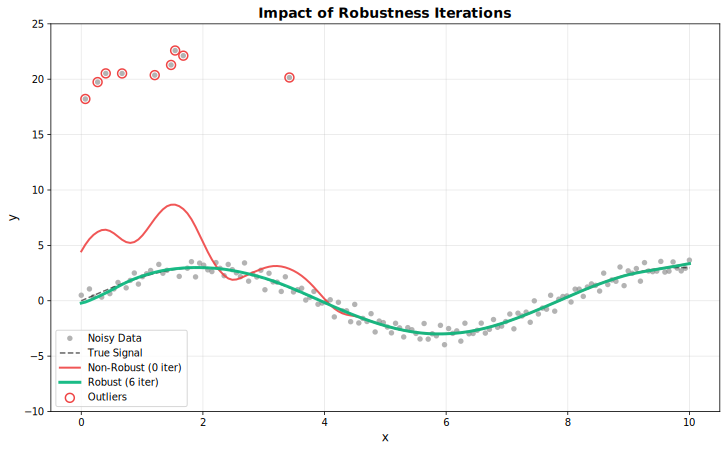
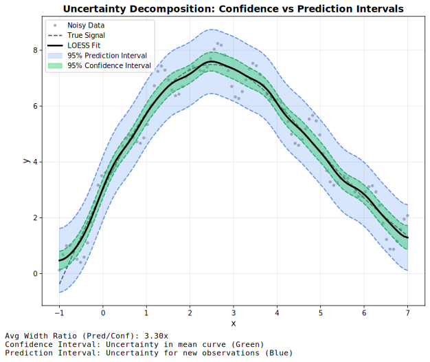
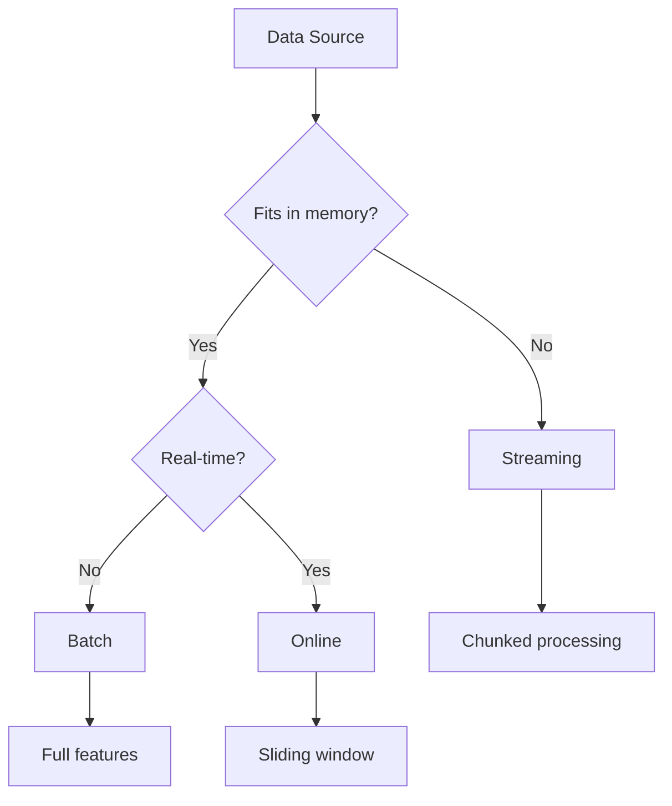

<!-- markdownlint-disable MD033 -->
# Concepts

Understanding how LOWESS works and when to use it.

## What is LOWESS?

**LOWESS** (Locally Weighted Scatterplot Smoothing) is a nonparametric regression method that fits smooth curves through scatter plots without assuming a global functional form.

Unlike parametric methods (linear regression, polynomial fitting), LOWESS adapts locally to the data structure, making it ideal for:

- **Exploratory data analysis** — Discover patterns without assumptions
- **Trend estimation** — Extract signals from noisy time series
- **Baseline correction** — Remove systematic effects in spectroscopy
- **Genomic smoothing** — Smooth methylation, ChIP-seq, or expression data

---

## How It Works

<figure markdown="span">
  { width="800" }
  <figcaption>LOWESS fits local weighted regressions at each point</figcaption>
</figure>

For each point in your data, LOWESS:

1. **Selects neighbors** — Choose the nearest points (controlled by `fraction`)
2. **Assigns weights** — Closer points get higher weights (using a kernel function)
3. **Fits locally** — Perform weighted least squares regression
4. **Extracts value** — Use the fitted value as the smoothed estimate
5. **Iterates** (optional) — Reweight points based on residuals to reduce outlier influence

---

## The Fraction Parameter

The `fraction` (also called bandwidth or span) is the most important parameter. It controls what proportion of data is used for each local fit.

<figure markdown="span">
  { width="1000" }
  <figcaption>Small fraction (left) vs optimal (center) vs large fraction (right)</figcaption>
</figure>

| Fraction    | Effect                            | When to Use                  |
|-------------|-----------------------------------|------------------------------|
| **0.1–0.3** | Fine detail, follows data closely | Rapidly changing signals     |
| **0.3–0.5** | Balanced smoothing                | Most applications            |
| **0.5–0.7** | Heavy smoothing                   | Noisy data, trend extraction |
| **0.7–1.0** | Very smooth                       | Strong noise, global trends  |

!!! tip "Rule of Thumb"
    Start with `fraction=0.67` (the default) and adjust based on visual inspection. Use cross-validation for automated selection.

---

## Robustness Iterations

Standard LOWESS is sensitive to outliers. **Robustness iterations** downweight points with large residuals:

<figure markdown="span">
  { width="800" }
  <figcaption>Standard LOWESS (left) vs Robust LOWESS (right) with outliers</figcaption>
</figure>

| Iterations | Effect                  | When to Use                |
|------------|-------------------------|----------------------------|
| **0**      | No robustness (fastest) | Clean data, speed-critical |
| **1–3**    | Moderate robustness     | Most applications          |
| **4–6**    | Strong robustness       | Data with outliers         |
| **7+**     | Very strong             | Heavy contamination        |

---

## Confidence vs Prediction Intervals

<figure markdown="span">
  { width="800" }
  <figcaption>Confidence intervals (narrow) vs Prediction intervals (wide)</figcaption>
</figure>

| Interval Type  | What It Represents                 | Width  |
|----------------|------------------------------------|--------|
| **Confidence** | Uncertainty in the *mean curve*    | Narrow |
| **Prediction** | Uncertainty for *new observations* | Wide   |

- Use **confidence intervals** to show where the true trend likely lies
- Use **prediction intervals** to show where new data points might fall

---

## Execution Modes

Choose the right mode based on your use case:

| Mode          | Use Case                   | Memory         | Features              |
|---------------|----------------------------|----------------|-----------------------|
| **Batch**     | Complete datasets          | Entire dataset | All features          |
| **Streaming** | Large files (>100K points) | One chunk      | Residuals, robustness |
| **Online**    | Real-time data             | Fixed window   | Incremental updates   |

---

## Key Advantages

| Feature                    | LOWESS | Polynomial Regression | Moving Average |
|----------------------------|:------:|:---------------------:|:--------------:|
| No parametric assumptions  | ✓      | ✗                     | ✓              |
| Adapts to local structure  | ✓      | ✗                     | Partial        |
| Robust to outliers         | ✓      | ✗                     | ✗              |
| Uncertainty estimates      | ✓      | ✓                     | ✗              |
| Handles irregular sampling | ✓      | ✓                     | ✗              |

---

## Next Steps

- [Quick Start](quickstart.md) — See it in action
- [Parameters](../user-guide/parameters.md) — All configuration options
- [Tutorials](../tutorials/index.md) — Application-specific guides
