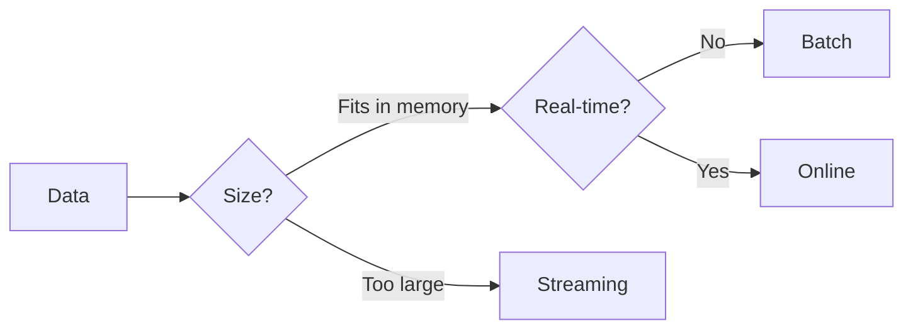

<!-- markdownlint-disable MD024 MD046 -->
# Execution Modes

Choose the right adapter for your use case.

## Overview



| Mode          | Use Case                | Memory       | Features              |
|---------------|-------------------------|--------------|-----------------------|
| **Batch**     | Complete datasets       | Full         | All features          |
| **Streaming** | Large files (>100K)     | Chunked      | Residuals, robustness |
| **Online**    | Real-time sensors       | Fixed window | Incremental updates   |

---

## Batch Adapter

Standard mode for complete datasets. **Supports all features.**

### When to Use

- Dataset fits in memory
- Need intervals, cross-validation, or diagnostics
- Processing complete files

### Example

=== "R"
    ```r
    result <- fastlowess(
        x, y,
        fraction = 0.5,
        iterations = 3,
        confidence_intervals = 0.95,
        prediction_intervals = 0.95,
        return_diagnostics = TRUE,
        parallel = TRUE
    )
    ```

=== "Python"
    ```python
    result = fl.smooth(
        x, y,
        fraction=0.5,
        iterations=3,
        confidence_intervals=0.95,
        prediction_intervals=0.95,
        return_diagnostics=True,
        parallel=True
    )
    ```

=== "Rust"
    ```rust
    use fastLowess::prelude::*;

    let model = Lowess::new()
        .fraction(0.5)
        .iterations(3)
        .confidence_intervals(0.95)
        .prediction_intervals(0.95)
        .return_diagnostics()
        .adapter(Batch)
        .parallel(true)
        .build()?;

    let result = model.fit(&x, &y)?;
    ```

=== "Julia"
    ```julia
    using fastLowess

    result = smooth(
        x, y,
        fraction=0.5,
        iterations=3,
        confidence_intervals=0.95,
        prediction_intervals=0.95,
        return_diagnostics=true,
        parallel=true
    )
    ```

=== "Node.js"
    ```javascript
    const fastlowess = require('fastlowess');

    const result = fastlowess.smooth(x, y, {
        fraction: 0.5,
        iterations: 3,
        confidenceIntervals: 0.95,
        predictionIntervals: 0.95,
        returnDiagnostics: true
    });
    ```

=== "WebAssembly"
    ```javascript
    import { smooth } from 'fastlowess-wasm';

    const result = smooth(x, y, {
        fraction: 0.5,
        iterations: 3,
        confidenceIntervals: 0.95,
        predictionIntervals: 0.95,
        returnDiagnostics: true
    });
    ```

=== "C++"
    ```cpp
    #include "fastlowess.hpp"

    auto result = fastlowess::smooth(x, y, {
        .fraction = 0.5,
        .iterations = 3,
        .confidence_intervals = 0.95,
        .prediction_intervals = 0.95,
        .return_diagnostics = true,
        .parallel = true
    });
    ```

---

## Streaming Adapter

Process large datasets in chunks with configurable overlap.

### When to Use

- Dataset >100,000 points
- Memory-constrained environments
- Batch processing pipelines

### Parameters

| Parameter        | Default | Description            |
|------------------|---------|------------------------|
| `chunk_size`     | 5000    | Points per chunk       |
| `overlap`        | 500     | Overlap between chunks |
| `merge_strategy` | Average | How to merge overlaps  |

### Merge Strategies

| Strategy   | Behavior                   |
|------------|----------------------------|
| `Average`  | Average overlapping values |
| `Left`     | Keep left chunk values     |
| `Right`    | Keep right chunk values    |
| `Weighted` | Distance-weighted blend    |

### Example

=== "R"
    ```r
    result <- fastlowess_streaming(
        x, y,
        fraction = 0.3,
        iterations = 2,
        chunk_size = 5000,
        overlap = 500,
        merge_strategy = "average"
    )
    ```

=== "Python"
    ```python
    result = fl.smooth_streaming(
        x, y,
        fraction=0.3,
        iterations=2,
        chunk_size=5000,
        overlap=500,
        merge_strategy="average"
    )
    ```

=== "Rust"
    ```rust
    use fastLowess::prelude::*;

    let mut processor = Lowess::new()
        .fraction(0.3)
        .iterations(2)
        .adapter(Streaming)
        .chunk_size(5000)
        .overlap(500)
        .merge_strategy(Average)
        .build()?;

    // Process chunks (e.g., from a file reader)
    for (chunk_x, chunk_y) in data_chunks {
        let result = processor.process_chunk(&chunk_x, &chunk_y)?;
        write_output(&result.y);
    }

    // IMPORTANT: Get remaining buffered data
    let final_result = processor.finalize()?;
    write_output(&final_result.y);
    ```

=== "Julia"
    ```julia
    using fastLowess

    result = smooth_streaming(
        x, y,
        fraction=0.3,
        iterations=2,
        chunk_size=5000,
        overlap=500,
        merge_strategy="average"
    )
    ```

=== "Node.js"
    ```javascript
    const { StreamingLowess } = require('fastlowess');

    const processor = new StreamingLowess(
        { fraction: 0.3, iterations: 2 },
        { chunkSize: 5000, overlap: 500 }
    );

    // Process chunks
    for (const {x, y} of dataChunks) {
        const result = processor.processChunk(x, y);
        // ...
    }

    const finalResult = processor.finalize();
    ```

=== "WebAssembly"
    ```javascript
    import { StreamingLowess } from 'fastlowess-wasm';

    const processor = new StreamingLowess(
        { fraction: 0.3, iterations: 2 },
        { chunkSize: 5000, overlap: 500 }
    );

    // Process chunks
    for (const {x, y} of dataChunks) {
        const result = processor.processChunk(x, y);
        // ...
    }

    const finalResult = processor.finalize();
    ```

=== "C++"
    ```cpp
    #include "fastlowess.hpp"

    fastlowess::StreamingOptions opts;
    opts.fraction = 0.3;
    opts.iterations = 2;
    opts.chunk_size = 5000;
    opts.overlap = 500;

    auto result = fastlowess::streaming(x, y, opts);
    ```

---

!!! warning "Always call finalize()"
    In Rust, always call `processor.finalize()` after processing all chunks to retrieve buffered overlap data.

## Online Adapter

Incremental updates with a sliding window for real-time data.

### When to Use

- Data arrives incrementally (sensors, streams)
- Need real-time smoothed values
- Fixed memory budget

### Parameters

| Parameter         | Default     | Description                 |
|-------------------|-------------|-----------------------------|
| `window_capacity` | 1000        | Max points in window        |
| `min_points`      | 2           | Points before output starts |
| `update_mode`     | Incremental | Update strategy             |

### Update Modes

| Mode          | Behavior                  | Speed         |
|---------------|---------------------------|---------------|
| `Incremental` | Update only affected fits | Faster        |
| `Full`        | Recompute entire window   | More accurate |

### Example

=== "R"
    ```r
    result <- fastlowess_online(
        x, y,
        fraction = 0.2,
        iterations = 1,
        window_capacity = 100,
        min_points = 5,
        update_mode = "incremental"
    )
    ```

=== "Python"
    ```python
    result = fl.smooth_online(
        x, y,
        fraction=0.2,
        iterations=1,
        window_capacity=100,
        min_points=5,
        update_mode="incremental"
    )

    # result contains smoothed values for all points
    print(result["y"])
    ```

=== "Rust"
    ```rust
    use fastLowess::prelude::*;

    let mut processor = Lowess::new()
        .fraction(0.2)
        .iterations(1)
        .adapter(Online)
        .window_capacity(100)
        .min_points(5)
        .update_mode(Incremental)
        .build()?;

    // Process points as they arrive
    for (x, y) in sensor_stream {
        if let Some(output) = processor.add_point(x, y)? {
            println!("Smoothed: {:.2}", output.smoothed);
        }
    }
    ```

=== "Julia"
    ```julia
    using fastLowess

    result = smooth_online(
        x, y,
        fraction=0.2,
        iterations=1,
        window_capacity=100,
        min_points=5,
        update_mode="incremental"
    )
    ```

=== "Node.js"
    ```javascript
    const { OnlineLowess } = require('fastlowess');

    const processor = new OnlineLowess(
        { fraction: 0.2, iterations: 1 },
        { windowCapacity: 100, minPoints: 5, updateMode: "incremental" }
    );

    // Add points
    for (const [x, y] of sensorStream) {
        const smoothed = processor.update(x, y);
        if (smoothed !== null) {
            console.log(`Smoothed: ${smoothed.toFixed(2)}`);
        }
    }
    ```

=== "WebAssembly"
    ```javascript
    import { OnlineLowess } from 'fastlowess-wasm';

    const processor = new OnlineLowess(
        { fraction: 0.2, iterations: 1 },
        { windowCapacity: 100, minPoints: 5, updateMode: "incremental" }
    );

    // Add points
    for (const [x, y] of sensorStream) {
        const smoothed = processor.update(x, y);
        if (smoothed !== null) {
            console.log(`Smoothed: ${smoothed.toFixed(2)}`);
        }
    }
    ```

=== "C++"
    ```cpp
    #include "fastlowess.hpp"

    fastlowess::OnlineOptions opts;
    opts.fraction = 0.2;
    opts.iterations = 1;
    opts.window_capacity = 100;
    opts.min_points = 5;
    opts.update_mode = "incremental";

    auto result = fastlowess::online(x, y, opts);
    ```

---

## Feature Comparison

| Feature              | Batch | Streaming | Online |
|----------------------|:-----:|:---------:|:------:|
| Confidence intervals | ✓     | ✗         | ✗      |
| Prediction intervals | ✓     | ✗         | ✗      |
| Cross-validation     | ✓     | ✗         | ✗      |
| Diagnostics          | ✓     | ✓         | ✗      |
| Residuals            | ✓     | ✓         | ✓      |
| Robustness weights   | ✓     | ✓         | ✓      |
| Parallel execution   | ✓     | ✓         | ✗      |
| GPU acceleration     | ✓     | ✗         | ✗      |

---

## Next Steps

- [Parameters](parameters.md) — All configuration options
- [Tutorials](../tutorials/real-time.md) — Real-time processing guide
