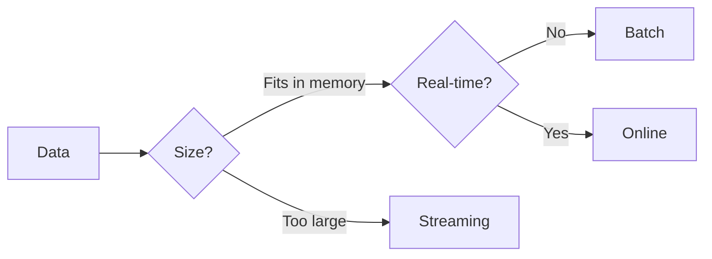
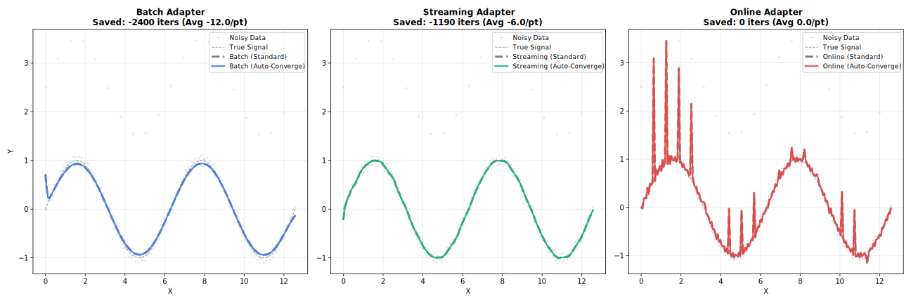
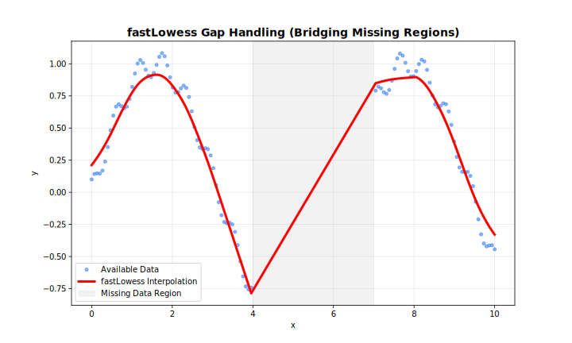
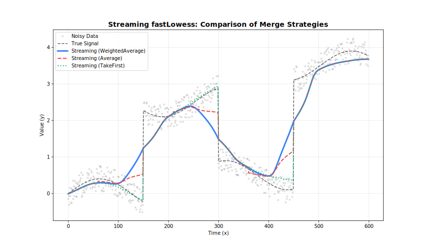
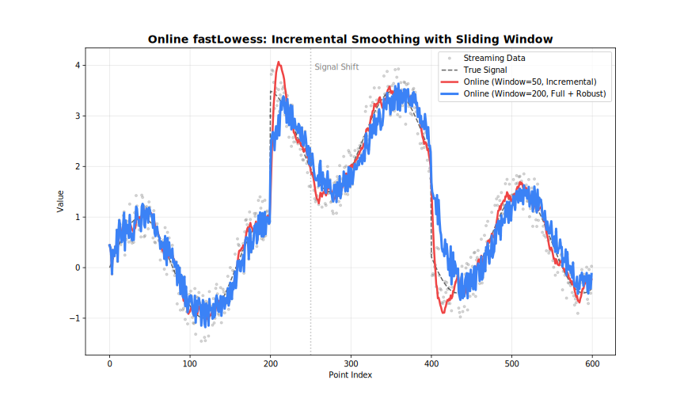

<!-- markdownlint-disable MD024 MD033 MD046 -->
# Execution Modes

Choose the right adapter for your use case.

## Overview


```mermaid
graph LR
    A[Data] --> B{Size?}
    B -->|Fits in memory| C{Real-time?}
    B -->|Too large| D[Streaming]
    C -->|No| E[Batch]
    C -->|Yes| F[Online]
```

| Mode | Use Case | Memory | Features |
| --- | --- | --- | --- |
| **Batch** | Complete datasets | Full | All features |
| **Streaming** | Large files (>100K) | Chunked | Residuals, robustness |
| **Online** | Real-time sensors | Fixed window | Incremental updates |



---

## Batch Adapter

Standard mode for complete datasets. **Supports all features.**

### When to Use

- Dataset fits in memory
- Need intervals, cross-validation, or diagnostics
- Processing complete files



### Example

=== "R"
    ```r
    library(rfastlowess)
    set.seed(42)
    x <- seq(0, 2 * pi, length.out = 100)
    y <- sin(x) + rnorm(100, sd = 0.3)

    model <- Lowess(
        fraction = 0.5,
        iterations = 3,
        confidence_intervals = 0.95,
        prediction_intervals = 0.95,
        return_diagnostics = TRUE,
        parallel = TRUE
    )
    result <- model$fit(x, y)
    ```

=== "Python"
    ```python
    import fastlowess as fl
    import numpy as np

    rng = np.random.default_rng(42)
    x = np.linspace(0, 2 * np.pi, 100)
    y = np.sin(x) + rng.normal(0, 0.3, 100)

    model = fl.Lowess(
        fraction=0.5,
        iterations=3,
        confidence_intervals=0.95,
        prediction_intervals=0.95,
        return_diagnostics=True,
        parallel=True
    )
    result = model.fit(x, y)
    ```

=== "Rust"
    ```rust
    use fastLowess::prelude::*;
    use std::f64::consts::TAU;

    fn main() -> Result<(), LowessError> {
        let n = 100usize;
        let x: Vec<f64> = (0..n).map(|i| i as f64 * TAU / (n - 1) as f64).collect();
        let y: Vec<f64> = x.iter().map(|&xi| xi.sin() + 0.1).collect();


        let model = Lowess::new()
            .fraction(0.5)
            .iterations(3)
            .confidence_intervals(0.95)
            .prediction_intervals(0.95)
            .return_diagnostics()
            .parallel(true)
            .build()?;

        let result = model.fit(&x, &y)?;

        Ok(())
    }
    ```

=== "Julia"
    ```julia
    using FastLOWESS
    using Random, Statistics

    rng = MersenneTwister(42)
    x = collect(range(0, 2π, length=100))
    y = sin.(x) .+ randn(rng, 100) .* 0.3

    using FastLOWESS

    model = Lowess(;
        fraction=0.5,
        iterations=3,
        confidence_intervals=0.95,
        prediction_intervals=0.95,
        return_diagnostics=true,
        parallel=true
    )
    result = fit(model, x, y)
    ```

=== "Node.js"
    ```javascript
    const fastlowess = require('fastlowess');

    const n = 100;
    const x = Float64Array.from({ length: n }, (_, i) => i * 2 * Math.PI / (n - 1));
    const y = Float64Array.from(x, (xi, i) => Math.sin(xi) + (((i*7+3)%17)/17-0.5)*0.6);

    const model = new fastlowess.Lowess({
        fraction: 0.5,
        iterations: 3,
        confidence_intervals: 0.95,
        prediction_intervals: 0.95,
        return_diagnostics: true
    });
    const result = model.fit(x, y);
    ```

=== "WebAssembly"
    ```javascript
    const { Lowess } = require('./fastlowess_wasm.js');

    const n = 100;
    const x = Float64Array.from({ length: n }, (_, i) => i * 2 * Math.PI / (n - 1));
    const y = Float64Array.from(x, (xi, i) => Math.sin(xi) + (((i * 7 + 3) % 17) / 17 - 0.5) * 0.6);

    const model = new Lowess({
        fraction: 0.5,
        iterations: 3,
        confidence_intervals: 0.95,
        prediction_intervals: 0.95,
        return_diagnostics: true
    });
    const result = model.fit(x, y);
    ```

=== "C++"
    ```cpp
    #include <fastlowess.hpp>
    #include <cmath>
    #include <iostream>
    #include <vector>

    int main() {
        const int n = 100;
        std::vector<double> x(n), y(n);
        for (int i = 0; i < n; ++i) {
            x[i] = i * 2 * M_PI / (n - 1);
            y[i] = std::sin(x[i]) + 0.1;
        }


        fastlowess::Lowess model({
            .fraction = 0.5,
            .iterations = 3,
            .confidence_intervals = 0.95,
            .prediction_intervals = 0.95,
            .return_diagnostics = true,
            .parallel = true
        });
        auto result = model.fit(x, y).value();

        return 0;
    }
    ```

---

## Streaming Adapter

Process large datasets in chunks with configurable overlap.

### When to Use

- Dataset >100,000 points
- Memory-constrained environments
- Batch processing pipelines

### Parameters

| Parameter | Default | Description |
| --- | --- | --- |
| `chunk_size` | 5000 | Points per chunk |
| `overlap` | 500 | Overlap between chunks |
| `merge_strategy` | `"average"` | How to merge overlaps |

### Merge Strategies

| Strategy | Behavior |
| --- | --- |
| `"average"` | Average overlapping values |
| `"weighted"` | Distance-weighted blend |
| `"left"` | Keep left chunk values |
| `"right"` | Keep right chunk values |



### Example

=== "R"
    ```r
    library(rfastlowess)
    set.seed(42)
    x <- seq(0, 2 * pi, length.out = 100)
    y <- sin(x) + rnorm(100, sd = 0.3)

    model <- StreamingLowess(
        fraction = 0.3,
        iterations = 2,
        chunk_size = 5000,
        overlap = 500,
        merge_strategy = "average"
    )
    result <- model$process_chunk(x, y)
    final <- model$finalize()
    ```

=== "Python"
    ```python
    import fastlowess as fl
    import numpy as np

    rng = np.random.default_rng(42)
    x = np.linspace(0, 2 * np.pi, 100)
    y = np.sin(x) + rng.normal(0, 0.3, 100)

    model = fl.StreamingLowess(
        fraction=0.3,
        iterations=2,
        chunk_size=5000,
        overlap=500,
        merge_strategy="average"
    )
    model.process_chunk(x, y)
    result = model.finalize()
    ```

=== "Rust"
    ```rust
    use fastLowess::prelude::*;
    use std::f64::consts::TAU;

    fn write_output(_data: &[f64]) {}

    fn main() -> Result<(), LowessError> {
        let n = 100usize;
        let x: Vec<f64> = (0..n).map(|i| i as f64 * TAU / (n - 1) as f64).collect();
        let y: Vec<f64> = x.iter().map(|&xi| xi.sin() + 0.1).collect();

        let data_chunks = vec![
            (x[..50].to_vec(), y[..50].to_vec()),
            (x[50..].to_vec(), y[50..].to_vec()),
        ];

        let mut processor = StreamingLowess::new()
            .build()?;

        // Process chunks (e.g., from a file reader)
        for (chunk_x, chunk_y) in data_chunks {
            let result = processor.process_chunk(&chunk_x, &chunk_y)?;
            write_output(&result.y);
        }

        // IMPORTANT: Get remaining buffered data
        let final_result = processor.finalize()?;
        write_output(&final_result.y);

        Ok(())
    }
    ```

=== "Julia"
    ```julia
    using FastLOWESS
    using Random, Statistics

    rng = MersenneTwister(42)
    x = collect(range(0, 2π, length=100))
    y = sin.(x) .+ randn(rng, 100) .* 0.3

    using FastLOWESS

    model = StreamingLowess(;
        fraction=0.3,
        iterations=2,
        chunk_size=5000,
        overlap=500,
        merge_strategy="average"
    )
    process_chunk(model, x, y)
    result = finalize(model)
    ```

=== "Node.js"
    ```javascript
    const { StreamingLowess } = require('fastlowess');

    const n = 100;
    const x = Float64Array.from({ length: n }, (_, i) => i * 2 * Math.PI / (n - 1));
    const y = Float64Array.from(x, (xi, i) => Math.sin(xi) + (((i*7+3)%17)/17-0.5)*0.6);
    const dataChunks = Array.from({ length: 5 }, (_, ci) => ({
        x: Float64Array.from({ length: 20 }, (_, i) => ci * 20 + i),
        y: Float64Array.from({ length: 20 }, (_, i) => Math.sin((ci * 20 + i) * 0.1))
    }));

    const processor = new StreamingLowess(
        { fraction: 0.3, iterations: 2 },
        { chunk_size: 5000, overlap: 500 }
    );

    // Process chunks
    for (const {x, y} of dataChunks) {
        const result = processor.process_chunk(x, y);
        // ...
    }

    const finalResult = processor.finalize();
    ```

=== "WebAssembly"
    ```javascript
    const { StreamingLowess } = require('./fastlowess_wasm.js');

    const n = 100;
    const x = Float64Array.from({ length: n }, (_, i) => i * 2 * Math.PI / (n - 1));
    const y = Float64Array.from(x, (xi, i) => Math.sin(xi) + (((i * 7 + 3) % 17) / 17 - 0.5) * 0.6);

    const dataChunks = [
        { x: x.slice(0, 50), y: y.slice(0, 50) },
        { x: x.slice(50), y: y.slice(50) }
    ];

    const processor = new StreamingLowess(
        { fraction: 0.3, iterations: 2 },
        { chunk_size: 5000, overlap: 500 }
    );

    // Process chunks
    for (const {x, y} of dataChunks) {
        const result = processor.process_chunk(x, y);
        // ...
    }

    const finalResult = processor.finalize();
    ```

=== "C++"
    ```cpp
    #include <fastlowess.hpp>
    #include <cmath>
    #include <iostream>
    #include <vector>

    int main() {
        const int n = 100;
        std::vector<double> x(n), y(n);
        for (int i = 0; i < n; ++i) {
            x[i] = i * 2 * M_PI / (n - 1);
            y[i] = std::sin(x[i]) + 0.1;
        }


        fastlowess::StreamingOptions opts;
        opts.fraction = 0.3;
        opts.iterations = 2;
        opts.chunk_size = 5000;
        opts.overlap = 500;

        fastlowess::StreamingLowess stream(opts);
        (void)stream.process_chunk(x, y);
        auto result = stream.finalize().value();

        return 0;
    }
    ```

---

!!! warning "Always call finalize()"
    In Rust, always call `processor.finalize()` after processing all chunks to retrieve buffered overlap data.

## Online Adapter

Incremental updates with a sliding window for real-time data.

### When to Use

- Data arrives incrementally (sensors, streams)
- Need real-time smoothed values
- Fixed memory budget



### Parameters

| Parameter | Default | Description |
| --- | --- | --- |
| `window_capacity` | 1000 | Max points in window |
| `min_points` | 2 | Points before output starts |
| `update_mode` | `"incremental"` | Update strategy |

### Update Modes

| Mode | Behavior | Speed |
| --- | --- | --- |
| `"incremental"` | Update only affected fits | Faster |
| `"full"` | Recompute entire window | More accurate |

### Example

=== "R"
    ```r
    library(rfastlowess)
    set.seed(42)
    x <- seq(0, 2 * pi, length.out = 100)
    y <- sin(x) + rnorm(100, sd = 0.3)

    model <- OnlineLowess(
        fraction = 0.2,
        iterations = 1,
        window_capacity = 100,
        min_points = 5,
        update_mode = "incremental"
    )
    smoothed <- sapply(seq_along(x), function(i) model$add_point(x[[i]], y[[i]]))
    ```

=== "Python"
    ```python
    import fastlowess as fl
    import numpy as np

    rng = np.random.default_rng(42)
    x = np.linspace(0, 2 * np.pi, 100)
    y = np.sin(x) + rng.normal(0, 0.3, 100)

    model = fl.OnlineLowess(
        fraction=0.2,
        iterations=1,
        window_capacity=100,
        min_points=5,
        update_mode="incremental"
    )
    for xi, yi in zip(x, y):
        result = model.add_point(float(xi), float(yi))
        if result is not None:
            print(result.smoothed)
    ```

=== "Rust"
    ```rust
    use fastLowess::prelude::*;
    use std::f64::consts::TAU;

    fn main() -> Result<(), LowessError> {
        let n = 100usize;
        let x: Vec<f64> = (0..n).map(|i| i as f64 * TAU / (n - 1) as f64).collect();
        let y: Vec<f64> = x.iter().map(|&xi| xi.sin() + 0.1).collect();
        let sensor_stream: Vec<(f64, f64)> = x.iter().zip(y.iter()).map(|(&xi, &yi)| (xi, yi)).collect();

        let mut processor = OnlineLowess::new()
            .fraction(0.2)
            .iterations(1)
            .window_capacity(100)
            .min_points(5)
            .update_mode("incremental")
            .build()?;

        // Process points as they arrive
        for (x, y) in sensor_stream {
            if let Some(output) = processor.add_point(x, y)? {
                println!("Smoothed: {:.2}", output.smoothed);
            }
        }

        Ok(())
    }
    ```

=== "Julia"
    ```julia
    using FastLOWESS
    using Random, Statistics

    rng = MersenneTwister(42)
    x = collect(range(0, 2π, length=100))
    y = sin.(x) .+ randn(rng, 100) .* 0.3

    using FastLOWESS

    model = OnlineLowess(;
        fraction=0.2,
        iterations=1,
        window_capacity=100,
        min_points=5,
        update_mode="incremental"
    )
    for i in eachindex(x)
        result = add_point(model, x[i], y[i])
        if result !== nothing
            println(result.smoothed)
        end
    end
    ```

=== "Node.js"
    ```javascript
    const { OnlineLowess } = require('fastlowess');

    const n = 100;
    const x = Float64Array.from({ length: n }, (_, i) => i * 2 * Math.PI / (n - 1));
    const y = Float64Array.from(x, (xi, i) => Math.sin(xi) + (((i*7+3)%17)/17-0.5)*0.6);
    // Sensor stream as array of [xi, yi] pairs
    const sensorStream = Array.from({ length: n }, (_, i) => [x[i], y[i]]);

    const processor = new OnlineLowess(
        { fraction: 0.2, iterations: 1 },
        { window_capacity: 100, min_points: 5, update_mode: "incremental" }
    );

    // Add points
    for (const [xi, yi] of sensorStream) {
        const result = processor.add_point(xi, yi);
        if (result !== null) {
            console.log(`Smoothed: ${result.smoothed.toFixed(2)}`);
        }
    }
    ```

=== "WebAssembly"
    ```javascript
    const { OnlineLowess } = require('./fastlowess_wasm.js');

    const n = 100;
    const x = Float64Array.from({ length: n }, (_, i) => i * 2 * Math.PI / (n - 1));
    const y = Float64Array.from(x, (xi, i) => Math.sin(xi) + (((i * 7 + 3) % 17) / 17 - 0.5) * 0.6);

    const sensorStream = Array.from({ length: n }, (_, i) => [x[i], y[i]]);

    const processor = new OnlineLowess(
        { fraction: 0.2, iterations: 1 },
        { window_capacity: 100, min_points: 5, update_mode: "incremental" }
    );

    // Add points
    for (const [xi, yi] of sensorStream) {
        const output = processor.add_point(xi, yi);
        if (output != null) {
            console.log(`Smoothed: ${output.smoothed.toFixed(2)}`);
        }
    }
    ```

=== "C++"
    ```cpp
    #include <fastlowess.hpp>
    #include <cmath>
    #include <iostream>
    #include <vector>

    int main() {
        const int n = 100;
        std::vector<double> x(n), y(n);
        for (int i = 0; i < n; ++i) {
            x[i] = i * 2 * M_PI / (n - 1);
            y[i] = std::sin(x[i]) + 0.1;
        }


        fastlowess::OnlineOptions opts;
        opts.fraction = 0.2;
        opts.iterations = 1;
        opts.window_capacity = 100;
        opts.min_points = 5;
        opts.update_mode = "incremental";

        fastlowess::OnlineLowess model(opts);
        for (size_t i = 0; i < x.size(); ++i) {
            auto out = model.add_point(x[i], y[i]).value();
            if (out.has_value())
                std::cout << out.smoothed() << std::endl;
        }

        return 0;
    }
    ```

---

## Feature Comparison

| Feature | Batch | Streaming | Online |
| --- | --- | --- | --- |
| Confidence intervals | ✓ | ✗ | ✗ |
| Prediction intervals | ✓ | ✗ | ✗ |
| Cross-validation | ✓ | ✗ | ✗ |
| Diagnostics | ✓ | ✓ | ✗ |
| Residuals | ✓ | ✓ | ✓ |
| Robustness weights | ✓ | ✓ | ✓ |
| Parallel execution | ✓ | ✓ | ✗ |

---

## Next Steps

- [Parameters](parameters.md) — All configuration options
- [Tutorials](../tutorials/real-time.md) — Real-time processing guide
