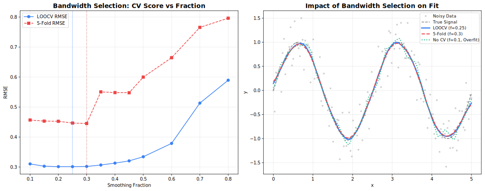

# Cross-Validation

Automated parameter selection via cross-validation.

## Overview

Cross-validation helps select optimal parameters (especially `fraction`) by evaluating performance on held-out data.



---

## K-Fold Cross-Validation

Split data into K folds, train on K-1, validate on 1.

=== "Rust"
    ```rust
    use fastLowess::prelude::*;

    let model = Lowess::new()
        .cross_validate(KFold(5, &[0.2, 0.3, 0.5, 0.7]))  // 5 folds, 4 fractions
        .adapter(Batch)
        .build()?;

    let result = model.fit(&x, &y)?;
    
    // The best fraction was automatically selected
    println!("Selected fraction: {}", result.fraction_used);
    
    if let Some(cv) = &result.cv_results {
        println!("CV scores: {:?}", cv.scores);
        println!("Best score: {}", cv.best_score);
    }
    ```

=== "Python"
    ```python
    result = fl.smooth(
        x, y,
        cv_method="kfold",
        cv_k=5,
        cv_fractions=[0.2, 0.3, 0.5, 0.7]
    )

    print(f"Selected fraction: {result['fraction_used']}")
    print(f"CV scores: {result['cv_scores']}")
    ```

=== "R"
    ```r
    result <- fastlowess(
        x, y,
        cv_method = "kfold",
        cv_k = 5,
        cv_fractions = c(0.2, 0.3, 0.5, 0.7)
    )

    cat("Selected fraction:", result$fraction_used, "\n")
    cat("CV scores:", result$cv_scores, "\n")
    ```

---

## Leave-One-Out (LOOCV)

Each point is held out once. Most thorough but slowest.

=== "Rust"
    ```rust
    let model = Lowess::new()
        .cross_validate(LOOCV(&[0.2, 0.3, 0.5, 0.7]))
        .adapter(Batch)
        .build()?;
    ```

=== "Python"
    ```python
    result = fl.smooth(
        x, y,
        cv_method="loocv",
        cv_fractions=[0.2, 0.3, 0.5, 0.7]
    )
    ```

=== "R"
    ```r
    result <- fastlowess(
        x, y,
        cv_method = "loocv",
        cv_fractions = c(0.2, 0.3, 0.5, 0.7)
    )
    ```

---

## Seeded Randomization

Set a seed for reproducible fold assignments:

=== "Rust"
    ```rust
    let model = Lowess::new()
        .cross_validate(KFold(5, &[0.3, 0.5, 0.7]).seed(42))
        .adapter(Batch)
        .build()?;
    ```

=== "Python"
    ```python
    result = fl.smooth(
        x, y,
        cv_method="kfold",
        cv_k=5,
        cv_fractions=[0.3, 0.5, 0.7],
        cv_seed=42
    )
    ```

=== "R"
    ```r
    result <- fastlowess(
        x, y,
        cv_method = "kfold",
        cv_k = 5,
        cv_fractions = c(0.3, 0.5, 0.7),
        cv_seed = 42
    )
    ```

---

## Comparison

| Method        | Folds | Speed  | Variance | Bias   |
|---------------|:-----:|:------:|:--------:|:------:|
| **KFold(5)**  | 5     | Fast   | Moderate | Low    |
| **KFold(10)** | 10    | Medium | Lower    | Lower  |
| **LOOCV**     | N     | Slow   | Lowest   | Lowest |

!!! tip "Recommendation"
    Use **5-fold** or **10-fold** CV for most applications. LOOCV is only worth it for small datasets (N < 100).

---

## CV Metrics

Cross-validation uses MSE (Mean Squared Error) by default:

```
MSE = mean((y_true - y_pred)²)
```

Lower MSE indicates better fit on held-out data.

---

## Interpreting Results

```python
# Example output
result = fl.smooth(x, y, cv_method="kfold", cv_k=5, 
                   cv_fractions=[0.1, 0.3, 0.5, 0.7])

# Fraction  | CV Score (MSE)
# 0.1       | 0.0542  ← Undersmoothed
# 0.3       | 0.0231  ← Best
# 0.5       | 0.0298
# 0.7       | 0.0412  ← Oversmoothed
```

The fraction with **lowest CV score** is automatically selected.

---

## Availability

!!! warning "Batch Mode Only"
    Cross-validation is only available in **Batch** mode.

| Feature   | Batch | Streaming | Online |
|-----------|:-----:|:---------:|:------:|
| K-Fold CV | ✓     | ✗         | ✗      |
| LOOCV     | ✓     | ✗         | ✗      |

---

## Best Practices

1. **Test a range**: Include fractions from 0.1 to 0.9
2. **Use enough folds**: 5-10 folds balance speed and accuracy
3. **Set a seed**: For reproducible results
4. **Check the curve**: CV optimizes MSE, but visual inspection matters
