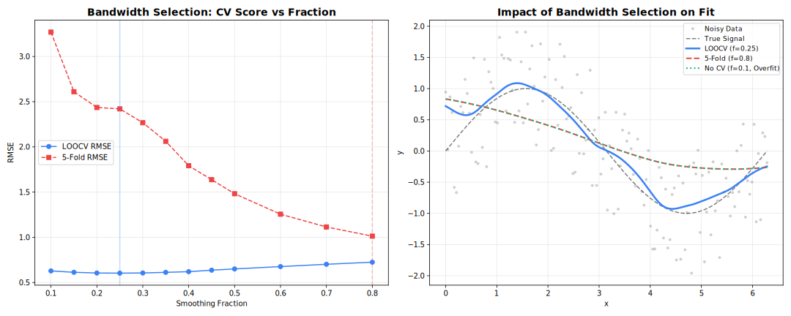

<!-- markdownlint-disable MD024 MD033 MD046 -->
# Cross-Validation

Automated parameter selection via cross-validation.

## Overview

Cross-validation helps select optimal parameters (especially `fraction`) by evaluating performance on held-out data.



---

## K-Fold Cross-Validation

Split data into K folds, train on K-1, validate on 1.

=== "R"
    ```r
    library(rfastlowess)
    set.seed(42)
    x <- seq(0, 2 * pi, length.out = 100)
    y <- sin(x) + rnorm(100, sd = 0.3)

    model <- Lowess(
        cv_method = "kfold",
        cv_k = 5,
        cv_fractions = c(0.2, 0.3, 0.5, 0.7)
    )
    result <- model$fit(x, y)

    cat("Selected fraction:", result$fraction_used, "\n")
    cat("CV scores:", result$cv_scores, "\n")
    ```

=== "Python"
    ```python
    import fastlowess as fl
    import numpy as np

    rng = np.random.default_rng(42)
    x = np.linspace(0, 2 * np.pi, 100)
    y = np.sin(x) + rng.normal(0, 0.3, 100)

    model = fl.Lowess(cv_method="kfold",
        cv_k=5,
        cv_fractions=[0.2, 0.3, 0.5, 0.7]
    )
    result = model.fit(x, y)

    print(f"Selected fraction: {result.fraction_used}")
    print(f"CV scores: {result.cv_scores}")
    ```

=== "Rust"
    ```rust
    use fastLowess::prelude::*;
    use std::f64::consts::TAU;

    fn main() -> Result<(), LowessError> {
        let n = 100usize;
        let x: Vec<f64> = (0..n).map(|i| i as f64 * TAU / (n - 1) as f64).collect();
        let y: Vec<f64> = x.iter().map(|&xi| xi.sin() + 0.1).collect();


        let model = Lowess::new()
            .cv_method("kfold")
            .cv_k(5)
            .cv_fractions(vec![0.2, 0.3, 0.5, 0.7])
            .build()?;

        let result = model.fit(&x, &y)?;

        // The best fraction was automatically selected
        println!("Selected fraction: {}", result.fraction_used);

        if let Some(scores) = &result.cv_scores {
            println!("CV scores: {:?}", scores);
        }

        Ok(())
    }
    ```

=== "Julia"
    ```julia
    using FastLOWESS
    using Random, Statistics

    rng = MersenneTwister(42)
    x = collect(range(0, 2π, length=100))
    y = sin.(x) .+ randn(rng, 100) .* 0.3

    using FastLOWESS

    model = Lowess(; cv_method="kfold",
        cv_k=5,
        cv_fractions=[0.2, 0.3, 0.5, 0.7]
    )
    result = fit(model, x, y)

    println("Selected fraction: ", result.fraction_used)
    println("CV scores: ", result.cv_scores)
    ```

=== "Node.js"
    ```javascript
    const { Lowess } = require('fastlowess');

    const n = 100;
    const x = Float64Array.from({ length: n }, (_, i) => i * 2 * Math.PI / (n - 1));
    const y = Float64Array.from(x, (xi, i) => Math.sin(xi) + (((i * 7 + 3) % 17) / 17 - 0.5) * 0.6);

    const model = new Lowess({
        cv_method: "kfold",
        cv_k: 5,
        cv_fractions: [0.2, 0.3, 0.5, 0.7]
    });
    const result = model.fit(x, y);

    console.log("Selected fraction:", result.fraction_used);
    console.log("CV scores:", result.cv_scores);
    ```

=== "WebAssembly"
    ```javascript
    import init, { Lowess } from 'fastlowess-wasm';
    await init();

    const n = 100;
    const x = Float64Array.from({ length: n }, (_, i) => i * 2 * Math.PI / (n - 1));
    const y = Float64Array.from(x, (xi, i) => Math.sin(xi) + (((i * 7 + 3) % 17) / 17 - 0.5) * 0.6);

    const model = new Lowess({
        cv_method: "kfold",
        cv_k: 5,
        cv_fractions: [0.2, 0.3, 0.5, 0.7]
    });
    const result = model.fit(x, y);

    console.log("Selected fraction:", result.fraction_used);
    console.log("CV scores:", result.cv_scores);
    ```

=== "C++"
    ```cpp
    #include <fastlowess.hpp>
    #include <cmath>
    #include <iostream>
    #include <vector>

    int main() {
        const int n = 100;
        std::vector<double> x(n), y(n);
        for (int i = 0; i < n; ++i) {
            x[i] = i * 2 * M_PI / (n - 1);
            y[i] = std::sin(x[i]) + 0.1;
        }


        fastlowess::LowessOptions opts;
        opts.cv_fractions = {0.2, 0.3, 0.5, 0.7};
        opts.cv_method = "kfold";
        opts.cv_k = 5;

        fastlowess::Lowess model(opts);
        auto result = model.fit(x, y).value();

        std::cout << "Selected fraction: " << result.fraction_used() << std::endl;

        return 0;
    }
    ```

---

## Leave-One-Out (LOOCV)

Each point is held out once. Most thorough but slowest.

=== "R"
    ```r
    library(rfastlowess)
    set.seed(42)
    x <- seq(0, 2 * pi, length.out = 100)
    y <- sin(x) + rnorm(100, sd = 0.3)

    model <- Lowess(
        cv_method = "loocv",
        cv_fractions = c(0.2, 0.3, 0.5, 0.7)
    )
    result <- model$fit(x, y)
    ```

=== "Python"
    ```python
    import fastlowess as fl
    import numpy as np

    rng = np.random.default_rng(42)
    x = np.linspace(0, 2 * np.pi, 100)
    y = np.sin(x) + rng.normal(0, 0.3, 100)

    model = fl.Lowess(cv_method="loocv",
        cv_fractions=[0.2, 0.3, 0.5, 0.7]
    )
    result = model.fit(x, y)
    ```

=== "Rust"
    ```rust
    use fastLowess::prelude::*;
    use std::f64::consts::TAU;

    fn main() -> Result<(), LowessError> {
        let n = 100usize;
        let x: Vec<f64> = (0..n).map(|i| i as f64 * TAU / (n - 1) as f64).collect();
        let y: Vec<f64> = x.iter().map(|&xi| xi.sin() + 0.1).collect();

        let model = Lowess::new()
            .cv_method("loocv")
            .cv_fractions(vec![0.2, 0.3, 0.5, 0.7])
            .build()?;
        let result = model.fit(&x, &y)?;

        Ok(())
    }
    ```

=== "Julia"
    ```julia
    using FastLOWESS
    using Random, Statistics

    rng = MersenneTwister(42)
    x = collect(range(0, 2π, length=100))
    y = sin.(x) .+ randn(rng, 100) .* 0.3

    model = Lowess(; cv_method="loocv",
        cv_fractions=[0.2, 0.3, 0.5, 0.7]
    )
    result = fit(model, x, y)
    ```

=== "Node.js"
    ```javascript
    const { Lowess } = require('fastlowess');

    const n = 100;
    const x = Float64Array.from({ length: n }, (_, i) => i * 2 * Math.PI / (n - 1));
    const y = Float64Array.from(x, (xi, i) => Math.sin(xi) + (((i * 7 + 3) % 17) / 17 - 0.5) * 0.6);

    const model = new Lowess({
        cv_method: "loocv",
        cv_fractions: [0.2, 0.3, 0.5, 0.7]
    });
    const result = model.fit(x, y);
    ```

=== "WebAssembly"
    ```javascript
    import init, { Lowess } from 'fastlowess-wasm';
    await init();

    const n = 100;
    const x = Float64Array.from({ length: n }, (_, i) => i * 2 * Math.PI / (n - 1));
    const y = Float64Array.from(x, (xi, i) => Math.sin(xi) + (((i * 7 + 3) % 17) / 17 - 0.5) * 0.6);

    const model = new Lowess({
        cv_method: "loocv",
        cv_fractions: [0.2, 0.3, 0.5, 0.7]
    });
    const result = model.fit(x, y);
    ```

=== "C++"
    ```cpp
    #include <fastlowess.hpp>
    #include <cmath>
    #include <iostream>
    #include <vector>

    int main() {
        const int n = 100;
        std::vector<double> x(n), y(n);
        for (int i = 0; i < n; ++i) {
            x[i] = i * 2 * M_PI / (n - 1);
            y[i] = std::sin(x[i]) + 0.1;
        }

        fastlowess::LowessOptions cv_opts;
        cv_opts.cv_method = "loocv";
        cv_opts.cv_fractions = {0.2, 0.3, 0.5, 0.7};
        fastlowess::Lowess model(cv_opts);
        auto result = model.fit(x, y).value();

        return 0;
    }
    ```

---

## Seeded Randomization

Set a seed for reproducible fold assignments:

=== "R"
    ```r
    library(rfastlowess)
    set.seed(42)
    x <- seq(0, 2 * pi, length.out = 100)
    y <- sin(x) + rnorm(100, sd = 0.3)

    model <- Lowess(
        cv_method = "kfold",
        cv_k = 5,
        cv_fractions = c(0.3, 0.5, 0.7),
        cv_seed = 42
    )
    result <- model$fit(x, y)
    ```

=== "Python"
    ```python
    import fastlowess as fl
    import numpy as np

    rng = np.random.default_rng(42)
    x = np.linspace(0, 2 * np.pi, 100)
    y = np.sin(x) + rng.normal(0, 0.3, 100)

    model = fl.Lowess(cv_method="kfold",
        cv_k=5,
        cv_fractions=[0.3, 0.5, 0.7],
        cv_seed=42
    )
    result = model.fit(x, y)
    ```

=== "Rust"
    ```rust
    use fastLowess::prelude::*;
    use std::f64::consts::TAU;

    fn main() -> Result<(), LowessError> {
        let n = 100usize;
        let x: Vec<f64> = (0..n).map(|i| i as f64 * TAU / (n - 1) as f64).collect();
        let y: Vec<f64> = x.iter().map(|&xi| xi.sin() + 0.1).collect();

        let model = Lowess::new()
            .cv_method("kfold")
            .cv_k(5)
            .cv_fractions(vec![0.3, 0.5, 0.7])
            .cv_seed(42)
            .build()?;
        let result = model.fit(&x, &y)?;

        Ok(())
    }
    ```

=== "Julia"
    ```julia
    using FastLOWESS
    using Random, Statistics

    rng = MersenneTwister(42)
    x = collect(range(0, 2π, length=100))
    y = sin.(x) .+ randn(rng, 100) .* 0.3

    model = Lowess(; cv_method="kfold",
        cv_k=5,
        cv_fractions=[0.3, 0.5, 0.7],
        cv_seed=42
    )
    result = fit(model, x, y)
    ```

=== "Node.js"
    ```javascript
    const fl = require('fastlowess');

    const n = 100;
    const x = Float64Array.from({ length: n }, (_, i) => i * 2 * Math.PI / (n - 1));
    const y = Float64Array.from(x, (xi, i) => Math.sin(xi) + (((i*7+3)%17)/17-0.5)*0.6);

    const model = new fl.Lowess({
        cv_method: "kfold",
        cv_k: 5,
        cv_fractions: [0.3, 0.5, 0.7],
        cv_seed: 42
    });
    const result = model.fit(x, y);
    ```

=== "WebAssembly"
    ```javascript
    import init, { Lowess } from 'fastlowess-wasm';
    await init();

    const n = 100;
    const x = Float64Array.from({ length: n }, (_, i) => i * 2 * Math.PI / (n - 1));
    const y = Float64Array.from(x, (xi, i) => Math.sin(xi) + (((i * 7 + 3) % 17) / 17 - 0.5) * 0.6);

    const model = new Lowess({
        cv_method: "kfold",
        cv_k: 5,
        cv_fractions: [0.3, 0.5, 0.7],
        cv_seed: 42
    });
    const result = model.fit(x, y);
    ```

=== "C++"
    ```cpp
    #include <fastlowess.hpp>
    #include <cmath>
    #include <iostream>
    #include <vector>

    int main() {
        const int n = 100;
        std::vector<double> x(n), y(n);
        for (int i = 0; i < n; ++i) {
            x[i] = i * 2 * M_PI / (n - 1);
            y[i] = std::sin(x[i]) + 0.1;
        }


        fastlowess::LowessOptions opts;
        opts.cv_fractions = {0.3, 0.5, 0.7};
        opts.cv_method = "kfold";
        opts.cv_k = 5;
        opts.cv_seed = 42;

        fastlowess::Lowess model(opts);
        auto result = model.fit(x, y).value();

        return 0;
    }
    ```

---

## Comparison

| Method | Folds | Speed | Variance | Bias |
| --- | --- | --- | --- | --- |
| **KFold(5)** | 5 | Fast | Moderate | Low |
| **KFold(10)** | 10 | Medium | Lower | Lower |
| **LOOCV** | N | Slow | Lowest | Lowest |

!!! tip "Recommendation"
    Use **5-fold** or **10-fold** CV for most applications. LOOCV is only worth it for small datasets (N < 100).

---

## CV Metrics

Cross-validation uses MSE (Mean Squared Error) by default:

```text
MSE = mean((y_true - y_pred)²)
```

Lower MSE indicates better fit on held-out data.

---

## Interpreting Results

=== "R"
    ```r
    library(rfastlowess)
    set.seed(42)
    x <- seq(0, 2 * pi, length.out = 100)
    y <- sin(x) + rnorm(100, sd = 0.3)

    # Example output
    model <- Lowess(cv_method = "kfold", cv_k = 5,
                    cv_fractions = c(0.1, 0.3, 0.5, 0.7))
    result <- model$fit(x, y)

    # Fraction  | CV Score (MSE)
    # 0.1       | 0.0542  ← Undersmoothed
    # 0.3       | 0.0231  ← Best
    # 0.5       | 0.0298
    # 0.7       | 0.0412  ← Oversmoothed
    ```

=== "Python"
    ```python
    import fastlowess as fl
    import numpy as np

    rng = np.random.default_rng(42)
    x = np.linspace(0, 2 * np.pi, 100)
    y = np.sin(x) + rng.normal(0, 0.3, 100)

    # Example output
    model = fl.Lowess(cv_method="kfold", cv_k=5,
                       cv_fractions=[0.1, 0.3, 0.5, 0.7])
    result = model.fit(x, y)

    # Fraction  | CV Score (MSE)
    # 0.1       | 0.0542  ← Undersmoothed
    # 0.3       | 0.0231  ← Best
    # 0.5       | 0.0298
    # 0.7       | 0.0412  ← Oversmoothed
    ```

=== "Rust"
    ```rust
    use fastLowess::prelude::*;
    use std::f64::consts::TAU;

    fn main() -> Result<(), LowessError> {
        let n = 100usize;
        let x: Vec<f64> = (0..n).map(|i| i as f64 * TAU / (n - 1) as f64).collect();
        let y: Vec<f64> = x.iter().map(|&xi| xi.sin() + 0.1).collect();

        // Example output
        let model = Lowess::new()
            .cv_method("kfold")
            .cv_k(5)
            .cv_fractions(vec![0.1, 0.3, 0.5, 0.7])
            .build()?;

        let result = model.fit(&x, &y)?;

        // Fraction  | CV Score (MSE)
        // 0.1       | 0.0542  ← Undersmoothed
        // 0.3       | 0.0231  ← Best
        // 0.5       | 0.0298
        // 0.7       | 0.0412  ← Oversmoothed

        Ok(())
    }
    ```

=== "Julia"
    ```julia
    using FastLOWESS
    using Random, Statistics

    rng = MersenneTwister(42)
    x = collect(range(0, 2π, length=100))
    y = sin.(x) .+ randn(rng, 100) .* 0.3

    # Example output
    model = Lowess(; cv_method="kfold", cv_k=5,
                    cv_fractions=[0.1, 0.3, 0.5, 0.7])
    result = fit(model, x, y)

    # Fraction  | CV Score (MSE)
    # 0.1       | 0.0542  ← Undersmoothed
    # 0.3       | 0.0231  ← Best
    # 0.5       | 0.0298
    # 0.7       | 0.0412  ← Oversmoothed
    ```

=== "Node.js"
    ```javascript
    const { Lowess } = require('fastlowess');

    const n = 100;
    const x = Float64Array.from({ length: n }, (_, i) => i * 2 * Math.PI / (n - 1));
    const y = Float64Array.from(x, (xi, i) => Math.sin(xi) + (((i * 7 + 3) % 17) / 17 - 0.5) * 0.6);

    // Example output
    const model = new Lowess({
        cv_method: "kfold",
        cv_k: 5,
        cv_fractions: [0.1, 0.3, 0.5, 0.7]
    });
    const result = model.fit(x, y);

    // Fraction  | CV Score (MSE)
    // 0.1       | 0.0542  ← Undersmoothed
    // 0.3       | 0.0231  ← Best
    // 0.5       | 0.0298
    // 0.7       | 0.0412  ← Oversmoothed
    ```

=== "WebAssembly"
    ```javascript
    import init, { Lowess } from 'fastlowess-wasm';
    await init();

    const n = 100;
    const x = Float64Array.from({ length: n }, (_, i) => i * 2 * Math.PI / (n - 1));
    const y = Float64Array.from(x, (xi, i) => Math.sin(xi) + (((i * 7 + 3) % 17) / 17 - 0.5) * 0.6);

    // Example output
    const model = new Lowess({
        cv_method: "kfold",
        cv_k: 5,
        cv_fractions: [0.1, 0.3, 0.5, 0.7]
    });
    const result = model.fit(x, y);

    // Fraction  | CV Score (MSE)
    // 0.1       | 0.0542  ← Undersmoothed
    // 0.3       | 0.0231  ← Best
    // 0.5       | 0.0298
    // 0.7       | 0.0412  ← Oversmoothed
    ```

=== "C++"
    ```cpp
    #include <fastlowess.hpp>
    #include <cmath>
    #include <iostream>
    #include <vector>

    int main() {
        const int n = 100;
        std::vector<double> x(n), y(n);
        for (int i = 0; i < n; ++i) {
            x[i] = i * 2 * M_PI / (n - 1);
            y[i] = std::sin(x[i]) + 0.1;
        }

        // Example output
        fastlowess::LowessOptions cv_opts;
        cv_opts.cv_fractions = {0.1, 0.3, 0.5, 0.7};
        cv_opts.cv_method = "kfold";
        cv_opts.cv_k = 5;
        fastlowess::Lowess model(cv_opts);
        auto result = model.fit(x, y).value();

        // Fraction  | CV Score (MSE)
        // 0.1       | 0.0542  ← Undersmoothed
        // 0.3       | 0.0231  ← Best
        // 0.5       | 0.0298
        // 0.7       | 0.0412  ← Oversmoothed

        return 0;
    }
    ```

The fraction with **lowest CV score** is automatically selected.

---

## Availability

!!! warning "Batch Mode Only"
    Cross-validation is only available in **Batch** mode.

| Feature | Batch | Streaming | Online |
| --- | --- | --- | --- |
| K-Fold CV | ✓ | ✗ | ✗ |
| LOOCV | ✓ | ✗ | ✗ |

---

## Best Practices

1. **Test a range**: Include fractions from 0.1 to 0.9
2. **Use enough folds**: 5-10 folds balance speed and accuracy
3. **Set a seed**: For reproducible results
4. **Check the curve**: CV optimizes MSE, but visual inspection matters
