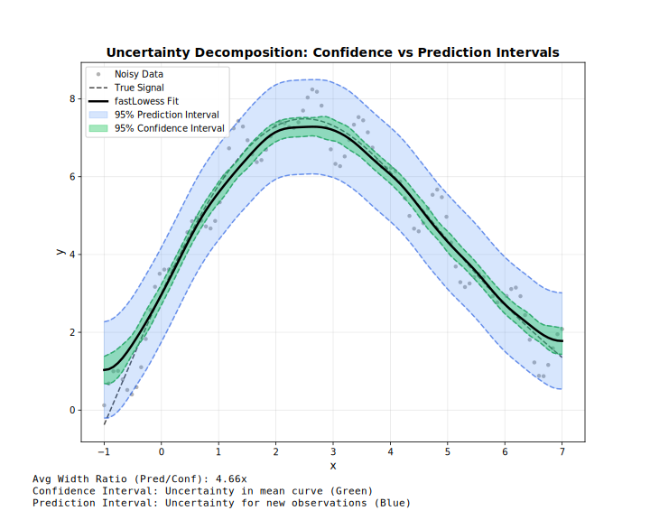

<!-- markdownlint-disable MD024 -->
# Intervals

Confidence and prediction intervals for uncertainty quantification.

## Overview



!!! note "Adapter support"
    Confidence and prediction intervals are available in **all three adapters**: Batch, Streaming, and Online.

| Type | Represents | Width | Use |
| --- | --- | --- | --- |
| **Confidence** | Uncertainty in mean curve | Narrow | Where is the true trend? |
| **Prediction** | Uncertainty for new points | Wide | Where will new data fall? |

---

## Confidence Intervals

Estimate uncertainty in the smoothed curve itself.

=== "R"
    ```r
    model <- Lowess(fraction = 0.5, confidence_intervals = 0.95)
    result <- model$fit(x, y)

    # Plot with bands
    plot(x, y, pch = 16, col = "gray")
    lines(result$x, result$y, col = "blue", lwd = 2)
    lines(result$x, result$confidence_lower, col = "blue", lty = 2)
    lines(result$x, result$confidence_upper, col = "blue", lty = 2)
    ```

=== "Python"
    ```python
    model = fl.Lowess(fraction=0.5, confidence_intervals=0.95)
    result = model.fit(x, y)

    print("Smoothed:", result.y)
    print("CI Lower:", result.confidence_lower)
    print("CI Upper:", result.confidence_upper)
    ```

=== "Rust"
    ```rust
    use fastLowess::prelude::*;

    let model = Lowess::new()
        .fraction(0.5)
        .confidence_intervals(0.95)  // 95% CI
        .build()?;

    let result = model.fit(&x, &y)?;
    
    // Access intervals
    if let (Some(lower), Some(upper)) = (&result.confidence_lower, &result.confidence_upper) {
        for i in 0..result.y.len() {
            println!("x={:.2}: y={:.2} [{:.2}, {:.2}]", 
                result.x[i], result.y[i], lower[i], upper[i]);
        }
    }
    ```

=== "Julia"
    ```julia
    using FastLOWESS

    model = Lowess(; fraction=0.5, confidence_intervals=0.95)
    result = fit(model, x, y)

    for i in 1:length(result.y)
        println("x=$(result.x[i]): y=$(result.y[i]) [$(result.confidence_lower[i]), $(result.confidence_upper[i])]")
    end
    ```

=== "Node.js"
    ```javascript
    const model = new fl.Lowess({fraction: 0.5, confidence_intervals: 0.95});
    const result = model.fit(x, y);

    result.y.forEach((y, i) => {
        console.log(`x=${result.x[i]}: y=${y} [${result.confidence_lower[i]}, ${result.confidence_upper[i]}]`);
    });
    ```

=== "WebAssembly"
    ```javascript
    const model = new Lowess({fraction: 0.5, confidence_intervals: 0.95});
    const result = model.fit(x, y);

    result.y.forEach((y, i) => {
        console.log(`x=${result.x[i]}: y=${y} [${result.confidence_lower[i]}, ${result.confidence_upper[i]}]`);
    });
    ```

=== "C++"
    ```cpp
    #include "fastlowess.hpp"

    fastlowess::Lowess model({
        .fraction = 0.5,
        .confidence_intervals = 0.95
    });
    auto result = model.fit(x, y).value();

    auto ci_lower = result.confidence_lower();
    auto ci_upper = result.confidence_upper();
    ```

---

## Prediction Intervals

Estimate where new observations might fall.

=== "R"
    ```r
    model <- Lowess(fraction = 0.5, prediction_intervals = 0.95)
    result <- model$fit(x, y)

    # Wider than confidence intervals
    polygon(
        c(result$x, rev(result$x)),
        c(result$prediction_lower, rev(result$prediction_upper)),
        col = rgb(1, 0, 0, 0.2), border = NA
    )
    ```

=== "Python"
    ```python
    model = fl.Lowess(fraction=0.5, prediction_intervals=0.95)
    result = model.fit(x, y)

    print("PI Lower:", result.prediction_lower)
    print("PI Upper:", result.prediction_upper)
    ```

=== "Rust"
    ```rust
    let model = Lowess::new()
        .fraction(0.5)
        .prediction_intervals(0.95)  // 95% PI
        .build()?;

    let result = model.fit(&x, &y)?;
    
    if let (Some(lower), Some(upper)) = (&result.prediction_lower, &result.prediction_upper) {
        println!("Prediction bounds: [{:.2}, {:.2}]", lower[0], upper[0]);
    }
    ```

=== "Julia"
    ```julia
    model = Lowess(; fraction=0.5, prediction_intervals=0.95)
    result = fit(model, x, y)

    println("Prediction bounds: [$(result.prediction_lower[1]), $(result.prediction_upper[1])]")
    ```

=== "Node.js"
    ```javascript
    const model = new fl.Lowess({fraction: 0.5, prediction_intervals: 0.95});
    const result = model.fit(x, y);
    console.log(`Prediction bounds: [${result.prediction_lower[0]}, ${result.prediction_upper[0]}]`);
    ```

=== "WebAssembly"
    ```javascript
    const model = new Lowess({fraction: 0.5, prediction_intervals: 0.95});
    const result = model.fit(x, y);
    console.log(`Prediction bounds: [${result.prediction_lower[0]}, ${result.prediction_upper[0]}]`);
    ```

=== "C++"
    ```cpp
    fastlowess::Lowess model({ .fraction = 0.5, .prediction_intervals = 0.95});
    auto result = model.fit(x, y).value();
    ```

---

## Both Intervals

Request both types simultaneously:

=== "R"
    ```r
    model <- Lowess(
        fraction = 0.5,
        confidence_intervals = 0.95,
        prediction_intervals = 0.95
    )
    result <- model$fit(x, y)
    ```

=== "Python"
    ```python
    model = fl.Lowess(
        fraction=0.5,
        confidence_intervals=0.95,
        prediction_intervals=0.95
    )
    result = model.fit(x, y)
    ```

=== "Rust"
    ```rust
    let model = Lowess::new()
        .fraction(0.5)
        .confidence_intervals(0.95)
        .prediction_intervals(0.95)
        .build()?;
    let result = model.fit(&x, &y)?;
    ```

=== "Julia"
    ```julia
    result = fit(
        Lowess(fraction=0.5, confidence_intervals=0.95, prediction_intervals=0.95),
        x, y
    )
    ```

=== "Node.js"
    ```javascript
    const model = new fl.Lowess({fraction: 0.5,
        confidence_intervals: 0.95,
        prediction_intervals: 0.95});
    const result = model.fit(x, y);
    ```

=== "WebAssembly"
    ```javascript
    const model = new Lowess({fraction: 0.5,
        confidence_intervals: 0.95,
        prediction_intervals: 0.95});
    const result = model.fit(x, y);
    ```

=== "C++"
    ```cpp
    fastlowess::Lowess model({ .fraction = 0.5, .confidence_intervals = 0.95, .prediction_intervals = 0.95});
    auto result = model.fit(x, y).value();
    ```

---

## Confidence Levels

Common levels and their z-values:

| Level | z-value | Interpretation |
| --- | --- | --- |
| 0.90 | 1.645 | 90% of intervals contain true value |
| 0.95 | 1.960 | 95% of intervals contain true value |
| 0.99 | 2.576 | 99% of intervals contain true value |

=== "R"
    ```r
    # 99% confidence interval (wider)
    model <- Lowess(confidence_intervals = 0.99)
    result <- model$fit(x, y)
    ```

=== "Python"
    ```python
    # 90% confidence interval (narrower)
    model = fl.Lowess(confidence_intervals=0.90)
    result = model.fit(x, y)
    ```

=== "Rust"
    ```rust
    // 99% confidence interval
    let model = Lowess::new()
        .confidence_intervals(0.99)
        .build()?;
    let result = model.fit(&x, &y)?;
    ```

=== "Julia"
    ```julia
    # 99% confidence interval
    model = Lowess(; confidence_intervals=0.99)
    result = fit(model, x, y)
    ```

=== "Node.js"
    ```javascript
    // 99% confidence interval
    const model = new fl.Lowess({confidence_intervals: 0.99});
    const result = model.fit(x, y);
    ```

=== "WebAssembly"
    ```javascript
    // 99% confidence interval
    const model = new Lowess({confidence_intervals: 0.99});
    const result = model.fit(x, y);
    ```

=== "C++"
    ```cpp
    fastlowess::Lowess model({ .confidence_intervals = 0.99});
    auto result = model.fit(x, y).value();
    ```

---

## Standard Errors

Access standard errors directly (available when intervals are computed):

=== "R"
    ```r
    model <- Lowess(confidence_intervals = 0.95)
    result <- model$fit(x, y)
    print(result$standard_errors)
    ```

=== "Python"
    ```python
    model = fl.Lowess(confidence_intervals=0.95)
    result = model.fit(x, y)
    print("Standard errors:", result.standard_errors)
    ```

=== "Rust"
    ```rust
    let result = model.fit(&x, &y)?;

    if let Some(standard_errors) = &result.standard_errors {
        for (i, &se) in standard_errors.iter().enumerate() {
            println!("Point {}: SE = {:.4}", i, se);
        }
    }
    ```

=== "Julia"
    ```julia
    model = Lowess(; confidence_intervals=0.95)
    result = fit(model, x, y)

    for (i, se) in enumerate(result.standard_errors)
        println("Point $i: SE = $se")
    end
    ```

=== "Node.js"
    ```javascript
    const model = new fl.Lowess({confidence_intervals: 0.95});
    const result = model.fit(x, y);

    result.standard_errors.forEach((se, i) => {
        console.log(`Point ${i}: SE = ${se.toFixed(4)}`);
    });
    ```

=== "WebAssembly"
    ```javascript
    const model = new Lowess({confidence_intervals: 0.95});
    const result = model.fit(x, y);

    result.standard_errors.forEach((se, i) => {
        console.log(`Point ${i}: SE = ${se.toFixed(4)}`);
    });
    ```

=== "C++"
    ```cpp
    fastlowess::Lowess model({ .confidence_intervals = 0.95});
    auto result = model.fit(x, y).value();
    ```

---

## Availability

!!! warning "Batch Mode Only"
    Confidence and prediction intervals are only available in **Batch** mode. Streaming and Online modes do not support intervals.

| Feature | Batch | Streaming | Online |
| --- | --- | --- | --- |
| Confidence intervals | ✓ | ✗ | ✗ |
| Prediction intervals | ✓ | ✗ | ✗ |
| Standard errors | ✓ | ✗ | ✗ |
