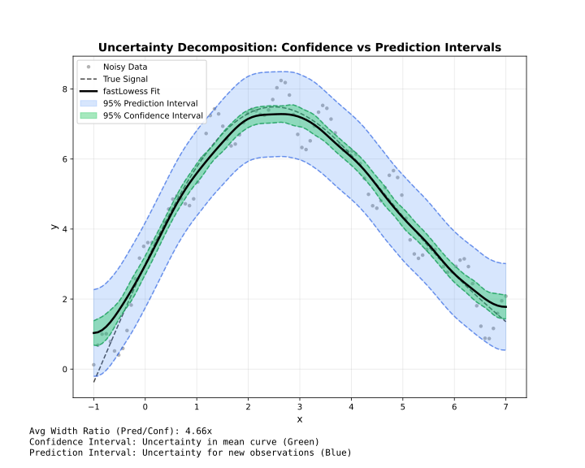

<!-- markdownlint-disable MD024 MD033 -->
# Intervals

Confidence and prediction intervals for uncertainty quantification.

## Overview



!!! note "Adapter support"
    Confidence and prediction intervals are available in **Batch** mode only. Streaming and Online modes do not support intervals.

| Type | Represents | Width | Use |
| --- | --- | --- | --- |
| **Confidence** | Uncertainty in mean curve | Narrow | Where is the true trend? |
| **Prediction** | Uncertainty for new points | Wide | Where will new data fall? |

---

## Confidence Intervals

Estimate uncertainty in the smoothed curve itself.

=== "Python"
    ```python
    import fastlowess as fl
    import numpy as np

    rng = np.random.default_rng(42)
    x = np.linspace(0, 2 * np.pi, 100)
    y = np.sin(x) + rng.normal(0, 0.3, 100)

    model = fl.Lowess(fraction=0.5, confidence_intervals=0.95)
    result = model.fit(x, y)

    print("Smoothed:", result.y)
    print("CI Lower:", result.confidence_lower)
    print("CI Upper:", result.confidence_upper)
    ```
=== "Node.js"
    ```javascript
    const fl = require('fastlowess');

    const n = 100;
    const x = Float64Array.from({ length: n }, (_, i) => i * 2 * Math.PI / (n - 1));
    const y = Float64Array.from(x, (xi, i) => Math.sin(xi) + (((i*7+3)%17)/17-0.5)*0.6);

    const model = new fl.Lowess({fraction: 0.5, confidence_intervals: 0.95});
    const result = model.fit(x, y);

    result.y.forEach((y, i) => {
        console.log(`x=${result.x[i]}: y=${y} [${result.confidence_lower[i]}, ${result.confidence_upper[i]}]`);
    });
    ```

=== "WebAssembly"
    ```javascript
    const { Lowess } = require('./fastlowess_wasm.js');

    const n = 100;
    const x = Float64Array.from({ length: n }, (_, i) => i * 2 * Math.PI / (n - 1));
    const y = Float64Array.from(x, (xi, i) => Math.sin(xi) + (((i * 7 + 3) % 17) / 17 - 0.5) * 0.6);

    const model = new Lowess({fraction: 0.5, confidence_intervals: 0.95});
    const result = model.fit(x, y);

    result.y.forEach((y, i) => {
        console.log(`x=${result.x[i]}: y=${y} [${result.confidence_lower[i]}, ${result.confidence_upper[i]}]`);
    });
    ```

=== "C++"
    ```cpp
    #include <fastlowess.hpp>
    #include <cmath>
    #include <iostream>
    #include <vector>

    int main() {
        const int n = 100;
        std::vector<double> x(n), y(n);
        for (int i = 0; i < n; ++i) {
            x[i] = i * 2 * M_PI / (n - 1);
            y[i] = std::sin(x[i]) + 0.1;
        }


        fastlowess::Lowess model({
            .fraction = 0.5,
            .confidence_intervals = 0.95
        });
        auto result = model.fit(x, y).value();

        auto ci_lower = result.confidence_lower();
        auto ci_upper = result.confidence_upper();

        return 0;
    }
    ```

---

## Prediction Intervals

Estimate where new observations might fall.

=== "Python"
    ```python
    import fastlowess as fl
    import numpy as np

    rng = np.random.default_rng(42)
    x = np.linspace(0, 2 * np.pi, 100)
    y = np.sin(x) + rng.normal(0, 0.3, 100)

    model = fl.Lowess(fraction=0.5, prediction_intervals=0.95)
    result = model.fit(x, y)

    print("PI Lower:", result.prediction_lower)
    print("PI Upper:", result.prediction_upper)
    ```
=== "Node.js"
    ```javascript
    const fl = require('fastlowess');

    const n = 100;
    const x = Float64Array.from({ length: n }, (_, i) => i * 2 * Math.PI / (n - 1));
    const y = Float64Array.from(x, (xi, i) => Math.sin(xi) + (((i*7+3)%17)/17-0.5)*0.6);

    const model = new fl.Lowess({fraction: 0.5, prediction_intervals: 0.95});
    const result = model.fit(x, y);
    console.log(`Prediction bounds: [${result.prediction_lower[0]}, ${result.prediction_upper[0]}]`);
    ```

=== "WebAssembly"
    ```javascript
    const { Lowess } = require('./fastlowess_wasm.js');

    const n = 100;
    const x = Float64Array.from({ length: n }, (_, i) => i * 2 * Math.PI / (n - 1));
    const y = Float64Array.from(x, (xi, i) => Math.sin(xi) + (((i * 7 + 3) % 17) / 17 - 0.5) * 0.6);

    const model = new Lowess({fraction: 0.5, prediction_intervals: 0.95});
    const result = model.fit(x, y);
    console.log(`Prediction bounds: [${result.prediction_lower[0]}, ${result.prediction_upper[0]}]`);
    ```

=== "C++"
    ```cpp
    #include <fastlowess.hpp>
    #include <cmath>
    #include <iostream>
    #include <vector>

    int main() {
        const int n = 100;
        std::vector<double> x(n), y(n);
        for (int i = 0; i < n; ++i) {
            x[i] = i * 2 * M_PI / (n - 1);
            y[i] = std::sin(x[i]) + 0.1;
        }

        fastlowess::Lowess model({ .fraction = 0.5, .prediction_intervals = 0.95});
        auto result = model.fit(x, y).value();

        return 0;
    }
    ```

---

## Both Intervals

Request both types simultaneously:

=== "Python"
    ```python
    import fastlowess as fl
    import numpy as np

    rng = np.random.default_rng(42)
    x = np.linspace(0, 2 * np.pi, 100)
    y = np.sin(x) + rng.normal(0, 0.3, 100)

    model = fl.Lowess(
        fraction=0.5,
        confidence_intervals=0.95,
        prediction_intervals=0.95
    )
    result = model.fit(x, y)
    ```
=== "Node.js"
    ```javascript
    const fl = require('fastlowess');

    const n = 100;
    const x = Float64Array.from({ length: n }, (_, i) => i * 2 * Math.PI / (n - 1));
    const y = Float64Array.from(x, (xi, i) => Math.sin(xi) + (((i*7+3)%17)/17-0.5)*0.6);

    const model = new fl.Lowess({fraction: 0.5,
        confidence_intervals: 0.95,
        prediction_intervals: 0.95});
    const result = model.fit(x, y);
    ```

=== "WebAssembly"
    ```javascript
    const { Lowess } = require('./fastlowess_wasm.js');

    const n = 100;
    const x = Float64Array.from({ length: n }, (_, i) => i * 2 * Math.PI / (n - 1));
    const y = Float64Array.from(x, (xi, i) => Math.sin(xi) + (((i * 7 + 3) % 17) / 17 - 0.5) * 0.6);

    const model = new Lowess({fraction: 0.5,
        confidence_intervals: 0.95,
        prediction_intervals: 0.95});
    const result = model.fit(x, y);
    ```

=== "C++"
    ```cpp
    #include <fastlowess.hpp>
    #include <cmath>
    #include <iostream>
    #include <vector>

    int main() {
        const int n = 100;
        std::vector<double> x(n), y(n);
        for (int i = 0; i < n; ++i) {
            x[i] = i * 2 * M_PI / (n - 1);
            y[i] = std::sin(x[i]) + 0.1;
        }

        fastlowess::Lowess model({ .fraction = 0.5, .confidence_intervals = 0.95, .prediction_intervals = 0.95});
        auto result = model.fit(x, y).value();

        return 0;
    }
    ```

---

## Confidence Levels

Common levels and their z-values:

| Level | z-value | Interpretation |
| --- | --- | --- |
| 0.90 | 1.645 | 90% of intervals contain true value |
| 0.95 | 1.960 | 95% of intervals contain true value |
| 0.99 | 2.576 | 99% of intervals contain true value |

=== "Python"
    ```python
    import fastlowess as fl
    import numpy as np

    rng = np.random.default_rng(42)
    x = np.linspace(0, 2 * np.pi, 100)
    y = np.sin(x) + rng.normal(0, 0.3, 100)

    # 90% confidence interval (narrower)
    model = fl.Lowess(confidence_intervals=0.90)
    result = model.fit(x, y)
    ```
=== "Node.js"
    ```javascript
    const fl = require('fastlowess');

    const n = 100;
    const x = Float64Array.from({ length: n }, (_, i) => i * 2 * Math.PI / (n - 1));
    const y = Float64Array.from(x, (xi, i) => Math.sin(xi) + (((i*7+3)%17)/17-0.5)*0.6);

    // 99% confidence interval
    const model = new fl.Lowess({confidence_intervals: 0.99});
    const result = model.fit(x, y);
    ```

=== "WebAssembly"
    ```javascript
    const { Lowess } = require('./fastlowess_wasm.js');

    const n = 100;
    const x = Float64Array.from({ length: n }, (_, i) => i * 2 * Math.PI / (n - 1));
    const y = Float64Array.from(x, (xi, i) => Math.sin(xi) + (((i * 7 + 3) % 17) / 17 - 0.5) * 0.6);

    // 99% confidence interval
    const model = new Lowess({confidence_intervals: 0.99});
    const result = model.fit(x, y);
    ```

=== "C++"
    ```cpp
    #include <fastlowess.hpp>
    #include <cmath>
    #include <iostream>
    #include <vector>

    int main() {
        const int n = 100;
        std::vector<double> x(n), y(n);
        for (int i = 0; i < n; ++i) {
            x[i] = i * 2 * M_PI / (n - 1);
            y[i] = std::sin(x[i]) + 0.1;
        }

        fastlowess::Lowess model({ .confidence_intervals = 0.99});
        auto result = model.fit(x, y).value();

        return 0;
    }
    ```

---

## Standard Errors

Access standard errors directly (available when intervals are computed):

=== "Python"
    ```python
    import fastlowess as fl
    import numpy as np

    rng = np.random.default_rng(42)
    x = np.linspace(0, 2 * np.pi, 100)
    y = np.sin(x) + rng.normal(0, 0.3, 100)

    model = fl.Lowess(confidence_intervals=0.95)
    result = model.fit(x, y)
    print("Standard errors:", result.standard_errors)
    ```
=== "Node.js"
    ```javascript
    const fl = require('fastlowess');

    const n = 100;
    const x = Float64Array.from({ length: n }, (_, i) => i * 2 * Math.PI / (n - 1));
    const y = Float64Array.from(x, (xi, i) => Math.sin(xi) + (((i*7+3)%17)/17-0.5)*0.6);

    const model = new fl.Lowess({confidence_intervals: 0.95});
    const result = model.fit(x, y);

    result.standard_errors.forEach((se, i) => {
        console.log(`Point ${i}: SE = ${se.toFixed(4)}`);
    });
    ```

=== "WebAssembly"
    ```javascript
    const { Lowess } = require('./fastlowess_wasm.js');

    const n = 100;
    const x = Float64Array.from({ length: n }, (_, i) => i * 2 * Math.PI / (n - 1));
    const y = Float64Array.from(x, (xi, i) => Math.sin(xi) + (((i * 7 + 3) % 17) / 17 - 0.5) * 0.6);

    const model = new Lowess({confidence_intervals: 0.95});
    const result = model.fit(x, y);

    result.standard_errors.forEach((se, i) => {
        console.log(`Point ${i}: SE = ${se.toFixed(4)}`);
    });
    ```

=== "C++"
    ```cpp
    #include <fastlowess.hpp>
    #include <cmath>
    #include <iostream>
    #include <vector>

    int main() {
        const int n = 100;
        std::vector<double> x(n), y(n);
        for (int i = 0; i < n; ++i) {
            x[i] = i * 2 * M_PI / (n - 1);
            y[i] = std::sin(x[i]) + 0.1;
        }

        fastlowess::Lowess model({ .confidence_intervals = 0.95});
        auto result = model.fit(x, y).value();

        return 0;
    }
    ```

---

## Availability

!!! warning "Batch Mode Only"
    Confidence and prediction intervals are only available in **Batch** mode. Streaming and Online modes do not support intervals.

| Feature | Batch | Streaming | Online |
| --- | --- | --- | --- |
| Confidence intervals | ✓ | ✗ | ✗ |
| Prediction intervals | ✓ | ✗ | ✗ |
| Standard errors | ✓ | ✗ | ✗ |
