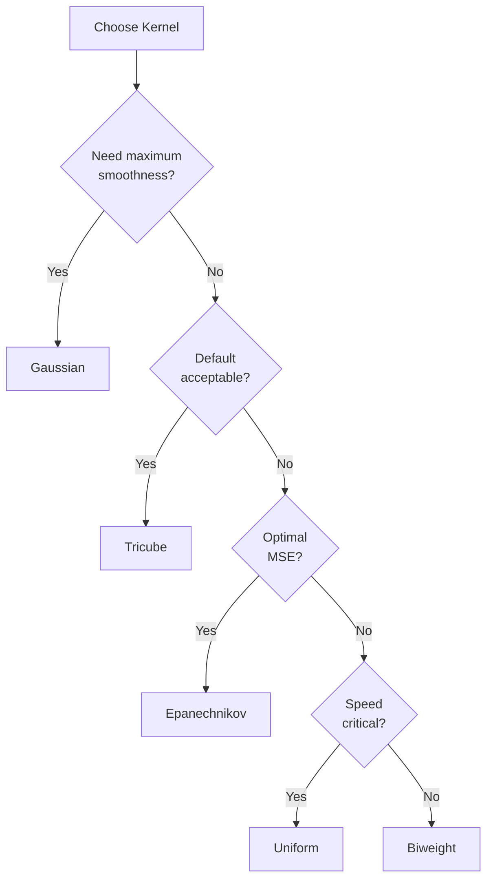

# Weight Functions

Kernel functions for distance weighting.

## Overview

Weight functions (kernels) determine how neighboring points contribute to each local fit. Points closer to the target receive higher weights.


---

## Available Kernels

| Kernel           | Efficiency | Smoothness  | Support   |
|------------------|:----------:|:-----------:|:---------:|
| **Tricube**      | 0.998      | Very smooth | Compact   |
| **Epanechnikov** | 1.000      | Smooth      | Compact   |
| **Gaussian**     | 0.961      | Infinite    | Unbounded |
| **Biweight**     | 0.995      | Very smooth | Compact   |
| **Cosine**       | 0.999      | Smooth      | Compact   |
| **Triangle**     | 0.989      | Moderate    | Compact   |
| **Uniform**      | 0.943      | None        | Compact   |

*Efficiency = AMISE relative to Epanechnikov (1.0 = optimal)*

---

## Tricube (Default)

Cleveland's original choice. Best all-around performance.

$$w(u) = (1 - |u|^3)^3$$

=== "Rust"
    ```rust
    let model = Lowess::new()
        .weight_function(Tricube)
        .adapter(Batch)
        .build()?;
    ```

=== "Python"
    ```python
    result = fl.smooth(x, y, weight_function="tricube")
    ```

=== "R"
    ```r
    result <- fastlowess(x, y, weight_function = "tricube")
    ```

**Use when**: Default choice for most applications.

---

## Epanechnikov

Theoretically optimal for kernel density estimation.

$$w(u) = \frac{3}{4}(1 - u^2)$$

=== "Rust"
    ```rust
    let model = Lowess::new()
        .weight_function(Epanechnikov)
        .adapter(Batch)
        .build()?;
    ```

=== "Python"
    ```python
    result = fl.smooth(x, y, weight_function="epanechnikov")
    ```

=== "R"
    ```r
    result <- fastlowess(x, y, weight_function = "epanechnikov")
    ```

**Use when**: Optimal MSE properties desired.

---

## Gaussian

Infinitely smooth. No boundary effects.

$$w(u) = \exp(-u^2/2)$$

=== "Rust"
    ```rust
    let model = Lowess::new()
        .weight_function(Gaussian)
        .adapter(Batch)
        .build()?;
    ```

=== "Python"
    ```python
    result = fl.smooth(x, y, weight_function="gaussian")
    ```

=== "R"
    ```r
    result <- fastlowess(x, y, weight_function = "gaussian")
    ```

**Use when**: Maximum smoothness needed, computational cost acceptable.

---

## Biweight

Good balance of efficiency and smoothness.

$$w(u) = (1 - u^2)^2$$

=== "Rust"
    ```rust
    let model = Lowess::new()
        .weight_function(Biweight)
        .adapter(Batch)
        .build()?;
    ```

=== "Python"
    ```python
    result = fl.smooth(x, y, weight_function="biweight")
    ```

=== "R"
    ```r
    result <- fastlowess(x, y, weight_function = "biweight")
    ```

**Use when**: Alternative to Tricube with slightly different properties.

---

## Cosine

Smooth and computationally efficient.

$$w(u) = \cos(\pi u / 2)$$

=== "Rust"
    ```rust
    let model = Lowess::new()
        .weight_function(Cosine)
        .adapter(Batch)
        .build()?;
    ```

=== "Python"
    ```python
    result = fl.smooth(x, y, weight_function="cosine")
    ```

=== "R"
    ```r
    result <- fastlowess(x, y, weight_function = "cosine")
    ```

**Use when**: Want smooth kernel with simple form.

---

## Triangle

Simple linear taper.

$$w(u) = 1 - |u|$$

=== "Rust"
    ```rust
    let model = Lowess::new()
        .weight_function(Triangle)
        .adapter(Batch)
        .build()?;
    ```

=== "Python"
    ```python
    result = fl.smooth(x, y, weight_function="triangle")
    ```

=== "R"
    ```r
    result <- fastlowess(x, y, weight_function = "triangle")
    ```

**Use when**: Simple, interpretable weights.

---

## Uniform

Equal weights within window. Fastest but least smooth.

$$w(u) = 1$$

=== "Rust"
    ```rust
    let model = Lowess::new()
        .weight_function(Uniform)
        .adapter(Batch)
        .build()?;
    ```

=== "Python"
    ```python
    result = fl.smooth(x, y, weight_function="uniform")
    ```

=== "R"
    ```r
    result <- fastlowess(x, y, weight_function = "uniform")
    ```

**Use when**: Speed is critical, smoothness less important.

---

## Choosing a Kernel



!!! tip "Recommendation"
    Stick with **Tricube** (default) unless you have specific requirements. The differences between kernels are usually small in practice.
