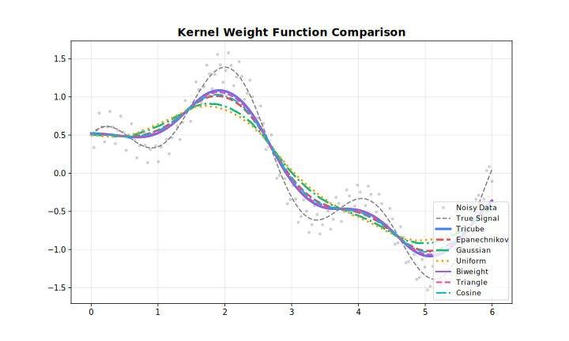
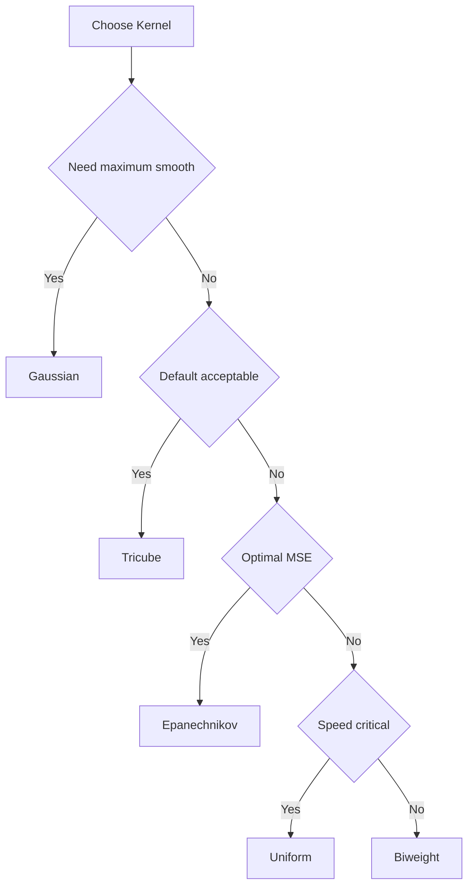

<!-- markdownlint-disable MD024 MD033 MD046 -->
# Weight Functions

Kernel functions for distance weighting.

## Overview

Weight functions (kernels) determine how neighboring points contribute to each local fit. Points closer to the target receive higher weights.



---

## Available Kernels

| Kernel | Efficiency | Smoothness | Support |
| --- | --- | --- | --- |
| **Tricube** | 0.998 | Very smooth | Compact |
| **Epanechnikov** | 1.000 | Smooth | Compact |
| **Gaussian** | 0.961 | Infinite | Unbounded |
| **Biweight** | 0.995 | Very smooth | Compact |
| **Cosine** | 0.999 | Smooth | Compact |
| **Triangle** | 0.989 | Moderate | Compact |
| **Uniform** | 0.943 | None | Compact |

**Efficiency** = AMISE relative to Epanechnikov (1.0 = optimal)

---

## Tricube (Default)

Cleveland's original choice. Best all-around performance.

$$w(u) = (1 - |u|^3)^3$$

**Use when**: Default choice for most applications.

=== "R"
    ```r
    library(rfastlowess)
    set.seed(42)
    x <- seq(0, 2 * pi, length.out = 100)
    y <- sin(x) + rnorm(100, sd = 0.3)

    model <- Lowess(weight_function = "tricube")
    result <- model$fit(x, y)
    ```

=== "Python"
    ```python
    import fastlowess as fl
    import numpy as np

    rng = np.random.default_rng(42)
    x = np.linspace(0, 2 * np.pi, 100)
    y = np.sin(x) + rng.normal(0, 0.3, 100)

    model = fl.Lowess(weight_function="tricube")
    result = model.fit(x, y)
    ```

=== "Rust"
    ```rust
    use fastLowess::prelude::*;
    use std::f64::consts::TAU;

    fn main() -> Result<(), LowessError> {
        let n = 100usize;
        let x: Vec<f64> = (0..n).map(|i| i as f64 * TAU / (n - 1) as f64).collect();
        let y: Vec<f64> = x.iter().map(|&xi| xi.sin() + 0.1).collect();

        let model = Lowess::new()
            .weight_function("tricube")
            .build()?;
        let result = model.fit(&x, &y)?;

        Ok(())
    }
    ```

=== "Julia"
    ```julia
    using FastLOWESS
    using Random, Statistics

    rng = MersenneTwister(42)
    x = collect(range(0, 2π, length=100))
    y = sin.(x) .+ randn(rng, 100) .* 0.3

    model = Lowess(; weight_function="tricube")
    result = fit(model, x, y)
    ```

=== "Node.js"
    ```javascript
    const { Lowess } = require('fastlowess');

    const n = 100;
    const x = Float64Array.from({ length: n }, (_, i) => i * 2 * Math.PI / (n - 1));
    const y = Float64Array.from(x, (xi, i) => Math.sin(xi) + (((i * 7 + 3) % 17) / 17 - 0.5) * 0.6);

    const model = new Lowess({ weight_function: "tricube" });
    const result = model.fit(x, y);
    ```

=== "WebAssembly"
    ```javascript
    import init, { Lowess } from 'fastlowess-wasm';
    await init();

    const n = 100;
    const x = Float64Array.from({ length: n }, (_, i) => i * 2 * Math.PI / (n - 1));
    const y = Float64Array.from(x, (xi, i) => Math.sin(xi) + (((i * 7 + 3) % 17) / 17 - 0.5) * 0.6);

    const model = new Lowess({ weight_function: "tricube" });
    const result = model.fit(x, y);
    ```

=== "C++"
    ```cpp
    #include <fastlowess.hpp>
    #include <cmath>
    #include <iostream>
    #include <vector>

    int main() {
        const int n = 100;
        std::vector<double> x(n), y(n);
        for (int i = 0; i < n; ++i) {
            x[i] = i * 2 * M_PI / (n - 1);
            y[i] = std::sin(x[i]) + 0.1;
        }

        fastlowess::Lowess model({ .weight_function = "tricube" });
        auto result = model.fit(x, y).value();

        return 0;
    }
    ```

---

## Epanechnikov

Theoretically optimal for kernel density estimation.

$$w(u) = \frac{3}{4}(1 - u^2)$$

**Use when**: Optimal MSE properties desired.

=== "R"
    ```r
    library(rfastlowess)
    set.seed(42)
    x <- seq(0, 2 * pi, length.out = 100)
    y <- sin(x) + rnorm(100, sd = 0.3)

    model <- Lowess(weight_function = "epanechnikov")
    result <- model$fit(x, y)
    ```

=== "Python"
    ```python
    import fastlowess as fl
    import numpy as np

    rng = np.random.default_rng(42)
    x = np.linspace(0, 2 * np.pi, 100)
    y = np.sin(x) + rng.normal(0, 0.3, 100)

    model = fl.Lowess(weight_function="epanechnikov")
    result = model.fit(x, y)
    ```

=== "Rust"
    ```rust
    use fastLowess::prelude::*;
    use std::f64::consts::TAU;

    fn main() -> Result<(), LowessError> {
        let n = 100usize;
        let x: Vec<f64> = (0..n).map(|i| i as f64 * TAU / (n - 1) as f64).collect();
        let y: Vec<f64> = x.iter().map(|&xi| xi.sin() + 0.1).collect();

        let model = Lowess::new()
            .weight_function("epanechnikov")
            .build()?;
        let result = model.fit(&x, &y)?;

        Ok(())
    }
    ```

=== "Julia"
    ```julia
    using FastLOWESS
    using Random, Statistics

    rng = MersenneTwister(42)
    x = collect(range(0, 2π, length=100))
    y = sin.(x) .+ randn(rng, 100) .* 0.3

    model = Lowess(; weight_function="epanechnikov")
    result = fit(model, x, y)
    ```

=== "Node.js"
    ```javascript
    const { Lowess } = require('fastlowess');

    const n = 100;
    const x = Float64Array.from({ length: n }, (_, i) => i * 2 * Math.PI / (n - 1));
    const y = Float64Array.from(x, (xi, i) => Math.sin(xi) + (((i * 7 + 3) % 17) / 17 - 0.5) * 0.6);

    const model = new Lowess({ weight_function: "epanechnikov" });
    const result = model.fit(x, y);
    ```

=== "WebAssembly"
    ```javascript
    import init, { Lowess } from 'fastlowess-wasm';
    await init();

    const n = 100;
    const x = Float64Array.from({ length: n }, (_, i) => i * 2 * Math.PI / (n - 1));
    const y = Float64Array.from(x, (xi, i) => Math.sin(xi) + (((i * 7 + 3) % 17) / 17 - 0.5) * 0.6);

    const model = new Lowess({ weight_function: "epanechnikov" });
    const result = model.fit(x, y);
    ```

=== "C++"
    ```cpp
    #include <fastlowess.hpp>
    #include <cmath>
    #include <iostream>
    #include <vector>

    int main() {
        const int n = 100;
        std::vector<double> x(n), y(n);
        for (int i = 0; i < n; ++i) {
            x[i] = i * 2 * M_PI / (n - 1);
            y[i] = std::sin(x[i]) + 0.1;
        }

        fastlowess::Lowess model({ .weight_function = "epanechnikov" });
        auto result = model.fit(x, y).value();

        return 0;
    }
    ```

---

## Gaussian

Infinitely smooth. No boundary effects.

$$w(u) = \exp(-u^2/2)$$

**Use when**: Maximum smoothness needed, computational cost acceptable.

=== "R"
    ```r
    library(rfastlowess)
    set.seed(42)
    x <- seq(0, 2 * pi, length.out = 100)
    y <- sin(x) + rnorm(100, sd = 0.3)

    model <- Lowess(weight_function = "gaussian")
    result <- model$fit(x, y)
    ```

=== "Python"
    ```python
    import fastlowess as fl
    import numpy as np

    rng = np.random.default_rng(42)
    x = np.linspace(0, 2 * np.pi, 100)
    y = np.sin(x) + rng.normal(0, 0.3, 100)

    model = fl.Lowess(weight_function="gaussian")
    result = model.fit(x, y)
    ```

=== "Rust"
    ```rust
    use fastLowess::prelude::*;
    use std::f64::consts::TAU;

    fn main() -> Result<(), LowessError> {
        let n = 100usize;
        let x: Vec<f64> = (0..n).map(|i| i as f64 * TAU / (n - 1) as f64).collect();
        let y: Vec<f64> = x.iter().map(|&xi| xi.sin() + 0.1).collect();

        let model = Lowess::new()
            .weight_function("gaussian")
            .build()?;
        let result = model.fit(&x, &y)?;

        Ok(())
    }
    ```

=== "Julia"
    ```julia
    using FastLOWESS
    using Random, Statistics

    rng = MersenneTwister(42)
    x = collect(range(0, 2π, length=100))
    y = sin.(x) .+ randn(rng, 100) .* 0.3

    model = Lowess(; weight_function="gaussian")
    result = fit(model, x, y)
    ```

=== "Node.js"
    ```javascript
    const { Lowess } = require('fastlowess');

    const n = 100;
    const x = Float64Array.from({ length: n }, (_, i) => i * 2 * Math.PI / (n - 1));
    const y = Float64Array.from(x, (xi, i) => Math.sin(xi) + (((i * 7 + 3) % 17) / 17 - 0.5) * 0.6);

    const model = new Lowess({ weight_function: "gaussian" });
    const result = model.fit(x, y);
    ```

=== "WebAssembly"
    ```javascript
    import init, { Lowess } from 'fastlowess-wasm';
    await init();

    const n = 100;
    const x = Float64Array.from({ length: n }, (_, i) => i * 2 * Math.PI / (n - 1));
    const y = Float64Array.from(x, (xi, i) => Math.sin(xi) + (((i * 7 + 3) % 17) / 17 - 0.5) * 0.6);

    const model = new Lowess({ weight_function: "gaussian" });
    const result = model.fit(x, y);
    ```

=== "C++"
    ```cpp
    #include <fastlowess.hpp>
    #include <cmath>
    #include <iostream>
    #include <vector>

    int main() {
        const int n = 100;
        std::vector<double> x(n), y(n);
        for (int i = 0; i < n; ++i) {
            x[i] = i * 2 * M_PI / (n - 1);
            y[i] = std::sin(x[i]) + 0.1;
        }

        fastlowess::Lowess model({ .weight_function = "gaussian" });
        auto result = model.fit(x, y).value();

        return 0;
    }
    ```

---

## Biweight

Good balance of efficiency and smoothness.

$$w(u) = (1 - u^2)^2$$

**Use when**: Alternative to Tricube with slightly different properties.

=== "R"
    ```r
    library(rfastlowess)
    set.seed(42)
    x <- seq(0, 2 * pi, length.out = 100)
    y <- sin(x) + rnorm(100, sd = 0.3)

    model <- Lowess(weight_function = "biweight")
    result <- model$fit(x, y)
    ```

=== "Python"
    ```python
    import fastlowess as fl
    import numpy as np

    rng = np.random.default_rng(42)
    x = np.linspace(0, 2 * np.pi, 100)
    y = np.sin(x) + rng.normal(0, 0.3, 100)

    model = fl.Lowess(weight_function="biweight")
    result = model.fit(x, y)
    ```

=== "Rust"
    ```rust
    use fastLowess::prelude::*;
    use std::f64::consts::TAU;

    fn main() -> Result<(), LowessError> {
        let n = 100usize;
        let x: Vec<f64> = (0..n).map(|i| i as f64 * TAU / (n - 1) as f64).collect();
        let y: Vec<f64> = x.iter().map(|&xi| xi.sin() + 0.1).collect();

        let model = Lowess::new()
            .weight_function("biweight")
            .build()?;
        let result = model.fit(&x, &y)?;

        Ok(())
    }
    ```

=== "Julia"
    ```julia
    using FastLOWESS
    using Random, Statistics

    rng = MersenneTwister(42)
    x = collect(range(0, 2π, length=100))
    y = sin.(x) .+ randn(rng, 100) .* 0.3

    model = Lowess(; weight_function="biweight")
    result = fit(model, x, y)
    ```

=== "Node.js"
    ```javascript
    const { Lowess } = require('fastlowess');

    const n = 100;
    const x = Float64Array.from({ length: n }, (_, i) => i * 2 * Math.PI / (n - 1));
    const y = Float64Array.from(x, (xi, i) => Math.sin(xi) + (((i * 7 + 3) % 17) / 17 - 0.5) * 0.6);

    const model = new Lowess({ weight_function: "biweight" });
    const result = model.fit(x, y);
    ```

=== "WebAssembly"
    ```javascript
    import init, { Lowess } from 'fastlowess-wasm';
    await init();

    const n = 100;
    const x = Float64Array.from({ length: n }, (_, i) => i * 2 * Math.PI / (n - 1));
    const y = Float64Array.from(x, (xi, i) => Math.sin(xi) + (((i * 7 + 3) % 17) / 17 - 0.5) * 0.6);

    const model = new Lowess({ weight_function: "biweight" });
    const result = model.fit(x, y);
    ```

=== "C++"
    ```cpp
    #include <fastlowess.hpp>
    #include <cmath>
    #include <iostream>
    #include <vector>

    int main() {
        const int n = 100;
        std::vector<double> x(n), y(n);
        for (int i = 0; i < n; ++i) {
            x[i] = i * 2 * M_PI / (n - 1);
            y[i] = std::sin(x[i]) + 0.1;
        }

        fastlowess::Lowess model({ .weight_function = "biweight" });
        auto result = model.fit(x, y).value();

        return 0;
    }
    ```

---

## Cosine

Smooth and computationally efficient.

$$w(u) = \cos(\pi u / 2)$$

**Use when**: Want smooth kernel with simple form.

=== "R"
    ```r
    library(rfastlowess)
    set.seed(42)
    x <- seq(0, 2 * pi, length.out = 100)
    y <- sin(x) + rnorm(100, sd = 0.3)

    model <- Lowess(weight_function = "cosine")
    result <- model$fit(x, y)
    ```

=== "Python"
    ```python
    import fastlowess as fl
    import numpy as np

    rng = np.random.default_rng(42)
    x = np.linspace(0, 2 * np.pi, 100)
    y = np.sin(x) + rng.normal(0, 0.3, 100)

    model = fl.Lowess(weight_function="cosine")
    result = model.fit(x, y)
    ```

=== "Rust"
    ```rust
    use fastLowess::prelude::*;
    use std::f64::consts::TAU;

    fn main() -> Result<(), LowessError> {
        let n = 100usize;
        let x: Vec<f64> = (0..n).map(|i| i as f64 * TAU / (n - 1) as f64).collect();
        let y: Vec<f64> = x.iter().map(|&xi| xi.sin() + 0.1).collect();

        let model = Lowess::new()
            .weight_function("cosine")
            .build()?;
        let result = model.fit(&x, &y)?;

        Ok(())
    }
    ```

=== "Julia"
    ```julia
    using FastLOWESS
    using Random, Statistics

    rng = MersenneTwister(42)
    x = collect(range(0, 2π, length=100))
    y = sin.(x) .+ randn(rng, 100) .* 0.3

    model = Lowess(; weight_function="cosine")
    result = fit(model, x, y)
    ```

=== "Node.js"
    ```javascript
    const { Lowess } = require('fastlowess');

    const n = 100;
    const x = Float64Array.from({ length: n }, (_, i) => i * 2 * Math.PI / (n - 1));
    const y = Float64Array.from(x, (xi, i) => Math.sin(xi) + (((i * 7 + 3) % 17) / 17 - 0.5) * 0.6);

    const model = new Lowess({ weight_function: "cosine" });
    const result = model.fit(x, y);
    ```

=== "WebAssembly"
    ```javascript
    import init, { Lowess } from 'fastlowess-wasm';
    await init();

    const n = 100;
    const x = Float64Array.from({ length: n }, (_, i) => i * 2 * Math.PI / (n - 1));
    const y = Float64Array.from(x, (xi, i) => Math.sin(xi) + (((i * 7 + 3) % 17) / 17 - 0.5) * 0.6);

    const model = new Lowess({ weight_function: "cosine" });
    const result = model.fit(x, y);
    ```

=== "C++"
    ```cpp
    #include <fastlowess.hpp>
    #include <cmath>
    #include <iostream>
    #include <vector>

    int main() {
        const int n = 100;
        std::vector<double> x(n), y(n);
        for (int i = 0; i < n; ++i) {
            x[i] = i * 2 * M_PI / (n - 1);
            y[i] = std::sin(x[i]) + 0.1;
        }

        fastlowess::Lowess model({ .weight_function = "cosine" });
        auto result = model.fit(x, y).value();

        return 0;
    }
    ```

---

## Triangle

Simple linear taper.

$$w(u) = 1 - |u|$$

**Use when**: Simple, interpretable weights.

=== "R"
    ```r
    library(rfastlowess)
    set.seed(42)
    x <- seq(0, 2 * pi, length.out = 100)
    y <- sin(x) + rnorm(100, sd = 0.3)

    model <- Lowess(weight_function = "triangle")
    result <- model$fit(x, y)
    ```

=== "Python"
    ```python
    import fastlowess as fl
    import numpy as np

    rng = np.random.default_rng(42)
    x = np.linspace(0, 2 * np.pi, 100)
    y = np.sin(x) + rng.normal(0, 0.3, 100)

    model = fl.Lowess(weight_function="triangle")
    result = model.fit(x, y)
    ```

=== "Rust"
    ```rust
    use fastLowess::prelude::*;
    use std::f64::consts::TAU;

    fn main() -> Result<(), LowessError> {
        let n = 100usize;
        let x: Vec<f64> = (0..n).map(|i| i as f64 * TAU / (n - 1) as f64).collect();
        let y: Vec<f64> = x.iter().map(|&xi| xi.sin() + 0.1).collect();

        let model = Lowess::new()
            .weight_function("triangle")
            .build()?;
        let result = model.fit(&x, &y)?;

        Ok(())
    }
    ```

=== "Julia"
    ```julia
    using FastLOWESS
    using Random, Statistics

    rng = MersenneTwister(42)
    x = collect(range(0, 2π, length=100))
    y = sin.(x) .+ randn(rng, 100) .* 0.3

    model = Lowess(; weight_function="triangle")
    result = fit(model, x, y)
    ```

=== "Node.js"
    ```javascript
    const { Lowess } = require('fastlowess');

    const n = 100;
    const x = Float64Array.from({ length: n }, (_, i) => i * 2 * Math.PI / (n - 1));
    const y = Float64Array.from(x, (xi, i) => Math.sin(xi) + (((i * 7 + 3) % 17) / 17 - 0.5) * 0.6);

    const model = new Lowess({ weight_function: "triangle" });
    const result = model.fit(x, y);
    ```

=== "WebAssembly"
    ```javascript
    import init, { Lowess } from 'fastlowess-wasm';
    await init();

    const n = 100;
    const x = Float64Array.from({ length: n }, (_, i) => i * 2 * Math.PI / (n - 1));
    const y = Float64Array.from(x, (xi, i) => Math.sin(xi) + (((i * 7 + 3) % 17) / 17 - 0.5) * 0.6);

    const model = new Lowess({ weight_function: "triangle" });
    const result = model.fit(x, y);
    ```

=== "C++"
    ```cpp
    #include <fastlowess.hpp>
    #include <cmath>
    #include <iostream>
    #include <vector>

    int main() {
        const int n = 100;
        std::vector<double> x(n), y(n);
        for (int i = 0; i < n; ++i) {
            x[i] = i * 2 * M_PI / (n - 1);
            y[i] = std::sin(x[i]) + 0.1;
        }

        fastlowess::Lowess model({ .weight_function = "triangle" });
        auto result = model.fit(x, y).value();

        return 0;
    }
    ```

---

## Uniform

Equal weights within window. Fastest but least smooth.

$$w(u) = 1$$

**Use when**: Speed is critical, smoothness less important.

=== "R"
    ```r
    library(rfastlowess)
    set.seed(42)
    x <- seq(0, 2 * pi, length.out = 100)
    y <- sin(x) + rnorm(100, sd = 0.3)

    model <- Lowess(weight_function = "uniform")
    result <- model$fit(x, y)
    ```

=== "Python"
    ```python
    import fastlowess as fl
    import numpy as np

    rng = np.random.default_rng(42)
    x = np.linspace(0, 2 * np.pi, 100)
    y = np.sin(x) + rng.normal(0, 0.3, 100)

    model = fl.Lowess(weight_function="uniform")
    result = model.fit(x, y)
    ```

=== "Rust"
    ```rust
    use fastLowess::prelude::*;
    use std::f64::consts::TAU;

    fn main() -> Result<(), LowessError> {
        let n = 100usize;
        let x: Vec<f64> = (0..n).map(|i| i as f64 * TAU / (n - 1) as f64).collect();
        let y: Vec<f64> = x.iter().map(|&xi| xi.sin() + 0.1).collect();

        let model = Lowess::new()
            .weight_function("uniform")
            .build()?;
        let result = model.fit(&x, &y)?;

        Ok(())
    }
    ```

=== "Julia"
    ```julia
    using FastLOWESS
    using Random, Statistics

    rng = MersenneTwister(42)
    x = collect(range(0, 2π, length=100))
    y = sin.(x) .+ randn(rng, 100) .* 0.3

    model = Lowess(; weight_function="uniform")
    result = fit(model, x, y)
    ```

=== "Node.js"
    ```javascript
    const { Lowess } = require('fastlowess');

    const n = 100;
    const x = Float64Array.from({ length: n }, (_, i) => i * 2 * Math.PI / (n - 1));
    const y = Float64Array.from(x, (xi, i) => Math.sin(xi) + (((i * 7 + 3) % 17) / 17 - 0.5) * 0.6);

    const model = new Lowess({ weight_function: "uniform" });
    const result = model.fit(x, y);
    ```

=== "WebAssembly"
    ```javascript
    import init, { Lowess } from 'fastlowess-wasm';
    await init();

    const n = 100;
    const x = Float64Array.from({ length: n }, (_, i) => i * 2 * Math.PI / (n - 1));
    const y = Float64Array.from(x, (xi, i) => Math.sin(xi) + (((i * 7 + 3) % 17) / 17 - 0.5) * 0.6);

    const model = new Lowess({ weight_function: "uniform" });
    const result = model.fit(x, y);
    ```

=== "C++"
    ```cpp
    #include <fastlowess.hpp>
    #include <cmath>
    #include <iostream>
    #include <vector>

    int main() {
        const int n = 100;
        std::vector<double> x(n), y(n);
        for (int i = 0; i < n; ++i) {
            x[i] = i * 2 * M_PI / (n - 1);
            y[i] = std::sin(x[i]) + 0.1;
        }

        fastlowess::Lowess model({ .weight_function = "uniform" });
        auto result = model.fit(x, y).value();

        return 0;
    }
    ```

---

## Choosing a Kernel


```mermaid
flowchart TD
    A[Choose Kernel] --> B{Need maximum smooth}
    B -- Yes --> C[Gaussian]
    B -- No --> D{Default acceptable}
    D -- Yes --> E[Tricube]
    D -- No --> F{Optimal MSE}
    F -- Yes --> G[Epanechnikov]
    F -- No --> H{Speed critical}
    H -- Yes --> I[Uniform]
    H -- No --> J[Biweight]
```

!!! tip "Recommendation"
    Stick with **Tricube** (default) unless you have specific requirements. The differences between kernels are usually small in practice.
