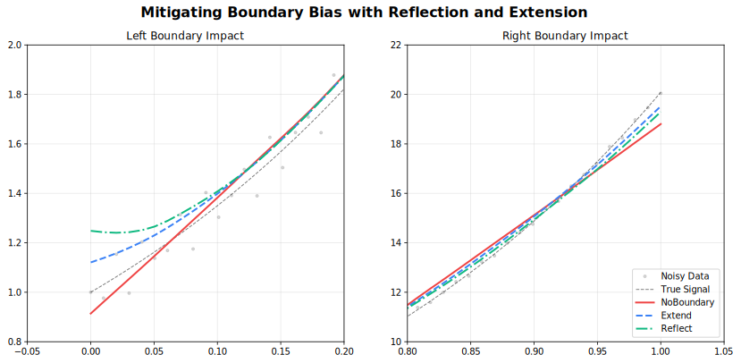

<!-- markdownlint-disable MD024 -->
# Parameters

Complete reference for all LOWESS configuration options.

## Quick Reference

=== "R"

    | Parameter                     | Default            | Range/Options | Description             | Adapter          |
    |-------------------------------|--------------------|---------------|-------------------------|------------------|
    | **fraction**                  | 0.67               | (0, 1]        | Smoothing span          | All              |
    | **iterations**                | 3                  | [0, 1000]     | Robustness iterations   | All              |
    | **delta**                     | NULL (auto)        | [0, ∞)        | Interpolation threshold | All              |
    | **weight_function**           | `"tricube"`        | 7 options     | Distance kernel         | All              |
    | **robustness_method**         | `"bisquare"`       | 3 options     | Outlier weighting       | All              |
    | **zero_weight_fallback**      | `"use_local_mean"` | 3 options     | Zero-weight behavior    | All              |
    | **boundary_policy**           | `"extend"`         | 4 options     | Edge handling           | All              |
    | **scaling_method**            | `"mad"`            | 2 options     | Scale estimation        | All              |
    | **auto_converge**             | NULL               | tolerance     | Early stopping          | All              |
    | **return_residuals**          | FALSE              | logical       | Include residuals       | All              |
    | **return_robustness_weights** | FALSE              | logical       | Include weights         | All              |
    | **return_diagnostics**        | FALSE              | logical       | Include metrics         | Batch, Streaming |
    | **confidence_intervals**      | NULL               | (0, 1)        | CI level                | Batch            |
    | **prediction_intervals**      | NULL               | (0, 1)        | PI level                | Batch            |
    | **cv_method**                 | NULL               | method        | Auto-select fraction    | Batch            |
    | **chunk_size**                | 5000               | [10, ∞)       | Points per chunk        | Streaming        |
    | **overlap**                   | 500                | [0, chunk)    | Overlap between chunks  | Streaming        |
    | **merge_strategy**            | `"average"`        | 4 options     | Merge overlaps          | Streaming        |
    | **window_capacity**           | 1000               | [3, ∞)        | Max window size         | Online           |
    | **min_points**                | 2                  | [2, window]   | Min before output       | Online           |
    | **update_mode**               | `"incremental"`    | 2 options     | Update strategy         | Online           |

=== "Python"

    | Parameter                     | Default            | Range/Options | Description             | Adapter          |
    |-------------------------------|--------------------|---------------|-------------------------|------------------|
    | **fraction**                  | 0.67               | (0, 1]        | Smoothing span          | All              |
    | **iterations**                | 3                  | [0, 1000]     | Robustness iterations   | All              |
    | **delta**                     | None (auto)        | [0, ∞)        | Interpolation threshold | All              |
    | **weight_function**           | `"tricube"`        | 7 options     | Distance kernel         | All              |
    | **robustness_method**         | `"bisquare"`       | 3 options     | Outlier weighting       | All              |
    | **zero_weight_fallback**      | `"use_local_mean"` | 3 options     | Zero-weight behavior    | All              |
    | **boundary_policy**           | `"extend"`         | 4 options     | Edge handling           | All              |
    | **scaling_method**            | `"mad"`            | 2 options     | Scale estimation        | All              |
    | **auto_converge**             | None               | tolerance     | Early stopping          | All              |
    | **return_residuals**          | False              | bool          | Include residuals       | All              |
    | **return_robustness_weights** | False              | bool          | Include weights         | All              |
    | **return_diagnostics**        | False              | bool          | Include metrics         | Batch, Streaming |
    | **confidence_intervals**      | None               | (0, 1)        | CI level                | Batch            |
    | **prediction_intervals**      | None               | (0, 1)        | PI level                | Batch            |
    | **cv_method**                 | None               | method        | Auto-select fraction    | Batch            |
    | **chunk_size**                | 5000               | [10, ∞)       | Points per chunk        | Streaming        |
    | **overlap**                   | 500                | [0, chunk)    | Overlap between chunks  | Streaming        |
    | **merge_strategy**            | `"average"`        | 4 options     | Merge overlaps          | Streaming        |
    | **window_capacity**           | 1000               | [3, ∞)        | Max window size         | Online           |
    | **min_points**                | 2                  | [2, window]   | Min before output       | Online           |
    | **update_mode**               | `"incremental"`    | 2 options     | Update strategy         | Online           |

=== "Rust"

    | Parameter                     | Default        | Range/Options | Description             | Adapter          |
    |-------------------------------|----------------|---------------|-------------------------|------------------|
    | **fraction**                  | 0.67           | (0, 1]        | Smoothing span          | All              |
    | **iterations**                | 3              | [0, 1000]     | Robustness iterations   | All              |
    | **delta**                     | auto           | [0, ∞)        | Interpolation threshold | All              |
    | **weight_function**           | `Tricube`      | 7 options     | Distance kernel         | All              |
    | **robustness_method**         | `Bisquare`     | 3 options     | Outlier weighting       | All              |
    | **zero_weight_fallback**      | `UseLocalMean` | 3 options     | Zero-weight behavior    | All              |
    | **boundary_policy**           | `Extend`       | 4 options     | Edge handling           | All              |
    | **scaling_method**            | `MAD`          | 2 options     | Scale estimation        | All              |
    | **auto_converge**             | None           | tolerance     | Early stopping          | All              |
    | **return_residuals**          | false          | bool          | Include residuals       | All              |
    | **return_robustness_weights** | false          | bool          | Include weights         | All              |
    | **return_diagnostics**        | false          | bool          | Include metrics         | Batch, Streaming |
    | **confidence_intervals**      | None           | (0, 1)        | CI level                | Batch            |
    | **prediction_intervals**      | None           | (0, 1)        | PI level                | Batch            |
    | **cross_validate**            | None           | method        | Auto-select fraction    | Batch            |
    | **chunk_size**                | 5000           | [10, ∞)       | Points per chunk        | Streaming        |
    | **overlap**                   | 500            | [0, chunk)    | Overlap between chunks  | Streaming        |
    | **merge_strategy**            | `Average`      | 4 options     | Merge overlaps          | Streaming        |
    | **window_capacity**           | 1000           | [3, ∞)        | Max window size         | Online           |
    | **min_points**                | 2                  | [2, window]   | Min before output       | Online           |
    | **update_mode**               | `Incremental`  | 2 options     | Update strategy         | Online           |

=== "Julia"

    | Parameter                     | Default           | Range/Options | Description             | Adapter          |
    |-------------------------------|-------------------|---------------|-------------------------|------------------|
    | **fraction**                  | 0.67              | (0, 1]        | Smoothing span          | All              |
    | **iterations**                | 3                 | [0, 1000]     | Robustness iterations   | All              |
    | **delta**                     | `nothing` (auto)  | [0, ∞)        | Interpolation threshold | All              |
    | **weight_function**           | `"tricube"`       | 7 options     | Distance kernel         | All              |
    | **robustness_method**         | `"bisquare"`      | 3 options     | Outlier weighting       | All              |
    | **zero_weight_fallback**      | `"use_local_mean"`| 3 options     | Zero-weight behavior    | All              |
    | **boundary_policy**           | `"extend"`        | 4 options     | Edge handling           | All              |
    | **scaling_method**            | `"mad"`           | 2 options     | Scale estimation        | All              |
    | **auto_converge**             | `nothing`         | tolerance     | Early stopping          | All              |
    | **return_residuals**          | `false`           | bool          | Include residuals       | All              |
    | **return_robustness_weights** | `false`           | bool          | Include weights         | All              |
    | **return_diagnostics**        | `false`           | bool          | Include metrics         | Batch, Streaming |
    | **confidence_intervals**      | `nothing`         | (0, 1)        | CI level                | Batch            |
    | **prediction_intervals**      | `nothing`         | (0, 1)        | PI level                | Batch            |
    | **cv_method**                 | `nothing`         | method        | Auto-select fraction    | Batch            |
    | **chunk_size**                | 5000              | [10, ∞)       | Points per chunk        | Streaming        |
    | **overlap**                   | 500               | [0, chunk)    | Overlap between chunks  | Streaming        |
    | **merge_strategy**            | `"average"`       | 4 options     | Merge overlaps          | Streaming        |
    | **window_capacity**           | 1000              | [3, ∞)        | Max window size         | Online           |
    | **min_points**                | 2                 | [2, window]   | Min before output       | Online           |
    | **update_mode**               | `"incremental"`   | 2 options     | Update strategy         | Online           |

=== "Node.js"

    | Parameter                 | Default | Range/Options | Description             | Adapter          |
    |---------------------------|---------|---------------|-------------------------|------------------|
    | **fraction**              | 0.67    | (0, 1]        | Smoothing span          | All              |
    | **iterations**            | 3       | [0, 1000]     | Robustness iterations   | All              |
    | **delta**                 | auto    | [0, ∞)        | Interpolation threshold | All              |
    | **weightFunction**        | `"tricube"`| 7 options  | Distance kernel         | All              |
    | **robustnessMethod**      | `"bisquare"`| 3 options | Outlier weighting       | All              |
    | **zeroWeightFallback**    | `"use_local_mean"`| 3 options| Zero-weight behavior| All              |
    | **boundaryPolicy**        | `"extend"`| 4 options   | Edge handling           | All              |
    | **scalingMethod**         | `"mad"` | 2 options     | Scale estimation        | All              |
    | **autoConverge**          | null    | tolerance     | Early stopping          | All              |
    | **returnResiduals**       | false   | bool          | Include residuals       | All              |
    | **returnRobustnessWeights**| false  | bool          | Include weights         | All              |
    | **returnDiagnostics**     | false   | bool          | Include metrics         | Batch, Streaming |
    | **confidenceIntervals**   | null    | (0, 1)        | CI level                | Batch            |
    | **predictionIntervals**   | null    | (0, 1)        | PI level                | Batch            |
    | **chunkSize**             | 5000    | [10, ∞)       | Points per chunk        | Streaming        |
    | **overlap**               | 500     | [0, chunk)    | Overlap between chunks  | Streaming        |
    | **mergeStrategy**         | `"average"`| 4 options  | Merge overlaps          | Streaming        |
    | **windowCapacity**        | 1000    | [3, ∞)        | Max window size         | Online           |
    | **minPoints**             | 2       | [2, window]   | Min before output       | Online           |
    | **updateMode**            | `"incremental"`| 2 options | Update strategy      | Online           |

=== "WebAssembly"

    | Parameter                 | Default | Range/Options | Description             | Adapter          |
    |---------------------------|---------|---------------|-------------------------|------------------|
    | **fraction**              | 0.67    | (0, 1]        | Smoothing span          | All              |
    | **iterations**            | 3       | [0, 1000]     | Robustness iterations   | All              |
    | **delta**                 | auto    | [0, ∞)        | Interpolation threshold | All              |
    | **weightFunction**        | `"tricube"`| 7 options  | Distance kernel         | All              |
    | **robustnessMethod**      | `"bisquare"`| 3 options | Outlier weighting       | All              |
    | **zeroWeightFallback**    | `"use_local_mean"`| 3 options| Zero-weight behavior| All              |
    | **boundaryPolicy**        | `"extend"`| 4 options   | Edge handling           | All              |
    | **scalingMethod**         | `"mad"` | 2 options     | Scale estimation        | All              |
    | **autoConverge**          | null    | tolerance     | Early stopping          | All              |
    | **returnResiduals**       | false   | bool          | Include residuals       | All              |
    | **returnRobustnessWeights**| false  | bool          | Include weights         | All              |
    | **returnDiagnostics**     | false   | bool          | Include metrics         | Batch, Streaming |
    | **confidenceIntervals**   | null    | (0, 1)        | CI level                | Batch            |
    | **predictionIntervals**   | null    | (0, 1)        | PI level                | Batch            |
    | **chunkSize**             | 5000    | [10, ∞)       | Points per chunk        | Streaming        |
    | **overlap**               | 500     | [0, chunk)    | Overlap between chunks  | Streaming        |
    | **mergeStrategy**         | `"average"`| 4 options  | Merge overlaps          | Streaming        |
    | **windowCapacity**        | 1000    | [3, ∞)        | Max window size         | Online           |
    | **minPoints**             | 2       | [2, window]   | Min before output       | Online           |
    | **updateMode**            | `"incremental"`| 2 options | Update strategy      | Online           |

=== "C++"

    | Parameter                   | Default            | Range/Options | Description             | Adapter          |
    |-----------------------------|--------------------|---------------|-------------------------|------------------|
    | **fraction**                | 0.67               | (0, 1]        | Smoothing span          | All              |
    | **iterations**              | 3                  | [0, 1000]     | Robustness iterations   | All              |
    | **delta**                   | NAN (auto)         | [0, ∞)        | Interpolation threshold | All              |
    | **weight_function**         | `"tricube"`        | 7 options     | Distance kernel         | All              |
    | **robustness_method**       | `"bisquare"`       | 3 options     | Outlier weighting       | All              |
    | **zero_weight_fallback**    | `"use_local_mean"` | 3 options     | Zero-weight behavior    | All              |
    | **boundary_policy**         | `"extend"`         | 4 options     | Edge handling           | All              |
    | **scaling_method**          | `"mad"`            | 2 options     | Scale estimation        | All              |
    | **auto_converge**           | NAN                | tolerance     | Early stopping          | All              |
    | **return_residuals**        | false              | bool          | Include residuals       | All              |
    | **return_robustness_weights**| false             | bool          | Include weights         | All              |
    | **return_diagnostics**      | false              | bool          | Include metrics         | Batch, Streaming |
    | **confidence_intervals**    | NAN                | (0, 1)        | CI level                | Batch            |
    | **prediction_intervals**    | NAN                | (0, 1)        | PI level                | Batch            |
    | **chunk_size**              | 5000               | [10, ∞)       | Points per chunk        | Streaming        |
    | **overlap**                 | -1 (auto)          | [0, chunk)    | Overlap between chunks  | Streaming        |
    | **window_capacity**         | 1000               | [3, ∞)        | Max window size         | Online           |
    | **min_points**              | 2                  | [2, window]   | Min before output       | Online           |
    | **update_mode**             | `"full"`           | 2 options     | Update strategy         | Online           |

---

## Parameter Options Summary

=== "R / Python / Julia"

    | Parameter                | Available Options                                                                            |
    |--------------------------|----------------------------------------------------------------------------------------------|
    | **weight_function**      | `"tricube"`, `"epanechnikov"`, `"gaussian"`, `"biweight"`, `"cosine"`, `"triangle"`, `"uniform"` |
    | **robustness_method**    | `"bisquare"`, `"huber"`, `"talwar"`                                                          |
    | **zero_weight_fallback** | `"use_local_mean"`, `"return_original"`, `"return_none"`                                     |
    | **boundary_policy**      | `"extend"`, `"reflect"`, `"zero"`, `"no_boundary"`                                           |
    | **scaling_method**       | `"mad"`, `"mar"`                                                                             |
    | **merge_strategy**       | `"average"`, `"left"`, `"right"`, `"weighted"`                                               |
    | **update_mode**          | `"incremental"`, `"full"`                                                                    |

=== "Rust"

    | Parameter                | Available Options                                                                  |
    |--------------------------|------------------------------------------------------------------------------------|
    | **weight_function**      | `Tricube`, `Epanechnikov`, `Gaussian`, `Biweight`, `Cosine`, `Triangle`, `Uniform` |
    | **robustness_method**    | `Bisquare`, `Huber`, `Talwar`                                                      |
    | **zero_weight_fallback** | `UseLocalMean`, `ReturnOriginal`, `ReturnNone`                                     |
    | **boundary_policy**      | `Extend`, `Reflect`, `Zero`, `NoBoundary`                                          |
    | **scaling_method**       | `MAD`, `MAR`                                                                       |
    | **merge_strategy**       | `Average`, `Left`, `Right`, `Weighted`                                             |
    | **update_mode**          | `Incremental`, `Full`                                                              |

=== "Node.js / WebAssembly"

    | Parameter                | Available Options                                                                            |
    |--------------------------|----------------------------------------------------------------------------------------------|
    | **weightFunction**       | `"tricube"`, `"epanechnikov"`, `"gaussian"`, `"biweight"`, `"cosine"`, `"triangle"`, `"uniform"` |
    | **robustnessMethod**     | `"bisquare"`, `"huber"`, `"talwar"`                                                          |
    | **zeroWeightFallback**   | `"use_local_mean"`, `"return_original"`, `"return_none"`                                     |
    | **boundaryPolicy**       | `"extend"`, `"reflect"`, `"zero"`, `"no_boundary"`                                           |
    | **scalingMethod**        | `"mad"`, `"mar"`                                                                             |
    | **mergeStrategy**        | `"average"`, `"left"`, `"right"`, `"weighted"`                                               |
    | **updateMode**           | `"incremental"`, `"full"`                                                                    |

=== "C++"

    | Parameter                  | Available Options                                                                            |
    |----------------------------|----------------------------------------------------------------------------------------------|
    | **weight_function**        | `"tricube"`, `"epanechnikov"`, `"gaussian"`, `"biweight"`, `"cosine"`, `"triangle"`, `"uniform"` |
    | **robustness_method**      | `"bisquare"`, `"huber"`, `"talwar"`                                                          |
    | **zero_weight_fallback**   | `"use_local_mean"`, `"return_original"`, `"return_none"`                                     |
    | **boundary_policy**        | `"extend"`, `"reflect"`, `"zero"`, `"no_boundary"`                                           |
    | **scaling_method**         | `"mad"`, `"mar"`                                                                             |
    | **merge_strategy**         | `"average"`, `"left"`, `"right"`, `"weighted"`                                               |
    | **update_mode**            | `"incremental"`, `"full"`                                                                    |

---

## Core Parameters

### fraction

The proportion of data used for each local fit. **Most important parameter.**

| Value   | Effect          | Use Case                 |
|---------|-----------------|--------------------------|
| 0.1–0.3 | Fine detail     | Rapidly changing signals |
| 0.3–0.5 | Balanced        | General purpose          |
| 0.5–0.7 | Heavy smoothing | Noisy data               |
| 0.7–1.0 | Very smooth     | Trend extraction         |

=== "R"
    ```r
    result <- fastlowess(x, y, fraction = 0.3)
    ```

=== "Python"
    ```python
    result = fl.smooth(x, y, fraction=0.3)
    ```

=== "Rust"
    ```rust
    let model = Lowess::new()
        .fraction(0.3)
        .adapter(Batch)
        .build()?;
    ```

=== "Julia"
    ```julia
    result = smooth(x, y, fraction=0.3)
    ```

=== "Node.js"
    ```javascript
    const result = smooth(x, y, { fraction: 0.3 });
    ```

=== "WebAssembly"
    ```javascript
    const result = smooth(x, y, { fraction: 0.3 });
    ```

=== "C++"
    ```cpp
    auto result = fastlowess::smooth(x, y, { .fraction = 0.3 });
    ```

---

### iterations

Number of robustness iterations for outlier resistance.

| Value | Effect        | Performance       |
|-------|---------------|-------------------|
| 0     | No robustness | Fastest           |
| 1–3   | Moderate      | Recommended       |
| 4–6   | Strong        | Contaminated data |
| 7+    | Very strong   | Heavy outliers    |

=== "R"
    ```r
    result <- fastlowess(x, y, iterations = 5)
    ```

=== "Python"
    ```python
    result = fl.smooth(x, y, iterations=5)
    ```

=== "Rust"
    ```rust
    let model = Lowess::new()
        .iterations(5)
        .adapter(Batch)
        .build()?;
    ```

=== "Julia"
    ```julia
    result = smooth(x, y, iterations=5)
    ```

=== "Node.js"
    ```javascript
    const result = smooth(x, y, { iterations: 5 });
    ```

=== "WebAssembly"
    ```javascript
    const result = smooth(x, y, { iterations: 5 });
    ```

=== "C++"
    ```cpp
    auto result = fastlowess::smooth(x, y, { .iterations = 5 });
    ```

---

### delta

Interpolation optimization threshold. Points within `delta` distance reuse the previous fit.

- **Default**: 1% of x-range (Batch), 0.0 (Streaming/Online)
- **Effect**: Higher values = faster but less accurate

=== "R"
    ```r
    result <- fastlowess(x, y, delta = 0.05)
    ```

=== "Python"
    ```python
    result = fl.smooth(x, y, delta=0.05)
    ```

=== "Rust"
    ```rust
    let model = Lowess::new()
        .delta(0.05)
        .adapter(Batch)
        .build()?;
    ```

=== "Julia"
    ```julia
    result = smooth(x, y, delta=0.05)
    ```

=== "Node.js"
    ```javascript
    const result = smooth(x, y, { delta: 0.05 });
    ```

=== "WebAssembly"
    ```javascript
    const result = smooth(x, y, { delta: 0.05 });
    ```

=== "C++"
    ```cpp
    auto result = fastlowess::smooth(x, y, { .delta = 0.05 });
    ```

---

### weight_function

Distance weighting kernel for local fits.

=== "R / Python / Julia / Node.js / WebAssembly / C++"

    | Kernel           | Efficiency | Smoothness  |
    |------------------|:----------:|:-----------:|
    | `"tricube"`      | 0.998      | Very smooth |
    | `"epanechnikov"` | 1.000      | Smooth      |
    | `"gaussian"`     | 0.961      | Infinite    |
    | `"biweight"`     | 0.995      | Very smooth |
    | `"cosine"`       | 0.999      | Smooth      |
    | `"triangle"`     | 0.989      | Moderate    |
    | `"uniform"`      | 0.943      | None        |

=== "Rust"

    | Kernel         | Efficiency | Smoothness  |
    |----------------|:----------:|:-----------:|
    | `Tricube`      | 0.998      | Very smooth |
    | `Epanechnikov` | 1.000      | Smooth      |
    | `Gaussian`     | 0.961      | Infinite    |
    | `Biweight`     | 0.995      | Very smooth |
    | `Cosine`       | 0.999      | Smooth      |
    | `Triangle`     | 0.989      | Moderate    |
    | `Uniform`      | 0.943      | None        |

See [Weight Functions](kernels.md) for detailed comparison.

=== "R"
    ```r
    result <- fastlowess(x, y, weight_function = "epanechnikov")
    ```

=== "Python"
    ```python
    result = fl.smooth(x, y, weight_function="epanechnikov")
    ```

=== "Rust"
    ```rust
    let model = Lowess::new()
        .weight_function(Epanechnikov)
        .adapter(Batch)
        .build()?;
    ```

=== "Julia"
    ```julia
    result = smooth(x, y, weight_function="epanechnikov")
    ```

=== "Node.js"
    ```javascript
    const result = smooth(x, y, { weightFunction: "epanechnikov" });
    ```

=== "WebAssembly"
    ```javascript
    const result = smooth(x, y, { weightFunction: "epanechnikov" });
    ```

=== "C++"
    ```cpp
    auto result = fastlowess::smooth(x, y, { .weight_function = "epanechnikov" });
    ```

---

### robustness_method

Method for downweighting outliers during iterative refinement.

=== "R / Python / Julia / Node.js / WebAssembly / C++"

    | Method       | Behavior                | Use Case              |
    |--------------|-------------------------|-----------------------|
    | `"bisquare"` | Smooth downweighting    | General-purpose       |
    | `"huber"`    | Linear beyond threshold | Moderate outliers     |
    | `"talwar"`   | Hard threshold (0 or 1) | Extreme contamination |

=== "Rust"

    | Method     | Behavior                | Use Case              |
    |------------|-------------------------|-----------------------|
    | `Bisquare` | Smooth downweighting    | General-purpose       |
    | `Huber`    | Linear beyond threshold | Moderate outliers     |
    | `Talwar`   | Hard threshold (0 or 1) | Extreme contamination |

See [Robustness](robustness.md) for detailed comparison.

=== "R"
    ```r
    result <- fastlowess(x, y, robustness_method = "talwar")
    ```

=== "Python"
    ```python
    result = fl.smooth(x, y, robustness_method="talwar")
    ```

=== "Rust"
    ```rust
    let model = Lowess::new()
        .robustness_method(Talwar)
        .adapter(Batch)
        .build()?;
    ```

=== "Julia"
    ```julia
    result = smooth(x, y, robustness_method="talwar")
    ```

=== "Node.js"
    ```javascript
    const result = smooth(x, y, { robustnessMethod: "talwar" });
    ```

=== "WebAssembly"
    ```javascript
    const result = smooth(x, y, { robustnessMethod: "talwar" });
    ```

=== "C++"
    ```cpp
    auto result = fastlowess::smooth(x, y, { .robustness_method = "talwar" });
    ```

---

### boundary_policy

Edge handling strategy to reduce boundary bias.



=== "R / Python / Julia / Node.js / WebAssembly / C++"

    | Policy          | Behavior                   | Use Case                    |
    |-----------------|----------------------------|-----------------------------|
    | `"extend"`      | Pad with first/last values | Most cases (default)        |
    | `"reflect"`     | Mirror data at boundaries  | Periodic/symmetric data     |
    | `"zero"`        | Pad with zeros             | Data approaches zero        |
    | `"no_boundary"` | No padding                 | Original Cleveland behavior |

=== "Rust"

    | Policy       | Behavior                   | Use Case                    |
    |--------------|----------------------------|-----------------------------|
    | `Extend`     | Pad with first/last values | Most cases (default)        |
    | `Reflect`    | Mirror data at boundaries  | Periodic/symmetric data     |
    | `Zero`       | Pad with zeros             | Data approaches zero        |
    | `NoBoundary` | No padding                 | Original Cleveland behavior |

For example:

=== "R"
    ```r
    result <- fastlowess(x, y, boundary_policy = "reflect")
    ```

=== "Python"
    ```python
    result = fl.smooth(x, y, boundary_policy="reflect")
    ```

=== "Rust"
    ```rust
    let model = Lowess::new()
        .boundary_policy(Reflect)
        .adapter(Batch)
        .build()?;
    ```

=== "Julia"
    ```julia
    result = smooth(x, y, boundary_policy="reflect")
    ```

=== "Node.js"
    ```javascript
    const result = smooth(x, y, { boundaryPolicy: "reflect" });
    ```

=== "WebAssembly"
    ```javascript
    const result = smooth(x, y, { boundaryPolicy: "reflect" });
    ```

=== "C++"
    ```cpp
    auto result = fastlowess::smooth(x, y, { .boundary_policy = "reflect" });
    ```

---

### scaling_method

Method for estimating residual scale during robustness iterations.

=== "R / Python / Julia / Node.js / WebAssembly / C++"

    | Method  | Description               | Robustness          |
    |---------|---------------------------|---------------------|
    | `"mad"` | Median Absolute Deviation | Very robust         |
    | `"mar"` | Mean Absolute Residual    | Less robust, faster |

=== "Rust"

    | Method | Description               | Robustness          |
    |--------|---------------------------|---------------------|
    | `MAD`  | Median Absolute Deviation | Very robust         |
    | `MAR`  | Mean Absolute Residual    | Less robust, faster |

For example:

=== "R"
    ```r
    result <- fastlowess(x, y, scaling_method = "mad")
    ```

=== "Python"
    ```python
    result = fl.smooth(x, y, scaling_method="mad")
    ```

=== "Rust"
    ```rust
    let model = Lowess::new()
        .scaling_method(MAD)
        .adapter(Batch)
        .build()?;
    ```

=== "Julia"
    ```julia
    result = smooth(x, y, scaling_method="mad")
    ```

=== "Node.js"
    ```javascript
    const result = smooth(x, y, { scalingMethod: "mad" });
    ```

=== "WebAssembly"
    ```javascript
    const result = smooth(x, y, { scalingMethod: "mad" });
    ```

=== "C++"
    ```cpp
    auto result = fastlowess::smooth(x, y, { .scaling_method = "mad" });
    ```

---

### zero_weight_fallback

Behavior when all neighborhood weights are zero.

=== "R / Python / Julia / Node.js / WebAssembly / C++"

    | Option              | Behavior                           |
    |---------------------|------------------------------------|
    | `"use_local_mean"`  | Use mean of neighborhood (default) |
    | `"return_original"` | Return original y value            |
    | `"return_none"`     | Return NaN                         |

=== "Rust"

    | Option           | Behavior                           |
    |------------------|------------------------------------|  
    | `UseLocalMean`   | Use mean of neighborhood (default) |
    | `ReturnOriginal` | Return original y value            |
    | `ReturnNone`     | Return NaN                         |

For example:

=== "R"
    ```r
    result <- fastlowess(x, y, zero_weight_fallback = "use_local_mean")
    ```

=== "Python"
    ```python
    result = fl.smooth(x, y, zero_weight_fallback="use_local_mean")
    ```

=== "Rust"
    ```rust
    let model = Lowess::new()
        .zero_weight_fallback(UseLocalMean)
        .adapter(Batch)
        .build()?;
    ```

=== "Julia"
    ```julia
    result = smooth(x, y, zero_weight_fallback="use_local_mean")
    ```

=== "Node.js"
    ```javascript
    const result = smooth(x, y, { zeroWeightFallback: "use_local_mean" });
    ```

=== "WebAssembly"
    ```javascript
    const result = smooth(x, y, { zeroWeightFallback: "use_local_mean" });
    ```

=== "C++"
    ```cpp
    auto result = fastlowess::smooth(x, y, { .zero_weight_fallback = "use_local_mean" });
    ```

---

### auto_converge

Enable early stopping when robustness weights stabilize.


=== "R"
    ```r
    result <- fastlowess(x, y, iterations = 20, auto_converge = 1e-6)
    ```

=== "Python"
    ```python
    result = fl.smooth(x, y, iterations=20, auto_converge=1e-6)
    ```

=== "Rust"
    ```rust
    let model = Lowess::new()
        .iterations(20)           // Maximum
        .auto_converge(1e-6)      // Stop when change < 1e-6
        .adapter(Batch)
        .build()?;
    ```

=== "Julia"
    ```julia
    result = smooth(x, y, iterations=20, auto_converge=1e-6)
    ```

=== "Node.js"
    ```javascript
    const result = smooth(x, y, { iterations: 20, autoConverge: 1e-6 });
    ```

=== "WebAssembly"
    ```javascript
    const result = smooth(x, y, { iterations: 20, autoConverge: 1e-6 });
    ```

=== "C++"
    ```cpp
    auto result = fastlowess::smooth(x, y, { .iterations = 20, .auto_converge = 1e-6 });
    ```

---

## Output Options

### return_residuals

Include residuals (`y - smoothed`) in the output.

=== "R"
    ```r
    result <- fastlowess(x, y, return_residuals = TRUE)
    print(result$residuals)
    ```

=== "Python"
    ```python
    result = fl.smooth(x, y, return_residuals=True)
    print(result["residuals"])
    ```

=== "Rust"
    ```rust
    let model = Lowess::new()
        .return_residuals()
        .adapter(Batch)
        .build()?;

    let result = model.fit(&x, &y)?;
    if let Some(residuals) = result.residuals {
        println!("Residuals: {:?}", residuals);
    }
    ```

=== "Julia"
    ```julia
    result = smooth(x, y, return_residuals=true)
    println(result.residuals)
    ```

=== "Node.js"
    ```javascript
    const result = smooth(x, y, { returnResiduals: true });
    console.log(result.residuals);
    ```

=== "WebAssembly"
    ```javascript
    const result = smooth(x, y, { returnResiduals: true });
    console.log(result.residuals);
    ```

=== "C++"
    ```cpp
    auto result = fastlowess::smooth(x, y, { .return_residuals = true });
    auto residuals = result.residuals();
    ```

---

### return_diagnostics

Include fit quality metrics (Batch and Streaming only).

| Metric         | Description                  |
|----------------|------------------------------|
| `rmse`         | Root Mean Square Error       |
| `mae`          | Mean Absolute Error          |
| `r_squared`    | R² coefficient               |
| `residual_sd`  | Residual standard deviation  |
| `effective_df` | Effective degrees of freedom |
| `aic`          | Akaike Information Criterion |
| `aicc`         | Corrected AIC                |

=== "R"
    ```r
    result <- fastlowess(x, y, return_diagnostics = TRUE)
    cat(sprintf("R²: %.4f\n", result$diagnostics$r_squared))
    ```

=== "Python"
    ```python
    result = fl.smooth(x, y, return_diagnostics=True)
    print(f"R²: {result['diagnostics']['r_squared']:.4f}")
    ```

=== "Rust"
    ```rust
    let model = Lowess::new()
        .return_diagnostics()
        .adapter(Batch)
        .build()?;

    let result = model.fit(&x, &y)?;
    if let Some(diag) = result.diagnostics {
        println!("R²: {:.4}", diag.r_squared);
        println!("RMSE: {:.4}", diag.rmse);
    }
    ```

=== "Julia"
    ```julia
    result = smooth(x, y, return_diagnostics=true)
    println("R²: ", result.diagnostics.r_squared)
    ```

=== "Node.js"
    ```javascript
    const result = smooth(x, y, { returnDiagnostics: true });
    console.log("R²:", result.diagnostics.rSquared);
    ```

=== "WebAssembly"
    ```javascript
    const result = smooth(x, y, { returnDiagnostics: true });
    console.log("R²:", result.diagnostics.rSquared);
    ```

=== "C++"
    ```cpp
    auto result = fastlowess::smooth(x, y, { .return_diagnostics = true });
    auto diag = result.diagnostics();
    std::cout << "R²: " << diag.r_squared << std::endl;
    ```

---

### return_robustness_weights

Include final robustness weights (useful for outlier detection).

=== "R"
    ```r
    result <- fastlowess(x, y, iterations = 3, return_robustness_weights = TRUE)
    outliers <- which(result$robustness_weights < 0.5)
    ```

=== "Python"
    ```python
    result = fl.smooth(x, y, iterations=3, return_robustness_weights=True)
    outliers = [i for i, w in enumerate(result["robustness_weights"]) if w < 0.5]
    ```

=== "Rust"
    ```rust
    let model = Lowess::new()
        .iterations(3)
        .return_robustness_weights()
        .adapter(Batch)
        .build()?;

    let result = model.fit(&x, &y)?;
    // Points with weight < 0.5 are likely outliers
    ```

=== "Julia"
    ```julia
    result = smooth(x, y, iterations=3, return_robustness_weights=true)
    # Points with result.robustness_weights < 0.5 are likely outliers
    ```

=== "Node.js"
    ```javascript
    const result = smooth(x, y, { iterations: 3, returnRobustnessWeights: true });
    // result.robustnessWeights contains outlier weights
    ```

=== "WebAssembly"
    ```javascript
    const result = smooth(x, y, { iterations: 3, returnRobustnessWeights: true });
    // result.robustnessWeights contains outlier weights
    ```

=== "C++"
    ```cpp
    auto result = fastlowess::smooth(x, y, {
        .iterations = 3,
        .return_robustness_weights = true
    });
    auto weights = result.robustness_weights();
    ```

---

### confidence_intervals / prediction_intervals

Request uncertainty estimates (Batch only).

See [Intervals](intervals.md) for detailed usage.

=== "R"
    ```r
    result <- fastlowess(x, y, confidence_intervals = 0.95, prediction_intervals = 0.95)
    ```

=== "Python"
    ```python
    result = fl.smooth(x, y, confidence_intervals=0.95, prediction_intervals=0.95)
    ```

=== "Rust"
    ```rust
    let model = Lowess::new()
        .confidence_intervals(0.95)
        .prediction_intervals(0.95)
        .adapter(Batch)
        .build()?;
    ```

=== "Julia"
    ```julia
    result = smooth(x, y, confidence_intervals=0.95, prediction_intervals=0.95)
    ```

=== "Node.js"
    ```javascript
    const result = smooth(x, y, { confidenceIntervals: 0.95, predictionIntervals: 0.95 });
    ```

=== "WebAssembly"
    ```javascript
    const result = smooth(x, y, { confidenceIntervals: 0.95, predictionIntervals: 0.95 });
    ```

=== "C++"
    ```cpp
    auto result = fastlowess::smooth(x, y, {
        .confidence_intervals = 0.95,
        .prediction_intervals = 0.95
    });
    ```

---

## CV Methods

### cv_method

Selection strategy for automated parameter tuning.

| Method    | Description                   | Speed  |
|-----------|-------------------------------|--------|
| `"kfold"` | K-Fold Cross-Validation       | Fast   |
| `"loocv"` | Leave-One-Out Cross-Validation| Slow   |

=== "R"
    ```r
    result <- fastlowess(x, y, cv_method = "kfold", cv_k = 5)
    ```

=== "Python"
    ```python
    result = fl.smooth(x, y, cv_method="kfold", cv_k=5)
    ```

=== "Rust"
    ```rust
    let model = Lowess::new()
        .cross_validate(KFold(5, &[0.1, 0.3, 0.5]))
        .adapter(Batch)
        .build()?;
    ```

=== "Julia"
    ```julia
    result = smooth(x, y, cv_method="kfold", cv_k=5)
    ```

=== "Node.js"
    ```javascript
    // Coming soon
    ```

=== "WebAssembly"
    ```javascript
    // Coming soon
    ```

=== "C++"
    ```cpp
    auto model = fastlowess::Lowess::new()
        .cross_validate(fastlowess::KFold(5, {0.1, 0.3, 0.5}))
        .adapter(fastlowess::Batch)
        .build();
    ```

---

## Adapter Parameters

### chunk_size

Points per chunk in Streaming mode.

=== "R"
    ```r
    result <- fastlowess_streaming(x, y, chunk_size = 10000)
    ```

=== "Python"
    ```python
    result = fl.smooth_streaming(x, y, chunk_size=10000)
    ```

=== "Rust"
    ```rust
    let model = Lowess::new()
        .adapter(Streaming {
            chunk_size: 10000,
            ..Default::default()
        })
        .build()?;
    ```

=== "Julia"
    ```julia
    result = smooth_streaming(x, y, chunk_size=10000)
    ```

=== "Node.js"
    ```javascript
    const processor = new StreamingLowess({}, { chunkSize: 10000 });
    ```

=== "WebAssembly"
    ```javascript
    const processor = new StreamingLowessWasm({}, { chunkSize: 10000 });
    ```

=== "C++"
    ```cpp
    fastlowess::StreamingOptions opts;
    opts.chunk_size = 10000;
    auto result = fastlowess::streaming(x, y, opts);
    ```

---

### overlap

Overlap between chunks in Streaming mode.

=== "R"
    ```r
    result <- fastlowess_streaming(x, y, overlap = 1000)
    ```

=== "Python"
    ```python
    result = fl.smooth_streaming(x, y, overlap=1000)
    ```

=== "Rust"
    ```rust
    let model = Lowess::new()
        .adapter(Streaming {
            overlap: 1000,
            ..Default::default()
        })
        .build()?;
    ```

=== "Julia"
    ```julia
    result = smooth_streaming(x, y, overlap=1000)
    ```

=== "Node.js"
    ```javascript
    const processor = new StreamingLowess({}, { overlap: 1000 });
    ```

=== "WebAssembly"
    ```javascript
    const processor = new StreamingLowessWasm({}, { overlap: 1000 });
    ```

=== "C++"
    ```cpp
    fastlowess::StreamingOptions opts;
    opts.overlap = 1000;
    auto result = fastlowess::streaming(x, y, opts);
    ```

---

### merge_strategy

Method for merging overlapping chunks.

=== "R / Python / Julia / Node.js / WebAssembly / C++"

    | Strategy  | Description               | Robustness          |
    |-----------|---------------------------|---------------------|
    | `"average"` | Average of overlapping chunks | Fastest, least robust |
    | `"left"`    | Left chunk                  | Fastest, least robust |
    | `"right"`   | Right chunk                 | Fastest, least robust |
    | `"weighted"` | Weighted average of overlapping chunks | Most robust |

=== "Rust"

    | Strategy       | Description               | Robustness          |
    |----------------|---------------------------|---------------------|
    | `Average`      | Average of overlapping chunks | Fastest, least robust |
    | `Left`         | Left chunk                  | Fastest, least robust |
    | `Right`        | Right chunk                 | Fastest, least robust |
    | `Weighted`     | Weighted average of overlapping chunks | Most robust |

For example:

=== "R"
    ```r
    result <- fastlowess_streaming(x, y, merge_strategy = "weighted")
    ```

=== "Python"
    ```python
    result = fl.smooth_streaming(x, y, merge_strategy="weighted")
    ```

=== "Rust"
    ```rust
    let model = Lowess::new()
        .adapter(Streaming {
            merge_strategy: Weighted,
            ..Default::default()
        })
        .build()?;
    ```

=== "Julia"
    ```julia
    result = smooth_streaming(x, y, merge_strategy="weighted")
    ```

=== "Node.js"
    ```javascript
    const processor = new StreamingLowess({}, { mergeStrategy: "weighted" });
    ```

=== "WebAssembly"
    ```javascript
    const processor = new StreamingLowessWasm({}, { mergeStrategy: "weighted" });
    ```

=== "C++"
    ```cpp
    // merge_strategy is handled internally in C++
    auto result = fastlowess::streaming(x, y);
    ```

---

### window_capacity

Maximum points held in memory for Online mode.

=== "R"
    ```r
    result <- fastlowess_online(x, y, window_capacity = 500)
    ```

=== "Python"
    ```python
    result = fl.smooth_online(x, y, window_capacity=500)
    ```

=== "Rust"
    ```rust
    let model = Lowess::new()
        .adapter(Online)
        .window_capacity(500)
        .build()?;
    ```

=== "Julia"
    ```julia
    result = smooth_online(x, y, window_capacity=500)
    ```

=== "Node.js"
    ```javascript
    const processor = new OnlineLowess({}, { windowCapacity: 500 });
    ```

=== "WebAssembly"
    ```javascript
    const processor = new OnlineLowessWasm({}, { windowCapacity: 500 });
    ```

=== "C++"
    ```cpp
    fastlowess::OnlineOptions opts;
    opts.window_capacity = 500;
    auto result = fastlowess::online(x, y, opts);
    ```

---

### min_points

Minimum points required before Online filter starts producing outputs.

=== "R"
    ```r
    result <- fastlowess_online(x, y, min_points = 10)
    ```

=== "Python"
    ```python
    result = fl.smooth_online(x, y, min_points=10)
    ```

=== "Rust"
    ```rust
    let model = Lowess::new()
        .adapter(Online)
        .min_points(10)
        .build()?;
    ```

=== "Julia"
    ```julia
    result = smooth_online(x, y, min_points=10)
    ```

=== "Node.js"
    ```javascript
    const processor = new OnlineLowess({}, { minPoints: 10 });
    ```

=== "WebAssembly"
    ```javascript
    const processor = new OnlineLowessWasm({}, { minPoints: 10 });
    ```

=== "C++"
    ```cpp
    fastlowess::OnlineOptions opts;
    opts.min_points = 10;
    auto result = fastlowess::online(x, y, opts);
    ```

---

### update_mode

Optimization strategy for Online mode updates.

=== "R / Python / Julia / Node.js / WebAssembly / C++"

    | Mode      | Description                     | Speed  |
    |-----------|---------------------------------|--------|
    | `full`    | Full update                     | Slow   |
    | `partial` | Partial update                  | Fast   |

=== "Rust"

    | Mode      | Description                     | Speed  |
    |-----------|---------------------------------|--------|
    | `Full`    | Full update                     | Slow   |
    | `Partial` | Partial update                  | Fast   |

For example:

=== "R"
    ```r
    result <- fastlowess_online(x, y, update_mode = "full")
    ```

=== "Python"
    ```python
    result = fl.smooth_online(x, y, update_mode="full")
    ```

=== "Rust"
    ```rust
    let model = Lowess::new()
        .adapter(Online)
        .update_mode(Full)
        .build()?;
    ```

=== "Julia"
    ```julia
    result = smooth_online(x, y, update_mode="full")
    ```

=== "Node.js"
    ```javascript
    const processor = new OnlineLowess({}, { updateMode: "full" });
    ```

=== "WebAssembly"
    ```javascript
    const processor = new OnlineLowessWasm({}, { updateMode: "full" });
    ```

=== "C++"
    ```cpp
    fastlowess::OnlineOptions opts;
    opts.update_mode = "full";
    auto result = fastlowess::online(x, y, opts);
    ```
