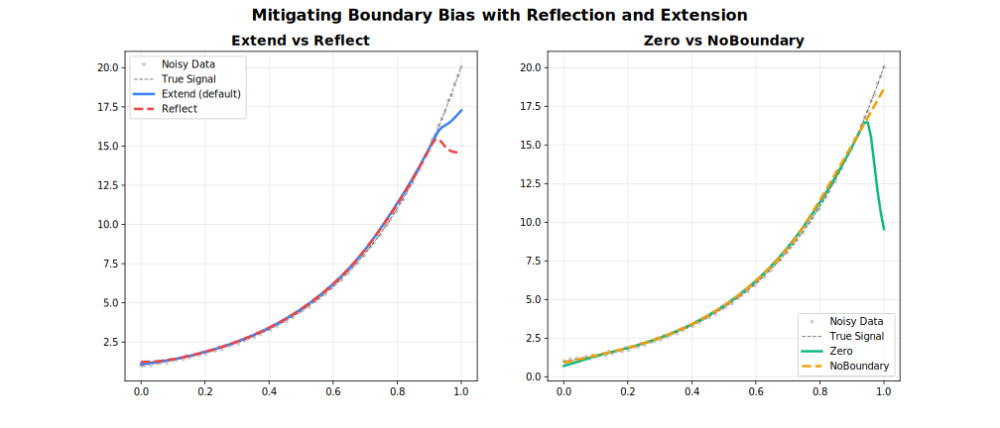
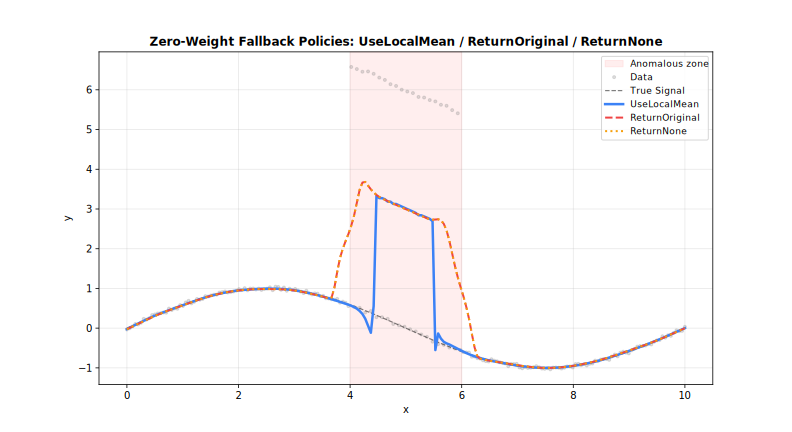

<!-- markdownlint-disable MD024 MD033 -->
# Parameters

Complete reference for all LOWESS configuration options.

## Quick Reference

!!! note "Language-specific values"
    **Null value** — R: `NULL` · Python: `None` · Rust: `None` · Julia: `nothing` · Node.js/WASM: `null` · C++: `NAN` (floats), `0` (integers), `{}` (vectors)

    **Logical false** — R uses `FALSE`, Python uses `False`, and Rust, Julia, Node.js, WASM, and C++ use `false`.

| Parameter | Default | Range/Options | Description | Adapter |
| --- | --- | --- | --- | --- |
| **fraction** | 0.67 | (0, 1] | Smoothing span | All |
| **iterations** | 3 | [0, 1000] | Robustness iterations | All |
| **delta** | Null value | [0, ∞) | Interpolation threshold | All |
| **weight_function** | `"tricube"` | 7 options | Distance kernel | All |
| **robustness_method** | `"bisquare"` | 3 options | Outlier weighting | All |
| **zero_weight_fallback** | `"use_local_mean"` | 3 options | Zero-weight behavior | All |
| **boundary_policy** | `"extend"` | 4 options | Edge handling | All |
| **scaling_method** | `"mad"` | 3 options | Scale estimation | All |
| **auto_converge** | Null value | tolerance | Early stopping | All |
| **return_residuals** | Logical false | logical | Include residuals | All |
| **return_robustness_weights** | Logical false | logical | Include weights | All |
| **return_diagnostics** | Logical false | logical | Include metrics | Batch, Streaming |
| **custom_weights** | Null value | positive | Per-observation weights | Batch |
| **confidence_intervals** | Null value | (0, 1) | CI level | Batch |
| **prediction_intervals** | Null value | (0, 1) | PI level | Batch |
| **cv_method** | Null value | method | Auto-select fraction | Batch |
| **chunk_size** | 5000 | [10, ∞) | Points per chunk | Streaming |
| **overlap** | 500 | [0, chunk) | Overlap between chunks | Streaming |
| **merge_strategy** | `"average"` | 4 options | Merge overlaps | Streaming |
| **window_capacity** | 1000 | [3, ∞) | Max window size | Online |
| **min_points** | 2 | [2, window] | Min before output | Online |
| **update_mode** | `"incremental"` | 2 options | Update strategy | Online |

!!! note "Rust option values"
    In Rust, pass option-like parameters as strings (case-insensitive), e.g. `"tricube"`, `"bisquare"`, `"extend"`, `"average"`.

---

## Parameter Options Summary

| Parameter | Available Options |
| --- | --- |
| **weight_function** | `"tricube"`, `"epanechnikov"`, `"gaussian"`, `"biweight"`, `"cosine"`, `"triangle"`, `"uniform"` |
| **robustness_method** | `"bisquare"`, `"huber"`, `"talwar"` |
| **zero_weight_fallback** | `"use_local_mean"`, `"return_original"`, `"return_none"` |
| **boundary_policy** | `"extend"`, `"reflect"`, `"zero"`, `"noboundary"` |
| **scaling_method** | `"mad"`, `"mar"`, `"mean"` |
| **merge_strategy** | `"average"`, `"left"`, `"right"`, `"weighted"` |
| **update_mode** | `"incremental"`, `"full"` |

---

## Core Parameters

### fraction

The proportion of data used for each local fit. **Most important parameter.**

| Value | Effect | Use Case |
| --- | --- | --- |
| 0.1–0.3 | Fine detail | Rapidly changing signals |
| 0.3–0.5 | Balanced | General purpose |
| 0.5–0.7 | Heavy smoothing | Noisy data |
| 0.7–1.0 | Very smooth | Trend extraction |

=== "R"
    ```r
    model <- Lowess(fraction = 0.3)
    result <- model$fit(x, y)
    ```

=== "Python"
    ```python
    model = fl.Lowess(fraction=0.3)
    result = model.fit(x, y)
    ```

=== "Rust"
    ```rust
    let model = Lowess::new()
        .fraction(0.3)
        .build()?;
    let result = model.fit(&x, &y)?;
    ```

=== "Julia"
    ```julia
    model = Lowess(; fraction=0.3)
    result = fit(model, x, y)
    ```

=== "Node.js"
    ```javascript
    const model = new Lowess({fraction: 0.3});
    const result = model.fit(x, y);
    ```

=== "WebAssembly"
    ```javascript
    const model = new Lowess({fraction: 0.3});
    const result = model.fit(x, y);
    ```

=== "C++"
    ```cpp
    fastlowess::Lowess model({ .fraction = 0.3});
    auto result = model.fit(x, y).value();
    ```

---

### iterations

Number of robustness iterations for outlier resistance.

| Value | Effect | Performance |
| --- | --- | --- |
| 0 | No robustness | Fastest |
| 1–3 | Moderate | Recommended |
| 4–6 | Strong | Contaminated data |
| 7+ | Very strong | Heavy outliers |

=== "R"
    ```r
    model <- Lowess(iterations = 5)
    result <- model$fit(x, y)
    ```

=== "Python"
    ```python
    model = fl.Lowess(iterations=5)
    result = model.fit(x, y)
    ```

=== "Rust"
    ```rust
    let model = Lowess::new()
        .iterations(5)
        .build()?;
    let result = model.fit(&x, &y)?;
    ```

=== "Julia"
    ```julia
    model = Lowess(; iterations=5)
    result = fit(model, x, y)
    ```

=== "Node.js"
    ```javascript
    const model = new Lowess({iterations: 5});
    const result = model.fit(x, y);
    ```

=== "WebAssembly"
    ```javascript
    const model = new Lowess({iterations: 5});
    const result = model.fit(x, y);
    ```

=== "C++"
    ```cpp
    fastlowess::Lowess model({ .iterations = 5});
    auto result = model.fit(x, y).value();
    ```

---

### delta

Interpolation optimization threshold. Points within `delta` distance reuse the previous fit.

- **Default**: 1% of x-range (Batch), 0.0 (Streaming/Online)
- **Effect**: Higher values = faster but less accurate

=== "R"
    ```r
    model <- Lowess(delta = 0.05)
    result <- model$fit(x, y)
    ```

=== "Python"
    ```python
    model = fl.Lowess(delta=0.05)
    result = model.fit(x, y)
    ```

=== "Rust"
    ```rust
    let model = Lowess::new()
        .delta(0.05)
        .build()?;
    let result = model.fit(&x, &y)?;
    ```

=== "Julia"
    ```julia
    model = Lowess(; delta=0.05)
    result = fit(model, x, y)
    ```

=== "Node.js"
    ```javascript
    const model = new Lowess({delta: 0.05});
    const result = model.fit(x, y);
    ```

=== "WebAssembly"
    ```javascript
    const model = new Lowess({delta: 0.05});
    const result = model.fit(x, y);
    ```

=== "C++"
    ```cpp
    fastlowess::Lowess model({ .delta = 0.05});
    auto result = model.fit(x, y).value();
    ```

---

### weight_function

Distance weighting kernel for local fits.

| Kernel | Efficiency | Smoothness |
| --- | --- | --- |
| `"tricube"` | 0.998 | Very smooth |
| `"epanechnikov"` | 1.000 | Smooth |
| `"gaussian"` | 0.961 | Infinite |
| `"biweight"` | 0.995 | Very smooth |
| `"cosine"` | 0.999 | Smooth |
| `"triangle"` | 0.989 | Moderate |
| `"uniform"` | 0.943 | None |

See [Weight Functions](kernels.md) for detailed comparison.

=== "R"
    ```r
    model <- Lowess(weight_function = "epanechnikov")
    result <- model$fit(x, y)
    ```

=== "Python"
    ```python
    model = fl.Lowess(weight_function="epanechnikov")
    result = model.fit(x, y)
    ```

=== "Rust"
    ```rust
    let model = Lowess::new()
        .weight_function("epanechnikov")
        .build()?;
    let result = model.fit(&x, &y)?;
    ```

=== "Julia"
    ```julia
    model = Lowess(; weight_function="epanechnikov")
    result = fit(model, x, y)
    ```

=== "Node.js"
    ```javascript
    const model = new Lowess({weight_function: "epanechnikov"});
    const result = model.fit(x, y);
    ```

=== "WebAssembly"
    ```javascript
    const model = new Lowess({weight_function: "epanechnikov"});
    const result = model.fit(x, y);
    ```

=== "C++"
    ```cpp
    fastlowess::Lowess model({ .weight_function = "epanechnikov"});
    auto result = model.fit(x, y).value();
    ```

---

### robustness_method

Method for downweighting outliers during iterative refinement.

| Method | Behavior | Use Case |
| --- | --- | --- |
| `"bisquare"` | Smooth downweighting | General-purpose |
| `"huber"` | Linear beyond threshold | Moderate outliers |
| `"talwar"` | Hard threshold (0 or 1) | Extreme contamination |

See [Robustness](robustness.md) for detailed comparison.

=== "R"
    ```r
    model <- Lowess(robustness_method = "talwar")
    result <- model$fit(x, y)
    ```

=== "Python"
    ```python
    model = fl.Lowess(robustness_method="talwar")
    result = model.fit(x, y)
    ```

=== "Rust"
    ```rust
    let model = Lowess::new()
        .robustness_method("talwar")
        .build()?;
    let result = model.fit(&x, &y)?;
    ```

=== "Julia"
    ```julia
    model = Lowess(; robustness_method="talwar")
    result = fit(model, x, y)
    ```

=== "Node.js"
    ```javascript
    const model = new Lowess({robustness_method: "talwar"});
    const result = model.fit(x, y);
    ```

=== "WebAssembly"
    ```javascript
    const model = new Lowess({robustness_method: "talwar"});
    const result = model.fit(x, y);
    ```

=== "C++"
    ```cpp
    fastlowess::Lowess model({ .robustness_method = "talwar"});
    auto result = model.fit(x, y).value();
    ```

---

### boundary_policy

Edge handling strategy to reduce boundary bias. See [Boundary Handling](boundary.md) for a detailed comparison.



| Policy | Behavior | Use Case |
| --- | --- | --- |
| `"extend"` | Pad with first/last values | Most cases (default) |
| `"reflect"` | Mirror data at boundaries | Periodic/symmetric data |
| `"zero"` | Pad with zeros | Data approaches zero |
| `"noboundary"` | No padding | Original Cleveland behavior |

For example:

=== "R"
    ```r
    model <- Lowess(boundary_policy = "reflect")
    result <- model$fit(x, y)
    ```

=== "Python"
    ```python
    model = fl.Lowess(boundary_policy="reflect")
    result = model.fit(x, y)
    ```

=== "Rust"
    ```rust
    let model = Lowess::new()
        .boundary_policy("reflect")
        .build()?;
    let result = model.fit(&x, &y)?;
    ```

=== "Julia"
    ```julia
    model = Lowess(; boundary_policy="reflect")
    result = fit(model, x, y)
    ```

=== "Node.js"
    ```javascript
    const model = new Lowess({boundary_policy: "reflect"});
    const result = model.fit(x, y);
    ```

=== "WebAssembly"
    ```javascript
    const model = new Lowess({boundary_policy: "reflect"});
    const result = model.fit(x, y);
    ```

=== "C++"
    ```cpp
    fastlowess::Lowess model({ .boundary_policy = "reflect"});
    auto result = model.fit(x, y).value();
    ```

---

### scaling_method

Method for estimating residual scale during robustness iterations. See [Scaling Methods](scaling.md) for a detailed comparison.


| Method | Description | Robustness |
| --- | --- | --- |
| `"mad"` | Median Absolute Deviation | Very robust |
| `"mar"` | Median Absolute Residual | Robust |
| `"mean"` | Mean Absolute Residual | Less robust |

For example:

=== "R"
    ```r
    model <- Lowess(scaling_method = "mad")
    result <- model$fit(x, y)
    ```

=== "Python"
    ```python
    model = fl.Lowess(scaling_method="mad")
    result = model.fit(x, y)
    ```

=== "Rust"
    ```rust
    let model = Lowess::new()
        .scaling_method("mad")
        .build()?;
    let result = model.fit(&x, &y)?;
    ```

=== "Julia"
    ```julia
    model = Lowess(; scaling_method="mad")
    result = fit(model, x, y)
    ```

=== "Node.js / WebAssembly"
    ```javascript
    const model = new Lowess({scaling_method: "mad"});
    const result = model.fit(x, y);
    ```

=== "C++"
    ```cpp
    fastlowess::Lowess model({ .scaling_method = "mad"});
    auto result = model.fit(x, y).value();
    ```

---

### zero_weight_fallback

Behavior when all neighborhood weights are zero.



| Option | Behavior |
| --- | --- |
| `"use_local_mean"` | Use mean of neighborhood (default) |
| `"return_original"` | Return original y value |
| `"return_none"` | Return NaN |

For example:

=== "R"
    ```r
    model <- Lowess(zero_weight_fallback = "use_local_mean")
    result <- model$fit(x, y)
    ```

=== "Python"
    ```python
    model = fl.Lowess(zero_weight_fallback="use_local_mean")
    result = model.fit(x, y)
    ```

=== "Rust"
    ```rust
    let model = Lowess::new()
        .zero_weight_fallback("use_local_mean")
        .build()?;
    let result = model.fit(&x, &y)?;
    ```

=== "Julia"
    ```julia
    model = Lowess(; zero_weight_fallback="use_local_mean")
    result = fit(model, x, y)
    ```

=== "Node.js"
    ```javascript
    const model = new Lowess({zero_weight_fallback: "use_local_mean"});
    const result = model.fit(x, y);
    ```

=== "WebAssembly"
    ```javascript
    const model = new Lowess({zero_weight_fallback: "use_local_mean"});
    const result = model.fit(x, y);
    ```

=== "C++"
    ```cpp
    fastlowess::Lowess model({ .zero_weight_fallback = "use_local_mean"});
    auto result = model.fit(x, y).value();
    ```

---

### auto_converge

Enable early stopping when robustness weights stabilize.

=== "R"
    ```r
    model <- Lowess(iterations = 20, auto_converge = 1e-6)
    result <- model$fit(x, y)
    ```

=== "Python"
    ```python
    model = fl.Lowess(iterations=20, auto_converge=1e-6)
    result = model.fit(x, y)
    ```

=== "Rust"
    ```rust
    let model = Lowess::new()
        .iterations(20)           // Maximum
        .auto_converge(1e-6)      // Stop when change < 1e-6
        .build()?;
    let result = model.fit(&x, &y)?;
    ```

=== "Julia"
    ```julia
    model = Lowess(; iterations=20, auto_converge=1e-6)
    result = fit(model, x, y)
    ```

=== "Node.js"
    ```javascript
    const model = new Lowess({iterations: 20, auto_converge: 1e-6});
    const result = model.fit(x, y);
    ```

=== "WebAssembly"
    ```javascript
    const model = new Lowess({iterations: 20, auto_converge: 1e-6});
    const result = model.fit(x, y);
    ```

=== "C++"
    ```cpp
    fastlowess::Lowess model({ .iterations = 20, .auto_converge = 1e-6});
    auto result = model.fit(x, y).value();
    ```

---

### custom_weights

Per-observation weights applied before distance and robustness weighting. Only
available in the **Batch** adapter.

!!! note "Batch only"
    `custom_weights` is silently ignored in Streaming and Online adapters.

See [Custom Weights](custom-weights.md) for a full discussion.

=== "R"
    ```r
    weights <- rep(1.0, length(x))
    weights[6] <- 0.0          # exclude index 6

    model <- Lowess(fraction = 0.5)
    result <- model$fit(x, y, custom_weights = weights)
    ```

=== "Python"
    ```python
    import numpy as np

    weights = np.ones(len(x))
    weights[5] = 0.0           # exclude index 5

    model = Lowess(fraction=0.5)
    result = model.fit(x, y, custom_weights=weights.tolist())
    ```

=== "Rust"
    ```rust
    let mut weights = vec![1.0_f64; x.len()];
    weights[5] = 0.0; // exclude index 5

    let model = Lowess::new()
        .fraction(0.5)
        .custom_weights(weights)
        .build()?;
    let result = model.fit(&x, &y)?;
    ```

=== "Julia"
    ```julia
    weights = ones(length(x))
    weights[6] = 0.0           # exclude index 6 (1-indexed)

    model = Lowess(fraction = 0.5)
    result = fit(model, x, y; custom_weights = weights)
    ```

=== "Node.js"
    ```javascript
    const weights = new Float64Array(x.length).fill(1.0);
    weights[5] = 0.0; // exclude index 5

    const model = new fastlowess.Lowess({fraction: 0.5});
    const result = model.fit(x, y, weights);
    ```

=== "WebAssembly"
    ```javascript
    const weights = new Float64Array(x.length).fill(1.0);
    weights[5] = 0.0; // exclude index 5

    const model = new Lowess({fraction: 0.5});
    const result = model.fit(x, y, weights);
    ```

=== "C++"
    ```cpp
    std::vector<double> weights(x.size(), 1.0);
    weights[5] = 0.0; // exclude index 5

    auto result = fastlowess::Lowess(opts).fit(x, y, weights).value();
    ```

---

## Output Options

### return_residuals

Include residuals (`y - smoothed`) in the output.

=== "R"
    ```r
    model <- Lowess(return_residuals = TRUE)
    result <- model$fit(x, y)
    print(result$residuals)
    ```

=== "Python"
    ```python
    model = fl.Lowess(return_residuals=True)
    result = model.fit(x, y)
    print(result["residuals"])
    ```

=== "Rust"
    ```rust
    let model = Lowess::new()
        .return_residuals()
        .build()?;

    let result = model.fit(&x, &y)?;
    if let Some(residuals) = result.residuals {
        println!("Residuals: {:?}", residuals);
    }
    ```

=== "Julia"
    ```julia
    model = Lowess(; return_residuals=true)
    result = fit(model, x, y)
    println(result.residuals)
    ```

=== "Node.js"
    ```javascript
    const model = new Lowess({return_residuals: true});
    const result = model.fit(x, y);
    console.log(result.residuals);
    ```

=== "WebAssembly"
    ```javascript
    const model = new Lowess({return_residuals: true});
    const result = model.fit(x, y);
    console.log(result.residuals);
    ```

=== "C++"
    ```cpp
    fastlowess::Lowess model({ .return_residuals = true});
    auto result = model.fit(x, y).value();
    auto residuals = result.residuals();
    ```

---

### return_diagnostics

Include fit quality metrics (Batch and Streaming only).

| Metric | Description |
| --- | --- |
| `rmse` | Root Mean Square Error |
| `mae` | Mean Absolute Error |
| `r_squared` | R² coefficient |
| `residual_sd` | Residual standard deviation |
| `effective_df` | Effective degrees of freedom |
| `aic` | Akaike Information Criterion |
| `aicc` | Corrected AIC |

=== "R"
    ```r
    model <- Lowess(return_diagnostics = TRUE)
    result <- model$fit(x, y)
    cat(sprintf("R²: %.4f\n", result$diagnostics$r_squared))
    ```

=== "Python"
    ```python
    model = fl.Lowess(return_diagnostics=True)
    result = model.fit(x, y)
    print(f"R²: {result['diagnostics']['r_squared']:.4f}")
    ```

=== "Rust"
    ```rust
    let model = Lowess::new()
        .return_diagnostics()
        .build()?;

    let result = model.fit(&x, &y)?;
    if let Some(diag) = result.diagnostics {
        println!("R²: {:.4}", diag.r_squared);
        println!("RMSE: {:.4}", diag.rmse);
    }
    ```

=== "Julia"
    ```julia
    model = Lowess(; return_diagnostics=true)
    result = fit(model, x, y)
    println("R²: ", result.diagnostics.r_squared)
    ```

=== "Node.js"
    ```javascript
    const model = new Lowess({return_diagnostics: true});
    const result = model.fit(x, y);
    console.log("R²:", result.diagnostics.r_squared);
    ```

=== "WebAssembly"
    ```javascript
    const model = new Lowess({return_diagnostics: true});
    const result = model.fit(x, y);
    console.log("R²:", result.diagnostics.r_squared);
    ```

=== "C++"
    ```cpp
    fastlowess::Lowess model({ .return_diagnostics = true});
    auto result = model.fit(x, y).value();
    auto diag = result.diagnostics();
    std::cout << "R²: " << diag.r_squared << std::endl;
    ```

---

### return_robustness_weights

Include final robustness weights (useful for outlier detection).

=== "R"
    ```r
    model <- Lowess(iterations = 3, return_robustness_weights = TRUE)
    result <- model$fit(x, y)
    outliers <- which(result$robustness_weights < 0.5)
    ```

=== "Python"
    ```python
    model = fl.Lowess(iterations=3, return_robustness_weights=True)
    result = model.fit(x, y)
    outliers = [i for i, w in enumerate(result["robustness_weights"]) if w < 0.5]
    ```

=== "Rust"
    ```rust
    let model = Lowess::new()
        .iterations(3)
        .return_robustness_weights()
        .build()?;

    let result = model.fit(&x, &y)?;
    // Points with weight < 0.5 are likely outliers
    ```

=== "Julia"
    ```julia
    model = Lowess(; iterations=3, return_robustness_weights=true)
    result = fit(model, x, y)
    # Points with result.robustness_weights < 0.5 are likely outliers
    ```

=== "Node.js"
    ```javascript
    const model = new Lowess({iterations: 3, return_robustness_weights: true});
    const result = model.fit(x, y);
    // result.robustness_weights contains outlier weights
    ```

=== "WebAssembly"
    ```javascript
    const model = new Lowess({iterations: 3, return_robustness_weights: true});
    const result = model.fit(x, y);
    // result.robustness_weights contains outlier weights
    ```

=== "C++"
    ```cpp
    fastlowess::Lowess model({
        .iterations = 3,
        .return_robustness_weights = true
        });
    auto result = model.fit(x, y).value();
    auto weights = result.robustness_weights();
    ```

---

### confidence_intervals / prediction_intervals

Request uncertainty estimates (Batch only).

See [Intervals](intervals.md) for detailed usage.

=== "R"
    ```r
    model <- Lowess(confidence_intervals = 0.95, prediction_intervals = 0.95)
    result <- model$fit(x, y)
    ```

=== "Python"
    ```python
    model = fl.Lowess(confidence_intervals=0.95, prediction_intervals=0.95)
    result = model.fit(x, y)
    ```

=== "Rust"
    ```rust
    let model = Lowess::new()
        .confidence_intervals(0.95)
        .prediction_intervals(0.95)
        .build()?;
    let result = model.fit(&x, &y)?;
    ```

=== "Julia"
    ```julia
    model = Lowess(; confidence_intervals=0.95, prediction_intervals=0.95)
    result = fit(model, x, y)
    ```

=== "Node.js"
    ```javascript
    const model = new Lowess({confidence_intervals: 0.95, prediction_intervals: 0.95});
    const result = model.fit(x, y);
    ```

=== "WebAssembly"
    ```javascript
    const model = new Lowess({confidence_intervals: 0.95, prediction_intervals: 0.95});
    const result = model.fit(x, y);
    ```

=== "C++"
    ```cpp
    fastlowess::Lowess model({
        .confidence_intervals = 0.95,
        .prediction_intervals = 0.95
        });
    auto result = model.fit(x, y).value();
    ```

---

## CV Methods

### cv_method

Selection strategy for automated parameter tuning.

| Method | Description | Speed |
| --- | --- | --- |
| `"kfold"` | K-Fold Cross-Validation | Fast |
| `"loocv"` | Leave-One-Out Cross-Validation | Slow |

=== "R"
    ```r
    model <- Lowess(cv_method = "kfold", cv_k = 5)
    result <- model$fit(x, y)
    ```

=== "Python"
    ```python
    model = fl.Lowess(cv_method="kfold", cv_k=5)
    result = model.fit(x, y)
    ```

=== "Rust"
    ```rust
    let model = Lowess::new()
        .cross_validate(KFold(5, &[0.1, 0.3, 0.5]))
        .build()?;
    let result = model.fit(&x, &y)?;
    ```

=== "Julia"
    ```julia
    model = Lowess(; cv_method="kfold", cv_k=5)
    result = fit(model, x, y)
    ```

=== "Node.js"
    ```javascript
    // Coming soon
    ```

=== "WebAssembly"
    ```javascript
    // Coming soon
    ```

=== "C++"
    ```cpp
    auto model = fastlowess::Lowess::new()
        .cross_validate(fastlowess::KFold(5, {0.1, 0.3, 0.5}))
        .build();
    ```

---

## Adapter Parameters

### chunk_size

Points per chunk in Streaming mode.

=== "R"
    ```r
    result <- StreamingLowess(chunk_size = 10000)$process_chunk(x, y)
    ```

=== "Python"
    ```python
    model = fl.StreamingLowess(chunk_size=10000)
    model.process_chunk(x, y)
    result = model.finalize()
    ```

=== "Rust"
    ```rust
    let model = StreamingLowess::new()
        .chunk_size(10000)
        .build()?;
    ```

=== "Julia"
    ```julia
    model = StreamingLowess(; chunk_size=10000)
    process_chunk(model, x, y)
    result = finalize(model)
    ```

=== "Node.js"
    ```javascript
    const processor = new StreamingLowess({}, { chunk_size: 10000 });
    ```

=== "WebAssembly"
    ```javascript
    const processor = new StreamingLowessWasm({}, { chunk_size: 10000 });
    ```

=== "C++"
    ```cpp
    fastlowess::StreamingOptions opts;
    opts.chunk_size = 10000;
    fastlowess::StreamingLowess stream(opts);
    (void)stream.process_chunk(x, y);
    auto result = stream.finalize().value();
    ```

---

### overlap

Overlap between chunks in Streaming mode.

=== "R"
    ```r
    result <- StreamingLowess(overlap = 1000)$process_chunk(x, y)
    ```

=== "Python"
    ```python
    model = fl.StreamingLowess(overlap=1000)
    model.process_chunk(x, y)
    result = model.finalize()
    ```

=== "Rust"
    ```rust
    let model = StreamingLowess::new()
        .overlap(1000)
        .build()?;
    ```

=== "Julia"
    ```julia
    model = StreamingLowess(; overlap=1000)
    process_chunk(model, x, y)
    result = finalize(model)
    ```

=== "Node.js"
    ```javascript
    const processor = new StreamingLowess({}, { overlap: 1000 });
    ```

=== "WebAssembly"
    ```javascript
    const processor = new StreamingLowessWasm({}, { overlap: 1000 });
    ```

=== "C++"
    ```cpp
    fastlowess::StreamingOptions opts;
    opts.overlap = 1000;
    fastlowess::StreamingLowess stream(opts);
    (void)stream.process_chunk(x, y);
    auto result = stream.finalize().value();
    ```

---

### merge_strategy

Method for merging overlapping chunks. See [Merge Strategies](merge.md) for a detailed comparison.

| Strategy | Description | Robustness |
| --- | --- | --- |
| `"average"` | Average of overlapping chunks | Fastest, least robust |
| `"left"` | Left chunk | Fastest, least robust |
| `"right"` | Right chunk | Fastest, least robust |
| `"weighted"` | Weighted average of overlapping chunks | Most robust |

For example:

=== "R"
    ```r
    result <- StreamingLowess(merge_strategy = "weighted")$process_chunk(x, y)
    ```

=== "Python"
    ```python
    model = fl.StreamingLowess(merge_strategy="weighted")
    model.process_chunk(x, y)
    result = model.finalize()
    ```

=== "Rust"
    ```rust
    let model = StreamingLowess::new()
        .merge_strategy("weighted")
        .build()?;
    ```

=== "Julia"
    ```julia
    model = StreamingLowess(; merge_strategy="weighted")
    process_chunk(model, x, y)
    result = finalize(model)
    ```

=== "Node.js"
    ```javascript
    const processor = new StreamingLowess({}, { merge_strategy: "weighted" });
    ```

=== "WebAssembly"
    ```javascript
    const processor = new StreamingLowessWasm({}, { merge_strategy: "weighted" });
    ```

=== "C++"
    ```cpp
    // merge_strategy is handled internally in C++
    fastlowess::StreamingLowess stream({});
    (void)stream.process_chunk(x, y);
    auto result = stream.finalize().value();
    ```

---

### window_capacity

Maximum points held in memory for Online mode.

=== "R"
    ```r
    result <- OnlineLowess(window_capacity = 500)$add_point(x[[1]], y[[1]])
    ```

=== "Python"
    ```python
    model = fl.OnlineLowess(window_capacity=500)
    result = model.add_point(x[0], y[0])  # None until window fills
    ```

=== "Rust"
    ```rust
    let model = OnlineLowess::new()
        .window_capacity(500)
        .build()?;
    ```

=== "Julia"
    ```julia
    model = OnlineLowess(; window_capacity=500)
    result = add_point(model, x[1], y[1])  # nothing until window fills
    ```

=== "Node.js"
    ```javascript
    const processor = new OnlineLowess({}, { window_capacity: 500 });
    ```

=== "WebAssembly"
    ```javascript
    const processor = new OnlineLowessWasm({}, { window_capacity: 500 });
    ```

=== "C++"
    ```cpp
    fastlowess::OnlineOptions opts;
    opts.window_capacity = 500;
    fastlowess::OnlineLowess model(opts);
    auto out = model.add_point(x[0], y[0]).value();
    // out.has_value() == false until window fills
    ```

---

### min_points

Minimum points required before Online filter starts producing outputs.

=== "R"
    ```r
    result <- OnlineLowess(min_points = 10)$add_point(x[[1]], y[[1]])
    ```

=== "Python"
    ```python
    model = fl.OnlineLowess(min_points=10)
    result = model.add_point(x[0], y[0])
    ```

=== "Rust"
    ```rust
    let model = OnlineLowess::new()
        .min_points(10)
        .build()?;
    ```

=== "Julia"
    ```julia
    model = OnlineLowess(; min_points=10)
    result = add_point(model, x[1], y[1])
    ```

=== "Node.js"
    ```javascript
    const processor = new OnlineLowess({}, { min_points: 10 });
    ```

=== "WebAssembly"
    ```javascript
    const processor = new OnlineLowessWasm({}, { min_points: 10 });
    ```

=== "C++"
    ```cpp
    fastlowess::OnlineOptions opts;
    opts.min_points = 10;
    fastlowess::OnlineLowess model(opts);
    auto out = model.add_point(x[0], y[0]).value();
    ```

---

### update_mode

Optimization strategy for Online mode updates.

| Mode | Description | Speed |
| --- | --- | --- |
| `"full"` | Full update | Slow |
| `"incremental"` | Incremental update | Fast |

For example:

=== "R"
    ```r
    result <- OnlineLowess(update_mode = "full")$add_point(x[[1]], y[[1]])
    ```

=== "Python"
    ```python
    model = fl.OnlineLowess(update_mode="full")
    result = model.add_point(x[0], y[0])
    ```

=== "Rust"
    ```rust
    let model = OnlineLowess::new()
        .update_mode("full")
        .build()?;
    ```

=== "Julia"
    ```julia
    model = OnlineLowess(; update_mode="full")
    result = add_point(model, x[1], y[1])
    ```

=== "Node.js"
    ```javascript
    const processor = new OnlineLowess({}, { update_mode: "full" });
    ```

=== "WebAssembly"
    ```javascript
    const processor = new OnlineLowessWasm({}, { update_mode: "full" });
    ```

=== "C++"
    ```cpp
    fastlowess::OnlineOptions opts;
    opts.update_mode = "full";
    fastlowess::OnlineLowess model(opts);
    auto out = model.add_point(x[0], y[0]).value();
    ```
