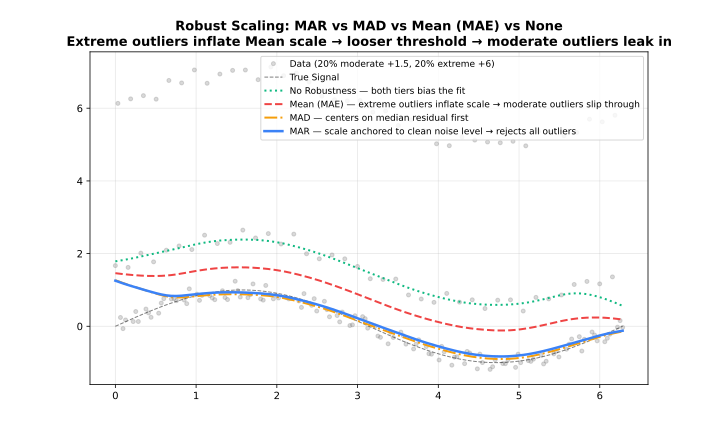
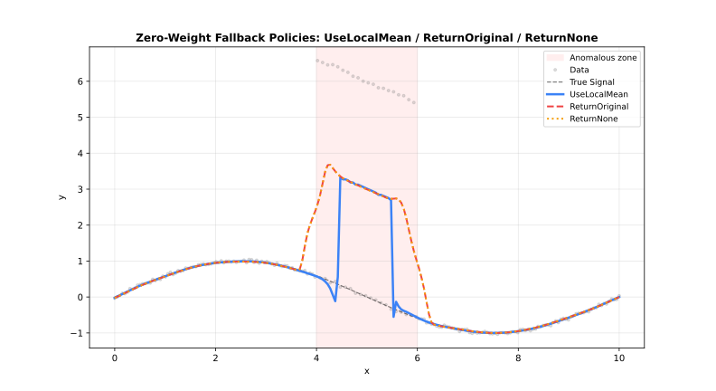

<!-- markdownlint-disable MD024 MD033 -->
# Parameters

Complete reference for all LOWESS configuration options.

## Quick Reference

!!! note "Language-specific values"
    **Null value** — R: `NULL` · Python: `None` · Rust: `None` · Julia: `nothing` · Node.js/WASM: `null` · C++: `NAN` (floats), `0` (integers), `{}` (vectors)

    **Logical false** — R uses `FALSE`, Python uses `False`, and Rust, Julia, Node.js, WASM, and C++ use `false`.

| Parameter | Default | Range/Options | Description | Adapter |
| --- | --- | --- | --- | --- |
| **fraction** | 0.67 | (0, 1] | Smoothing span | All |
| **iterations** | 3 | [0, 1000] | Robustness iterations | All |
| **delta** | Null value | [0, ∞) | Interpolation threshold | All |
| **weight_function** | `"tricube"` | 7 options | Distance kernel | All |
| **robustness_method** | `"bisquare"` | 3 options | Outlier weighting | All |
| **zero_weight_fallback** | `"use_local_mean"` | 3 options | Zero-weight behavior | All |
| **boundary_policy** | `"extend"` | 4 options | Edge handling | All |
| **scaling_method** | `"mad"` | 3 options | Scale estimation | All |
| **auto_converge** | Null value | tolerance | Early stopping | All |
| **return_residuals** | Logical false | logical | Include residuals | All |
| **return_robustness_weights** | Logical false | logical | Include weights | All |
| **return_se** | Logical false | logical | Return standard errors | All |
| **return_diagnostics** | Logical false | logical | Include metrics | Batch, Streaming |
| **custom_weights** | Null value | positive | Per-observation weights | Batch |
| **confidence_intervals** | Null value | (0, 1) | CI level | Batch |
| **prediction_intervals** | Null value | (0, 1) | PI level | Batch |
| **cv_method** | Null value | method | Auto-select fraction | Batch |
| **chunk_size** | 5000 | [10, ∞) | Points per chunk | Streaming |
| **overlap** | 500 | [0, chunk) | Overlap between chunks | Streaming |
| **merge_strategy** | `"weighted_average"` | 4 options | Merge overlaps | Streaming |
| **window_capacity** | 1000 | [3, ∞) | Max window size | Online |
| **min_points** | 2 | [2, window] | Min before output | Online |
| **update_mode** | `"incremental"` | 2 options | Update strategy | Online |

!!! note "Rust option values"
    In Rust, pass option-like parameters as strings (case-insensitive), e.g. `"tricube"`, `"bisquare"`, `"extend"`, `"average"`.

---

## Parameter Options Summary

| Parameter | Available Options |
| --- | --- |
| **weight_function** | `"tricube"`, `"epanechnikov"`, `"gaussian"`, `"biweight"`, `"cosine"`, `"triangle"`, `"uniform"` |
| **robustness_method** | `"bisquare"`, `"huber"`, `"talwar"` |
| **zero_weight_fallback** | `"use_local_mean"`, `"return_original"`, `"return_none"` |
| **boundary_policy** | `"extend"`, `"reflect"`, `"zero"`, `"noboundary"` |
| **scaling_method** | `"mad"`, `"mar"`, `"mean"` |
| **merge_strategy** | `"average"`, `"weighted_average"`, `"take_first"`, `"take_last"` |
| **update_mode** | `"incremental"`, `"full"` |

---

## Core Parameters

### fraction

The proportion of data used for each local fit. **Most important parameter.**

| Value | Effect | Use Case |
| --- | --- | --- |
| 0.1–0.3 | Fine detail | Rapidly changing signals |
| 0.3–0.5 | Balanced | General purpose |
| 0.5–0.7 | Heavy smoothing | Noisy data |
| 0.7–1.0 | Very smooth | Trend extraction |

=== "Python"
    ```python
    import fastlowess as fl
    import numpy as np

    rng = np.random.default_rng(42)
    x = np.linspace(0, 2 * np.pi, 100)
    y = np.sin(x) + rng.normal(0, 0.3, 100)

    model = fl.Lowess(fraction=0.3)
    result = model.fit(x, y)
    ```
=== "WebAssembly"
    ```javascript
    const { Lowess } = require('./fastlowess_wasm.js');

    const n = 100;
    const x = Float64Array.from({ length: n }, (_, i) => i * 2 * Math.PI / (n - 1));
    const y = Float64Array.from(x, (xi, i) => Math.sin(xi) + (((i * 7 + 3) % 17) / 17 - 0.5) * 0.6);

    const model = new Lowess({fraction: 0.3});
    const result = model.fit(x, y);
    ```

=== "C++"
    ```cpp
    #include <fastlowess.hpp>
    #include <cmath>
    #include <iostream>
    #include <vector>

    int main() {
        const int n = 100;
        std::vector<double> x(n), y(n);
        for (int i = 0; i < n; ++i) {
            x[i] = i * 2 * M_PI / (n - 1);
            y[i] = std::sin(x[i]) + 0.1;
        }

        fastlowess::Lowess model({ .fraction = 0.3});
        auto result = model.fit(x, y).value();

        return 0;
    }
    ```

---

### iterations

Number of robustness iterations for outlier resistance.

| Value | Effect | Performance |
| --- | --- | --- |
| 0 | No robustness | Fastest |
| 1–3 | Moderate | Recommended |
| 4–6 | Strong | Contaminated data |
| 7+ | Very strong | Heavy outliers |

=== "Python"
    ```python
    import fastlowess as fl
    import numpy as np

    rng = np.random.default_rng(42)
    x = np.linspace(0, 2 * np.pi, 100)
    y = np.sin(x) + rng.normal(0, 0.3, 100)

    model = fl.Lowess(iterations=5)
    result = model.fit(x, y)
    ```
=== "WebAssembly"
    ```javascript
    const { Lowess } = require('./fastlowess_wasm.js');

    const n = 100;
    const x = Float64Array.from({ length: n }, (_, i) => i * 2 * Math.PI / (n - 1));
    const y = Float64Array.from(x, (xi, i) => Math.sin(xi) + (((i * 7 + 3) % 17) / 17 - 0.5) * 0.6);

    const model = new Lowess({iterations: 5});
    const result = model.fit(x, y);
    ```

=== "C++"
    ```cpp
    #include <fastlowess.hpp>
    #include <cmath>
    #include <iostream>
    #include <vector>

    int main() {
        const int n = 100;
        std::vector<double> x(n), y(n);
        for (int i = 0; i < n; ++i) {
            x[i] = i * 2 * M_PI / (n - 1);
            y[i] = std::sin(x[i]) + 0.1;
        }

        fastlowess::Lowess model({ .iterations = 5});
        auto result = model.fit(x, y).value();

        return 0;
    }
    ```

---

### delta

Interpolation optimization threshold. Points within `delta` distance reuse the previous fit.

- **Default**: 1% of x-range (Batch), 0.0 (Streaming/Online)
- **Effect**: Higher values = faster but less accurate

=== "Python"
    ```python
    import fastlowess as fl
    import numpy as np

    rng = np.random.default_rng(42)
    x = np.linspace(0, 2 * np.pi, 100)
    y = np.sin(x) + rng.normal(0, 0.3, 100)

    model = fl.Lowess(delta=0.05)
    result = model.fit(x, y)
    ```
=== "WebAssembly"
    ```javascript
    const { Lowess } = require('./fastlowess_wasm.js');

    const n = 100;
    const x = Float64Array.from({ length: n }, (_, i) => i * 2 * Math.PI / (n - 1));
    const y = Float64Array.from(x, (xi, i) => Math.sin(xi) + (((i * 7 + 3) % 17) / 17 - 0.5) * 0.6);

    const model = new Lowess({delta: 0.05});
    const result = model.fit(x, y);
    ```

=== "C++"
    ```cpp
    #include <fastlowess.hpp>
    #include <cmath>
    #include <iostream>
    #include <vector>

    int main() {
        const int n = 100;
        std::vector<double> x(n), y(n);
        for (int i = 0; i < n; ++i) {
            x[i] = i * 2 * M_PI / (n - 1);
            y[i] = std::sin(x[i]) + 0.1;
        }

        fastlowess::Lowess model({ .delta = 0.05});
        auto result = model.fit(x, y).value();

        return 0;
    }
    ```

---

### weight_function

Distance weighting kernel for local fits.

| Kernel | Efficiency | Smoothness |
| --- | --- | --- |
| `"tricube"` | 0.998 | Very smooth |
| `"epanechnikov"` | 1.000 | Smooth |
| `"gaussian"` | 0.961 | Infinite |
| `"biweight"` | 0.995 | Very smooth |
| `"cosine"` | 0.999 | Smooth |
| `"triangle"` | 0.989 | Moderate |
| `"uniform"` | 0.943 | None |

See [Weight Functions](kernels.md) for detailed comparison.

=== "Python"
    ```python
    import fastlowess as fl
    import numpy as np

    rng = np.random.default_rng(42)
    x = np.linspace(0, 2 * np.pi, 100)
    y = np.sin(x) + rng.normal(0, 0.3, 100)

    model = fl.Lowess(weight_function="epanechnikov")
    result = model.fit(x, y)
    ```
=== "WebAssembly"
    ```javascript
    const { Lowess } = require('./fastlowess_wasm.js');

    const n = 100;
    const x = Float64Array.from({ length: n }, (_, i) => i * 2 * Math.PI / (n - 1));
    const y = Float64Array.from(x, (xi, i) => Math.sin(xi) + (((i * 7 + 3) % 17) / 17 - 0.5) * 0.6);

    const model = new Lowess({weight_function: "epanechnikov"});
    const result = model.fit(x, y);
    ```

=== "C++"
    ```cpp
    #include <fastlowess.hpp>
    #include <cmath>
    #include <iostream>
    #include <vector>

    int main() {
        const int n = 100;
        std::vector<double> x(n), y(n);
        for (int i = 0; i < n; ++i) {
            x[i] = i * 2 * M_PI / (n - 1);
            y[i] = std::sin(x[i]) + 0.1;
        }

        fastlowess::Lowess model({ .weight_function = "epanechnikov"});
        auto result = model.fit(x, y).value();

        return 0;
    }
    ```

---

### robustness_method

Method for downweighting outliers during iterative refinement.

| Method | Behavior | Use Case |
| --- | --- | --- |
| `"bisquare"` | Smooth downweighting | General-purpose |
| `"huber"` | Linear beyond threshold | Moderate outliers |
| `"talwar"` | Hard threshold (0 or 1) | Extreme contamination |

See [Robustness](robustness.md) for detailed comparison.

=== "Python"
    ```python
    import fastlowess as fl
    import numpy as np

    rng = np.random.default_rng(42)
    x = np.linspace(0, 2 * np.pi, 100)
    y = np.sin(x) + rng.normal(0, 0.3, 100)

    model = fl.Lowess(robustness_method="talwar")
    result = model.fit(x, y)
    ```
=== "WebAssembly"
    ```javascript
    const { Lowess } = require('./fastlowess_wasm.js');

    const n = 100;
    const x = Float64Array.from({ length: n }, (_, i) => i * 2 * Math.PI / (n - 1));
    const y = Float64Array.from(x, (xi, i) => Math.sin(xi) + (((i * 7 + 3) % 17) / 17 - 0.5) * 0.6);

    const model = new Lowess({robustness_method: "talwar"});
    const result = model.fit(x, y);
    ```

=== "C++"
    ```cpp
    #include <fastlowess.hpp>
    #include <cmath>
    #include <iostream>
    #include <vector>

    int main() {
        const int n = 100;
        std::vector<double> x(n), y(n);
        for (int i = 0; i < n; ++i) {
            x[i] = i * 2 * M_PI / (n - 1);
            y[i] = std::sin(x[i]) + 0.1;
        }

        fastlowess::Lowess model({ .robustness_method = "talwar"});
        auto result = model.fit(x, y).value();

        return 0;
    }
    ```

---

### boundary_policy

Edge handling strategy to reduce boundary bias. See [Boundary Handling](boundary.md) for a detailed comparison.


| Policy | Behavior | Use Case |
| --- | --- | --- |
| `"extend"` | Pad with first/last values | Most cases (default) |
| `"reflect"` | Mirror data at boundaries | Periodic/symmetric data |
| `"zero"` | Pad with zeros | Data approaches zero |
| `"noboundary"` | No padding | Original Cleveland behavior |

For example:

=== "Python"
    ```python
    import fastlowess as fl
    import numpy as np

    rng = np.random.default_rng(42)
    x = np.linspace(0, 2 * np.pi, 100)
    y = np.sin(x) + rng.normal(0, 0.3, 100)

    model = fl.Lowess(boundary_policy="reflect")
    result = model.fit(x, y)
    ```
=== "WebAssembly"
    ```javascript
    const { Lowess } = require('./fastlowess_wasm.js');

    const n = 100;
    const x = Float64Array.from({ length: n }, (_, i) => i * 2 * Math.PI / (n - 1));
    const y = Float64Array.from(x, (xi, i) => Math.sin(xi) + (((i * 7 + 3) % 17) / 17 - 0.5) * 0.6);

    const model = new Lowess({boundary_policy: "reflect"});
    const result = model.fit(x, y);
    ```

=== "C++"
    ```cpp
    #include <fastlowess.hpp>
    #include <cmath>
    #include <iostream>
    #include <vector>

    int main() {
        const int n = 100;
        std::vector<double> x(n), y(n);
        for (int i = 0; i < n; ++i) {
            x[i] = i * 2 * M_PI / (n - 1);
            y[i] = std::sin(x[i]) + 0.1;
        }

        fastlowess::Lowess model({ .boundary_policy = "reflect"});
        auto result = model.fit(x, y).value();

        return 0;
    }
    ```

---

### scaling_method

Method for estimating residual scale during robustness iterations. See [Scaling Methods](scaling.md) for a detailed comparison.



| Method | Description | Robustness |
| --- | --- | --- |
| `"mad"` | Median Absolute Deviation | Very robust |
| `"mar"` | Median Absolute Residual | Robust |
| `"mean"` | Mean Absolute Residual | Less robust |

For example:

=== "Python"
    ```python
    import fastlowess as fl
    import numpy as np

    rng = np.random.default_rng(42)
    x = np.linspace(0, 2 * np.pi, 100)
    y = np.sin(x) + rng.normal(0, 0.3, 100)

    model = fl.Lowess(scaling_method="mad")
    result = model.fit(x, y)
    ```
=== "WebAssembly"
    ```javascript
    const { Lowess } = require('./fastlowess_wasm.js');

    const n = 100;
    const x = Float64Array.from({ length: n }, (_, i) => i * 2 * Math.PI / (n - 1));
    const y = Float64Array.from(x, (xi, i) => Math.sin(xi) + (((i * 7 + 3) % 17) / 17 - 0.5) * 0.6);

    const model = new Lowess({scaling_method: "mad"});
    const result = model.fit(x, y);
    ```

=== "C++"
    ```cpp
    #include <fastlowess.hpp>
    #include <cmath>
    #include <iostream>
    #include <vector>

    int main() {
        const int n = 100;
        std::vector<double> x(n), y(n);
        for (int i = 0; i < n; ++i) {
            x[i] = i * 2 * M_PI / (n - 1);
            y[i] = std::sin(x[i]) + 0.1;
        }

        fastlowess::Lowess model({ .scaling_method = "mad"});
        auto result = model.fit(x, y).value();

        return 0;
    }
    ```

---

### zero_weight_fallback

Behavior when all neighborhood weights are zero.



| Option | Behavior |
| --- | --- |
| `"use_local_mean"` | Use mean of neighborhood (default) |
| `"return_original"` | Return original y value |
| `"return_none"` | Return NaN |

For example:

=== "Python"
    ```python
    import fastlowess as fl
    import numpy as np

    rng = np.random.default_rng(42)
    x = np.linspace(0, 2 * np.pi, 100)
    y = np.sin(x) + rng.normal(0, 0.3, 100)

    model = fl.Lowess(zero_weight_fallback="use_local_mean")
    result = model.fit(x, y)
    ```
=== "WebAssembly"
    ```javascript
    const { Lowess } = require('./fastlowess_wasm.js');

    const n = 100;
    const x = Float64Array.from({ length: n }, (_, i) => i * 2 * Math.PI / (n - 1));
    const y = Float64Array.from(x, (xi, i) => Math.sin(xi) + (((i * 7 + 3) % 17) / 17 - 0.5) * 0.6);

    const model = new Lowess({zero_weight_fallback: "use_local_mean"});
    const result = model.fit(x, y);
    ```

=== "C++"
    ```cpp
    #include <fastlowess.hpp>
    #include <cmath>
    #include <iostream>
    #include <vector>

    int main() {
        const int n = 100;
        std::vector<double> x(n), y(n);
        for (int i = 0; i < n; ++i) {
            x[i] = i * 2 * M_PI / (n - 1);
            y[i] = std::sin(x[i]) + 0.1;
        }

        fastlowess::Lowess model({ .zero_weight_fallback = "use_local_mean"});
        auto result = model.fit(x, y).value();

        return 0;
    }
    ```

---

### auto_converge

Enable early stopping when robustness weights stabilize.

=== "Python"
    ```python
    import fastlowess as fl
    import numpy as np

    rng = np.random.default_rng(42)
    x = np.linspace(0, 2 * np.pi, 100)
    y = np.sin(x) + rng.normal(0, 0.3, 100)

    model = fl.Lowess(iterations=20, auto_converge=1e-6)
    result = model.fit(x, y)
    ```
=== "WebAssembly"
    ```javascript
    const { Lowess } = require('./fastlowess_wasm.js');

    const n = 100;
    const x = Float64Array.from({ length: n }, (_, i) => i * 2 * Math.PI / (n - 1));
    const y = Float64Array.from(x, (xi, i) => Math.sin(xi) + (((i * 7 + 3) % 17) / 17 - 0.5) * 0.6);

    const model = new Lowess({iterations: 20, auto_converge: 1e-6});
    const result = model.fit(x, y);
    ```

=== "C++"
    ```cpp
    #include <fastlowess.hpp>
    #include <cmath>
    #include <iostream>
    #include <vector>

    int main() {
        const int n = 100;
        std::vector<double> x(n), y(n);
        for (int i = 0; i < n; ++i) {
            x[i] = i * 2 * M_PI / (n - 1);
            y[i] = std::sin(x[i]) + 0.1;
        }

        fastlowess::Lowess model({ .iterations = 20, .auto_converge = 1e-6});
        auto result = model.fit(x, y).value();

        return 0;
    }
    ```

---

### custom_weights

Per-observation weights applied before distance and robustness weighting. Only
available in the **Batch** adapter.

!!! note "Batch only"
    `custom_weights` is silently ignored in Streaming and Online adapters.

See [Custom Weights](custom-weights.md) for a full discussion.

=== "Python"
    ```python
    import fastlowess as fl
    import numpy as np

    rng = np.random.default_rng(42)
    x = np.linspace(0, 2 * np.pi, 100)
    y = np.sin(x) + rng.normal(0, 0.3, 100)

    import numpy as np

    weights = np.ones(len(x))
    weights[5] = 0.0           # exclude index 5

    model = fl.Lowess(fraction=0.5)
    result = model.fit(x, y, custom_weights=weights)
    ```
=== "WebAssembly"
    ```javascript
    const { Lowess } = require('./fastlowess_wasm.js');

    const n = 100;
    const x = Float64Array.from({ length: n }, (_, i) => i * 2 * Math.PI / (n - 1));
    const y = Float64Array.from(x, (xi, i) => Math.sin(xi) + (((i * 7 + 3) % 17) / 17 - 0.5) * 0.6);

    const weights = new Float64Array(x.length).fill(1.0);
    weights[5] = 0.0; // exclude index 5

    const model = new Lowess({fraction: 0.5});
    const result = model.fit(x, y, weights);
    ```

=== "C++"
    ```cpp
    #include <fastlowess.hpp>
    #include <cmath>
    #include <iostream>
    #include <vector>

    int main() {
        const int n = 100;
        std::vector<double> x(n), y(n);
        for (int i = 0; i < n; ++i) {
            x[i] = i * 2 * M_PI / (n - 1);
            y[i] = std::sin(x[i]) + 0.1;
        }

        fastlowess::LowessOptions opts;
        opts.fraction = 0.5;
        std::vector<double> weights(x.size(), 1.0);
        weights[5] = 0.0; // exclude index 5

        auto result = fastlowess::Lowess(opts).fit(x, y, weights).value();

        return 0;
    }
    ```

---

## Output Options

### return_residuals

Include residuals (`y - smoothed`) in the output.

=== "Python"
    ```python
    import fastlowess as fl
    import numpy as np

    rng = np.random.default_rng(42)
    x = np.linspace(0, 2 * np.pi, 100)
    y = np.sin(x) + rng.normal(0, 0.3, 100)

    model = fl.Lowess(return_residuals=True)
    result = model.fit(x, y)
    print(result.residuals)
    ```
=== "WebAssembly"
    ```javascript
    const { Lowess } = require('./fastlowess_wasm.js');

    const n = 100;
    const x = Float64Array.from({ length: n }, (_, i) => i * 2 * Math.PI / (n - 1));
    const y = Float64Array.from(x, (xi, i) => Math.sin(xi) + (((i * 7 + 3) % 17) / 17 - 0.5) * 0.6);

    const model = new Lowess({return_residuals: true});
    const result = model.fit(x, y);
    console.log(result.residuals);
    ```

=== "C++"
    ```cpp
    #include <fastlowess.hpp>
    #include <cmath>
    #include <iostream>
    #include <vector>

    int main() {
        const int n = 100;
        std::vector<double> x(n), y(n);
        for (int i = 0; i < n; ++i) {
            x[i] = i * 2 * M_PI / (n - 1);
            y[i] = std::sin(x[i]) + 0.1;
        }

        fastlowess::Lowess model({ .return_residuals = true});
        auto result = model.fit(x, y).value();
        auto residuals = result.residuals();

        return 0;
    }
    ```

---

### return_diagnostics

Include fit quality metrics (Batch and Streaming only).

| Metric | Description |
| --- | --- |
| `rmse` | Root Mean Square Error |
| `mae` | Mean Absolute Error |
| `r_squared` | R² coefficient |
| `residual_sd` | Residual standard deviation |
| `effective_df` | Effective degrees of freedom |
| `aic` | Akaike Information Criterion |
| `aicc` | Corrected AIC |

=== "Python"
    ```python
    import fastlowess as fl
    import numpy as np

    rng = np.random.default_rng(42)
    x = np.linspace(0, 2 * np.pi, 100)
    y = np.sin(x) + rng.normal(0, 0.3, 100)

    model = fl.Lowess(return_diagnostics=True)
    result = model.fit(x, y)
    print(f"R²: {result.diagnostics.r_squared:.4f}")
    ```
=== "WebAssembly"
    ```javascript
    const { Lowess } = require('./fastlowess_wasm.js');

    const n = 100;
    const x = Float64Array.from({ length: n }, (_, i) => i * 2 * Math.PI / (n - 1));
    const y = Float64Array.from(x, (xi, i) => Math.sin(xi) + (((i * 7 + 3) % 17) / 17 - 0.5) * 0.6);

    const model = new Lowess({return_diagnostics: true});
    const result = model.fit(x, y);
    console.log("R²:", result.diagnostics.r_squared);
    ```

=== "C++"
    ```cpp
    #include <fastlowess.hpp>
    #include <cmath>
    #include <iostream>
    #include <vector>

    int main() {
        const int n = 100;
        std::vector<double> x(n), y(n);
        for (int i = 0; i < n; ++i) {
            x[i] = i * 2 * M_PI / (n - 1);
            y[i] = std::sin(x[i]) + 0.1;
        }

        fastlowess::Lowess model({ .return_diagnostics = true});
        auto result = model.fit(x, y).value();
        auto diag = result.diagnostics();
        std::cout << "R2: " << diag.r_squared() << std::endl;

        return 0;
    }
    ```

---

### return_robustness_weights

Include final robustness weights (useful for outlier detection).

=== "Python"
    ```python
    import fastlowess as fl
    import numpy as np

    rng = np.random.default_rng(42)
    x = np.linspace(0, 2 * np.pi, 100)
    y = np.sin(x) + rng.normal(0, 0.3, 100)

    model = fl.Lowess(iterations=3, return_robustness_weights=True)
    result = model.fit(x, y)
    outliers = [i for i, w in enumerate(result.robustness_weights) if w < 0.5]
    ```
=== "WebAssembly"
    ```javascript
    const { Lowess } = require('./fastlowess_wasm.js');

    const n = 100;
    const x = Float64Array.from({ length: n }, (_, i) => i * 2 * Math.PI / (n - 1));
    const y = Float64Array.from(x, (xi, i) => Math.sin(xi) + (((i * 7 + 3) % 17) / 17 - 0.5) * 0.6);

    const model = new Lowess({iterations: 3, return_robustness_weights: true});
    const result = model.fit(x, y);
    // result.robustness_weights contains outlier weights
    ```

=== "C++"
    ```cpp
    #include <fastlowess.hpp>
    #include <cmath>
    #include <iostream>
    #include <vector>

    int main() {
        const int n = 100;
        std::vector<double> x(n), y(n);
        for (int i = 0; i < n; ++i) {
            x[i] = i * 2 * M_PI / (n - 1);
            y[i] = std::sin(x[i]) + 0.1;
        }

        fastlowess::Lowess model({
            .iterations = 3,
            .return_robustness_weights = true
            });
        auto result = model.fit(x, y).value();
        auto weights = result.robustness_weights();

        return 0;
    }
    ```

---

### return_se

Return per-point standard errors for the smoothed fit. Standard errors measure the uncertainty of each smoothed estimate and are used as the basis for confidence and prediction intervals when those are requested alongside `return_se`.

=== "Python"
    ```python
    import fastlowess as fl
    import numpy as np

    rng = np.random.default_rng(42)
    x = np.linspace(0, 2 * np.pi, 100)
    y = np.sin(x) + rng.normal(0, 0.3, 100)

    model = fl.Lowess(return_se=True)
    result = model.fit(x, y)
    print(result.standard_errors)
    ```
=== "WebAssembly"
    ```javascript
    const { Lowess } = require('./fastlowess_wasm.js');

    const n = 100;
    const x = Float64Array.from({ length: n }, (_, i) => i * 2 * Math.PI / (n - 1));
    const y = Float64Array.from(x, (xi, i) => Math.sin(xi) + (((i * 7 + 3) % 17) / 17 - 0.5) * 0.6);

    const model = new Lowess({return_se: true});
    const result = model.fit(x, y);
    console.log(result.standard_errors);
    ```

=== "C++"
    ```cpp
    #include <fastlowess.hpp>
    #include <cmath>
    #include <iostream>
    #include <vector>

    int main() {
        const int n = 100;
        std::vector<double> x(n), y(n);
        for (int i = 0; i < n; ++i) {
            x[i] = i * 2 * M_PI / (n - 1);
            y[i] = std::sin(x[i]) + 0.1;
        }

        fastlowess::LowessOptions opts;
        opts.return_se = true;
        auto result = fastlowess::Lowess(opts).fit(x, y).value();
        auto se = result.standard_errors();

        return 0;
    }
    ```

---

### confidence_intervals / prediction_intervals

Request uncertainty estimates (Batch only).

See [Intervals](intervals.md) for detailed usage.

=== "Python"
    ```python
    import fastlowess as fl
    import numpy as np

    rng = np.random.default_rng(42)
    x = np.linspace(0, 2 * np.pi, 100)
    y = np.sin(x) + rng.normal(0, 0.3, 100)

    model = fl.Lowess(confidence_intervals=0.95, prediction_intervals=0.95)
    result = model.fit(x, y)
    ```
=== "WebAssembly"
    ```javascript
    const { Lowess } = require('./fastlowess_wasm.js');

    const n = 100;
    const x = Float64Array.from({ length: n }, (_, i) => i * 2 * Math.PI / (n - 1));
    const y = Float64Array.from(x, (xi, i) => Math.sin(xi) + (((i * 7 + 3) % 17) / 17 - 0.5) * 0.6);

    const model = new Lowess({confidence_intervals: 0.95, prediction_intervals: 0.95});
    const result = model.fit(x, y);
    ```

=== "C++"
    ```cpp
    #include <fastlowess.hpp>
    #include <cmath>
    #include <iostream>
    #include <vector>

    int main() {
        const int n = 100;
        std::vector<double> x(n), y(n);
        for (int i = 0; i < n; ++i) {
            x[i] = i * 2 * M_PI / (n - 1);
            y[i] = std::sin(x[i]) + 0.1;
        }

        fastlowess::Lowess model({
            .confidence_intervals = 0.95,
            .prediction_intervals = 0.95
            });
        auto result = model.fit(x, y).value();

        return 0;
    }
    ```

---

## CV Methods

### cv_method

Selection strategy for automated parameter tuning.

| Method | Description | Speed |
| --- | --- | --- |
| `"kfold"` | K-Fold Cross-Validation | Fast |
| `"loocv"` | Leave-One-Out Cross-Validation | Slow |

=== "Python"
    ```python
    import fastlowess as fl
    import numpy as np

    rng = np.random.default_rng(42)
    x = np.linspace(0, 2 * np.pi, 100)
    y = np.sin(x) + rng.normal(0, 0.3, 100)

    model = fl.Lowess(cv_method="kfold", cv_k=5)
    result = model.fit(x, y)
    ```
=== "WebAssembly"
    ```javascript
    const { Lowess } = require('./fastlowess_wasm.js');

    const n = 100;
    const x = Float64Array.from({ length: n }, (_, i) => i * 2 * Math.PI / (n - 1));
    const y = Float64Array.from(x, (xi, i) => Math.sin(xi) + (((i * 7 + 3) % 17) / 17 - 0.5) * 0.6);

    const model = new Lowess({ cv_method: "kfold", cv_k: 5 });
    const result = model.fit(x, y);
    ```

=== "C++"
    ```cpp
    #include <fastlowess.hpp>
    #include <cmath>
    #include <iostream>
    #include <vector>

    int main() {
        const int n = 100;
        std::vector<double> x(n), y(n);
        for (int i = 0; i < n; ++i) {
            x[i] = i * 2 * M_PI / (n - 1);
            y[i] = std::sin(x[i]) + 0.1;
        }

        fastlowess::LowessOptions cv_opts;
        cv_opts.cv_k = 5;
        cv_opts.cv_fractions = {0.1, 0.3, 0.5};
        fastlowess::Lowess model(cv_opts);
        auto result = model.fit(x, y).value();

        return 0;
    }
    ```

---

## Adapter Parameters

### chunk_size

Points per chunk in Streaming mode.

=== "Python"
    ```python
    import fastlowess as fl
    import numpy as np

    rng = np.random.default_rng(42)
    x = np.linspace(0, 2 * np.pi, 100)
    y = np.sin(x) + rng.normal(0, 0.3, 100)

    model = fl.StreamingLowess(chunk_size=10000)
    model.process_chunk(x, y)
    result = model.finalize()
    ```
=== "WebAssembly"
    ```javascript
    const { StreamingLowess } = require('./fastlowess_wasm.js');

    const processor = new StreamingLowess({}, { chunk_size: 10000 });
    ```

=== "C++"
    ```cpp
    #include <fastlowess.hpp>
    #include <cmath>
    #include <iostream>
    #include <vector>

    int main() {
        const int n = 100;
        std::vector<double> x(n), y(n);
        for (int i = 0; i < n; ++i) {
            x[i] = i * 2 * M_PI / (n - 1);
            y[i] = std::sin(x[i]) + 0.1;
        }

        fastlowess::StreamingOptions opts;
        opts.chunk_size = 10000;
        fastlowess::StreamingLowess stream(opts);
        (void)stream.process_chunk(x, y);
        auto result = stream.finalize().value();

        return 0;
    }
    ```

---

### overlap

Overlap between chunks in Streaming mode.

=== "Python"
    ```python
    import fastlowess as fl
    import numpy as np

    rng = np.random.default_rng(42)
    x = np.linspace(0, 2 * np.pi, 100)
    y = np.sin(x) + rng.normal(0, 0.3, 100)

    model = fl.StreamingLowess(overlap=1000)
    model.process_chunk(x, y)
    result = model.finalize()
    ```
=== "WebAssembly"
    ```javascript
    const { StreamingLowess } = require('./fastlowess_wasm.js');

    const processor = new StreamingLowess({}, { overlap: 1000 });
    ```

=== "C++"
    ```cpp
    #include <fastlowess.hpp>
    #include <cmath>
    #include <iostream>
    #include <vector>

    int main() {
        const int n = 100;
        std::vector<double> x(n), y(n);
        for (int i = 0; i < n; ++i) {
            x[i] = i * 2 * M_PI / (n - 1);
            y[i] = std::sin(x[i]) + 0.1;
        }

        fastlowess::StreamingOptions opts;
        opts.overlap = 1000;
        fastlowess::StreamingLowess stream(opts);
        (void)stream.process_chunk(x, y);
        auto result = stream.finalize().value();

        return 0;
    }
    ```

---

### merge_strategy

Method for merging overlapping chunks. See [Merge Strategies](merge.md) for a detailed comparison.

| Strategy | Description | Robustness |
| --- | --- | --- |
| `"average"` | Average of overlapping chunks | Faster, less accurate |
| `"take_first"` | Use value from first chunk | Fastest, least accurate |
| `"take_last"` | Use value from last chunk | Fastest, least accurate |
| `"weighted_average"` | Weighted average of overlapping chunks | Most accurate |

For example:

=== "Python"
    ```python
    import fastlowess as fl
    import numpy as np

    rng = np.random.default_rng(42)
    x = np.linspace(0, 2 * np.pi, 100)
    y = np.sin(x) + rng.normal(0, 0.3, 100)

    model = fl.StreamingLowess(merge_strategy="weighted_average")
    model.process_chunk(x, y)
    result = model.finalize()
    ```
=== "WebAssembly"
    ```javascript
    const { StreamingLowess } = require('./fastlowess_wasm.js');

    const processor = new StreamingLowess({}, { merge_strategy: "weighted_average" });
    ```

=== "C++"
    ```cpp
    #include <fastlowess.hpp>
    #include <cmath>
    #include <iostream>
    #include <vector>

    int main() {
        const int n = 100;
        std::vector<double> x(n), y(n);
        for (int i = 0; i < n; ++i) {
            x[i] = i * 2 * M_PI / (n - 1);
            y[i] = std::sin(x[i]) + 0.1;
        }

        // merge_strategy is handled internally in C++
        fastlowess::StreamingLowess stream({});
        (void)stream.process_chunk(x, y);
        auto result = stream.finalize().value();

        return 0;
    }
    ```

---

### window_capacity

Maximum points held in memory for Online mode.

=== "Python"
    ```python
    import fastlowess as fl
    import numpy as np

    rng = np.random.default_rng(42)
    x = np.linspace(0, 2 * np.pi, 100)
    y = np.sin(x) + rng.normal(0, 0.3, 100)

    model = fl.OnlineLowess(window_capacity=500)
    result = model.add_point(x[0], y[0])  # None until window fills
    ```
=== "WebAssembly"
    ```javascript
    const { OnlineLowess } = require('./fastlowess_wasm.js');

    const processor = new OnlineLowess({}, { window_capacity: 500 });
    ```

=== "C++"
    ```cpp
    #include <fastlowess.hpp>
    #include <cmath>
    #include <iostream>
    #include <vector>

    int main() {
        const int n = 100;
        std::vector<double> x(n), y(n);
        for (int i = 0; i < n; ++i) {
            x[i] = i * 2 * M_PI / (n - 1);
            y[i] = std::sin(x[i]) + 0.1;
        }

        fastlowess::OnlineOptions opts;
        opts.window_capacity = 500;
        fastlowess::OnlineLowess model(opts);
        auto out = model.add_point(x[0], y[0]).value();
        // out.has_value() == false until window fills

        return 0;
    }
    ```

---

### min_points

Minimum points required before Online filter starts producing outputs.

=== "Python"
    ```python
    import fastlowess as fl
    import numpy as np

    rng = np.random.default_rng(42)
    x = np.linspace(0, 2 * np.pi, 100)
    y = np.sin(x) + rng.normal(0, 0.3, 100)

    model = fl.OnlineLowess(min_points=10)
    result = model.add_point(x[0], y[0])
    ```
=== "WebAssembly"
    ```javascript
    const { OnlineLowess } = require('./fastlowess_wasm.js');

    const processor = new OnlineLowess({}, { min_points: 10 });
    ```

=== "C++"
    ```cpp
    #include <fastlowess.hpp>
    #include <cmath>
    #include <iostream>
    #include <vector>

    int main() {
        const int n = 100;
        std::vector<double> x(n), y(n);
        for (int i = 0; i < n; ++i) {
            x[i] = i * 2 * M_PI / (n - 1);
            y[i] = std::sin(x[i]) + 0.1;
        }

        fastlowess::OnlineOptions opts;
        opts.min_points = 10;
        fastlowess::OnlineLowess model(opts);
        auto out = model.add_point(x[0], y[0]).value();

        return 0;
    }
    ```

---

### update_mode

Optimization strategy for Online mode updates.

| Mode | Description | Speed |
| --- | --- | --- |
| `"full"` | Full update | Slow |
| `"incremental"` | Incremental update | Fast |

For example:

=== "Python"
    ```python
    import fastlowess as fl
    import numpy as np

    rng = np.random.default_rng(42)
    x = np.linspace(0, 2 * np.pi, 100)
    y = np.sin(x) + rng.normal(0, 0.3, 100)

    model = fl.OnlineLowess(update_mode="full")
    result = model.add_point(x[0], y[0])
    ```
=== "WebAssembly"
    ```javascript
    const { OnlineLowess } = require('./fastlowess_wasm.js');

    const processor = new OnlineLowess({}, { update_mode: "full" });
    ```

=== "C++"
    ```cpp
    #include <fastlowess.hpp>
    #include <cmath>
    #include <iostream>
    #include <vector>

    int main() {
        const int n = 100;
        std::vector<double> x(n), y(n);
        for (int i = 0; i < n; ++i) {
            x[i] = i * 2 * M_PI / (n - 1);
            y[i] = std::sin(x[i]) + 0.1;
        }

        fastlowess::OnlineOptions opts;
        opts.update_mode = "full";
        fastlowess::OnlineLowess model(opts);
        auto out = model.add_point(x[0], y[0]).value();

        return 0;
    }
    ```
