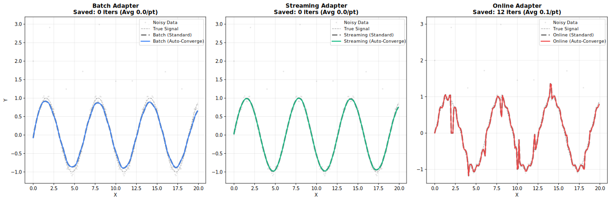

# Robustness

Outlier handling through iterative reweighting.

## How Robustness Works

Standard LOWESS can be biased by outliers. Robustness iterations downweight points with large residuals:

1. Fit initial LOWESS
2. Compute residuals
3. Assign robustness weights (large residuals → low weight)
4. Refit using combined distance × robustness weights
5. Repeat steps 2–4


---

## Robustness Methods

### Bisquare (Default)

Smooth downweighting. Points transition gradually from full weight to zero.

$$w(u) = \begin{cases} (1 - u^2)^2 & |u| < 1 \\ 0 & |u| \geq 1 \end{cases}$$

**Use when**: General purpose, balanced approach.

=== "R"
    ```r
    result <- fastlowess(x, y, iterations = 3, robustness_method = "bisquare")
    ```

=== "Python"
    ```python
    result = fl.smooth(x, y, iterations=3, robustness_method="bisquare")
    ```

=== "Rust"
    ```rust
    let model = Lowess::new()
        .iterations(3)
        .robustness_method(Bisquare)
        .adapter(Batch)
        .build()?;
    ```

=== "Julia"
    ```julia
    result = smooth(x, y, iterations=3, robustness_method="bisquare")
    ```

---

### Huber

Linear penalty beyond threshold. Less aggressive than Bisquare.

$$w(u) = \begin{cases} 1 & |u| \leq k \\ k/|u| & |u| > k \end{cases}$$

**Use when**: Moderate outliers, want to retain some influence.

=== "R"
    ```r
    result <- fastlowess(x, y, iterations = 3, robustness_method = "huber")
    ```

=== "Python"
    ```python
    result = fl.smooth(x, y, iterations=3, robustness_method="huber")
    ```

=== "Rust"
    ```rust
    let model = Lowess::new()
        .iterations(3)
        .robustness_method(Huber)
        .adapter(Batch)
        .build()?;
    ```

=== "Julia"
    ```julia
    result = smooth(x, y, iterations=3, robustness_method="huber")
    ```

---

### Talwar

Hard threshold. Points are either fully weighted or completely excluded.

$$w(u) = \begin{cases} 1 & |u| \leq k \\ 0 & |u| > k \end{cases}$$

**Use when**: Extreme outliers, want binary exclusion.

=== "R"
    ```r
    result <- fastlowess(x, y, iterations = 3, robustness_method = "talwar")
    ```

=== "Python"
    ```python
    result = fl.smooth(x, y, iterations=3, robustness_method="talwar")
    ```

=== "Rust"
    ```rust
    let model = Lowess::new()
        .iterations(3)
        .robustness_method(Talwar)
        .adapter(Batch)
        .build()?;
    ```

=== "Julia"
    ```julia
    result = smooth(x, y, iterations=3, robustness_method="talwar")
    ```

---

## Comparison

| Method       | Transition | Aggressiveness | Use Case              |
|--------------|------------|----------------|-----------------------|
| **Bisquare** | Smooth     | Moderate       | General purpose       |
| **Huber**    | Gradual    | Mild           | Preserve influence    |
| **Talwar**   | Hard       | Strong         | Extreme contamination |

---

## Detecting Outliers

Use robustness weights to identify potential outliers:

=== "R"
    ```r
    result <- fastlowess(x, y, iterations = 5, return_robustness_weights = TRUE)

    weights <- result$robustness_weights
    outliers <- which(weights < 0.5)
    cat("Potential outliers at indices:", outliers, "\n")
    ```

=== "Python"
    ```python
    result = fl.smooth(x, y, iterations=5, return_robustness_weights=True)

    for i, w in enumerate(result["robustness_weights"]):
        if w < 0.5:
            print(f"Potential outlier at index {i}: weight = {w:.3f}")
    ```

=== "Rust"
    ```rust
    let model = Lowess::new()
        .iterations(5)
        .return_robustness_weights()
        .adapter(Batch)
        .build()?;

    let result = model.fit(&x, &y)?;
    
    if let Some(weights) = &result.robustness_weights {
        for (i, &w) in weights.iter().enumerate() {
            if w < 0.5 {
                println!("Potential outlier at index {}: weight = {:.3}", i, w);
            }
        }
    }
    ```

=== "Julia"
    ```julia
    result = smooth(x, y, iterations=5, return_robustness_weights=true)

    for (i, w) in enumerate(result.robustness_weights)
        if w < 0.5
            println("Potential outlier at index $i: weight = $w")
        end
    end
    ```

---

## Scale Estimation

Residuals are scaled before computing robustness weights. Two methods:

| Method  | Description               | Robustness          |
|---------|---------------------------|---------------------|
| **MAD** | Median Absolute Deviation | Very robust         |
| **MAR** | Mean Absolute Residual    | Less robust, faster |

=== "R"
    ```r
    result <- fastlowess(x, y, iterations = 3, scaling_method = "mad")
    ```

=== "Python"
    ```python
    result = fl.smooth(x, y, iterations=3, scaling_method="mad")
    ```

=== "Rust"
    ```rust
    let model = Lowess::new()
        .iterations(3)
        .scaling_method(MAD)  // Default
        .adapter(Batch)
        .build()?;
    ```

=== "Julia"
    ```julia
    result = smooth(x, y, iterations=3, scaling_method="mad")
    ```

---

## Auto-Convergence



Stop iterations early when weights stabilize:

!!! tip "Performance"
    Auto-convergence can significantly reduce computation when weights stabilize before reaching max iterations.

=== "R"
    ```r
    result <- fastlowess(x, y, iterations = 10, auto_converge = 1e-6)
    ```

=== "Python"
    ```python
    result = fl.smooth(x, y, iterations=10, auto_converge=1e-6)
    ```

=== "Rust"
    ```rust
    let model = Lowess::new()
        .iterations(10)           // Maximum iterations
        .auto_converge(1e-6)      // Stop when change < 1e-6
        .adapter(Batch)
        .build()?;
    ```

=== "Julia"
    ```julia
    result = smooth(x, y, iterations=10, auto_converge=1e-6)
    ```
