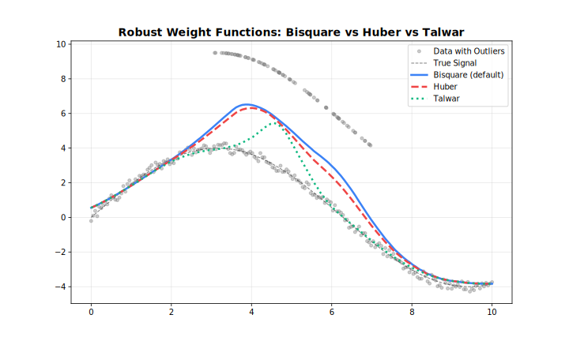
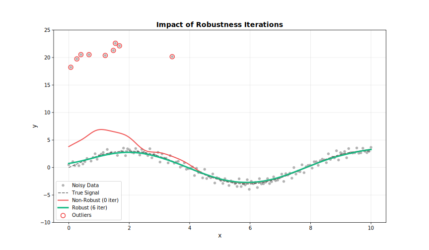

<!-- markdownlint-disable MD033 -->
# Robustness

Outlier handling through iterative reweighting.

## How Robustness Works

Standard LOWESS can be biased by outliers. Robustness iterations downweight points with large residuals:

1. Fit initial LOWESS
2. Compute residuals
3. Assign robustness weights (large residuals → low weight)
4. Refit using combined distance × robustness weights
5. Repeat steps 2–4





---

## Robustness Methods

### Bisquare (Default)

Smooth downweighting. Points transition gradually from full weight to zero.

$$w(u) = \begin{cases} (1 - u^2)^2 & |u| < 1 \\ 0 & |u| \geq 1 \end{cases}$$

**Use when**: General purpose, balanced approach.

=== "R"
    ```r
    library(rfastlowess)
    set.seed(42)
    x <- seq(0, 2 * pi, length.out = 100)
    y <- sin(x) + rnorm(100, sd = 0.3)

    model <- Lowess(iterations = 3, robustness_method = "bisquare")
    result <- model$fit(x, y)
    ```

=== "Python"
    ```python
    import fastlowess as fl
    import numpy as np

    rng = np.random.default_rng(42)
    x = np.linspace(0, 2 * np.pi, 100)
    y = np.sin(x) + rng.normal(0, 0.3, 100)

    model = fl.Lowess(iterations=3, robustness_method="bisquare")
    result = model.fit(x, y)
    ```

=== "Rust"
    ```rust
    use fastLowess::prelude::*;
    use std::f64::consts::TAU;

    fn main() -> Result<(), LowessError> {
        let n = 100usize;
        let x: Vec<f64> = (0..n).map(|i| i as f64 * TAU / (n - 1) as f64).collect();
        let y: Vec<f64> = x.iter().map(|&xi| xi.sin() + 0.1).collect();

        let model = Lowess::new()
            .iterations(3)
            .robustness_method("bisquare")
            .build()?;
        let result = model.fit(&x, &y)?;

        Ok(())
    }
    ```

=== "Julia"
    ```julia
    using FastLOWESS
    using Random, Statistics

    rng = MersenneTwister(42)
    x = collect(range(0, 2π, length=100))
    y = sin.(x) .+ randn(rng, 100) .* 0.3

    model = Lowess(; iterations=3, robustness_method="bisquare")
    result = fit(model, x, y)
    ```

=== "Node.js"
    ```javascript
    const { Lowess } = require('fastlowess');

    const n = 100;
    const x = Float64Array.from({ length: n }, (_, i) => i * 2 * Math.PI / (n - 1));
    const y = Float64Array.from(x, (xi, i) => Math.sin(xi) + (((i * 7 + 3) % 17) / 17 - 0.5) * 0.6);

    const model = new Lowess({ iterations: 3, robustness_method: "bisquare" });
    const result = model.fit(x, y);
    ```

=== "WebAssembly"
    ```javascript
    const { Lowess } = require('./fastlowess_wasm.js');

    const n = 100;
    const x = Float64Array.from({ length: n }, (_, i) => i * 2 * Math.PI / (n - 1));
    const y = Float64Array.from(x, (xi, i) => Math.sin(xi) + (((i * 7 + 3) % 17) / 17 - 0.5) * 0.6);

    const model = new Lowess({ iterations: 3, robustness_method: "bisquare" });
    const result = model.fit(x, y);
    ```

=== "C++"
    ```cpp
    #include <fastlowess.hpp>
    #include <cmath>
    #include <iostream>
    #include <vector>

    int main() {
        const int n = 100;
        std::vector<double> x(n), y(n);
        for (int i = 0; i < n; ++i) {
            x[i] = i * 2 * M_PI / (n - 1);
            y[i] = std::sin(x[i]) + 0.1;
        }

        fastlowess::Lowess model({ .iterations = 3,
            .robustness_method = "bisquare"
         });
        auto result = model.fit(x, y).value();

        return 0;
    }
    ```

---

### Huber

Linear penalty beyond threshold. Less aggressive than Bisquare.

$$w(u) = \begin{cases} 1 & |u| \leq k \\ k/|u| & |u| > k \end{cases}$$

**Use when**: Moderate outliers, want to retain some influence.

=== "R"
    ```r
    library(rfastlowess)
    set.seed(42)
    x <- seq(0, 2 * pi, length.out = 100)
    y <- sin(x) + rnorm(100, sd = 0.3)

    model <- Lowess(iterations = 3, robustness_method = "huber")
    result <- model$fit(x, y)
    ```

=== "Python"
    ```python
    import fastlowess as fl
    import numpy as np

    rng = np.random.default_rng(42)
    x = np.linspace(0, 2 * np.pi, 100)
    y = np.sin(x) + rng.normal(0, 0.3, 100)

    model = fl.Lowess(iterations=3, robustness_method="huber")
    result = model.fit(x, y)
    ```

=== "Rust"
    ```rust
    use fastLowess::prelude::*;
    use std::f64::consts::TAU;

    fn main() -> Result<(), LowessError> {
        let n = 100usize;
        let x: Vec<f64> = (0..n).map(|i| i as f64 * TAU / (n - 1) as f64).collect();
        let y: Vec<f64> = x.iter().map(|&xi| xi.sin() + 0.1).collect();

        let model = Lowess::new()
            .iterations(3)
            .robustness_method("huber")
            .build()?;
        let result = model.fit(&x, &y)?;

        Ok(())
    }
    ```

=== "Julia"
    ```julia
    using FastLOWESS
    using Random, Statistics

    rng = MersenneTwister(42)
    x = collect(range(0, 2π, length=100))
    y = sin.(x) .+ randn(rng, 100) .* 0.3

    model = Lowess(; iterations=3, robustness_method="huber")
    result = fit(model, x, y)
    ```

=== "Node.js"
    ```javascript
    const { Lowess } = require('fastlowess');

    const n = 100;
    const x = Float64Array.from({ length: n }, (_, i) => i * 2 * Math.PI / (n - 1));
    const y = Float64Array.from(x, (xi, i) => Math.sin(xi) + (((i * 7 + 3) % 17) / 17 - 0.5) * 0.6);

    const model = new Lowess({ iterations: 3, robustness_method: "huber" });
    const result = model.fit(x, y);
    ```

=== "WebAssembly"
    ```javascript
    const { Lowess } = require('./fastlowess_wasm.js');

    const n = 100;
    const x = Float64Array.from({ length: n }, (_, i) => i * 2 * Math.PI / (n - 1));
    const y = Float64Array.from(x, (xi, i) => Math.sin(xi) + (((i * 7 + 3) % 17) / 17 - 0.5) * 0.6);

    const model = new Lowess({ iterations: 3, robustness_method: "huber" });
    const result = model.fit(x, y);
    ```

=== "C++"
    ```cpp
    #include <fastlowess.hpp>
    #include <cmath>
    #include <iostream>
    #include <vector>

    int main() {
        const int n = 100;
        std::vector<double> x(n), y(n);
        for (int i = 0; i < n; ++i) {
            x[i] = i * 2 * M_PI / (n - 1);
            y[i] = std::sin(x[i]) + 0.1;
        }

        fastlowess::Lowess model({ .iterations = 3,
            .robustness_method = "huber"
         });
        auto result = model.fit(x, y).value();

        return 0;
    }
    ```

---

### Talwar

Hard threshold. Points are either fully weighted or completely excluded.

$$w(u) = \begin{cases} 1 & |u| \leq k \\ 0 & |u| > k \end{cases}$$

**Use when**: Extreme outliers, want binary exclusion.

=== "R"
    ```r
    library(rfastlowess)
    set.seed(42)
    x <- seq(0, 2 * pi, length.out = 100)
    y <- sin(x) + rnorm(100, sd = 0.3)

    model <- Lowess(iterations = 3, robustness_method = "talwar")
    result <- model$fit(x, y)
    ```

=== "Python"
    ```python
    import fastlowess as fl
    import numpy as np

    rng = np.random.default_rng(42)
    x = np.linspace(0, 2 * np.pi, 100)
    y = np.sin(x) + rng.normal(0, 0.3, 100)

    model = fl.Lowess(iterations=3, robustness_method="talwar")
    result = model.fit(x, y)
    ```

=== "Rust"
    ```rust
    use fastLowess::prelude::*;
    use std::f64::consts::TAU;

    fn main() -> Result<(), LowessError> {
        let n = 100usize;
        let x: Vec<f64> = (0..n).map(|i| i as f64 * TAU / (n - 1) as f64).collect();
        let y: Vec<f64> = x.iter().map(|&xi| xi.sin() + 0.1).collect();

        let model = Lowess::new()
            .iterations(3)
            .robustness_method("talwar")
            .build()?;
        let result = model.fit(&x, &y)?;

        Ok(())
    }
    ```

=== "Julia"
    ```julia
    using FastLOWESS
    using Random, Statistics

    rng = MersenneTwister(42)
    x = collect(range(0, 2π, length=100))
    y = sin.(x) .+ randn(rng, 100) .* 0.3

    model = Lowess(; iterations=3, robustness_method="talwar")
    result = fit(model, x, y)
    ```

=== "Node.js"
    ```javascript
    const { Lowess } = require('fastlowess');

    const n = 100;
    const x = Float64Array.from({ length: n }, (_, i) => i * 2 * Math.PI / (n - 1));
    const y = Float64Array.from(x, (xi, i) => Math.sin(xi) + (((i * 7 + 3) % 17) / 17 - 0.5) * 0.6);

    const model = new Lowess({ iterations: 3, robustness_method: "talwar" });
    const result = model.fit(x, y);
    ```

=== "WebAssembly"
    ```javascript
    const { Lowess } = require('./fastlowess_wasm.js');

    const n = 100;
    const x = Float64Array.from({ length: n }, (_, i) => i * 2 * Math.PI / (n - 1));
    const y = Float64Array.from(x, (xi, i) => Math.sin(xi) + (((i * 7 + 3) % 17) / 17 - 0.5) * 0.6);

    const model = new Lowess({ iterations: 3, robustness_method: "talwar" });
    const result = model.fit(x, y);
    ```

=== "C++"
    ```cpp
    #include <fastlowess.hpp>
    #include <cmath>
    #include <iostream>
    #include <vector>

    int main() {
        const int n = 100;
        std::vector<double> x(n), y(n);
        for (int i = 0; i < n; ++i) {
            x[i] = i * 2 * M_PI / (n - 1);
            y[i] = std::sin(x[i]) + 0.1;
        }

        fastlowess::Lowess model({ .iterations = 3,
            .robustness_method = "talwar"
         });
        auto result = model.fit(x, y).value();

        return 0;
    }
    ```

---

## Comparison

| Method | Transition | Aggressiveness | Use Case |
| --- | --- | --- | --- |
| **Bisquare** | Smooth | Moderate | General purpose |
| **Huber** | Gradual | Mild | Preserve influence |
| **Talwar** | Hard | Strong | Extreme contamination |

---

## Detecting Outliers

Use robustness weights to identify potential outliers:

=== "R"
    ```r
    library(rfastlowess)
    set.seed(42)
    x <- seq(0, 2 * pi, length.out = 100)
    y <- sin(x) + rnorm(100, sd = 0.3)

    model <- Lowess(iterations = 5, return_robustness_weights = TRUE)
    result <- model$fit(x, y)

    weights <- result$robustness_weights
    outliers <- which(weights < 0.5)
    cat("Potential outliers at indices:", outliers, "\n")
    ```

=== "Python"
    ```python
    import fastlowess as fl
    import numpy as np

    rng = np.random.default_rng(42)
    x = np.linspace(0, 2 * np.pi, 100)
    y = np.sin(x) + rng.normal(0, 0.3, 100)

    model = fl.Lowess(iterations=5, return_robustness_weights=True)
    result = model.fit(x, y)

    for i, w in enumerate(result.robustness_weights):
        if w < 0.5:
            print(f"Potential outlier at index {i}: weight = {w:.3f}")
    ```

=== "Rust"
    ```rust
    use fastLowess::prelude::*;
    use std::f64::consts::TAU;

    fn main() -> Result<(), LowessError> {
        let n = 100usize;
        let x: Vec<f64> = (0..n).map(|i| i as f64 * TAU / (n - 1) as f64).collect();
        let y: Vec<f64> = x.iter().map(|&xi| xi.sin() + 0.1).collect();

        let model = Lowess::new()
            .iterations(5)
            .return_robustness_weights()
            .build()?;

        let result = model.fit(&x, &y)?;

        if let Some(weights) = &result.robustness_weights {
            for (i, &w) in weights.iter().enumerate() {
                if w < 0.5 {
                    println!("Potential outlier at index {}: weight = {:.3}", i, w);
                }
            }
        }

        Ok(())
    }
    ```

=== "Julia"
    ```julia
    using FastLOWESS
    using Random, Statistics

    rng = MersenneTwister(42)
    x = collect(range(0, 2π, length=100))
    y = sin.(x) .+ randn(rng, 100) .* 0.3

    model = Lowess(; iterations=5, return_robustness_weights=true)
    result = fit(model, x, y)

    for (i, w) in enumerate(result.robustness_weights)
        if w < 0.5
            println("Potential outlier at index $i: weight = $w")
        end
    end
    ```

=== "Node.js"
    ```javascript
    const { Lowess } = require('fastlowess');

    const n = 100;
    const x = Float64Array.from({ length: n }, (_, i) => i * 2 * Math.PI / (n - 1));
    const y = Float64Array.from(x, (xi, i) => Math.sin(xi) + (((i * 7 + 3) % 17) / 17 - 0.5) * 0.6);

    const model = new Lowess({ iterations: 5, return_robustness_weights: true });
    const result = model.fit(x, y);

    result.robustness_weights.forEach((w, i) => {
        if (w < 0.5) {
            console.log(`Potential outlier at index ${i}: weight = ${w.toFixed(3)}`);
        }
    });
    ```

=== "WebAssembly"
    ```javascript
    const { Lowess } = require('./fastlowess_wasm.js');

    const n = 100;
    const x = Float64Array.from({ length: n }, (_, i) => i * 2 * Math.PI / (n - 1));
    const y = Float64Array.from(x, (xi, i) => Math.sin(xi) + (((i * 7 + 3) % 17) / 17 - 0.5) * 0.6);

    const model = new Lowess({ iterations: 5, return_robustness_weights: true });
    const result = model.fit(x, y);

    result.robustness_weights.forEach((w, i) => {
        if (w < 0.5) {
            console.log(`Potential outlier at index ${i}: weight = ${w.toFixed(3)}`);
        }
    });
    ```

=== "C++"
    ```cpp
    #include <fastlowess.hpp>
    #include <cmath>
    #include <iostream>
    #include <vector>

    int main() {
        const int n = 100;
        std::vector<double> x(n), y(n);
        for (int i = 0; i < n; ++i) {
            x[i] = i * 2 * M_PI / (n - 1);
            y[i] = std::sin(x[i]) + 0.1;
        }

        fastlowess::Lowess model({ .iterations = 5,
            .return_robustness_weights = true
         });
        auto result = model.fit(x, y).value();

        auto weights = result.robustness_weights();
        for (size_t i = 0; i < weights.size(); ++i) {
            if (weights[i] < 0.5) {
                std::cout << "Potential outlier at " << i << std::endl;
            }
        }

        return 0;
    }
    ```

---

## Scale Estimation

Residuals are scaled before computing robustness weights. Two methods:

| Method | Formula | Robustness |
| --- | --- | --- |
| **MAD** | `median(\|r − median(r)\|)` | Very robust (default) |
| **MAR** | `median(\|r\|)` | Robust, uncentered |
| **Mean** | `mean(\|r\|)` | Less robust, fastest |


=== "R"
    ```r
    library(rfastlowess)
    set.seed(42)
    x <- seq(0, 2 * pi, length.out = 100)
    y <- sin(x) + rnorm(100, sd = 0.3)

    model <- Lowess(iterations = 3, scaling_method = "mad")
    result <- model$fit(x, y)
    ```

=== "Python"
    ```python
    import fastlowess as fl
    import numpy as np

    rng = np.random.default_rng(42)
    x = np.linspace(0, 2 * np.pi, 100)
    y = np.sin(x) + rng.normal(0, 0.3, 100)

    model = fl.Lowess(iterations=3, scaling_method="mad")
    result = model.fit(x, y)
    ```

=== "Rust"
    ```rust
    use fastLowess::prelude::*;
    use std::f64::consts::TAU;

    fn main() -> Result<(), LowessError> {
        let n = 100usize;
        let x: Vec<f64> = (0..n).map(|i| i as f64 * TAU / (n - 1) as f64).collect();
        let y: Vec<f64> = x.iter().map(|&xi| xi.sin() + 0.1).collect();

        let model = Lowess::new()
            .iterations(3)
            .scaling_method("mad")  // Default
            .build()?;
        let result = model.fit(&x, &y)?;

        Ok(())
    }
    ```

=== "Julia"
    ```julia
    using FastLOWESS
    using Random, Statistics

    rng = MersenneTwister(42)
    x = collect(range(0, 2π, length=100))
    y = sin.(x) .+ randn(rng, 100) .* 0.3

    model = Lowess(; iterations=3, scaling_method="mad")
    result = fit(model, x, y)
    ```

=== "Node.js"
    ```javascript
    const { Lowess } = require('fastlowess');

    const n = 100;
    const x = Float64Array.from({ length: n }, (_, i) => i * 2 * Math.PI / (n - 1));
    const y = Float64Array.from(x, (xi, i) => Math.sin(xi) + (((i * 7 + 3) % 17) / 17 - 0.5) * 0.6);

    const model = new Lowess({ iterations: 3, scaling_method: "mad" });
    const result = model.fit(x, y);
    ```

=== "WebAssembly"
    ```javascript
    const { Lowess } = require('./fastlowess_wasm.js');

    const n = 100;
    const x = Float64Array.from({ length: n }, (_, i) => i * 2 * Math.PI / (n - 1));
    const y = Float64Array.from(x, (xi, i) => Math.sin(xi) + (((i * 7 + 3) % 17) / 17 - 0.5) * 0.6);

    const model = new Lowess({ iterations: 3, scaling_method: "mad" });
    const result = model.fit(x, y);
    ```

=== "C++"
    ```cpp
    #include <fastlowess.hpp>
    #include <cmath>
    #include <iostream>
    #include <vector>

    int main() {
        const int n = 100;
        std::vector<double> x(n), y(n);
        for (int i = 0; i < n; ++i) {
            x[i] = i * 2 * M_PI / (n - 1);
            y[i] = std::sin(x[i]) + 0.1;
        }

        fastlowess::Lowess model({ .iterations = 3,
            .scaling_method = "mad"
         });
        auto result = model.fit(x, y).value();

        return 0;
    }
    ```

---

## Auto-Convergence

Stop iterations early when weights stabilize:

!!! tip "Performance"
    Auto-convergence can significantly reduce computation when weights stabilize before reaching max iterations.

=== "R"
    ```r
    library(rfastlowess)
    set.seed(42)
    x <- seq(0, 2 * pi, length.out = 100)
    y <- sin(x) + rnorm(100, sd = 0.3)

    model <- Lowess(iterations = 10, auto_converge = 1e-6)
    result <- model$fit(x, y)
    ```

=== "Python"
    ```python
    import fastlowess as fl
    import numpy as np

    rng = np.random.default_rng(42)
    x = np.linspace(0, 2 * np.pi, 100)
    y = np.sin(x) + rng.normal(0, 0.3, 100)

    model = fl.Lowess(iterations=10, auto_converge=1e-6)
    result = model.fit(x, y)
    ```

=== "Rust"
    ```rust
    use fastLowess::prelude::*;
    use std::f64::consts::TAU;

    fn main() -> Result<(), LowessError> {
        let n = 100usize;
        let x: Vec<f64> = (0..n).map(|i| i as f64 * TAU / (n - 1) as f64).collect();
        let y: Vec<f64> = x.iter().map(|&xi| xi.sin() + 0.1).collect();

        let model = Lowess::new()
            .iterations(10)           // Maximum iterations
            .auto_converge(1e-6)      // Stop when change < 1e-6
            .build()?;
        let result = model.fit(&x, &y)?;

        Ok(())
    }
    ```

=== "Julia"
    ```julia
    using FastLOWESS
    using Random, Statistics

    rng = MersenneTwister(42)
    x = collect(range(0, 2π, length=100))
    y = sin.(x) .+ randn(rng, 100) .* 0.3

    model = Lowess(; iterations=10, auto_converge=1e-6)
    result = fit(model, x, y)
    ```

=== "Node.js"
    ```javascript
    const { Lowess } = require('fastlowess');

    const n = 100;
    const x = Float64Array.from({ length: n }, (_, i) => i * 2 * Math.PI / (n - 1));
    const y = Float64Array.from(x, (xi, i) => Math.sin(xi) + (((i * 7 + 3) % 17) / 17 - 0.5) * 0.6);

    const model = new Lowess({ iterations: 10, auto_converge: 1e-6 });
    const result = model.fit(x, y);
    ```

=== "WebAssembly"
    ```javascript
    const { Lowess } = require('./fastlowess_wasm.js');

    const n = 100;
    const x = Float64Array.from({ length: n }, (_, i) => i * 2 * Math.PI / (n - 1));
    const y = Float64Array.from(x, (xi, i) => Math.sin(xi) + (((i * 7 + 3) % 17) / 17 - 0.5) * 0.6);

    const model = new Lowess({ iterations: 10, auto_converge: 1e-6 });
    const result = model.fit(x, y);
    ```

=== "C++"
    ```cpp
    #include <fastlowess.hpp>
    #include <cmath>
    #include <iostream>
    #include <vector>

    int main() {
        const int n = 100;
        std::vector<double> x(n), y(n);
        for (int i = 0; i < n; ++i) {
            x[i] = i * 2 * M_PI / (n - 1);
            y[i] = std::sin(x[i]) + 0.1;
        }

        fastlowess::Lowess model({ .iterations = 10,
            .auto_converge = 1e-6
         });
        auto result = model.fit(x, y).value();

        return 0;
    }
    ```
