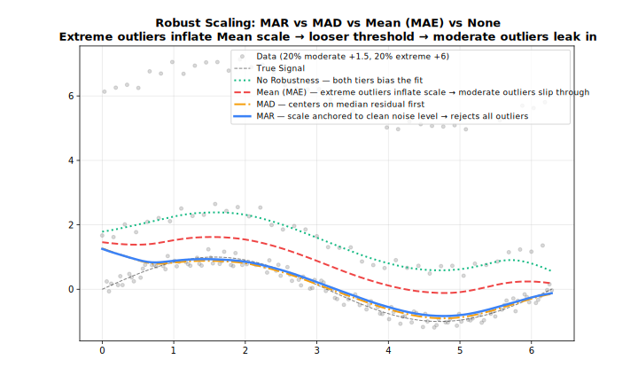

<!-- markdownlint-disable MD024 -->
# Scaling Methods

Residual scale estimation during robustness iterations.

## Overview

When `iterations > 0`, LOWESS computes robustness weights by comparing each residual to the current residual scale estimate. The `scaling_method` parameter controls how that scale is measured.

The robustness weight for point $i$ is:

$$w_i = B\!\left(\frac{|r_i|}{6 \cdot \hat{\sigma}}\right)$$

where $B$ is the bisquare function and $\hat{\sigma}$ is the scale estimate. A larger $\hat{\sigma}$ makes the algorithm more tolerant of large residuals; a smaller one makes it more aggressive.

| Method | Formula | Robustness | Speed |
| --- | --- | --- | --- |
| `"mad"` | Median of \|residuals − median(residuals)\| | Very robust | Moderate |
| `"mar"` | Median of \|residuals\| | Robust | Fast |
| `"mean"` | Mean of \|residuals\| | Less robust | Fastest |



---

## MAD — Median Absolute Deviation (Default)

$$\hat{\sigma} = \text{median}(|r_i - \text{median}(r_i)|)$$

First centers residuals at their median, then takes the median of the absolute deviations. Double use of the median makes it highly resistant to extreme outliers. This is the standard choice for robust regression.

**Use when**: Data may contain outliers (default for most applications).

=== "R"
    ```r
    model <- Lowess(iterations = 3, scaling_method = "mad")
    result <- model$fit(x, y)
    ```

=== "Python"
    ```python
    model = fl.Lowess(iterations=3, scaling_method="mad")
    result = model.fit(x, y)
    ```

=== "Rust"
    ```rust
    let model = Lowess::new()
        .iterations(3)
        .scaling_method("mad")
        .build()?;
    let result = model.fit(&x, &y)?;
    ```

=== "Julia"
    ```julia
    model = Lowess(; iterations=3, scaling_method="mad")
    result = fit(model, x, y)
    ```

=== "Node.js"
    ```javascript
    const model = new Lowess({ iterations: 3, scaling_method: "mad" });
    const result = model.fit(x, y);
    ```

=== "WebAssembly"
    ```javascript
    const model = new Lowess({ iterations: 3, scaling_method: "mad" });
    const result = model.fit(x, y);
    ```

=== "C++"
    ```cpp
    fastlowess::Lowess model({ .iterations = 3, .scaling_method = "mad" });
    auto result = model.fit(x, y).value();
    ```

---

## MAR — Median Absolute Residual

$$\hat{\sigma} = \text{median}(|r_i|)$$

Uses the uncentered median — unlike MAD it does not subtract the residual median first. Still robust (median-based) but slightly less resistant than MAD when residuals are systematically shifted. Faster than MAD in practice because it requires only one partial sort.

**Use when**: Speed matters and data have minimal systematic bias in residuals.

=== "R"
    ```r
    model <- Lowess(iterations = 3, scaling_method = "mar")
    result <- model$fit(x, y)
    ```

=== "Python"
    ```python
    model = fl.Lowess(iterations=3, scaling_method="mar")
    result = model.fit(x, y)
    ```

=== "Rust"
    ```rust
    let model = Lowess::new()
        .iterations(3)
        .scaling_method("mar")
        .build()?;
    let result = model.fit(&x, &y)?;
    ```

=== "Julia"
    ```julia
    model = Lowess(; iterations=3, scaling_method="mar")
    result = fit(model, x, y)
    ```

=== "Node.js"
    ```javascript
    const model = new Lowess({ iterations: 3, scaling_method: "mar" });
    const result = model.fit(x, y);
    ```

=== "WebAssembly"
    ```javascript
    const model = new Lowess({ iterations: 3, scaling_method: "mar" });
    const result = model.fit(x, y);
    ```

=== "C++"
    ```cpp
    fastlowess::Lowess model({ .iterations = 3, .scaling_method = "mar" });
    auto result = model.fit(x, y).value();
    ```

---

## Mean — Mean Absolute Residual

$$\hat{\sigma} = \frac{1}{n}\sum_i |r_i|$$

Arithmetic mean of absolute residuals. Non-robust: a single extreme outlier inflates $\hat{\sigma}$, causing the algorithm to under-downweight it. Fastest to compute (no sort required). Useful when data are believed to be clean and speed is a priority.

**Use when**: Clean data with no outliers; maximum computation speed required.

=== "R"
    ```r
    model <- Lowess(iterations = 3, scaling_method = "mean")
    result <- model$fit(x, y)
    ```

=== "Python"
    ```python
    model = fl.Lowess(iterations=3, scaling_method="mean")
    result = model.fit(x, y)
    ```

=== "Rust"
    ```rust
    let model = Lowess::new()
        .iterations(3)
        .scaling_method("mean")
        .build()?;
    let result = model.fit(&x, &y)?;
    ```

=== "Julia"
    ```julia
    model = Lowess(; iterations=3, scaling_method="mean")
    result = fit(model, x, y)
    ```

=== "Node.js"
    ```javascript
    const model = new Lowess({ iterations: 3, scaling_method: "mean" });
    const result = model.fit(x, y);
    ```

=== "WebAssembly"
    ```javascript
    const model = new Lowess({ iterations: 3, scaling_method: "mean" });
    const result = model.fit(x, y);
    ```

=== "C++"
    ```cpp
    fastlowess::Lowess model({ .iterations = 3, .scaling_method = "mean" });
    auto result = model.fit(x, y).value();
    ```

---

## Choosing a Scaling Method

| Situation | Recommended Method |
| --- | --- |
| General purpose, possible outliers | `"mad"` (default) |
| Robust but faster, low systematic bias | `"mar"` |
| Clean data, no outliers | `"mean"` |

See [Robustness](robustness.md) for a broader discussion of outlier handling.
