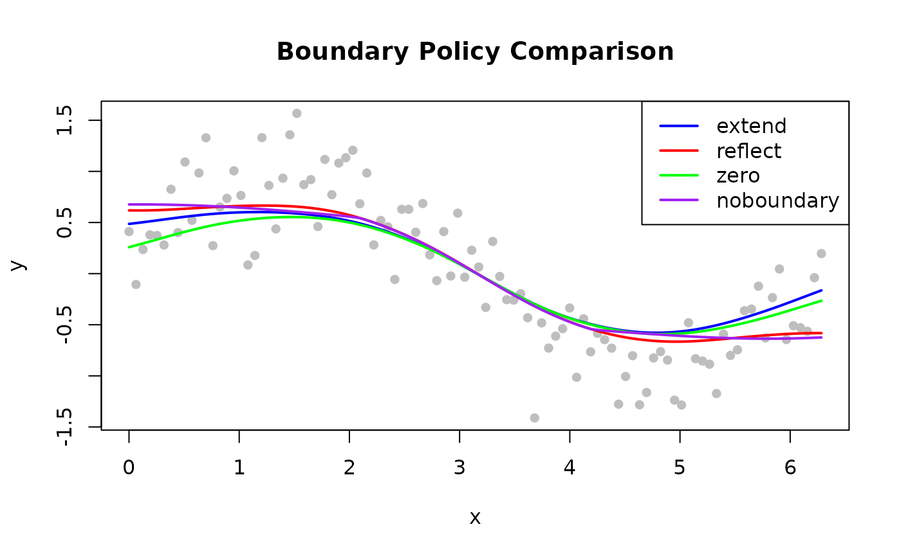

# Boundary Handling

## Overview


Boundary policy comparison

Standard LOWESS neighbourhoods become asymmetric at the boundaries:
fewer points exist on one side, pulling the local fit toward the data
interior. The `boundary_policy` parameter controls how the data is
padded to mitigate this effect.

| Policy         | Padding Strategy                | Best For                    |
|----------------|---------------------------------|-----------------------------|
| `"extend"`     | Repeat first / last value       | Most datasets (default)     |
| `"reflect"`    | Mirror data at boundaries       | Periodic or symmetric data  |
| `"zero"`       | Pad with zeros                  | Data known to approach zero |
| `"noboundary"` | No padding (Cleveland original) | Reference behaviour         |

------------------------------------------------------------------------

## Extend (Default)

Pads beyond both endpoints by replicating the first and last observed
values. Prevents the fit from curling toward zero.

**Use when**: No strong prior on boundary behaviour; general-purpose
smoothing.

``` r

library(rfastlowess)
set.seed(42)
x <- seq(0, 2 * pi, length.out = 100)
y <- sin(x) + rnorm(100, sd = 0.3)

model <- Lowess(boundary_policy = "extend")
result <- fit(model, x, y)
print(head(result$y))
#> [1] 0.4862648 0.4942855 0.5026953 0.5114688 0.5205144 0.5296957
```

------------------------------------------------------------------------

## Reflect

Mirrors data at both endpoints. Prevents inflection artifacts when the
signal is periodic or symmetric.

**Use when**: Signal is periodic (e.g. time-of-day) or the boundary is a
known symmetry point.

``` r

model <- Lowess(boundary_policy = "reflect")
result <- fit(model, x, y)
print(head(result$y))
#> [1] 0.6186141 0.6178251 0.6179654 0.6190096 0.6208929 0.6235246
```

------------------------------------------------------------------------

## Zero

Pads with zeros beyond the endpoints.

**Use when**: The signal is known to decay to zero at the boundaries
(e.g. impulse responses, genomic signals at chromosome ends).

``` r

model <- Lowess(boundary_policy = "zero")
result <- fit(model, x, y)
print(head(result$y))
#> [1] 0.2584769 0.2767076 0.2953720 0.3144259 0.3337405 0.3531253
```

------------------------------------------------------------------------

## No Boundary Padding

Reproduces Cleveland’s original behaviour — no padding applied.

**Use when**: Comparing against reference implementations; the original
Cleveland algorithm behaviour is required.

> **Note:** Without padding, boundary fits can have higher variance and
> visible edge artefacts, particularly with small `fraction` values.

``` r

model <- Lowess(boundary_policy = "noboundary")
result <- fit(model, x, y)
print(head(result$y))
#> [1] 0.6766520 0.6769305 0.6769029 0.6765617 0.6759035 0.6749280
```

------------------------------------------------------------------------

## Comparing Policies

``` r

library(rfastlowess)
set.seed(42)
x <- seq(0, 2 * pi, length.out = 100)
y <- sin(x) + rnorm(100, sd = 0.3)

policies <- c("extend", "reflect", "zero", "noboundary")
colors   <- c("blue", "red", "green", "purple")

plot(x, y, pch = 16, col = "gray",
    main = "Boundary Policy Comparison")

for (i in seq_along(policies)) {
    model  <- Lowess(boundary_policy = policies[i])
    result <- fit(model, x, y)
    lines(result$x, result$y, col = colors[i], lwd = 2)
}

legend("topright", policies, col = colors, lwd = 2)
```



``` r

sessionInfo()
#> R version 4.6.1 (2026-06-24)
#> Platform: x86_64-pc-linux-gnu
#> Running under: Ubuntu 24.04.4 LTS
#> 
#> Matrix products: default
#> BLAS:   /usr/lib/x86_64-linux-gnu/openblas-pthread/libblas.so.3 
#> LAPACK: /usr/lib/x86_64-linux-gnu/openblas-pthread/libopenblasp-r0.3.26.so;  LAPACK version 3.12.0
#> 
#> locale:
#>  [1] LC_CTYPE=C.UTF-8       LC_NUMERIC=C           LC_TIME=C.UTF-8       
#>  [4] LC_COLLATE=C.UTF-8     LC_MONETARY=C.UTF-8    LC_MESSAGES=C.UTF-8   
#>  [7] LC_PAPER=C.UTF-8       LC_NAME=C              LC_ADDRESS=C          
#> [10] LC_TELEPHONE=C         LC_MEASUREMENT=C.UTF-8 LC_IDENTIFICATION=C   
#> 
#> time zone: UTC
#> tzcode source: system (glibc)
#> 
#> attached base packages:
#> [1] stats     graphics  grDevices utils     datasets  methods   base     
#> 
#> other attached packages:
#> [1] rfastlowess_3.0.0 BiocStyle_2.40.0 
#> 
#> loaded via a namespace (and not attached):
#>  [1] cli_3.6.6           knitr_1.51          rlang_1.3.0        
#>  [4] xfun_0.60           otel_0.2.0          generics_0.1.4     
#>  [7] textshaping_1.0.5   jsonlite_2.0.0      htmltools_0.5.9    
#> [10] ragg_1.5.2          sass_0.4.10         rmarkdown_2.31     
#> [13] evaluate_1.0.5      jquerylib_0.1.4     fastmap_1.2.0      
#> [16] yaml_2.3.12         lifecycle_1.0.5     bookdown_0.47      
#> [19] BiocManager_1.30.27 compiler_4.6.1      fs_2.1.0           
#> [22] htmlwidgets_1.6.4   systemfonts_1.3.2   digest_0.6.39      
#> [25] R6_2.6.1            bslib_0.12.0        tools_4.6.1        
#> [28] BiocGenerics_0.58.1 pkgdown_2.2.1       cachem_1.1.0       
#> [31] desc_1.4.3
```
