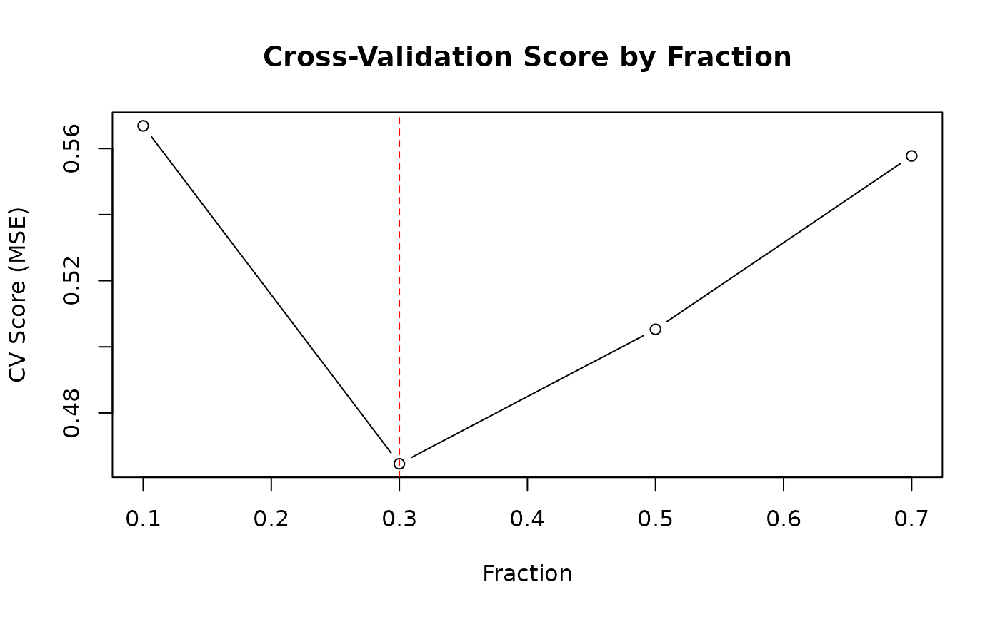

# Cross-Validation

## Overview


Cross-validation comparison

Cross-validation helps select the optimal `fraction` parameter by
evaluating performance on held-out data.

------------------------------------------------------------------------

## K-Fold Cross-Validation

Split data into K folds, train on K-1, validate on 1. Repeat for each
fold and average the scores.

``` r

library(rfastlowess)
set.seed(42)
x <- seq(0, 2 * pi, length.out = 100)
y <- sin(x) + rnorm(100, sd = 0.3)

model <- Lowess(
    cv_method = "kfold",
    cv_k = 5,
    cv_fractions = c(0.2, 0.3, 0.5, 0.7)
)
result <- fit(model, x, y)

cat("Selected fraction:", result$fraction_used, "\n")
#> Selected fraction: 0.3
cat("CV scores:", result$cv_scores, "\n")
#> CV scores: 0.4753221 0.43492 0.491747 0.5442841
```

### Parameters

| Parameter      | Default   | Description                         |
|----------------|-----------|-------------------------------------|
| `cv_method`    | `NULL`    | `"kfold"` or `"loocv"`              |
| `cv_k`         | 5         | Number of folds (k-fold only)       |
| `cv_fractions` | automatic | Candidate fraction values to search |

------------------------------------------------------------------------

## Leave-One-Out Cross-Validation (LOOCV)

Each point is held out once. More thorough but slower than k-fold.

``` r

library(rfastlowess)
set.seed(42)
x <- seq(0, 2 * pi, length.out = 100)
y <- sin(x) + rnorm(100, sd = 0.3)

model <- Lowess(
    cv_method = "loocv",
    cv_fractions = c(0.2, 0.3, 0.5, 0.7)
)
result <- fit(model, x, y)

cat("Selected fraction:", result$fraction_used, "\n")
#> Selected fraction: 0.3
```

------------------------------------------------------------------------

## Custom Fraction Grid

Provide a fine grid of candidate fractions for more precise selection.

``` r

library(rfastlowess)
set.seed(42)
x <- seq(0, 2 * pi, length.out = 100)
y <- sin(x) + rnorm(100, sd = 0.3)

fractions <- seq(0.1, 0.9, by = 0.05)

model <- Lowess(
    cv_method = "kfold",
    cv_k = 10,
    cv_fractions = fractions
)
result <- fit(model, x, y)

cat("Best fraction:", result$fraction_used, "\n")
#> Best fraction: 0.2
cat("CV scores:\n")
#> CV scores:
cat("CV scores by fraction:\n")
#> CV scores by fraction:
print(data.frame(fraction = fractions, score = result$cv_scores))
#>    fraction     score
#> 1      0.10 0.3851899
#> 2      0.15 0.3711534
#> 3      0.20 0.3508004
#> 4      0.25 0.3517818
#> 5      0.30 0.3568073
#> 6      0.35 0.3651356
#> 7      0.40 0.3839338
#> 8      0.45 0.3965866
#> 9      0.50 0.4080908
#> 10     0.55 0.4202877
#> 11     0.60 0.4398273
#> 12     0.65 0.4541805
#> 13     0.70 0.4652196
#> 14     0.75 0.4796631
#> 15     0.80 0.5049745
#> 16     0.85 0.5205908
#> 17     0.90 0.5358147
```

------------------------------------------------------------------------

## Inspecting CV Results

After fitting, `result$cv_scores` contains the CV score for each
candidate fraction in the order they were passed.

``` r

library(rfastlowess)
set.seed(42)
x <- seq(0, 2 * pi, length.out = 100)
y <- sin(x) + rnorm(100, sd = 0.3)

fractions <- c(0.1, 0.2, 0.3, 0.5, 0.7)
model <- Lowess(cv_method = "kfold", cv_fractions = fractions)
result <- fit(model, x, y)

plot(fractions, result$cv_scores, type = "b",
    xlab = "Fraction", ylab = "CV Score (MSE)",
    main = "Cross-Validation Score by Fraction")
abline(v = result$fraction_used, col = "red", lty = 2)
```



------------------------------------------------------------------------

## Seeded Randomization

Set a seed for reproducible fold assignments in k-fold CV:

``` r

library(rfastlowess)
set.seed(42)
x <- seq(0, 2 * pi, length.out = 100)
y <- sin(x) + rnorm(100, sd = 0.3)

model <- Lowess(
    cv_method = "kfold",
    cv_k = 5,
    cv_fractions = c(0.2, 0.3, 0.5, 0.7),
    cv_seed = 42L
)
result <- fit(model, x, y)
cat("Selected fraction:", result$fraction_used, "\n")
#> Selected fraction: 0.7
```

------------------------------------------------------------------------

## Method Comparison

| Method        | Folds | Speed  | Variance | Bias   |
|---------------|-------|--------|----------|--------|
| **KFold(5)**  | 5     | Fast   | Moderate | Low    |
| **KFold(10)** | 10    | Medium | Lower    | Lower  |
| **LOOCV**     | N     | Slow   | Lowest   | Lowest |

Use **5-fold** or **10-fold** CV for most applications. LOOCV is only
worth it for small datasets (N \< 100).

``` r

sessionInfo()
#> R version 4.6.1 (2026-06-24)
#> Platform: x86_64-pc-linux-gnu
#> Running under: Ubuntu 24.04.4 LTS
#> 
#> Matrix products: default
#> BLAS:   /usr/lib/x86_64-linux-gnu/openblas-pthread/libblas.so.3 
#> LAPACK: /usr/lib/x86_64-linux-gnu/openblas-pthread/libopenblasp-r0.3.26.so;  LAPACK version 3.12.0
#> 
#> locale:
#>  [1] LC_CTYPE=C.UTF-8       LC_NUMERIC=C           LC_TIME=C.UTF-8       
#>  [4] LC_COLLATE=C.UTF-8     LC_MONETARY=C.UTF-8    LC_MESSAGES=C.UTF-8   
#>  [7] LC_PAPER=C.UTF-8       LC_NAME=C              LC_ADDRESS=C          
#> [10] LC_TELEPHONE=C         LC_MEASUREMENT=C.UTF-8 LC_IDENTIFICATION=C   
#> 
#> time zone: UTC
#> tzcode source: system (glibc)
#> 
#> attached base packages:
#> [1] stats     graphics  grDevices utils     datasets  methods   base     
#> 
#> other attached packages:
#> [1] rfastlowess_3.0.0
#> 
#> loaded via a namespace (and not attached):
#>  [1] digest_0.6.39     desc_1.4.3        R6_2.6.1          fastmap_1.2.0    
#>  [5] xfun_0.60         cachem_1.1.0      knitr_1.51        htmltools_0.5.9  
#>  [9] rmarkdown_2.31    lifecycle_1.0.5   cli_3.6.6         sass_0.4.10      
#> [13] pkgdown_2.2.1     textshaping_1.0.5 jquerylib_0.1.4   systemfonts_1.3.2
#> [17] compiler_4.6.1    tools_4.6.1       ragg_1.5.2        bslib_0.12.0     
#> [21] evaluate_1.0.5    yaml_2.3.12       otel_0.2.0        jsonlite_2.0.0   
#> [25] rlang_1.3.0       fs_2.1.0          htmlwidgets_1.6.4
```
