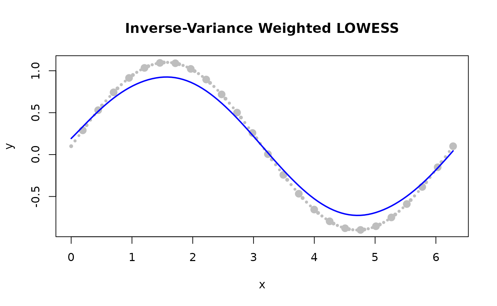

# Custom Weights

## How Custom Weights Work

Standard LOWESS assigns equal prior trust to all observations. Custom
weights let you override this assumption point by point — before any
distance or robustness weighting is applied.

The effective weight of observation $`j`$ in a local fit centred at
$`x_i`$ is:

``` math
w_{ij} = \text{custom\_weights}[j] \times K\!\left(\frac{d_{ij}}{h_i}\right)
\times r_j
```

where $`K`$ is the distance kernel, $`h_i`$ is the local bandwidth, and
$`r_j`$ is the robustness weight from the current iteration.

> **Batch adapter only:** `custom_weights` applies in **Batch** mode. It
> is silently ignored in Streaming and Online adapters.

------------------------------------------------------------------------

## When to Use Custom Weights

| Situation                            | Recommended weight     |
|--------------------------------------|------------------------|
| Point known to be erroneous          | `0.0` — fully excluded |
| Unreliable sensor / low precision    | `0.1 – 0.5`            |
| Standard observation                 | `1.0` (default)        |
| Carefully calibrated measurement     | `> 1.0`                |
| Measurement uncertainty $`\sigma_i`$ | $`1 / \sigma_i^2`$     |

### Custom Weights vs. Robustness Iterations

Both mechanisms handle unreliable data, but they serve different
purposes:

|  | Custom Weights | Robustness Iterations |
|----|----|----|
| **When known** | Before fitting | Computed from residuals |
| **Knowledge required** | Prior knowledge of quality | None — data-driven |
| **Effect** | Fixed throughout fit | Adapts each iteration |
| **Use case** | Known bad sensors | Unknown outlier contamination |

They compose: you can use both simultaneously. Custom weights suppress
*a priori* bad points; robustness iterations then handle any *residual*
outliers that remain.

------------------------------------------------------------------------

## Basic Usage

### Suppress a Known Outlier

Set the weight to `0` at the bad point — it is excluded from every local
fit that would otherwise include it.

``` r

library(rfastlowess)

x <- 1:10
y <- x * 2.0
y[6] <- 100.0              # spike at index 6

weights <- rep(1.0, 10)
weights[6] <- 0.0          # exclude the spike

model <- Lowess(fraction = 0.5, iterations = 0L)
result <- fit(model, x, y, custom_weights = weights)
cat("Smoothed y[0]:", result$y[1], "\n")
#> Smoothed y[0]: 2.572621
```

------------------------------------------------------------------------

### Emphasize Important Points

Assign high weights to measurements you trust most — calibration
standards, reference instruments, or low-noise observations.

``` r

library(rfastlowess)
x <- seq(0, 2 * pi, length.out = 100)
y <- sin(x) + 0.1
calibration_indices <- c(6, 21, 41, 61, 81)

weights <- rep(1.0, length(x))
weights[calibration_indices] <- 10.0

model <- Lowess(fraction = 0.5)
result <- fit(model, x, y, custom_weights = weights)
cat("Smoothed y[0]:", result$y[1], "\n")
#> Smoothed y[0]: 0.323742
```

------------------------------------------------------------------------

### Propagate Measurement Uncertainty

If each observation has a known standard deviation $`\sigma_i`$, set
$`w_i = 1 / \sigma_i^2`$ to give the fit information-theoretically
optimal weighting.

``` r

library(rfastlowess)
x <- seq(0, 2 * pi, length.out = 100)
y <- sin(x) + 0.1
sigma <- 0.1 + (seq_along(x) %% 4) * 0.1

weights <- 1 / sigma^2
model <- Lowess(fraction = 0.5)
result <- fit(model, x, y, custom_weights = weights)

plot(x, y, pch = 16, cex = 0.5 + weights / max(weights),
    col = "gray", main = "Inverse-Variance Weighted LOWESS")
lines(result$x, result$y, col = "blue", lwd = 2)
```



``` r


cat("Smoothed y[0]:", result$y[1], "\n")
#> Smoothed y[0]: 0.1922027
```

------------------------------------------------------------------------

## Combined with Robustness Iterations

Custom weights and robustness iterations compose naturally: use custom
weights for *known* bad points and robustness for *unknown*
contamination.

``` r

library(rfastlowess)
x <- 0:19
y <- x * 1.5
y[4]  <- -50.0   # known bad
y[13] <- 80.0    # unknown outlier

weights <- rep(1.0, 20)
weights[4] <- 0.0

model <- Lowess(fraction = 0.4, iterations = 3)
result <- fit(model, x, y, custom_weights = weights)
cat("Smoothed y[0]:", result$y[1], "\n")
#> Smoothed y[0]: 1.798397
```

------------------------------------------------------------------------

## Validation Rules

| Rule | Effect |
|----|----|
| Length must equal `n` | Error at fit time if mismatched |
| All values must be ≥ 0 | Negative weights are rejected |
| All-zero weight vector | Error: no points remain for any local fit |
| Uniform weights (`1.0` everywhere) | Identical result to omitting weights |

> **Zero-weight windows:** If a local neighbourhood contains only
> zero-weight points, the fit at that centre point falls back to the
> behaviour specified by `zero_weight_fallback` (default:
> `"use_local_mean"`).

------------------------------------------------------------------------

## See Also

- [Robustness](https://thisisamirv.github.io/lowess-project/r/articles/robustness.md)
  — adaptive outlier downweighting via IRLS
- [`?Lowess`](https://thisisamirv.github.io/lowess-project/r/reference/Lowess.md)
  — full parameter reference

``` r

sessionInfo()
#> R version 4.6.1 (2026-06-24)
#> Platform: x86_64-pc-linux-gnu
#> Running under: Ubuntu 24.04.4 LTS
#> 
#> Matrix products: default
#> BLAS:   /usr/lib/x86_64-linux-gnu/openblas-pthread/libblas.so.3 
#> LAPACK: /usr/lib/x86_64-linux-gnu/openblas-pthread/libopenblasp-r0.3.26.so;  LAPACK version 3.12.0
#> 
#> locale:
#>  [1] LC_CTYPE=C.UTF-8       LC_NUMERIC=C           LC_TIME=C.UTF-8       
#>  [4] LC_COLLATE=C.UTF-8     LC_MONETARY=C.UTF-8    LC_MESSAGES=C.UTF-8   
#>  [7] LC_PAPER=C.UTF-8       LC_NAME=C              LC_ADDRESS=C          
#> [10] LC_TELEPHONE=C         LC_MEASUREMENT=C.UTF-8 LC_IDENTIFICATION=C   
#> 
#> time zone: UTC
#> tzcode source: system (glibc)
#> 
#> attached base packages:
#> [1] stats     graphics  grDevices utils     datasets  methods   base     
#> 
#> other attached packages:
#> [1] rfastlowess_4.0.0
#> 
#> loaded via a namespace (and not attached):
#>  [1] digest_0.6.39     desc_1.4.3        R6_2.6.1          fastmap_1.2.0    
#>  [5] xfun_0.60         cachem_1.1.0      knitr_1.51        htmltools_0.5.9  
#>  [9] rmarkdown_2.32    lifecycle_1.0.5   cli_3.6.6         sass_0.4.10      
#> [13] pkgdown_2.2.1     textshaping_1.0.5 jquerylib_0.1.4   systemfonts_1.3.2
#> [17] compiler_4.6.1    tools_4.6.1       ragg_1.5.2        bslib_0.12.0     
#> [21] evaluate_1.0.5    yaml_2.3.12       otel_0.2.0        jsonlite_2.0.0   
#> [25] rlang_1.3.0       fs_2.1.0          htmlwidgets_1.6.4
```
