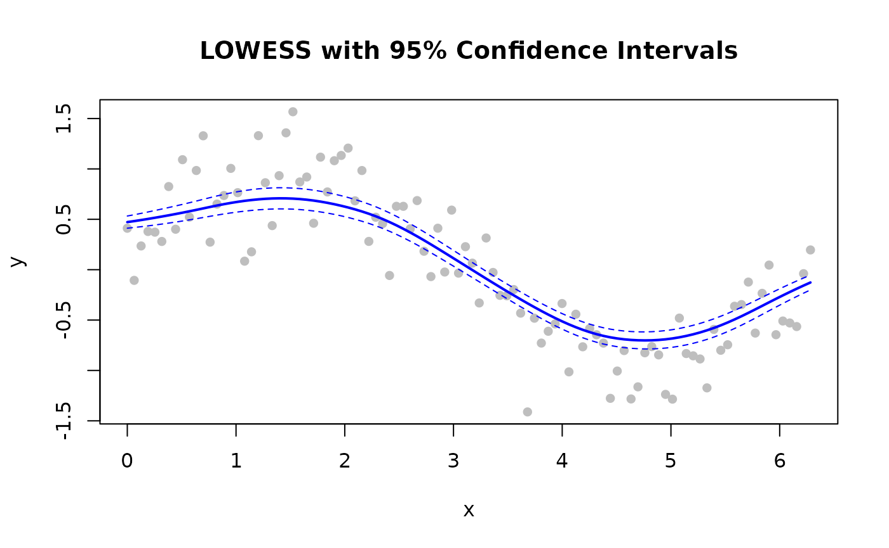
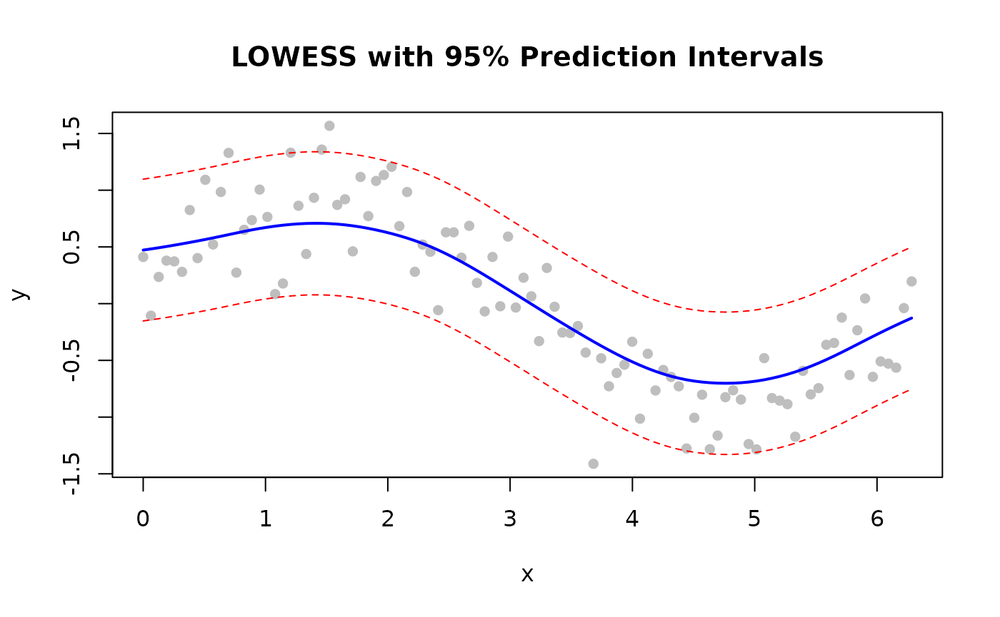
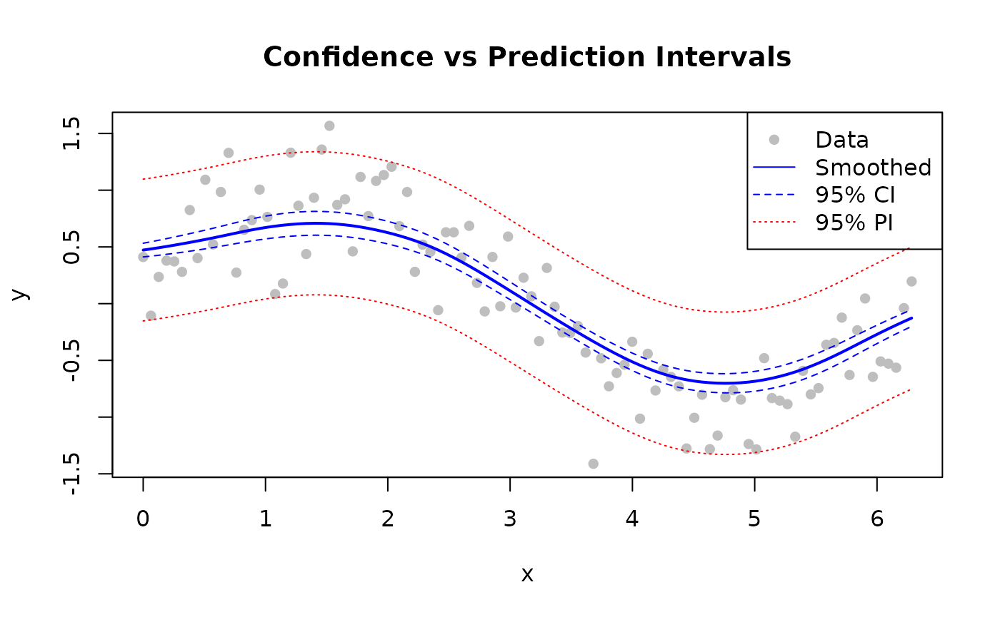

# Confidence and Prediction Intervals

## Overview


Confidence and prediction intervals

> **Note:** Confidence and prediction intervals are available in
> **Batch** mode only. Streaming and Online modes do not support
> intervals.

| Type           | Represents             | Width  | Use                       |
|----------------|------------------------|--------|---------------------------|
| **Confidence** | Mean curve uncertainty | Narrow | Where is the true trend?  |
| **Prediction** | New-point uncertainty  | Wide   | Where will new data fall? |

------------------------------------------------------------------------

## Confidence Intervals

Estimate uncertainty in the smoothed curve itself.

``` r

library(rfastlowess)
set.seed(42)
x <- seq(0, 2 * pi, length.out = 100)
y <- sin(x) + rnorm(100, sd = 0.3)

model <- Lowess(fraction = 0.5, confidence_intervals = 0.95)
result <- fit(model, x, y)

# Plot with bands
plot(x, y, pch = 16, col = "gray",
    main = "LOWESS with 95% Confidence Intervals")
lines(result$x, result$y, col = "blue", lwd = 2)
lines(result$x, result$confidence_lower, col = "blue", lty = 2)
lines(result$x, result$confidence_upper, col = "blue", lty = 2)
```



------------------------------------------------------------------------

## Prediction Intervals

Wider than confidence intervals — cover where new observations will
fall.

``` r

library(rfastlowess)
set.seed(42)
x <- seq(0, 2 * pi, length.out = 100)
y <- sin(x) + rnorm(100, sd = 0.3)

model <- Lowess(fraction = 0.5, prediction_intervals = 0.95)
result <- fit(model, x, y)

plot(x, y, pch = 16, col = "gray",
    main = "LOWESS with 95% Prediction Intervals")
lines(result$x, result$y, col = "blue", lwd = 2)
lines(result$x, result$prediction_lower, col = "red", lty = 2)
lines(result$x, result$prediction_upper, col = "red", lty = 2)
```



------------------------------------------------------------------------

## Both Intervals Together

``` r

library(rfastlowess)
set.seed(42)
x <- seq(0, 2 * pi, length.out = 100)
y <- sin(x) + rnorm(100, sd = 0.3)

model <- Lowess(
    fraction = 0.5,
    confidence_intervals = 0.95,
    prediction_intervals = 0.95
)
result <- fit(model, x, y)

plot(x, y, pch = 16, col = "gray",
    main = "Confidence vs Prediction Intervals")
lines(result$x, result$y, col = "blue", lwd = 2)

# Confidence interval (narrow, blue)
lines(result$x, result$confidence_lower, col = "blue", lty = 2)
lines(result$x, result$confidence_upper, col = "blue", lty = 2)

# Prediction interval (wide, red)
lines(result$x, result$prediction_lower, col = "red", lty = 3)
lines(result$x, result$prediction_upper, col = "red", lty = 3)

legend("topright",
        c("Data", "Smoothed", "95% CI", "95% PI"),
        pch = c(16, NA, NA, NA), lty = c(NA, 1, 2, 3),
        col = c("gray", "blue", "blue", "red"))
```



------------------------------------------------------------------------

## Choosing a Coverage Level

Pass any value between 0 and 1 (exclusive). Common choices:

| Level | z-value | Interpretation                      |
|-------|---------|-------------------------------------|
| 0.90  | 1.645   | 90% of intervals contain true value |
| 0.95  | 1.960   | 95% of intervals contain true value |
| 0.99  | 2.576   | 99% of intervals contain true value |

``` r

# 99% confidence intervals
model <- Lowess(fraction = 0.5, confidence_intervals = 0.99)
result <- fit(model, x, y)
cat("First 6 smoothed values (99% CI):\n")
#> First 6 smoothed values (99% CI):
print(head(result$y))
#> [1] 0.4722882 0.4822189 0.4927151 0.5037882 0.5153461 0.5273328
```

``` r

sessionInfo()
#> R version 4.6.1 (2026-06-24)
#> Platform: x86_64-pc-linux-gnu
#> Running under: Ubuntu 24.04.4 LTS
#> 
#> Matrix products: default
#> BLAS:   /usr/lib/x86_64-linux-gnu/openblas-pthread/libblas.so.3 
#> LAPACK: /usr/lib/x86_64-linux-gnu/openblas-pthread/libopenblasp-r0.3.26.so;  LAPACK version 3.12.0
#> 
#> locale:
#>  [1] LC_CTYPE=C.UTF-8       LC_NUMERIC=C           LC_TIME=C.UTF-8       
#>  [4] LC_COLLATE=C.UTF-8     LC_MONETARY=C.UTF-8    LC_MESSAGES=C.UTF-8   
#>  [7] LC_PAPER=C.UTF-8       LC_NAME=C              LC_ADDRESS=C          
#> [10] LC_TELEPHONE=C         LC_MEASUREMENT=C.UTF-8 LC_IDENTIFICATION=C   
#> 
#> time zone: UTC
#> tzcode source: system (glibc)
#> 
#> attached base packages:
#> [1] stats     graphics  grDevices utils     datasets  methods   base     
#> 
#> other attached packages:
#> [1] rfastlowess_3.2.1
#> 
#> loaded via a namespace (and not attached):
#>  [1] digest_0.6.39     desc_1.4.3        R6_2.6.1          fastmap_1.2.0    
#>  [5] xfun_0.60         cachem_1.1.0      knitr_1.51        htmltools_0.5.9  
#>  [9] rmarkdown_2.32    lifecycle_1.0.5   cli_3.6.6         sass_0.4.10      
#> [13] pkgdown_2.2.1     textshaping_1.0.5 jquerylib_0.1.4   systemfonts_1.3.2
#> [17] compiler_4.6.1    tools_4.6.1       ragg_1.5.2        bslib_0.12.0     
#> [21] evaluate_1.0.5    yaml_2.3.12       otel_0.2.0        jsonlite_2.0.0   
#> [25] rlang_1.3.0       fs_2.1.0          htmlwidgets_1.6.4
```
