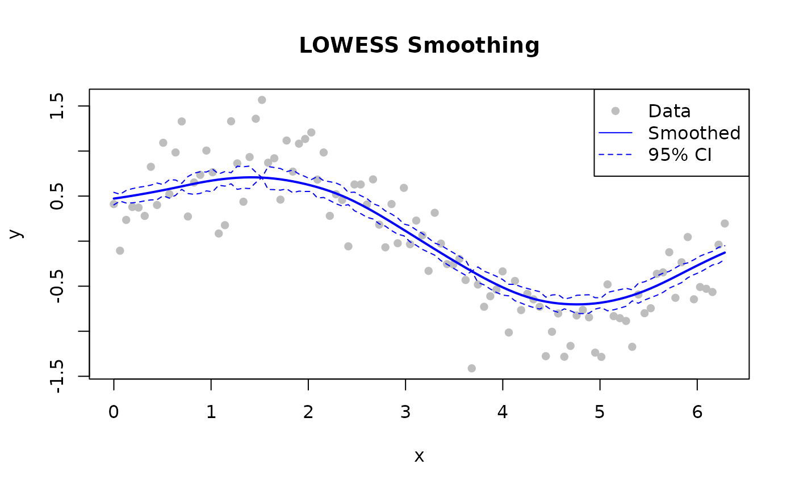

# Quick Start

## Basic Smoothing

Smooth a noisy sine wave. `fraction = 0.3` and `iterations = 3` are good
starting values for most signals.

``` r

library(rfastlowess)

# 100-point noisy sine wave
set.seed(42)
x <- seq(0, 2 * pi, length.out = 100)
y <- sin(x) + rnorm(100, sd = 0.3)

model <- Lowess(fraction = 0.3, iterations = 3)
result <- fit(model, x, y)

cat(sprintf("First smoothed value: %.4f (true: %.4f)\n",
            result$y[1], sin(x[1])))
#> First smoothed value: 0.4246 (true: 0.0000)
```

------------------------------------------------------------------------

## With Confidence and Prediction Intervals

Set `confidence_intervals` and/or `prediction_intervals` to a coverage
level (0–1).

``` r

library(rfastlowess)
set.seed(42)
x <- seq(0, 2 * pi, length.out = 100)
y <- sin(x) + rnorm(100, sd = 0.3)

model <- Lowess(
    fraction = 0.5,
    iterations = 3,
    confidence_intervals = 0.95,
    prediction_intervals = 0.95,
    return_diagnostics = TRUE
)
result <- fit(model, x, y)

cat("Confidence lower bounds (first 5):\n")
#> Confidence lower bounds (first 5):
print(head(result$confidence_lower, 5))
#> [1] 0.4029128 0.4444254 0.4229649 0.4249155 0.4334419
cat("Confidence upper bounds (first 5):\n")
#> Confidence upper bounds (first 5):
print(head(result$confidence_upper, 5))
#> [1] 0.5416635 0.5200124 0.5624654 0.5826608 0.5972503
cat("R²:", result$diagnostics$r_squared, "\n")
#> R²: 0.7841212
```

------------------------------------------------------------------------

## Handling Outliers

LOWESS can robustly handle outliers through iterative reweighting:

``` r

library(rfastlowess)

x_out <- seq(1, 6, length.out = 6)
y_with_outlier <- c(2.0, 4.0, 6.0, 50.0, 10.0, 12.0)

model <- Lowess(
    fraction = 0.7,
    iterations = 5,
    robustness_method = "bisquare",
    return_robustness_weights = TRUE
)
result <- fit(model, x_out, y_with_outlier)

for (i in seq_along(result$robustness_weights)) {
    if (result$robustness_weights[i] < 0.5)
        cat(sprintf("Point %d is likely an outlier (weight: %.3f)\n",
                    i, result$robustness_weights[i]))
}
#> Point 4 is likely an outlier (weight: 0.000)
```

------------------------------------------------------------------------

## Streaming Mode

For large datasets (\>100K points) that may not fit in memory.

``` r

library(rfastlowess)
set.seed(42)
x <- seq(0, 2 * pi, length.out = 10000)
y <- sin(x) + rnorm(10000, sd = 0.3)

model <- StreamingLowess(
    fraction = 0.3,
    iterations = 2,
    chunk_size = 5000,
    overlap = 500,
    merge_strategy = "weighted_average"
)

# Process one chunk at a time
chunk_x <- x[1:5000]
chunk_y <- y[1:5000]
result <- process_chunk(model, chunk_x, chunk_y)

# Finalize after all chunks
final <- finalize(model)
cat("First 6 smoothed values (streaming, weighted_average merge):\n")
#> First 6 smoothed values (streaming, weighted_average merge):
print(head(final$y))
#> [1] 0.3234034 0.3229753 0.3225477 0.3221207 0.3216941 0.3212681
```

------------------------------------------------------------------------

## Online Mode

For real-time / point-by-point processing.

``` r

library(rfastlowess)
set.seed(42)
times <- 1:100
temperatures <- 20 + 5 * sin(times / 10) + rnorm(100)

model <- OnlineLowess(
    fraction = 0.3,
    window_capacity = 25,
    min_points = 5,
    update_mode = "incremental"
)

for (i in seq_along(times)) {
    result <- add_point(model, times[i], temperatures[i])
    if (!is.null(result))
        cat(sprintf("Time %d: %.2f\n", times[i], result$y))
    if (i >= 10) break  # print only the first few outputs
}
#> Time 5: 22.80
#> Time 6: 22.72
#> Time 7: 24.73
#> Time 8: 23.49
#> Time 9: 25.94
#> Time 10: 24.14
```

------------------------------------------------------------------------

## Plotting Results

``` r

library(rfastlowess)
set.seed(42)
x <- seq(0, 2 * pi, length.out = 100)
y <- sin(x) + rnorm(100, sd = 0.3)

model <- Lowess(fraction = 0.5, confidence_intervals = 0.95)
result <- fit(model, x, y)

plot(x, y, pch = 16, col = "gray", main = "LOWESS Smoothing")
lines(result$x, result$y, col = "blue", lwd = 2)
lines(result$x, result$confidence_lower, col = "blue", lty = 2)
lines(result$x, result$confidence_upper, col = "blue", lty = 2)
legend("topright", c("Data", "Smoothed", "95% CI"),
        pch = c(16, NA, NA), lty = c(NA, 1, 2),
        col = c("gray", "blue", "blue"))
```



``` r

sessionInfo()
#> R version 4.6.1 (2026-06-24)
#> Platform: x86_64-pc-linux-gnu
#> Running under: Ubuntu 24.04.4 LTS
#> 
#> Matrix products: default
#> BLAS:   /usr/lib/x86_64-linux-gnu/openblas-pthread/libblas.so.3 
#> LAPACK: /usr/lib/x86_64-linux-gnu/openblas-pthread/libopenblasp-r0.3.26.so;  LAPACK version 3.12.0
#> 
#> locale:
#>  [1] LC_CTYPE=C.UTF-8       LC_NUMERIC=C           LC_TIME=C.UTF-8       
#>  [4] LC_COLLATE=C.UTF-8     LC_MONETARY=C.UTF-8    LC_MESSAGES=C.UTF-8   
#>  [7] LC_PAPER=C.UTF-8       LC_NAME=C              LC_ADDRESS=C          
#> [10] LC_TELEPHONE=C         LC_MEASUREMENT=C.UTF-8 LC_IDENTIFICATION=C   
#> 
#> time zone: UTC
#> tzcode source: system (glibc)
#> 
#> attached base packages:
#> [1] stats     graphics  grDevices utils     datasets  methods   base     
#> 
#> other attached packages:
#> [1] rfastlowess_3.1.0
#> 
#> loaded via a namespace (and not attached):
#>  [1] digest_0.6.39     desc_1.4.3        R6_2.6.1          fastmap_1.2.0    
#>  [5] xfun_0.60         cachem_1.1.0      knitr_1.51        htmltools_0.5.9  
#>  [9] rmarkdown_2.31    lifecycle_1.0.5   cli_3.6.6         sass_0.4.10      
#> [13] pkgdown_2.2.1     textshaping_1.0.5 jquerylib_0.1.4   systemfonts_1.3.2
#> [17] compiler_4.6.1    tools_4.6.1       ragg_1.5.2        bslib_0.12.0     
#> [21] evaluate_1.0.5    yaml_2.3.12       otel_0.2.0        jsonlite_2.0.0   
#> [25] rlang_1.3.0       fs_2.1.0          htmlwidgets_1.6.4
```
