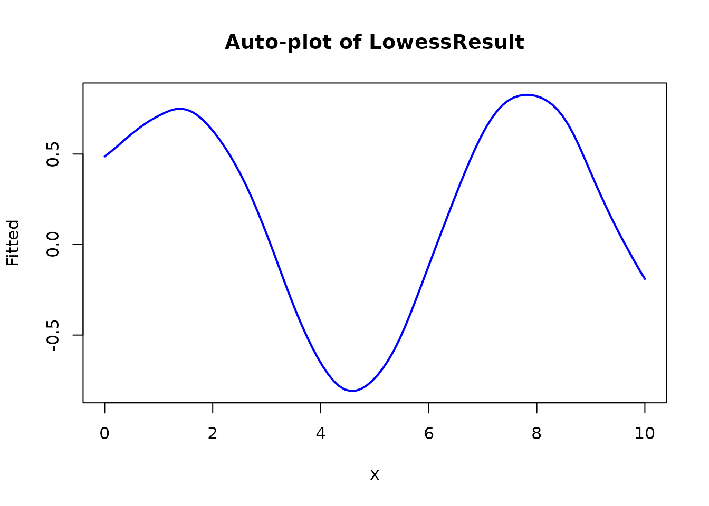
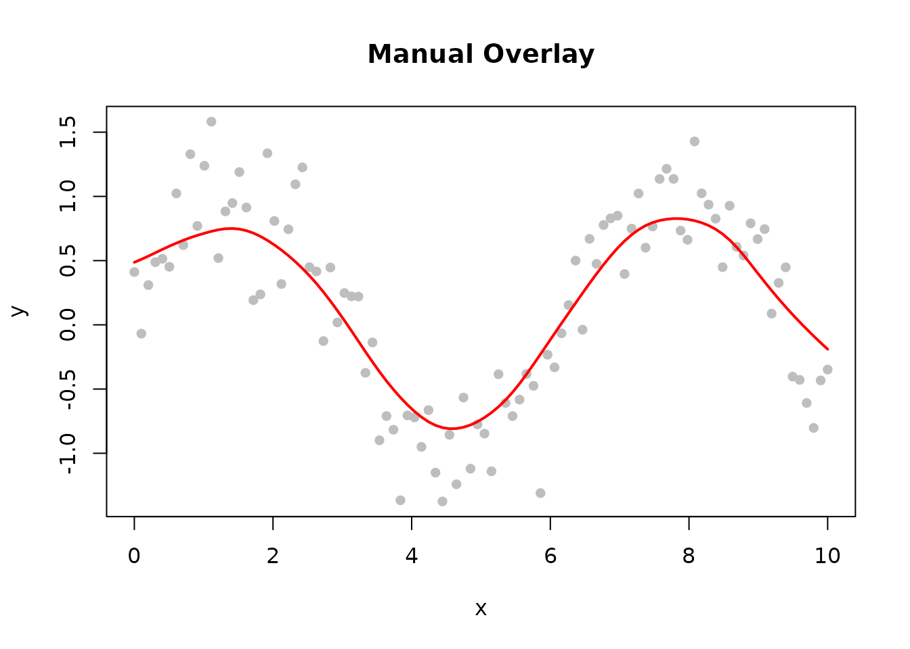
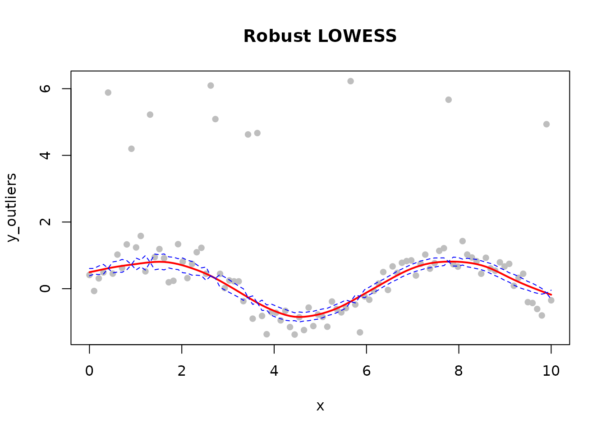
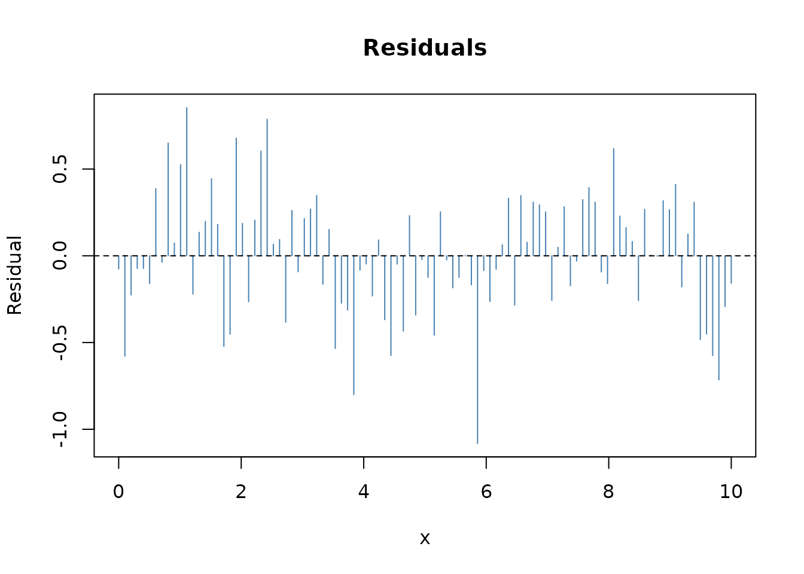
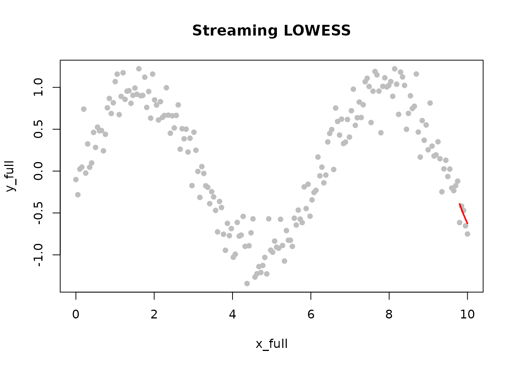
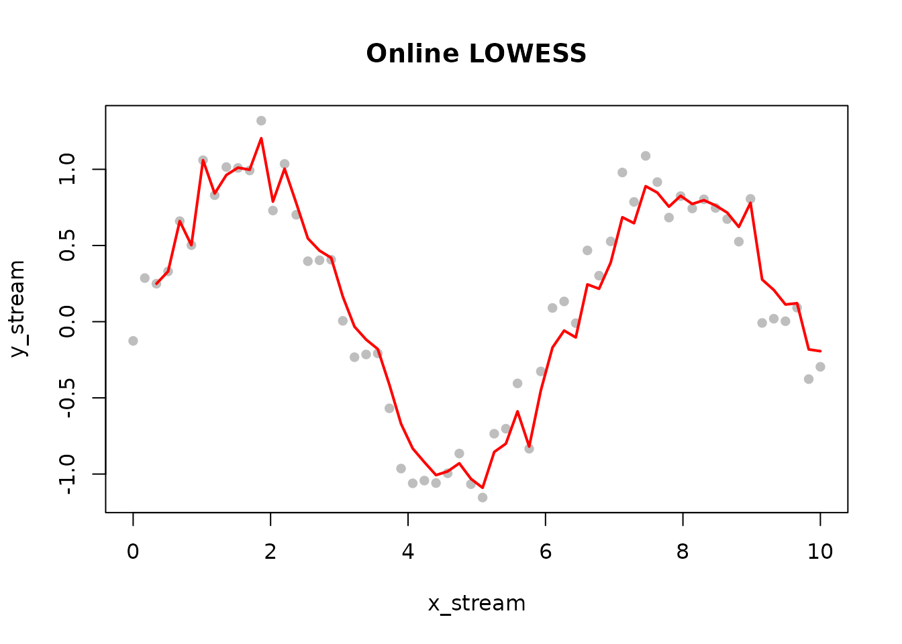

# Introduction to rfastlowess

## Overview

`rfastlowess` is a high-performance R package for LOWESS (Locally
Weighted Scatterplot Smoothing) built on a Rust backend.

LOWESS fits a smooth curve through a scatter plot by performing a
sequence of *local polynomial regressions*. For each point $`x_i`$, the
algorithm selects the nearest `fraction` of observations, assigns
distance-based weights (points farther away receive lower weight), fits
a weighted least-squares polynomial, and reads off the predicted value
at $`x_i`$. Because no global model is assumed, LOWESS adapts naturally
to non-linear and non-stationary data.

Optional robustness iterations guard against outliers: after each pass,
residuals are used to recompute per-observation weights so that
high-leverage outliers are progressively downweighted. This makes
`iterations > 0` the right choice whenever the data may contain
measurement errors or anomalies.

**Full documentation**: <https://lowess.readthedocs.io/>

## Installation

``` r

# From R-universe (pre-built binaries, no Rust required)
install.packages("rfastlowess", repos = "https://thisisamirv.r-universe.dev")
```

## Quick Start

### Basic Smoothing

[`Lowess()`](https://thisisamirv.github.io/lowess-project/r/reference/Lowess.md)
accepts all smoothing options at construction time and returns a
reusable model object. Calling `fit(model, x, y)` runs the algorithm and
returns a `LowessResult` list. Key result fields are `$x` (input x
values), `$y` (smoothed fitted values), `$fraction_used`, and
`$iterations_used`. The `fraction` parameter controls the bandwidth: a
larger value produces a smoother curve at the cost of following local
features less closely.

``` r

library(rfastlowess)

# Generate example data
set.seed(42)
x <- seq(0, 10, length.out = 100)
y <- sin(x) + rnorm(100, sd = 0.3)

# Initialize model
model <- Lowess(fraction = 0.3)
print(model)
#> <Lowess Model>
#>   Fraction:          0.3 
#>   Iterations:        3 
#>   Weight Function:   tricube 
#>   Parallel:          TRUE

# Fit model
result <- fit(model, x, y)
print(result)
#> <LowessResult>
#>   Points:            100 
#>   Fraction Used:     0.3

# Quick visualization using the S3 plot method
plot(result, main = "Auto-plot of LowessResult")
```



``` r


# For custom plotting, access components directly
plot(x, y, pch = 16, col = "gray", main = "Manual Overlay")
lines(result$x, result$y, col = "red", lwd = 2)
```



### Robust Smoothing with Intervals

Real-world data often contains a small fraction of gross errors. Setting
`iterations > 0` activates robustness re-weighting: after the initial
fit, large residuals identify likely outliers and their contribution is
downweighted for the next iteration. The bisquare robustness function
(the default) reduces the weight of any point whose residual exceeds
about six times the median absolute deviation to zero.

Setting `confidence_intervals = 0.95` attaches pointwise 95% confidence
bands to the smoothed curve. These reflect uncertainty in the mean
response, not individual observations; `prediction_intervals` provides
the wider bands covering future observations.

``` r

# Add outliers
y_outliers <- y
y_outliers[sample(1:100, 10)] <- y_outliers[sample(1:100, 10)] + 5

# Robust smoothing with confidence intervals
result_robust <- fit(Lowess(
    fraction = 0.3,
    iterations = 5,
    confidence_intervals = 0.95
), x, y_outliers)

# Plot
plot(x, y_outliers, pch = 16, col = "gray", main = "Robust LOWESS")
lines(result_robust$x, result_robust$y, col = "red", lwd = 2)
lines(result_robust$x, result_robust$confidence_lower, col = "blue", lty = 2)
lines(result_robust$x, result_robust$confidence_upper, col = "blue", lty = 2)
```



### Diagnostics

When `return_diagnostics = TRUE`, the result includes goodness-of-fit
metrics that are useful for comparing different `fraction` values or
kernel choices. `return_residuals = TRUE` attaches the raw residuals,
and `return_robustness_weights = TRUE` exposes the final per-point
robustness weights so you can see which observations were downweighted.

``` r

result_diag <- fit(Lowess(
    fraction = 0.3,
    iterations = 3,
    return_diagnostics = TRUE,
    return_residuals = TRUE,
    return_robustness_weights = TRUE
), x, y)

cat("R-squared:  ", result_diag$r_squared, "\n")
#> R-squared:
cat("RMSE:       ", result_diag$rmse, "\n")
#> RMSE:
cat("MAE:        ", result_diag$mae, "\n")
#> MAE:

# Residual plot
plot(x, result_diag$residuals,
    type = "h", col = "steelblue",
    main = "Residuals", ylab = "Residual"
)
abline(h = 0, lty = 2)
```



## Streaming Processing

`StreamingLowess` processes data in fixed-size chunks and keeps only a
small in-memory buffer, making it practical for datasets that would
otherwise require loading everything into RAM at once. The `chunk_size`
parameter controls how many observations are processed at a time; chunks
are stitched together using a configurable overlap and `merge_strategy`
to avoid boundary artefacts.

After processing all chunks, call
[`finalize()`](https://thisisamirv.github.io/lowess-project/r/reference/finalize.md)
to retrieve the combined `LowessResult` covering the full input range.

``` r

x_full <- seq(0, 10, length.out = 200)
y_full <- sin(x_full) + rnorm(200, sd = 0.2)

model_s <- StreamingLowess(fraction = 0.3, chunk_size = 50L)

# Feed data in chunks of 50
chunk_breaks <- c(0, 50, 100, 150, 200)
for (i in seq_len(length(chunk_breaks) - 1)) {
    idx <- (chunk_breaks[i] + 1):chunk_breaks[i + 1]
    process_chunk(model_s, x_full[idx], y_full[idx])
}

result_s <- finalize(model_s)

plot(x_full, y_full, pch = 16, col = "gray", main = "Streaming LOWESS")
lines(result_s$x, result_s$y, col = "red", lwd = 2)
```



## Online Processing

`OnlineLowess` is designed for real-time data streams where observations
arrive one at a time. The model maintains a sliding window of the most
recent `window_capacity` points. `add_point(model, x, y)` adds a single
observation and immediately returns the smoothed value at that point -
or `NULL` if fewer than `min_points` have been seen yet.

The `update_mode` parameter controls how the window is updated: `"full"`
(default) re-smooths all window points after each addition, giving the
most accurate estimate; `"incremental"` updates only the newest point,
which is faster but less accurate.

``` r

model_o <- OnlineLowess(
    fraction = 0.5,
    window_capacity = 30L,
    min_points = 3L
)

x_stream <- seq(0, 10, length.out = 60)
y_stream <- sin(x_stream) + rnorm(60, sd = 0.2)

smoothed_values <- numeric(length(x_stream))
for (i in seq_along(x_stream)) {
    out <- add_point(model_o, x_stream[i], y_stream[i])
    smoothed_values[i] <- if (is.null(out)) NA_real_ else out$y
}

plot(x_stream, y_stream, pch = 16, col = "gray", main = "Online LOWESS")
lines(x_stream[!is.na(smoothed_values)],
    smoothed_values[!is.na(smoothed_values)],
    col = "red", lwd = 2
)
```



## Main Classes

| Class             | Use Case                                     |
|-------------------|----------------------------------------------|
| `Lowess`          | Primary interface - batch processing         |
| `StreamingLowess` | Large datasets processed chunk by chunk      |
| `OnlineLowess`    | Real-time streams, one observation at a time |

## Learn More

For comprehensive documentation including:

- Parameter selection guides
- Streaming and online processing tutorials
- Genomic data examples
- Performance benchmarks

Visit: **<https://lowess.readthedocs.io/>**

## Session Info

``` r

sessionInfo()
#> R version 4.6.1 (2026-06-24)
#> Platform: x86_64-pc-linux-gnu
#> Running under: Ubuntu 24.04.4 LTS
#> 
#> Matrix products: default
#> BLAS:   /usr/lib/x86_64-linux-gnu/openblas-pthread/libblas.so.3 
#> LAPACK: /usr/lib/x86_64-linux-gnu/openblas-pthread/libopenblasp-r0.3.26.so;  LAPACK version 3.12.0
#> 
#> locale:
#>  [1] LC_CTYPE=C.UTF-8       LC_NUMERIC=C           LC_TIME=C.UTF-8       
#>  [4] LC_COLLATE=C.UTF-8     LC_MONETARY=C.UTF-8    LC_MESSAGES=C.UTF-8   
#>  [7] LC_PAPER=C.UTF-8       LC_NAME=C              LC_ADDRESS=C          
#> [10] LC_TELEPHONE=C         LC_MEASUREMENT=C.UTF-8 LC_IDENTIFICATION=C   
#> 
#> time zone: UTC
#> tzcode source: system (glibc)
#> 
#> attached base packages:
#> [1] stats     graphics  grDevices utils     datasets  methods   base     
#> 
#> other attached packages:
#> [1] rfastlowess_3.0.0 BiocStyle_2.40.0 
#> 
#> loaded via a namespace (and not attached):
#>  [1] cli_3.6.6           knitr_1.51          rlang_1.3.0        
#>  [4] xfun_0.60           otel_0.2.0          generics_0.1.4     
#>  [7] textshaping_1.0.5   jsonlite_2.0.0      htmltools_0.5.9    
#> [10] ragg_1.5.2          sass_0.4.10         rmarkdown_2.31     
#> [13] evaluate_1.0.5      jquerylib_0.1.4     fastmap_1.2.0      
#> [16] yaml_2.3.12         lifecycle_1.0.5     bookdown_0.47      
#> [19] BiocManager_1.30.27 compiler_4.6.1      fs_2.1.0           
#> [22] htmlwidgets_1.6.4   systemfonts_1.3.2   digest_0.6.39      
#> [25] R6_2.6.1            bslib_0.12.0        tools_4.6.1        
#> [28] BiocGenerics_0.58.1 pkgdown_2.2.1       cachem_1.1.0       
#> [31] desc_1.4.3
```
