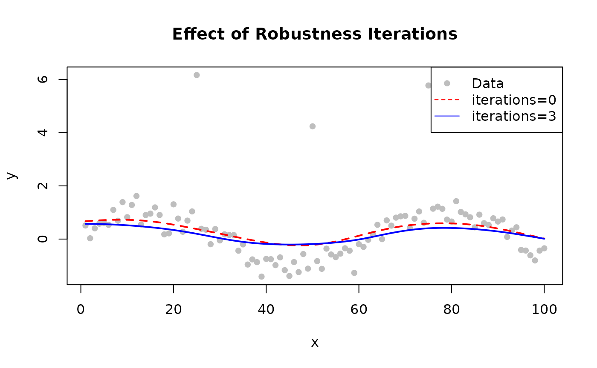

# Robustness

## How Robustness Works

Standard LOWESS can be biased by outliers. Robustness iterations
downweight points with large residuals:

1.  Fit initial LOWESS
2.  Compute residuals
3.  Assign robustness weights (large residuals → low weight)
4.  Refit using combined distance × robustness weights
5.  Repeat steps 2–4

------------------------------------------------------------------------

## Robustness Methods


Robustness method comparison


Effect of robustness iterations

### Bisquare (Default)

Smooth downweighting. Points transition gradually from full weight to
zero.

``` math
w(u) = \begin{cases} (1 - u^2)^2 & |u| < 1 \\ 0 & |u| \geq 1 \end{cases}
```

**Use when**: General purpose, balanced approach.

``` r

library(rfastlowess)
set.seed(42)
x <- seq(0, 2 * pi, length.out = 100)
y <- sin(x) + rnorm(100, sd = 0.3)

model <- Lowess(iterations = 3, robustness_method = "bisquare")
result <- fit(model, x, y)
print(head(result$y))
#> [1] 0.4862648 0.4942855 0.5026953 0.5114688 0.5205144 0.5296957
```

### Huber

Less aggressive than bisquare; still downweights outliers but keeps
moderate residuals at reduced weight.

**Use when**: Mild outlier contamination; want to preserve moderate
deviations.

``` r

model <- Lowess(iterations = 3, robustness_method = "huber")
result <- fit(model, x, y)
print(head(result$y))
#> [1] 0.4937237 0.5027904 0.5122265 0.5219833 0.5319406 0.5419355
```

### Talwar

Hard thresholding — points above the threshold are excluded completely.

**Use when**: Known contamination that should be fully excluded.

``` r

model <- Lowess(iterations = 3, robustness_method = "talwar")
result <- fit(model, x, y)
print(head(result$y))
#> [1] 0.4606284 0.4670145 0.4736902 0.4805995 0.4876121 0.4945557
```

------------------------------------------------------------------------

## Choosing the Number of Iterations

| Iterations | Effect                  | When to Use                |
|------------|-------------------------|----------------------------|
| 0          | No robustness (fastest) | Clean data, speed-critical |
| 1–3        | Moderate                | Most applications          |
| 4–6        | Strong                  | Data with clear outliers   |
| 7+         | Very strong             | Heavy contamination        |

``` r

library(rfastlowess)
set.seed(42)
x <- 1:100
y <- sin(x / 10) + rnorm(100, sd = 0.3)

# Inject outliers
y[c(25, 50, 75)] <- y[c(25, 50, 75)] + 5

# Without robustness
model_0 <- Lowess(iterations = 0)
result_0 <- fit(model_0, x, y)

# With robustness
model_3 <- Lowess(iterations = 3)
result_3 <- fit(model_3, x, y)

plot(x, y, pch = 16, col = "gray", main = "Effect of Robustness Iterations")
lines(result_0$x, result_0$y, col = "red", lwd = 2, lty = 2)
lines(result_3$x, result_3$y, col = "blue", lwd = 2)
legend("topright", c("Data", "iterations=0", "iterations=3"),
        pch = c(16, NA, NA), lty = c(NA, 2, 1),
        col = c("gray", "red", "blue"))
```



------------------------------------------------------------------------

## Method Comparison

| Method       | Handling                | Best For              |
|--------------|-------------------------|-----------------------|
| `"bisquare"` | Smooth to zero          | General purpose       |
| `"huber"`    | Linear then downweights | Mild contamination    |
| `"talwar"`   | Hard threshold (0/1)    | Severe point outliers |

------------------------------------------------------------------------

## Detecting Outliers

Use robustness weights to identify potential outliers:

``` r

library(rfastlowess)
set.seed(42)
x <- seq(0, 2 * pi, length.out = 100)
y <- sin(x) + rnorm(100, sd = 0.3)
y[c(20, 50, 80)] <- y[c(20, 50, 80)] + 5  # inject outliers

model <- Lowess(iterations = 5, return_robustness_weights = TRUE)
result <- fit(model, x, y)

for (i in seq_along(result$robustness_weights)) {
    if (result$robustness_weights[i] < 0.5)
        cat(sprintf("Point %d is likely an outlier (weight: %.3f)\n",
                    i, result$robustness_weights[i]))
}
#> Point 2 is likely an outlier (weight: 0.312)
#> Point 9 is likely an outlier (weight: 0.403)
#> Point 12 is likely an outlier (weight: 0.082)
#> Point 18 is likely an outlier (weight: 0.461)
#> Point 20 is likely an outlier (weight: 0.000)
#> Point 24 is likely an outlier (weight: 0.066)
#> Point 25 is likely an outlier (weight: 0.000)
#> Point 29 is likely an outlier (weight: 0.363)
#> Point 31 is likely an outlier (weight: 0.384)
#> Point 32 is likely an outlier (weight: 0.274)
#> Point 33 is likely an outlier (weight: 0.143)
#> Point 35 is likely an outlier (weight: 0.441)
#> Point 48 is likely an outlier (weight: 0.482)
#> Point 50 is likely an outlier (weight: 0.000)
#> Point 59 is likely an outlier (weight: 0.000)
#> Point 65 is likely an outlier (weight: 0.378)
#> Point 71 is likely an outlier (weight: 0.114)
#> Point 74 is likely an outlier (weight: 0.131)
#> Point 75 is likely an outlier (weight: 0.316)
#> Point 79 is likely an outlier (weight: 0.185)
#> Point 80 is likely an outlier (weight: 0.000)
#> Point 85 is likely an outlier (weight: 0.182)
```

``` r

sessionInfo()
#> R version 4.6.1 (2026-06-24)
#> Platform: x86_64-pc-linux-gnu
#> Running under: Ubuntu 24.04.4 LTS
#> 
#> Matrix products: default
#> BLAS:   /usr/lib/x86_64-linux-gnu/openblas-pthread/libblas.so.3 
#> LAPACK: /usr/lib/x86_64-linux-gnu/openblas-pthread/libopenblasp-r0.3.26.so;  LAPACK version 3.12.0
#> 
#> locale:
#>  [1] LC_CTYPE=C.UTF-8       LC_NUMERIC=C           LC_TIME=C.UTF-8       
#>  [4] LC_COLLATE=C.UTF-8     LC_MONETARY=C.UTF-8    LC_MESSAGES=C.UTF-8   
#>  [7] LC_PAPER=C.UTF-8       LC_NAME=C              LC_ADDRESS=C          
#> [10] LC_TELEPHONE=C         LC_MEASUREMENT=C.UTF-8 LC_IDENTIFICATION=C   
#> 
#> time zone: UTC
#> tzcode source: system (glibc)
#> 
#> attached base packages:
#> [1] stats     graphics  grDevices utils     datasets  methods   base     
#> 
#> other attached packages:
#> [1] rfastlowess_3.0.0 BiocStyle_2.40.0 
#> 
#> loaded via a namespace (and not attached):
#>  [1] cli_3.6.6           knitr_1.51          rlang_1.3.0        
#>  [4] xfun_0.60           otel_0.2.0          generics_0.1.4     
#>  [7] textshaping_1.0.5   jsonlite_2.0.0      htmltools_0.5.9    
#> [10] ragg_1.5.2          sass_0.4.10         rmarkdown_2.31     
#> [13] evaluate_1.0.5      jquerylib_0.1.4     fastmap_1.2.0      
#> [16] yaml_2.3.12         lifecycle_1.0.5     bookdown_0.47      
#> [19] BiocManager_1.30.27 compiler_4.6.1      fs_2.1.0           
#> [22] htmlwidgets_1.6.4   systemfonts_1.3.2   digest_0.6.39      
#> [25] R6_2.6.1            bslib_0.12.0        tools_4.6.1        
#> [28] BiocGenerics_0.58.1 pkgdown_2.2.1       cachem_1.1.0       
#> [31] desc_1.4.3
```
