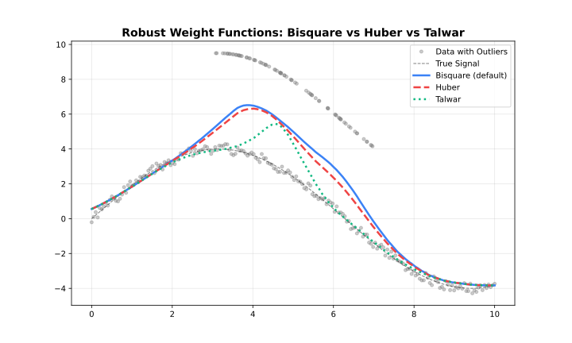

# Robustness

## How Robustness Works

Standard LOWESS can be biased by outliers. Robustness iterations
downweight points with large residuals:

1.  Fit initial LOWESS
2.  Compute residuals
3.  Assign robustness weights (large residuals → low weight)
4.  Refit using combined distance × robustness weights
5.  Repeat steps 2–4



Robustness Methods


Robustness Iterations

------------------------------------------------------------------------

## Robustness Methods

### Bisquare (Default)

Smooth downweighting. Points transition gradually from full weight to
zero.

``` math
w(u) = \begin{cases} (1 - u^2)^2 & |u| < 1 \\ 0 & |u| \geq 1 \end{cases}
```

**Use when**: General purpose, balanced approach.

``` r

library(rfastlowess)
set.seed(42)
x <- seq(0, 2 * pi, length.out = 100)
y <- sin(x) + rnorm(100, sd = 0.3)

model <- Lowess(iterations = 3, robustness_method = "bisquare")
result <- fit(model, x, y)
cat("Smoothed y[0]:", result$y[1], "\n")
#> Smoothed y[0]: 0.4862648
```

------------------------------------------------------------------------

### Huber

Linear penalty beyond threshold. Less aggressive than Bisquare.

``` math
w(u) = \begin{cases} 1 & |u| \leq k \\ k/|u| & |u| > k \end{cases}
```

**Use when**: Moderate outliers, want to retain some influence.

``` r

model <- Lowess(iterations = 3, robustness_method = "huber")
result <- fit(model, x, y)
cat("Smoothed y[0]:", result$y[1], "\n")
#> Smoothed y[0]: 0.4937237
```

------------------------------------------------------------------------

### Talwar

Hard threshold. Points are either fully weighted or completely excluded.

``` math
w(u) = \begin{cases} 1 & |u| \leq k \\ 0 & |u| > k \end{cases}
```

**Use when**: Extreme outliers, want binary exclusion.

``` r

model <- Lowess(iterations = 3, robustness_method = "talwar")
result <- fit(model, x, y)
cat("Smoothed y[0]:", result$y[1], "\n")
#> Smoothed y[0]: 0.4606284
```

------------------------------------------------------------------------

## Comparison

| Method       | Transition | Aggressiveness | Use Case              |
|--------------|------------|----------------|-----------------------|
| **Bisquare** | Smooth     | Moderate       | General purpose       |
| **Huber**    | Gradual    | Mild           | Preserve influence    |
| **Talwar**   | Hard       | Strong         | Extreme contamination |

------------------------------------------------------------------------

## Detecting Outliers

Use robustness weights to identify potential outliers:

``` r

library(rfastlowess)
set.seed(42)
x <- seq(0, 2 * pi, length.out = 100)
y <- sin(x) + rnorm(100, sd = 0.3)
y[c(20, 50, 80)] <- y[c(20, 50, 80)] + 5  # inject outliers

model <- Lowess(iterations = 5, return_robustness_weights = TRUE)
result <- fit(model, x, y)

shown <- 0
for (i in seq_along(result$robustness_weights)) {
    if (result$robustness_weights[i] < 0.5 && shown < 5) {
        cat(sprintf("Potential outlier at index %d: weight = %.3f\n",
                    i, result$robustness_weights[i]))
        shown <- shown + 1
    }
}
#> Potential outlier at index 2: weight = 0.312
#> Potential outlier at index 9: weight = 0.403
#> Potential outlier at index 12: weight = 0.082
#> Potential outlier at index 18: weight = 0.461
#> Potential outlier at index 20: weight = 0.000
```

------------------------------------------------------------------------

## Scale Estimation

Residuals are scaled before computing robustness weights. Two methods:

| Method   | Formula                     | Robustness            |
|----------|-----------------------------|-----------------------|
| **MAD**  | `median(\|r - median(r)\|)` | Very robust (default) |
| **MAR**  | `median(\|r\|)`             | Robust, uncentered    |
| **Mean** | `mean(\|r\|)`               | Less robust, fastest  |


Scaling Methods Comparison

``` r

library(rfastlowess)
set.seed(42)
x <- seq(0, 2 * pi, length.out = 100)
y <- sin(x) + rnorm(100, sd = 0.3)

model <- Lowess(iterations = 3, scaling_method = "mad")
result <- fit(model, x, y)
cat("Smoothed y[0]:", result$y[1], "\n")
#> Smoothed y[0]: 0.4862648
```

------------------------------------------------------------------------

## Auto-Convergence

Stop iterations early when weights stabilize:

> **Performance:** Auto-convergence can significantly reduce computation
> when weights stabilize before reaching max iterations.

``` r

library(rfastlowess)
set.seed(42)
x <- seq(0, 2 * pi, length.out = 100)
y <- sin(x) + rnorm(100, sd = 0.3)

model <- Lowess(iterations = 10, auto_converge = 1e-6)
result <- fit(model, x, y)
cat("Smoothed y[0]:", result$y[1], "\n")
#> Smoothed y[0]: 0.4784941
```

``` r

sessionInfo()
#> R version 4.6.1 (2026-06-24)
#> Platform: x86_64-pc-linux-gnu
#> Running under: Ubuntu 24.04.4 LTS
#> 
#> Matrix products: default
#> BLAS:   /usr/lib/x86_64-linux-gnu/openblas-pthread/libblas.so.3 
#> LAPACK: /usr/lib/x86_64-linux-gnu/openblas-pthread/libopenblasp-r0.3.26.so;  LAPACK version 3.12.0
#> 
#> locale:
#>  [1] LC_CTYPE=C.UTF-8       LC_NUMERIC=C           LC_TIME=C.UTF-8       
#>  [4] LC_COLLATE=C.UTF-8     LC_MONETARY=C.UTF-8    LC_MESSAGES=C.UTF-8   
#>  [7] LC_PAPER=C.UTF-8       LC_NAME=C              LC_ADDRESS=C          
#> [10] LC_TELEPHONE=C         LC_MEASUREMENT=C.UTF-8 LC_IDENTIFICATION=C   
#> 
#> time zone: UTC
#> tzcode source: system (glibc)
#> 
#> attached base packages:
#> [1] stats     graphics  grDevices utils     datasets  methods   base     
#> 
#> other attached packages:
#> [1] rfastlowess_4.0.0
#> 
#> loaded via a namespace (and not attached):
#>  [1] digest_0.6.39     desc_1.4.3        R6_2.6.1          fastmap_1.2.0    
#>  [5] xfun_0.60         cachem_1.1.0      knitr_1.51        htmltools_0.5.9  
#>  [9] rmarkdown_2.32    lifecycle_1.0.5   cli_3.6.6         sass_0.4.10      
#> [13] pkgdown_2.2.1     textshaping_1.0.5 jquerylib_0.1.4   systemfonts_1.3.2
#> [17] compiler_4.6.1    tools_4.6.1       ragg_1.5.2        bslib_0.12.0     
#> [21] evaluate_1.0.5    yaml_2.3.12       otel_0.2.0        jsonlite_2.0.0   
#> [25] rlang_1.3.0       fs_2.1.0          htmlwidgets_1.6.4
```
