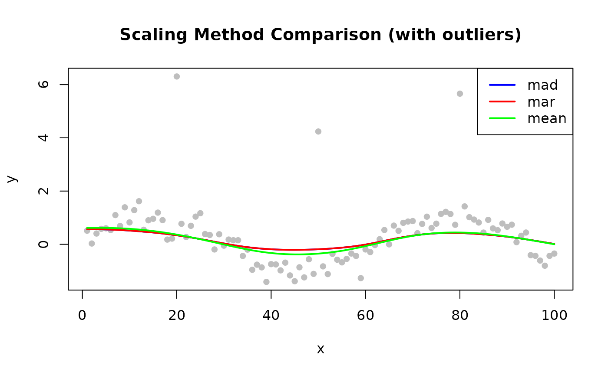

# Scaling Methods

## Overview

When `iterations > 0`, LOWESS computes robustness weights by comparing
each residual to the current residual scale estimate. The
`scaling_method` parameter controls how that scale is measured.

The robustness weight for point $`i`$ is:

``` math
w_i = B\!\left(\frac{|r_i|}{6 \cdot \hat{\sigma}}\right)
```

where $`B`$ is the bisquare function and $`\hat{\sigma}`$ is the scale
estimate. A larger $`\hat{\sigma}`$ makes the algorithm more tolerant of
large residuals; a smaller one makes it more aggressive.

| Method   | Formula                               | Robustness  | Speed    |
|----------|---------------------------------------|-------------|----------|
| `"mad"`  | Median absolute deviation from median | Very robust | Moderate |
| `"mar"`  | Median of \|residuals\|               | Robust      | Fast     |
| `"mean"` | Mean of \|residuals\|                 | Less robust | Fastest  |


Scaling method comparison

------------------------------------------------------------------------

## MAD — Median Absolute Deviation (Default)

``` math
\hat{\sigma} = \text{median}(|r_i - \text{median}(r_i)|)
```

First centers residuals at their median, then takes the median of the
absolute deviations. Double use of the median makes it highly resistant
to extreme outliers.

**Use when**: Data may contain outliers (default for most applications).

``` r

library(rfastlowess)
set.seed(42)
x <- seq(0, 2 * pi, length.out = 100)
y <- sin(x) + rnorm(100, sd = 0.3)

model <- Lowess(iterations = 3, scaling_method = "mad")
result <- fit(model, x, y)
cat("First 6 smoothed values (MAD scaling):\n")
#> First 6 smoothed values (MAD scaling):
print(head(result$y))
#> [1] 0.4862648 0.4942855 0.5026953 0.5114688 0.5205144 0.5296957
```

------------------------------------------------------------------------

## MAR — Median Absolute Residual

``` math
\hat{\sigma} = \text{median}(|r_i|)
```

Slightly less robust than MAD because it does not center residuals
first, but faster to compute.

**Use when**: Residuals are roughly symmetric around zero; speed is a
concern.

``` r

model <- Lowess(iterations = 3, scaling_method = "mar")
result <- fit(model, x, y)
cat("First 6 smoothed values (MAR scaling):\n")
#> First 6 smoothed values (MAR scaling):
print(head(result$y))
#> [1] 0.4870733 0.4951594 0.5036339 0.5124703 0.5215762 0.5308144
```

------------------------------------------------------------------------

## Mean Absolute Residual

``` math
\hat{\sigma} = \frac{1}{n}\sum_i |r_i|
```

Least robust — influenced by outliers. Matches classic OLS residual
scale.

**Use when**: No outliers expected; comparisons with classical methods.

``` r

model <- Lowess(iterations = 3, scaling_method = "mean")
result <- fit(model, x, y)
cat("First 6 smoothed values (mean scaling):\n")
#> First 6 smoothed values (mean scaling):
print(head(result$y))
#> [1] 0.5023604 0.5119281 0.5219198 0.5323007 0.5429772 0.5538188
```

------------------------------------------------------------------------

## Comparing Scaling Methods

``` r

library(rfastlowess)
set.seed(42)
x <- 1:100
y <- sin(x / 10) + rnorm(100, sd = 0.3)
y[c(20, 50, 80)] <- y[c(20, 50, 80)] + 5  # outliers

methods <- c("mad", "mar", "mean")
colors  <- c("blue", "red", "green")

plot(x, y, pch = 16, col = "gray",
    main = "Scaling Method Comparison (with outliers)")

for (i in seq_along(methods)) {
    model  <- Lowess(iterations = 3, scaling_method = methods[i])
    result <- fit(model, x, y)
    lines(result$x, result$y, col = colors[i], lwd = 2)
}

legend("topright", methods, col = colors, lwd = 2)
```



``` r

sessionInfo()
#> R version 4.6.1 (2026-06-24)
#> Platform: x86_64-pc-linux-gnu
#> Running under: Ubuntu 24.04.4 LTS
#> 
#> Matrix products: default
#> BLAS:   /usr/lib/x86_64-linux-gnu/openblas-pthread/libblas.so.3 
#> LAPACK: /usr/lib/x86_64-linux-gnu/openblas-pthread/libopenblasp-r0.3.26.so;  LAPACK version 3.12.0
#> 
#> locale:
#>  [1] LC_CTYPE=C.UTF-8       LC_NUMERIC=C           LC_TIME=C.UTF-8       
#>  [4] LC_COLLATE=C.UTF-8     LC_MONETARY=C.UTF-8    LC_MESSAGES=C.UTF-8   
#>  [7] LC_PAPER=C.UTF-8       LC_NAME=C              LC_ADDRESS=C          
#> [10] LC_TELEPHONE=C         LC_MEASUREMENT=C.UTF-8 LC_IDENTIFICATION=C   
#> 
#> time zone: UTC
#> tzcode source: system (glibc)
#> 
#> attached base packages:
#> [1] stats     graphics  grDevices utils     datasets  methods   base     
#> 
#> other attached packages:
#> [1] rfastlowess_3.1.0
#> 
#> loaded via a namespace (and not attached):
#>  [1] digest_0.6.39     desc_1.4.3        R6_2.6.1          fastmap_1.2.0    
#>  [5] xfun_0.60         cachem_1.1.0      knitr_1.51        htmltools_0.5.9  
#>  [9] rmarkdown_2.31    lifecycle_1.0.5   cli_3.6.6         sass_0.4.10      
#> [13] pkgdown_2.2.1     textshaping_1.0.5 jquerylib_0.1.4   systemfonts_1.3.2
#> [17] compiler_4.6.1    tools_4.6.1       ragg_1.5.2        bslib_0.12.0     
#> [21] evaluate_1.0.5    yaml_2.3.12       otel_0.2.0        jsonlite_2.0.0   
#> [25] rlang_1.3.0       fs_2.1.0          htmlwidgets_1.6.4
```
