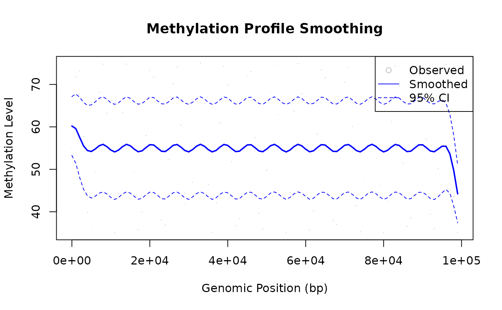
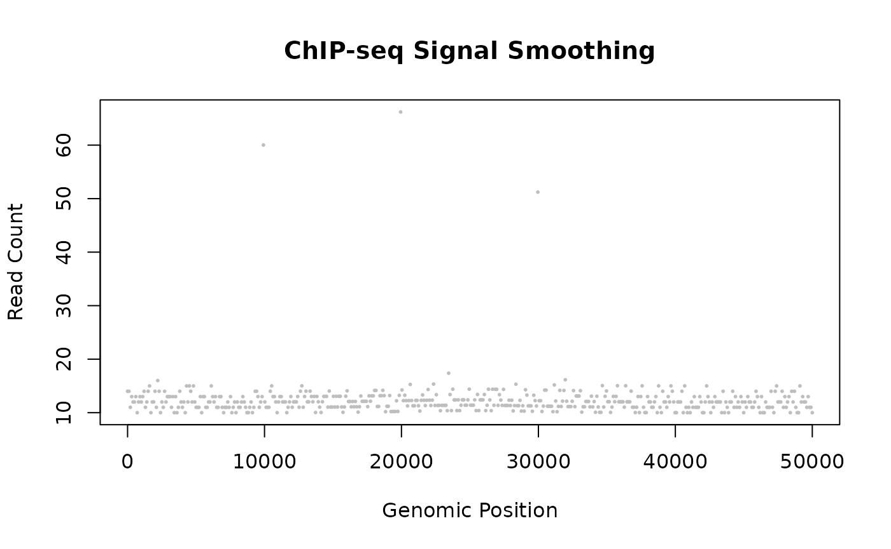

# Use Case: Genomic Data Smoothing

## Overview

LOWESS is well-suited for genomic data such as DNA methylation profiles,
ChIP-seq signals, and expression arrays. Sequencing depth variation, PCR
artifacts, and biological heterogeneity all create noise that LOWESS
handles gracefully without parametric assumptions.

------------------------------------------------------------------------

## Methylation Profile Smoothing

A small `fraction = 0.1` lets LOWESS follow fine-scale spatial structure
without smearing transitions between methylated and unmethylated
regions. `confidence_intervals = 0.95` produces uncertainty bands that
naturally widen at positions with sparser CpG coverage.

``` r

library(rfastlowess)

# Deterministic methylation profile along a chromosome
positions <- seq(0, 99000, by = 1000)
observed <- (50 + sin(positions / 1000) * 20 + 5) / 100  # Methylation is 0-1

# Smooth
model <- Lowess(
    fraction = 0.1,
    iterations = 3,
    confidence_intervals = 0.95
)
result <- fit(model, positions, observed)

# Plot
plot(positions, observed, pch = ".", col = "gray",
    xlab = "Genomic Position (bp)", ylab = "Methylation Level",
    main = "Methylation Profile Smoothing")
lines(result$x, result$y, col = "blue", lwd = 2)
lines(result$x, result$confidence_lower, col = "blue", lty = 2)
lines(result$x, result$confidence_upper, col = "blue", lty = 2)
legend("topright", c("Observed", "Smoothed", "95% CI"),
        pch = c(1, NA, NA), lty = c(NA, 1, 2),
        col = c("gray", "blue", "blue"))
```



``` r

cat(sprintf(
    "95%% CI: [%.4f, %.4f]\n",
    result$confidence_lower[1], result$confidence_upper[1]
))
#> 95% CI: [0.5168, 0.6874]
```

------------------------------------------------------------------------

## ChIP-seq Signal Smoothing

ChIP-seq experiments produce sparse, noisy coverage data. LOWESS can
help identify binding regions.

`fraction = 0.05` provides high spatial resolution — important for
resolving narrow binding peaks that would otherwise be smeared into the
background. The larger `iterations = 5` is deliberate:
Poisson-distributed read counts produce tall, isolated spikes, and extra
robustness iterations progressively down-weight them so the estimated
background level is not inflated by a handful of extreme counts.

``` r

library(rfastlowess)

# Deterministic ChIP-seq-style coverage profile
positions <- seq(0, 99000, by = 1000)
signal <- 50 + sin(positions / 1000) * 20 + 5

# Smooth
model <- Lowess(
    fraction = 0.05,
    iterations = 5
)
result <- fit(model, positions, signal)
peak_count <- sum(result$y > 65.0)

plot(positions, signal, pch = 16, cex = 0.4, col = "gray",
    xlab = "Genomic Position", ylab = "Read Count",
    main = "ChIP-seq Signal Smoothing")
lines(result$x, result$y, col = "blue", lwd = 2)
abline(h = 65.0, col = "red", lty = 2)
```



``` r

cat(sprintf("y[0]: %.4f\n", result$y[1]))
#> y[0]: 59.9520
cat(sprintf("Peak count: %d\n", peak_count))
#> Peak count: 26
```

------------------------------------------------------------------------

## Large Genome Coverage (Streaming)

For whole-genome datasets that do not fit in memory, use the streaming
adapter.

``` r

library(rfastlowess)

model <- StreamingLowess(
    fraction   = 0.05,
    iterations = 3,
    chunk_size = 50,
    overlap    = 10,
    merge_strategy = "weighted_average"
)

# Deterministic whole-genome coverage, processed as a single chunk
positions <- seq(0, 10000, by = 10)
coverage <- 50 + sin(positions / 100) * 20 + 5
result <- process_chunk(model, positions, coverage)
final <- finalize(model)
cat(sprintf("y[0]: %.4f\n", final$y[1]))
#> y[0]: 41.2977
```

``` r

sessionInfo()
#> R version 4.6.1 (2026-06-24)
#> Platform: x86_64-pc-linux-gnu
#> Running under: Ubuntu 24.04.4 LTS
#> 
#> Matrix products: default
#> BLAS:   /usr/lib/x86_64-linux-gnu/openblas-pthread/libblas.so.3 
#> LAPACK: /usr/lib/x86_64-linux-gnu/openblas-pthread/libopenblasp-r0.3.26.so;  LAPACK version 3.12.0
#> 
#> locale:
#>  [1] LC_CTYPE=C.UTF-8       LC_NUMERIC=C           LC_TIME=C.UTF-8       
#>  [4] LC_COLLATE=C.UTF-8     LC_MONETARY=C.UTF-8    LC_MESSAGES=C.UTF-8   
#>  [7] LC_PAPER=C.UTF-8       LC_NAME=C              LC_ADDRESS=C          
#> [10] LC_TELEPHONE=C         LC_MEASUREMENT=C.UTF-8 LC_IDENTIFICATION=C   
#> 
#> time zone: UTC
#> tzcode source: system (glibc)
#> 
#> attached base packages:
#> [1] stats     graphics  grDevices utils     datasets  methods   base     
#> 
#> other attached packages:
#> [1] rfastlowess_3.2.1
#> 
#> loaded via a namespace (and not attached):
#>  [1] digest_0.6.39     desc_1.4.3        R6_2.6.1          fastmap_1.2.0    
#>  [5] xfun_0.60         cachem_1.1.0      knitr_1.51        htmltools_0.5.9  
#>  [9] rmarkdown_2.32    lifecycle_1.0.5   cli_3.6.6         sass_0.4.10      
#> [13] pkgdown_2.2.1     textshaping_1.0.5 jquerylib_0.1.4   systemfonts_1.3.2
#> [17] compiler_4.6.1    tools_4.6.1       ragg_1.5.2        bslib_0.12.0     
#> [21] evaluate_1.0.5    yaml_2.3.12       otel_0.2.0        jsonlite_2.0.0   
#> [25] rlang_1.3.0       fs_2.1.0          htmlwidgets_1.6.4
```
