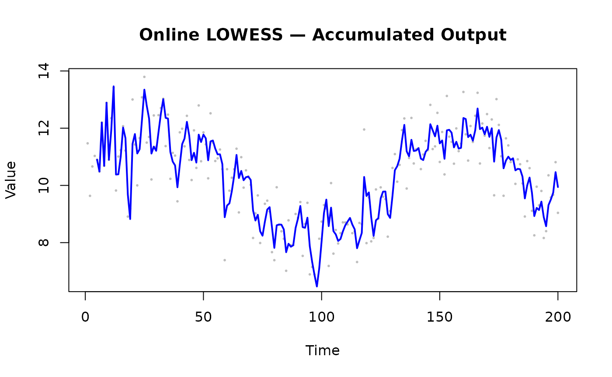

# Use Case: Real-Time Processing

## Overview

When data arrives continuously from sensors, logs, or streaming
pipelines, the Online adapter provides incremental smoothing without
reprocessing the entire dataset.

------------------------------------------------------------------------

## Online Mode: Point-by-Point

`window_capacity = 25` limits the internal buffer to the 25 most recent
observations; each
[`add_point()`](https://thisisamirv.github.io/lowess-project/r/reference/add_point.md)
call costs O(window) rather than growing with total history.
`min_points = 5` suppresses output until the window holds enough points
for a stable fit. `update_mode = "incremental"` re-fits only the most
recent point rather than the full window, halving typical latency.

### Sensor Data Example

``` r

library(rfastlowess)

set.seed(42)
times <- 1:100
temperatures <- 20 + 5 * sin(times / 10) + rnorm(100)

model <- OnlineLowess(
    fraction = 0.3,
    window_capacity = 25,
    min_points = 5,
    update_mode = "incremental"
)
for (i in seq_along(times)) {
    result <- add_point(model, times[i], temperatures[i])
    if (!is.null(result))
        cat(sprintf("Time %d: %.2f\n", times[i], result$y))
}
#> Time 5: 22.80
#> Time 6: 22.72
#> Time 7: 24.73
#> Time 8: 23.49
#> Time 9: 25.94
#> Time 10: 24.14
#> Time 11: 25.35
#> Time 12: 27.00
#> Time 13: 23.99
#> Time 14: 24.04
#> Time 15: 24.64
#> Time 16: 25.60
#> Time 17: 25.13
#> Time 18: 23.01
#> Time 19: 21.96
#> Time 20: 24.34
#> Time 21: 24.42
#> Time 22: 23.41
#> Time 23: 23.21
#> Time 24: 23.86
#> Time 25: 24.49
#> Time 26: 23.48
#> Time 27: 22.44
#> Time 28: 20.54
#> Time 29: 20.50
#> Time 30: 20.03
#> Time 31: 20.29
#> Time 32: 20.35
#> Time 33: 20.27
#> Time 34: 18.98
#> Time 35: 18.52
#> Time 36: 16.82
#> Time 37: 16.15
#> Time 38: 15.74
#> Time 39: 14.60
#> Time 40: 15.17
#> Time 41: 15.68
#> Time 42: 15.58
#> Time 43: 15.97
#> Time 44: 15.21
#> Time 45: 14.17
#> Time 46: 14.57
#> Time 47: 14.31
#> Time 48: 15.51
#> Time 49: 15.33
#> Time 50: 15.71
#> Time 51: 15.76
#> Time 52: 15.26
#> Time 53: 16.38
#> Time 54: 16.85
#> Time 55: 16.94
#> Time 56: 17.17
#> Time 57: 17.66
#> Time 58: 17.85
#> Time 59: 16.47
#> Time 60: 17.56
#> Time 61: 18.29
#> Time 62: 19.43
#> Time 63: 20.61
#> Time 64: 21.85
#> Time 65: 21.41
#> Time 66: 22.33
#> Time 67: 22.58
#> Time 68: 23.29
#> Time 69: 23.88
#> Time 70: 24.23
#> Time 71: 23.47
#> Time 72: 23.59
#> Time 73: 24.27
#> Time 74: 24.04
#> Time 75: 24.19
#> Time 76: 24.92
#> Time 77: 25.52
#> Time 78: 25.75
#> Time 79: 25.01
#> Time 80: 24.18
#> Time 81: 25.10
#> Time 82: 25.15
#> Time 83: 25.01
#> Time 84: 24.54
#> Time 85: 23.35
#> Time 86: 23.48
#> Time 87: 23.18
#> Time 88: 22.87
#> Time 89: 23.08
#> Time 90: 22.94
#> Time 91: 22.92
#> Time 92: 21.62
#> Time 93: 21.08
#> Time 94: 20.99
#> Time 95: 19.46
#> Time 96: 18.41
#> Time 97: 17.43
#> Time 98: 16.54
#> Time 99: 16.88
#> Time 100: 17.46
```

------------------------------------------------------------------------

## Accumulating Results

Collect online smoothed values into a vector for downstream analysis or
plotting.

``` r

library(rfastlowess)
set.seed(42)
n <- 200
times <- seq_len(n)
signal <- 10 + 2 * sin(times / 20) + rnorm(n, sd = 1)

model <- OnlineLowess(
    fraction       = 0.3,
    window_capacity = 30,
    min_points      = 5
)

smoothed_x <- numeric(n)
smoothed_y <- numeric(n)
n_out <- 0L

for (i in seq_len(n)) {
    result <- add_point(model, times[i], signal[i])
    if (!is.null(result)) {
        n_out <- n_out + 1L
        smoothed_x[n_out] <- times[i]
        smoothed_y[n_out] <- result$y
    }
}

smoothed_x <- smoothed_x[seq_len(n_out)]
smoothed_y <- smoothed_y[seq_len(n_out)]

plot(times, signal, pch = 16, cex = 0.4, col = "gray",
    xlab = "Time", ylab = "Value",
    main = "Online LOWESS — Accumulated Output")
lines(smoothed_x, smoothed_y, col = "blue", lwd = 2)
```



------------------------------------------------------------------------

## Update Modes

| Mode            | Behaviour                     | Latency | Accuracy |
|-----------------|-------------------------------|---------|----------|
| `"incremental"` | Re-fits only the newest point | Low     | Moderate |
| `"full"`        | Re-fits the entire window     | Higher  | Higher   |

``` r

# Full-window refit (more accurate, slower)
model_full <- OnlineLowess(
    fraction       = 0.3,
    window_capacity = 25,
    update_mode     = "full"
)
```

------------------------------------------------------------------------

## Streaming Mode for Large Batches

> **Note:** Always call
> [`finalize()`](https://thisisamirv.github.io/lowess-project/r/reference/finalize.md)
> after the last chunk to flush any remaining buffered points and
> produce output for the tail of the dataset.

For large historical files arriving in chunks (not true real-time), the
Streaming adapter is more efficient than Online:

``` r

library(rfastlowess)

model <- StreamingLowess(
    fraction       = 0.3,
    iterations     = 2,
    chunk_size     = 5000,
    overlap        = 500,
    merge_strategy = "weighted_average"
)

set.seed(42)
n_total <- 20000
x_all <- seq_len(n_total)
y_all <- sin(x_all / 500) + rnorm(n_total, sd = 0.5)

chunk_size <- 5000
n_chunks <- ceiling(n_total / chunk_size)

for (i in seq_len(n_chunks)) {
    idx_from <- (i - 1) * chunk_size + 1
    idx_to   <- min(i * chunk_size, n_total)
    result   <- process_chunk(model, x_all[idx_from:idx_to],
                                    y_all[idx_from:idx_to])
}

final <- finalize(model)
cat("First 6 smoothed values (streaming, weighted_average merge):\n")
#> First 6 smoothed values (streaming, weighted_average merge):
print(head(final$y))
#> [1] 0.8387164 0.8396539 0.8405907 0.8415269 0.8424623 0.8433970
```

``` r

sessionInfo()
#> R version 4.6.1 (2026-06-24)
#> Platform: x86_64-pc-linux-gnu
#> Running under: Ubuntu 24.04.4 LTS
#> 
#> Matrix products: default
#> BLAS:   /usr/lib/x86_64-linux-gnu/openblas-pthread/libblas.so.3 
#> LAPACK: /usr/lib/x86_64-linux-gnu/openblas-pthread/libopenblasp-r0.3.26.so;  LAPACK version 3.12.0
#> 
#> locale:
#>  [1] LC_CTYPE=C.UTF-8       LC_NUMERIC=C           LC_TIME=C.UTF-8       
#>  [4] LC_COLLATE=C.UTF-8     LC_MONETARY=C.UTF-8    LC_MESSAGES=C.UTF-8   
#>  [7] LC_PAPER=C.UTF-8       LC_NAME=C              LC_ADDRESS=C          
#> [10] LC_TELEPHONE=C         LC_MEASUREMENT=C.UTF-8 LC_IDENTIFICATION=C   
#> 
#> time zone: UTC
#> tzcode source: system (glibc)
#> 
#> attached base packages:
#> [1] stats     graphics  grDevices utils     datasets  methods   base     
#> 
#> other attached packages:
#> [1] rfastlowess_3.0.0
#> 
#> loaded via a namespace (and not attached):
#>  [1] digest_0.6.39     desc_1.4.3        R6_2.6.1          fastmap_1.2.0    
#>  [5] xfun_0.60         cachem_1.1.0      knitr_1.51        htmltools_0.5.9  
#>  [9] rmarkdown_2.31    lifecycle_1.0.5   cli_3.6.6         sass_0.4.10      
#> [13] pkgdown_2.2.1     textshaping_1.0.5 jquerylib_0.1.4   systemfonts_1.3.2
#> [17] compiler_4.6.1    tools_4.6.1       ragg_1.5.2        bslib_0.12.0     
#> [21] evaluate_1.0.5    yaml_2.3.12       otel_0.2.0        jsonlite_2.0.0   
#> [25] rlang_1.3.0       fs_2.1.0          htmlwidgets_1.6.4
```
