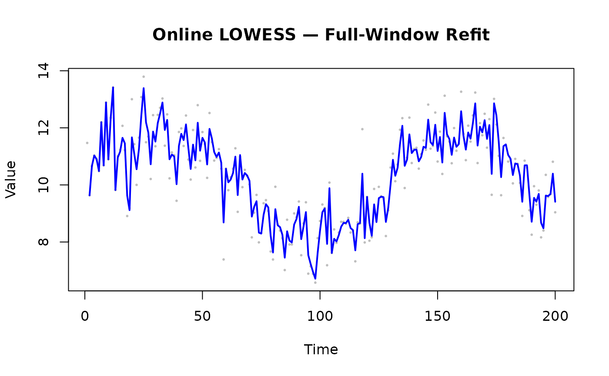

# Use Case: Real-Time Processing

## Overview

When data arrives continuously from sensors, logs, or streaming
pipelines, the Online adapter provides incremental smoothing without
reprocessing the entire dataset.

------------------------------------------------------------------------

## Online Mode: Point-by-Point

`window_capacity = 25` limits the internal buffer to the 25 most recent
observations; each
[`add_point()`](https://thisisamirv.github.io/lowess-project/r/reference/add_point.md)
call costs O(window) rather than growing with total history.
`min_points = 5` suppresses output until the window holds enough points
for a stable fit. `update_mode = "incremental"` re-fits only the most
recent point rather than the full window, halving typical latency.

### Sensor Data Example

``` r

library(rfastlowess)

times <- 0:99
temperatures <- 20 + 5 * sin(times / 10) + sin(times * 1.7) * 0.5

model <- OnlineLowess(
    fraction = 0.3,
    iterations = 1,
    window_capacity = 25,
    min_points = 5,
    update_mode = "incremental"
)
count <- 0
for (i in seq_along(times)) {
    result <- add_point(model, times[i], temperatures[i])
    if (!is.null(result)) {
        if (count < 5) cat(sprintf("Time %d: smoothed = %.4f\n", times[i], result$y))
        count <- count + 1
    }
}
#> Time 4: smoothed = 22.1941
#> Time 5: smoothed = 22.7964
#> Time 6: smoothed = 22.4733
#> Time 7: smoothed = 22.9120
#> Time 8: smoothed = 24.0164
cat(sprintf("... (%d more)\n", count - 5))
#> ... (91 more)
```

------------------------------------------------------------------------

## Accumulating Results

Collect online smoothed values into a vector for downstream analysis or
plotting.

``` r

library(rfastlowess)
set.seed(42)
n <- 200
times <- seq_len(n)
signal <- 10 + 2 * sin(times / 20) + rnorm(n, sd = 1)

model <- OnlineLowess(
    fraction       = 0.3,
    window_capacity = 30,
    min_points      = 5
)

smoothed_x <- numeric(n)
smoothed_y <- numeric(n)
n_out <- 0L

for (i in seq_len(n)) {
    result <- add_point(model, times[i], signal[i])
    if (!is.null(result)) {
        n_out <- n_out + 1L
        smoothed_x[n_out] <- times[i]
        smoothed_y[n_out] <- result$y
    }
}

smoothed_x <- smoothed_x[seq_len(n_out)]
smoothed_y <- smoothed_y[seq_len(n_out)]

plot(times, signal, pch = 16, cex = 0.4, col = "gray",
    xlab = "Time", ylab = "Value",
    main = "Online LOWESS — Accumulated Output")
lines(smoothed_x, smoothed_y, col = "blue", lwd = 2)
```


------------------------------------------------------------------------

## Update Modes

| Mode            | Behaviour                     | Latency | Accuracy |
|-----------------|-------------------------------|---------|----------|
| `"incremental"` | Re-fits only the newest point | Low     | Moderate |
| `"full"`        | Re-fits the entire window     | Higher  | Higher   |

``` r

# Full-window refit (more accurate, slower)
model_full <- OnlineLowess(
    fraction       = 0.3,
    window_capacity = 25,
    update_mode     = "full"
)

smoothed_full_x <- numeric(n)
smoothed_full_y <- numeric(n)
n_full <- 0L

for (i in seq_len(n)) {
    result <- add_point(model_full, times[i], signal[i])
    if (!is.null(result)) {
        n_full <- n_full + 1L
        smoothed_full_x[n_full] <- times[i]
        smoothed_full_y[n_full] <- result$y
    }
}

smoothed_full_x <- smoothed_full_x[seq_len(n_full)]
smoothed_full_y <- smoothed_full_y[seq_len(n_full)]

plot(times, signal, pch = 16, cex = 0.4, col = "gray",
    xlab = "Time", ylab = "Value",
    main = "Online LOWESS — Full-Window Refit")
lines(smoothed_full_x, smoothed_full_y, col = "blue", lwd = 2)
```



------------------------------------------------------------------------

## Streaming Mode for Large Batches

> **Note:** Always call
> [`finalize()`](https://thisisamirv.github.io/lowess-project/r/reference/finalize.md)
> after the last chunk to flush any remaining buffered points and
> produce output for the tail of the dataset.

For large historical files arriving in chunks (not true real-time), the
Streaming adapter is more efficient than Online:

``` r

library(rfastlowess)

model <- StreamingLowess(
    fraction       = 0.1,
    iterations     = 2,
    chunk_size     = 50,
    overlap        = 10,
    merge_strategy = "weighted_average"
)

chunk1_x <- 0:49
chunk1_y <- sin(chunk1_x) + 0.1
chunk2_x <- 50:99
chunk2_y <- sin(chunk2_x) + 0.1

process_chunk(model, chunk1_x, chunk1_y)
#> <LowessResult>
#>   Points:            40 
#>   Fraction Used:     0.1 
#>   Iterations Used:   0
process_chunk(model, chunk2_x, chunk2_y)
#> <LowessResult>
#>   Points:            50 
#>   Fraction Used:     0.1 
#>   Iterations Used:   0

final <- finalize(model)
cat(sprintf("y[0]: %.6f\n", final$y[1]))
#> y[0]: 0.516484
```

``` r

sessionInfo()
#> R version 4.6.1 (2026-06-24)
#> Platform: x86_64-pc-linux-gnu
#> Running under: Ubuntu 24.04.4 LTS
#> 
#> Matrix products: default
#> BLAS:   /usr/lib/x86_64-linux-gnu/openblas-pthread/libblas.so.3 
#> LAPACK: /usr/lib/x86_64-linux-gnu/openblas-pthread/libopenblasp-r0.3.26.so;  LAPACK version 3.12.0
#> 
#> locale:
#>  [1] LC_CTYPE=C.UTF-8       LC_NUMERIC=C           LC_TIME=C.UTF-8       
#>  [4] LC_COLLATE=C.UTF-8     LC_MONETARY=C.UTF-8    LC_MESSAGES=C.UTF-8   
#>  [7] LC_PAPER=C.UTF-8       LC_NAME=C              LC_ADDRESS=C          
#> [10] LC_TELEPHONE=C         LC_MEASUREMENT=C.UTF-8 LC_IDENTIFICATION=C   
#> 
#> time zone: UTC
#> tzcode source: system (glibc)
#> 
#> attached base packages:
#> [1] stats     graphics  grDevices utils     datasets  methods   base     
#> 
#> other attached packages:
#> [1] rfastlowess_3.2.0
#> 
#> loaded via a namespace (and not attached):
#>  [1] digest_0.6.39     desc_1.4.3        R6_2.6.1          fastmap_1.2.0    
#>  [5] xfun_0.60         cachem_1.1.0      knitr_1.51        htmltools_0.5.9  
#>  [9] rmarkdown_2.31    lifecycle_1.0.5   cli_3.6.6         sass_0.4.10      
#> [13] pkgdown_2.2.1     textshaping_1.0.5 jquerylib_0.1.4   systemfonts_1.3.2
#> [17] compiler_4.6.1    tools_4.6.1       ragg_1.5.2        bslib_0.12.0     
#> [21] evaluate_1.0.5    yaml_2.3.12       otel_0.2.0        jsonlite_2.0.0   
#> [25] rlang_1.3.0       fs_2.1.0          htmlwidgets_1.6.4
```
