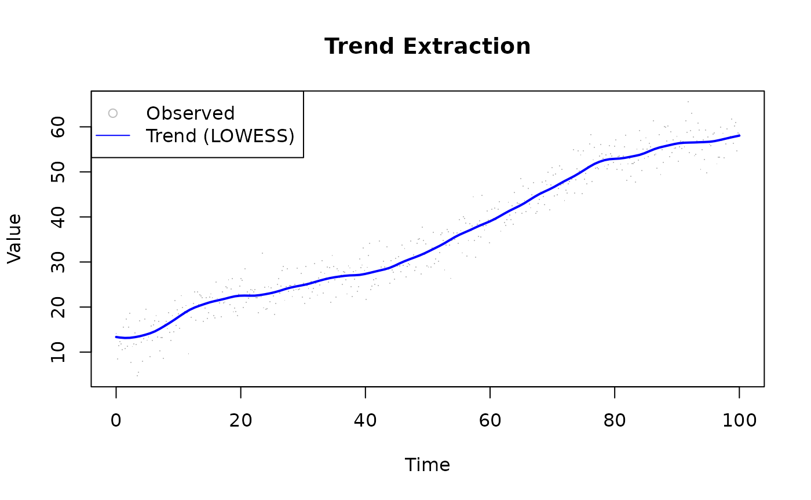
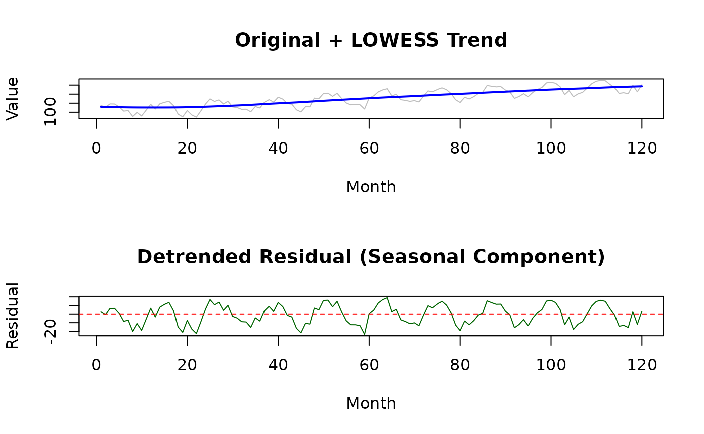
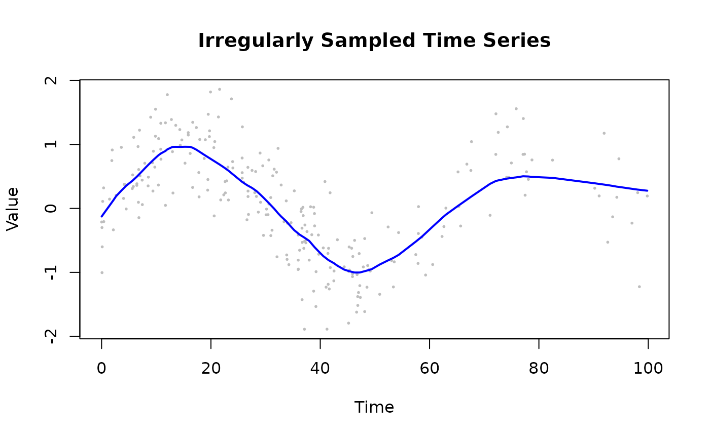
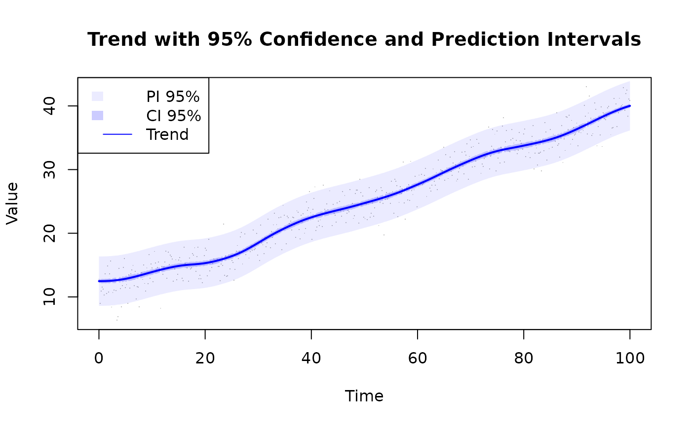

# Use Case: Time Series Analysis

## Overview

LOWESS provides flexible trend extraction from time series without
parametric assumptions. It handles irregular sampling, noise, and
outliers naturally.

------------------------------------------------------------------------

## Basic Trend Extraction

`fraction = 0.1` sizes the neighbourhood to 10% of the data at each
evaluation point — narrow enough to follow a slowly varying trend
without smearing periodic variation. Three robustness `iterations`
down-weight noise spikes.

``` r

library(rfastlowess)

set.seed(42)
t <- seq(0, 100, length.out = 500)
trend <- 10 + 0.5 * t + 3 * sin(t / 10)
noise <- rnorm(500, sd = 3)
y <- trend + noise

model <- Lowess(fraction = 0.1, iterations = 3)
result <- fit(model, t, y)

plot(t, y, col = "gray", pch = ".",
    xlab = "Time", ylab = "Value", main = "Trend Extraction")
lines(result$x, result$y, col = "blue", lwd = 2)
legend("topleft", c("Observed", "Trend (LOWESS)"),
        pch = c(1, NA), lty = c(NA, 1), col = c("gray", "blue"))
```



------------------------------------------------------------------------

## Seasonal Decomposition

Extract the trend component and compute the residual to inspect
seasonality.

``` r

library(rfastlowess)
set.seed(42)

# Simulate monthly data with trend + seasonality + noise
t <- 1:120  # 10 years monthly
trend <- 100 + 0.5 * t
seasonal <- 15 * sin(2 * pi * t / 12)
noise <- rnorm(120, sd = 5)
y <- trend + seasonal + noise

# Extract trend with large fraction (heavy smoothing)
model <- Lowess(fraction = 0.4, iterations = 2)
result <- fit(model, t, y)

# Residual = observed - trend (should show seasonality)
residual <- y - result$y

par(mfrow = c(2, 1))
plot(t, y, type = "l", col = "gray",
    main = "Original + LOWESS Trend", xlab = "Month", ylab = "Value")
lines(result$x, result$y, col = "blue", lwd = 2)

plot(t, residual, type = "l", col = "darkgreen",
    main = "Detrended Residual (Seasonal Component)",
    xlab = "Month", ylab = "Residual")
abline(h = 0, lty = 2, col = "red")
```



``` r

par(mfrow = c(1, 1))
```

------------------------------------------------------------------------

## Irregular Time Grids

LOWESS handles irregularly sampled data naturally — no interpolation
needed.

``` r

library(rfastlowess)
set.seed(42)

# Irregular sampling: dense early, sparse later
t_irregular <- c(sort(runif(200, 0, 50)), sort(runif(50, 50, 100)))
y_irregular <- sin(t_irregular / 10) + rnorm(length(t_irregular), sd = 0.5)

model <- Lowess(fraction = 0.2, iterations = 2)
result <- fit(model, t_irregular, y_irregular)

plot(t_irregular, y_irregular, pch = 16, cex = 0.4, col = "gray",
    xlab = "Time", ylab = "Value", main = "Irregularly Sampled Time Series")
lines(result$x, result$y, col = "blue", lwd = 2)
```



------------------------------------------------------------------------

## Uncertainty Bands for Forecasting Context

Prediction intervals widen the uncertainty band to include both the
uncertainty in the fitted curve and the expected scatter of new
observations. `fraction = 0.2` offers a balance between local detail and
stable interval width.

``` r

library(rfastlowess)
set.seed(42)
t <- seq(0, 100, length.out = 500)
y <- 10 + 0.3 * t + sin(t / 5) + rnorm(500, sd = 2)

model <- Lowess(
    fraction = 0.2,
    iterations = 3,
    confidence_intervals = 0.95,
    prediction_intervals = 0.95
)
result <- fit(model, t, y)

plot(t, y, pch = ".", col = "gray",
    xlab = "Time", ylab = "Value",
    main = "Trend with 95% Confidence and Prediction Intervals")
polygon(c(result$x, rev(result$x)),
        c(result$prediction_upper, rev(result$prediction_lower)),
        col = rgb(0, 0, 1, 0.08), border = NA)
polygon(c(result$x, rev(result$x)),
        c(result$confidence_upper, rev(result$confidence_lower)),
        col = rgb(0, 0, 1, 0.20), border = NA)
lines(result$x, result$y, col = "blue", lwd = 2)
legend("topleft", c("PI 95%", "CI 95%", "Trend"),
        fill = c(rgb(0, 0, 1, 0.08), rgb(0, 0, 1, 0.20), NA),
        lty  = c(NA, NA, 1), col = c(NA, NA, "blue"), border = NA)
```



``` r

sessionInfo()
#> R version 4.6.1 (2026-06-24)
#> Platform: x86_64-pc-linux-gnu
#> Running under: Ubuntu 24.04.4 LTS
#> 
#> Matrix products: default
#> BLAS:   /usr/lib/x86_64-linux-gnu/openblas-pthread/libblas.so.3 
#> LAPACK: /usr/lib/x86_64-linux-gnu/openblas-pthread/libopenblasp-r0.3.26.so;  LAPACK version 3.12.0
#> 
#> locale:
#>  [1] LC_CTYPE=C.UTF-8       LC_NUMERIC=C           LC_TIME=C.UTF-8       
#>  [4] LC_COLLATE=C.UTF-8     LC_MONETARY=C.UTF-8    LC_MESSAGES=C.UTF-8   
#>  [7] LC_PAPER=C.UTF-8       LC_NAME=C              LC_ADDRESS=C          
#> [10] LC_TELEPHONE=C         LC_MEASUREMENT=C.UTF-8 LC_IDENTIFICATION=C   
#> 
#> time zone: UTC
#> tzcode source: system (glibc)
#> 
#> attached base packages:
#> [1] stats     graphics  grDevices utils     datasets  methods   base     
#> 
#> other attached packages:
#> [1] rfastlowess_3.0.0 BiocStyle_2.40.0 
#> 
#> loaded via a namespace (and not attached):
#>  [1] cli_3.6.6           knitr_1.51          rlang_1.3.0        
#>  [4] xfun_0.60           otel_0.2.0          generics_0.1.4     
#>  [7] textshaping_1.0.5   jsonlite_2.0.0      htmltools_0.5.9    
#> [10] ragg_1.5.2          sass_0.4.10         rmarkdown_2.31     
#> [13] evaluate_1.0.5      jquerylib_0.1.4     fastmap_1.2.0      
#> [16] yaml_2.3.12         lifecycle_1.0.5     bookdown_0.47      
#> [19] BiocManager_1.30.27 compiler_4.6.1      fs_2.1.0           
#> [22] htmlwidgets_1.6.4   systemfonts_1.3.2   digest_0.6.39      
#> [25] R6_2.6.1            bslib_0.12.0        tools_4.6.1        
#> [28] BiocGenerics_0.58.1 pkgdown_2.2.1       cachem_1.1.0       
#> [31] desc_1.4.3
```
